# CARES AR Lab

## Introduction

This project is to showcase the CARES lab and apply knowledge graph in AR. It is built with Unity and MRTK3 library for Hololens2 devices. The project consists of 3 scenes, home scene, floor plan scene and model scene.

### Home Scene

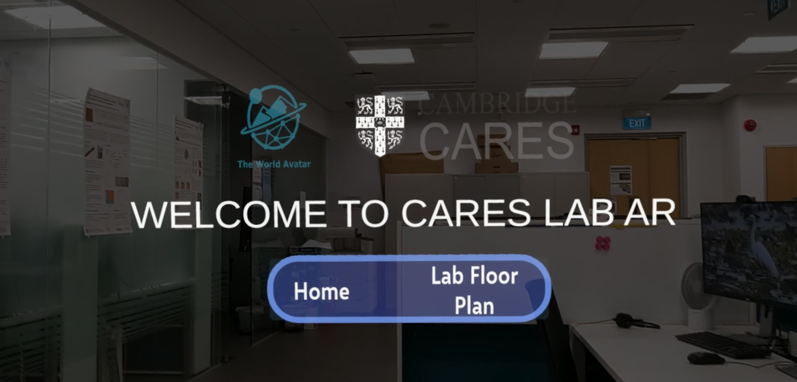

This is the first scene user will see when open up the application. User can navigate to the home scene and the floor plan scene with the buttons.

### Floor Plan Scene

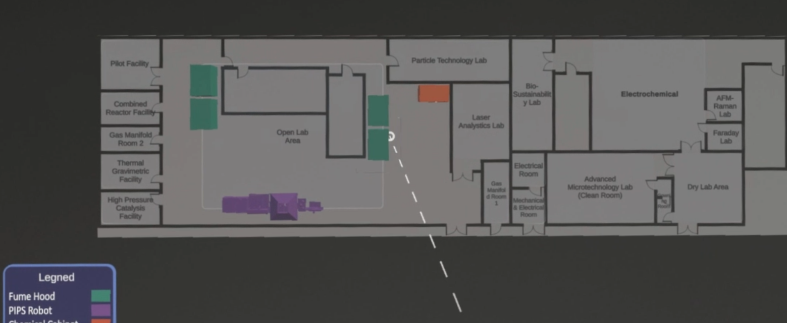

In the floor plan scene, user can click on each room to check the real time room temperature and humidity. The user can also click on the models in the open lab area to view the reasize models and their real time status in the model scene. There are three types of model available, fumehood, PIPS robot and chemical cabinet. Each type is labeled with different colors and the color representation can be found from the legend.

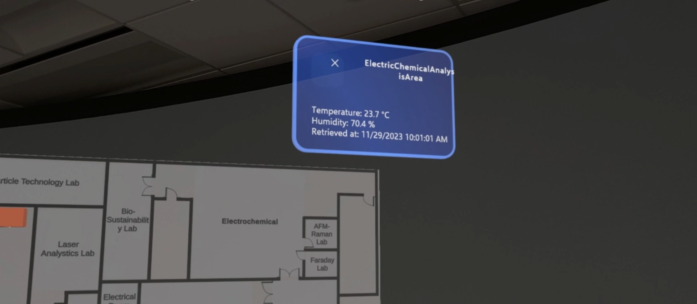

Check room temperature and humidity

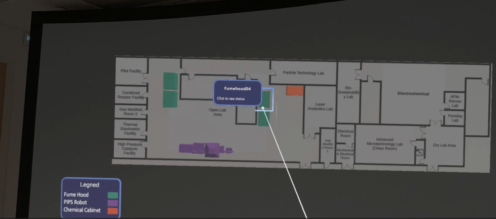

Select model

### Model Scene

In this scene, the real size model selected in the floor plan scene will be shown. Model can be drag and placed in the world and applied different operations on them based on the type.

#### Fumehood

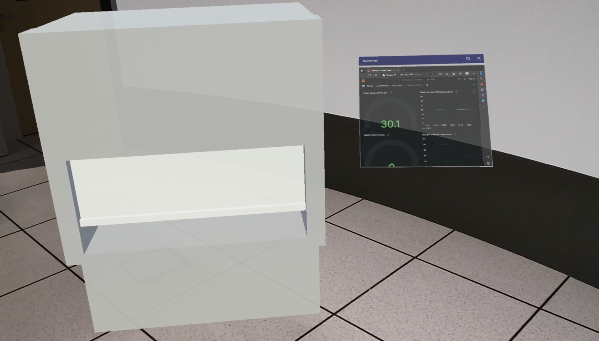

User can check the fumehood's status on the dashboard and the model's sash position reflects the real time sash opening in the lab.

#### PIPS Robot

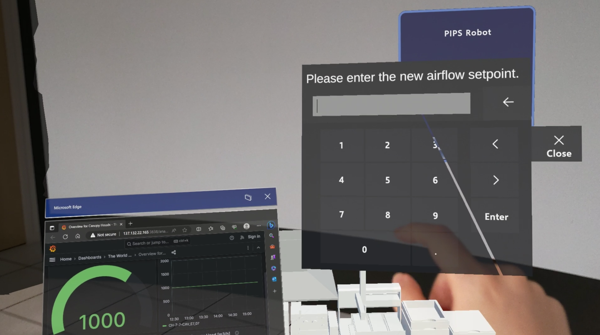

Similar to the fumehood, user can check the status of the canopy hood on top of the robot and interact with the model. User can also change the setpoint of the canopy hood with the pop up keyboard. The state change can be viewed on the dashboard.

#### Chemical Cabinet

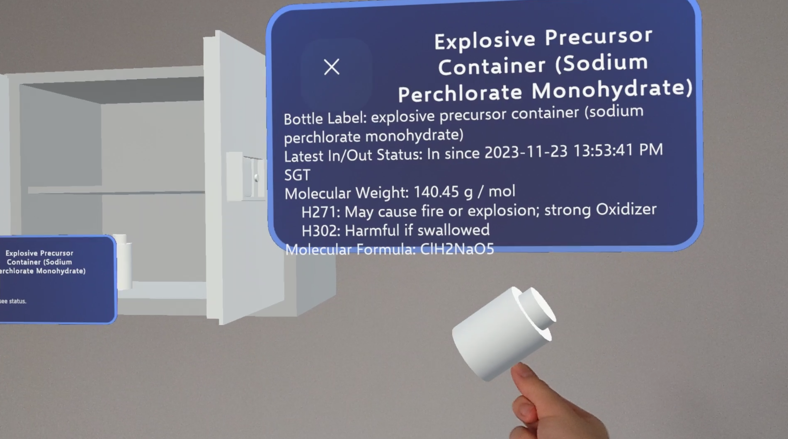

User can experiecne the process of unlocking the cabinet, opening the door and check the chemical bottle's status. 

## Project Setup

### Prerequisites

- [Unity Hub](https://unity.com/download) with Unity 2021.3 LTS installed
- [Visual Studio](https://visualstudio.microsoft.com/vs/older-downloads/) with the [reaquired workloads](https://learn.microsoft.com/en-us/windows/mixed-reality/develop/install-the-tools?tabs=unity)
- Hololens2 device or Hololens2 Emulator
- Windows 10 or 11
- [Microsoft Mixed Reality Feature Tool](https://learn.microsoft.com/en-us/windows/mixed-reality/develop/unity/welcome-to-mr-feature-tool#2-selecting-your-unity-project)

A detailed installation list (without Microsoft Mixed Reality Feature Tool) can be found at [here](https://learn.microsoft.com/en-us/windows/mixed-reality/develop/install-the-tools?tabs=unity).

### Project Setup

1. Clone this project to local
2. Copy `*.blend` model files from dropbox `IRP3 CAPRICORN shared folder\SDENG\ar project\CARESLab\Assets\Model` to `\CARESLab\Assets\Model`
3. Install MRTK3 features with Microsoft Mixed Reality Feature Tool

    Acquire the following features from Microsoft Mixed Reality Feature Tool:

    - MRTK3
        - MRTK Graphics Tools (0.6.2)
        - MRTK Core Definitions (3.0.0)
        - MRTK Extended Assets (3.0.0)
        - MRTK Input (3.0.0)
        - MRTK Spatial Manipulation (3.0.0)
        - MRTK Standard Assets (3.0.0)
        - MRTK Tools (3.0.0)
        - MRTK UX Components (3.1.0)
        - MRTK UX Core Scripts (3.1.0)
    - Platform SUpport
        - Mixed Reality OpenXR Plugin (1.9.0)
        - Mixed Reality Scene Understanding (0.6.0)
    - Spatial Audio 
        - Microsoft Spatializer (2.0.47)
    
    Ideally the features shuold be able to restore with 'Restore Features' button in the tool. But from experiements, only part of the features are recovered, so it is recomended to acquire these features.

    A complete step by step guide on Microsoft Mixed Reality Feature Tool can be found at [here](https://learn.microsoft.com/en-us/windows/mixed-reality/develop/unity/welcome-to-mr-feature-tool).

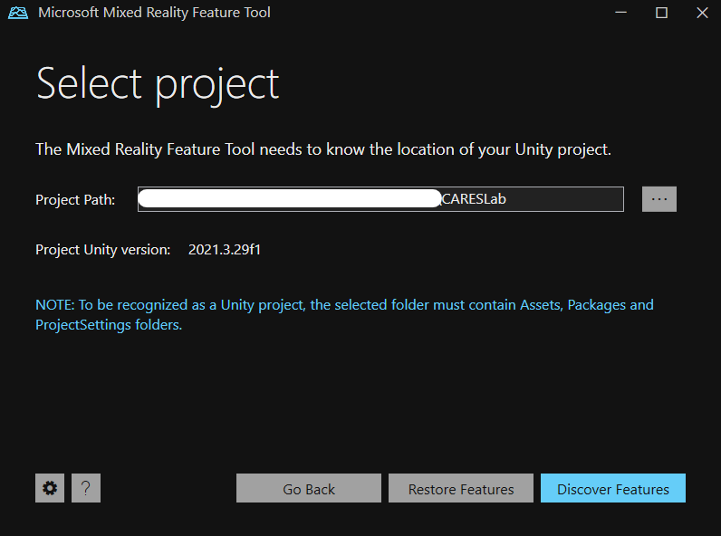

4. Open Unity hub, add local project and open the project. Unity will download and extract the dependency packages and compile codes.

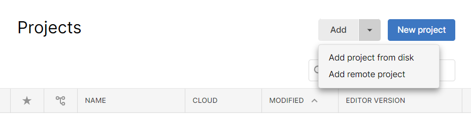

5. Configuration in Unity

    a. Go to `Edit > Project Settings > MRTK3` to assign MRTK default profile.

    

    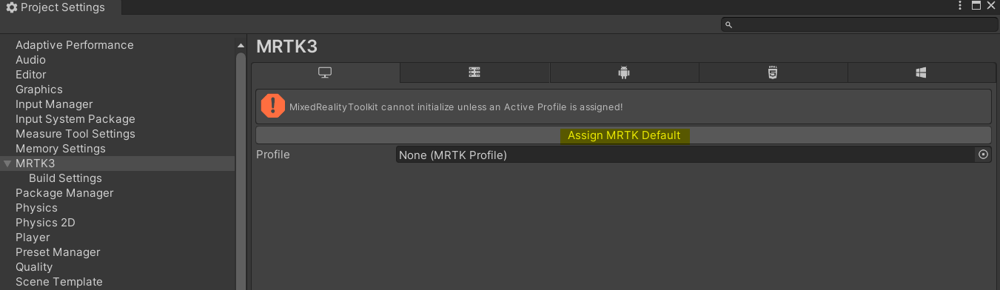
    

    b. In Project Settings `XR Plug-in Management`, tick `OpenXR > Windows Mixed Reality feature group` for `Windows, Mac, Linux settings` and `OpenXR > Microsoft HoloLens feature group` for `Universal Windows Platform settings`

    

    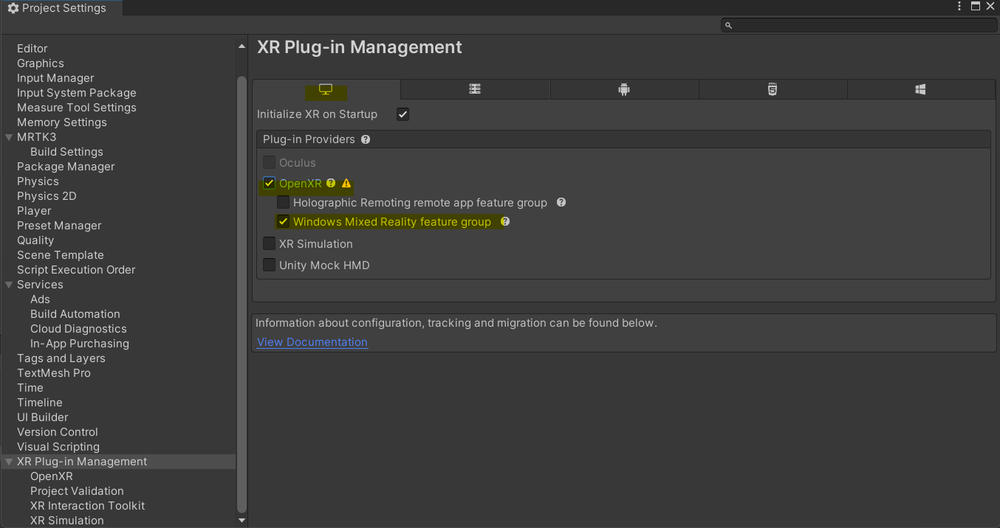
    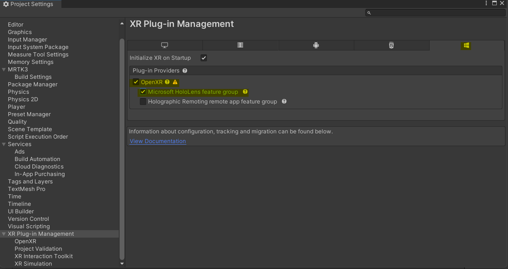
    

    c. In `XR Plug-in Management > OpenXR` add `Microsoft Hand Interaction Profile` for both `Windows, Mac, Linux settings` and `Universal Windows Platform settings`

    

    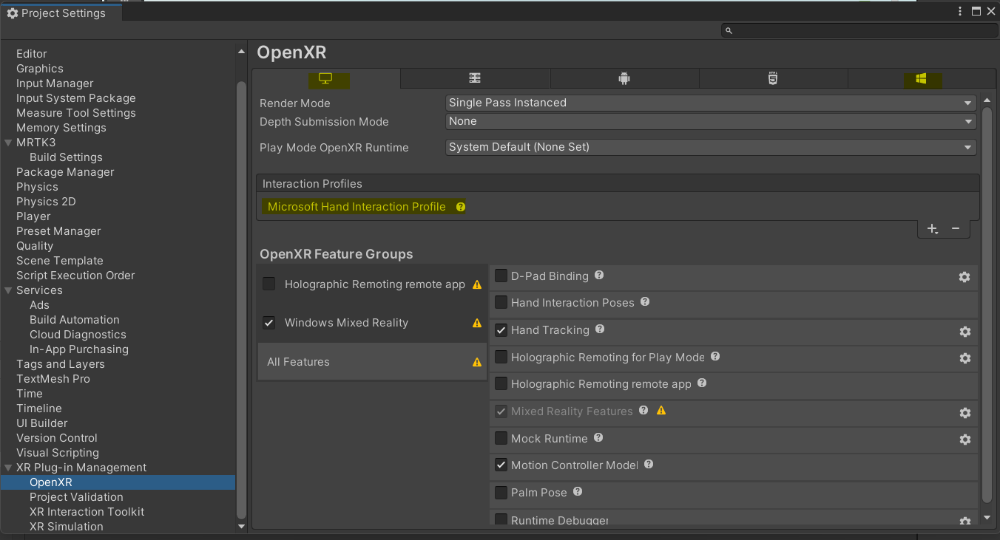
    

    d. In `XR Plug-in Management > Project Validation`, fix all issues for both `Windows, Mac, Linux settings` and `Universal Windows Platform settings`.

    

    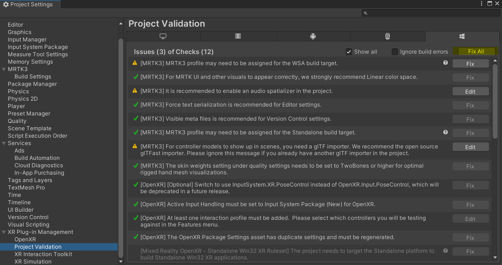
    

    e. Check `Player > Resolution and Presentation > Run In Background` is ticked.

    

    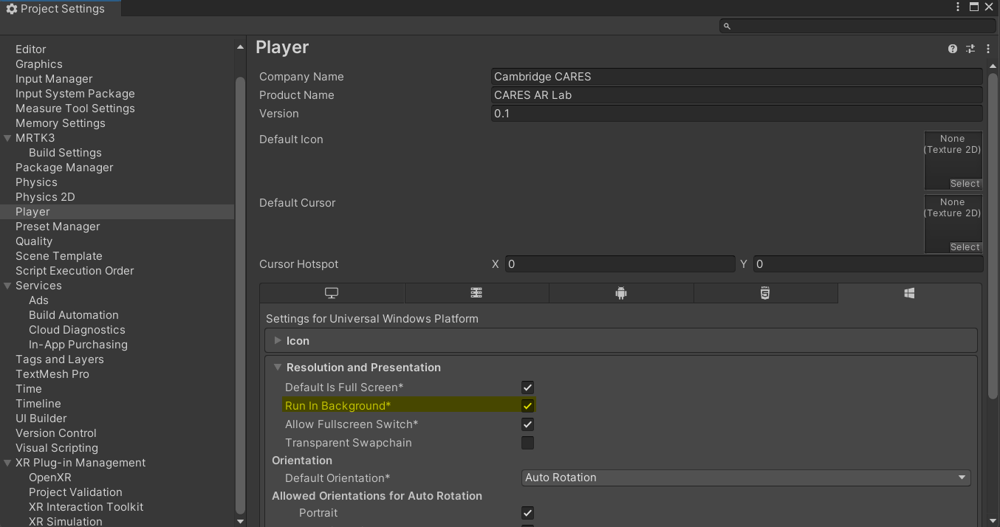
    

Completed guide of setting up **new** MRTK3 project can be found at [here](https://learn.microsoft.com/en-us/windows/mixed-reality/mrtk-unity/mrtk3-overview/getting-started/setting-up/setup-new-project).

6. If TMP Importer is prompt, choose to import TMP Essentials.
    

    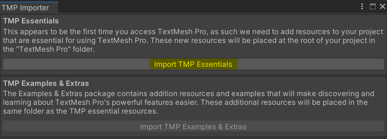
    

7. Add `bmsUpdateAgentUrl`, `canopyhoodAirflowIri` and `canopyhoodControlModeIri` in Assets/Scripts/ModelScene/AirflowInputControl.cs
    
    Due to security consideration, the url and iri in this file are removed. To be able to use the change airflow function, please add the correct url and iri.

### Run in Unity

Run in Unity is the most easy and convinient way to test during development. Check [here](https://learn.microsoft.com/en-us/windows/mixed-reality/mrtk-unity/mrtk3-input/packages/input/input-simulation#how-to-use-mrtk3-input-simulation-mrtk3-input-simulator-default-controls) for keys to control.

Other resources:
- [Debug C# code in Unity](https://docs.unity3d.com/Manual/ManagedCodeDebugging.html)

### Test and Deploy on Device or Emulator

Test and deploy on device or emulator consists of two steps:
1. Build project in Unity
2. Build and deploy with Visual Studio

A complete guide on deployment can be found [here](https://learn.microsoft.com/en-us/windows/mixed-reality/develop/unity/build-and-deploy-to-hololens).

If errors occurred when deploying with Master or Release mode in Visual Studio, developer can choose to deploy with Debug mode, which gives a faster compile speed but little optimizations.

Other resources:
- [Using the HoloLens Emulator](https://learn.microsoft.com/en-us/windows/mixed-reality/develop/advanced-concepts/using-the-hololens-emulator)
    
    If deploying to the emulator, the Visual Studio should `run as administrator`. During the deployment process, the Visual Studio will boot the emulator.

- [Debug Unity IL2CPP UWP build in Hololens](https://learn.microsoft.com/en-us/windows/mixed-reality/develop/unity/managed-debugging-with-unity-il2cpp)

    This enables the use of breakpoints when running the program in Hololens.

### Troubleshoot

- Unity Package Manager error
    

    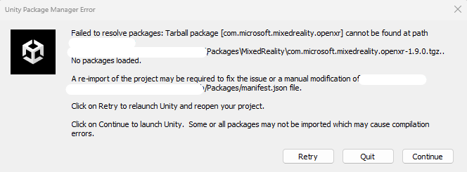
    

    Occurred when MRTK3 features not added properly. Please check whether all the packages stated in [Project Setup](#project-setup) have been added.

- Prefab file missing error
    

    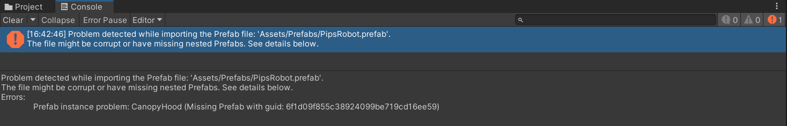
    

    Occurred when `*.blend` model files are not added before opening the project in Unity. This will also remove the `*.asset` files in `Assets/Model/`. Please add the `*.blend` model files **and** pull the project again.
