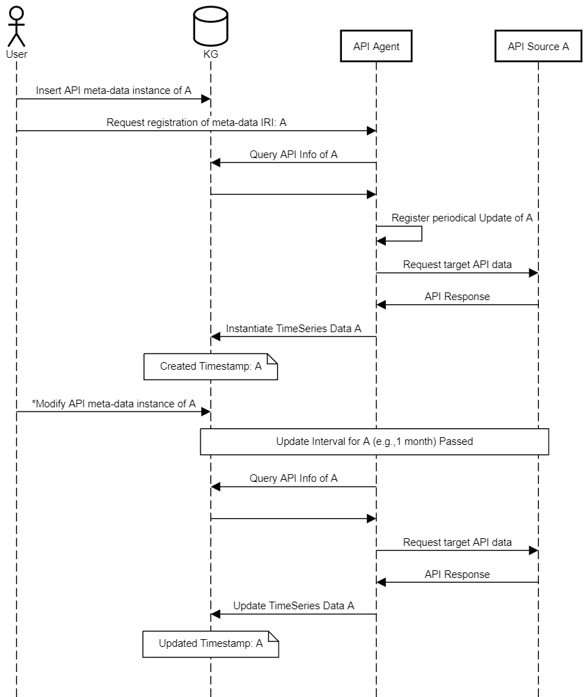

# API agent
This `API Agent` can be used to manage the automatic instantiation and updating of TimeSeries data from external APIs into the knowledge graph (KG) using the [OntoTimeSeries] (TS) ontology. Reading and writing TimeSeries from/into the KG relies on the [TimeSeriesClient].


The agent is integrated with the [Derived Information Framework]'s (DIF) to ensure proper data provenance. API information and API-Data-to-TimeSeries mappings are defined under a meta-data instance in KG. TS data is then considered as the derived quantity of the meta-data. The required meta-data triples to derive an API-downloaded TS instance are described in the [required derivation markup](#12-required-derivation-markup) section below.

Once a API is registered using the [`DerivationClient`](https://github.com/cambridge-cares/TheWorldAvatar/blob/main/JPS_BASE_LIB/src/main/java/uk/ac/cam/cares/jps/base/derivation), API agent automatically manages a periodical re-downloading of the data from that API.

Ontology definition of API meta-data relies on  [Web of Things (WoT) Hypermedia Controls Ontology]. We also extend [RDF Mapping Language (RML)] for TimeSeries data as `rml4ts Ontology`.


The agent now supports three input data formats from API: `json, csv, xlsx.` Downloaded data is instantiated as [TWA](https://github.com/cambridge-cares/TheWorldAvatar) TimeSeries instances. Support of instantiating generic RDF triples from API is not currently supported and may be a direction for future work.


# 1. Setup

## 1.1 Agent Settings
Agent are configured through env file `agent.env.run`.
```bash
###Agent settings
ONTOAGENT_SERVICE_IRI=
DERIVATION_PERIODIC_TIMESCALE=
DERIVATION_INSTANCE_BASE_URL=
ONTOAGENT_OPERATION_HTTP_URL=
REGISTER_AGENT=
### KB access info
SPARQL_QUERY_ENDPOINT=
SPARQL_UPDATE_ENDPOINT=
KG_USERNAME=''
KG_PASSWORD=''
### RDB access info
DB_URL=
DB_PW=
DB_USER=
```

## 1.2 Required Derivation Markup
Before each set of API data can be downloaded (and instantiated), the required meta-data instance need to be put into KG.


The following snippet provides an overview of the expected instantiation structure of required API meta-data instance (further examples can be found in folder [test_triples]): 

```
###   Required inputs   ###
<target_data_IRI> rml4ts:has_ts_mapping <IRI_of_API_Mapping>.

### Define API-to-Timeseries Data Mapping
<IRI_of_API_Mapping> a rml4ts:TimeSeriesMap;
    time:hasDuration <IRI_of_Update_Interval>;
    rml:logicalSource [ a rml:LogicalSource;
    rml:source <IRI_of_Web_Source> ;
    rml:referenceFormulation ql:JSONPath;
    rml4ts:value_iterator <JSONPath>; ## A JSONPath or XPath
    rml4ts:time_iterator <JSONPath>; ## A JSONPath or XPath
  ];
.
### Define the HTTP request
<IRI_of_Web_Source> a td:PropertyAffordance;
  td:hasForm [
    hctl:hasTarget <RequestUrl>;
    hctl:forContentType <ContentType>;
    htv:methodName <HTTPMethod>;
  ];
.
### Define API update interval
<IRI_of_Update_Interval> rdf:type time:Duration ;
    time:numericDuration <xsd:decimal> ;
    time:unitType  time:unitDay .
```


#2. Agent Design

##2.1 Ontology
This ontology design is not considered as the finalized version and should only serve as a reference. The HTTP request of each external API data point is defined via [Web of Things (WoT) Hypermedia Controls Ontology]. The API-Data-to-TimeSeries mapping is defined by extending RDF Mapping Language (RML) for current TWA Timeseries data format as`rmlts Ontology`. See a proposed version of rml4ts: [rml4ts.owl].

##2.2 Agent Operation
Upon an API is registered to the API Agent, the Agent will conduct two actions:
1. Immediately create a Timeseries if there is no existing one associated to the target data IRI. Immediately download the data from the API and instantiate or update the Timeseries Instance.
2. Register a periodical scheduled job to repeat action 1.

To register an API, one should use the derivation client functions to create a derivation through the API agent, an example is shown below: 
```bash
from pyderivationagent import PyDerivationClient
from pyderivationagent.data_model import ONTODERIVATION_DERIVATIONWITHTIMESERIES
derivation_client = PyDerivationClient(triples_base_url, kg_endpoint, kg_endpoint)
derivation_client.createSyncDerivationForNewInfo(API_AGENT_IRI, [IRI_of_API_Mapping],
                                                                  ONTODERIVATION_DERIVATIONWITHTIMESERIES)
```
The full time-sequence of API Agent actions is illustrated as the below diagram. Note that the only required action for the user is to register the API via two steps: 1) Insert proper meta triples into KG. 2) Register the API via creating a derivation.
Once this is done, the API Agent automatically manages the instantiation and all follow-up updates of the API data. User can modify the meta-data at any time (e.g, the external source has changed to a different URL), the change will be reflected after the next scheduled update.

<p align="center">
    
</p>

##2.2 Extra Options
###2.2.1 API with dynamically generated URL
It is common for external data API to use dynamically generated access URL. For this purpose, we define a new rdf property in `rmlts.owl`: `rmlts:hasDynamicTarget`. Find in [test_triples] folder an example to define an API source with dynamically generated URL: [api_temperature.ttl].
 
###2.2.2 API-to-TS mapping with additional function
Some source-data-to-target-Timeseries mapping may need additional operations. For examples, the raw data contains 4 set of sub-category quantities and the target quantity is the sum of them. Such operations can be declared as a Named Individual of type `rml4ts:Algebra`. And a corresponding implementation should be put in the [calculations module]. We have implemented one example: `rml4ts:Sum`. An API meta-data example can be found in [test_triples] folder: [api_pvcapacity.ttl].


#3. Using the Agent

A local running container can be initiated via:
```
docker compose -f "docker-compose.yml" up -d --build
```
Note that the agent needs a triple store and an RDB to work. The access information needs to be declared in agent.env.run. For easy local test, one could use the docker-compose-testcontainers.yml, which creates both the triple store and RDB as docker containers.
```commandline
python -m pytest --docker-compose=./docker-compose-testcontainers.yml
```

##env files
They are two env files in the repo. `agent.env.run` is used for running the agent in Docker. `agent.env.test` is used in pytest. The need of two separate files is due to 'localhost' should be referred to as 'host.docker.internal' from inside Docker. 

##property files
One may notice the agent, once started, creates a property file named `APIAgent.properties` under `/resources` in the working directory. This is the property file that is used to create the [TimeSeriesClient] Instance via one of the library's constructor methods. The property file is automatically created by the agent from the parameters defined in env files. No action is required on the user side.


<!-- Links -->
<!-- websites -->
[allows you to publish and install packages]: https://docs.github.com/en/packages/working-with-a-github-packages-registry/working-with-the-apache-maven-registry#authenticating-to-github-packages
[py4jps]: https://pypi.org/project/py4jps/#description
[TimeSeriesClient]: https://github.com/cambridge-cares/TheWorldAvatar/tree/main/JPS_BASE_LIB/src/main/java/uk/ac/cam/cares/jps/base/timeseries
[Darts]: https://unit8co.github.io/darts/index.html
[Prophet]: https://unit8co.github.io/darts/generated_api/darts.models.forecasting.prophet_model.html
[Facebook Prophet]: https://github.com/facebook/prophet
[Github container registry]: https://ghcr.io
[personal access token]: https://docs.github.com/en/authentication/keeping-your-account-and-data-secure/managing-your-personal-access-tokens
[Derived Information Framework]: https://github.com/cambridge-cares/TheWorldAvatar/tree/main/JPS_BASE_LIB/src/main/java/uk/ac/cam/cares/jps/base/derivation
[Stack manager]: https://github.com/cambridge-cares/TheWorldAvatar/tree/main/Deploy/stacks/dynamic/stack-manager
[derivation agent]: https://github.com/cambridge-cares/TheWorldAvatar/tree/main/JPS_BASE_LIB/python_derivation_agent

[OntoTimeSeries]: https://github.com/cambridge-cares/TheWorldAvatar/tree/main/JPS_Ontology/ontology/ontotimeseries
[OntoDerivation]: https://github.com/cambridge-cares/TheWorldAvatar/tree/main/JPS_Ontology/ontology/ontoderivation
[rml4ts.owl]: https://github.com/cambridge-cares/TheWorldAvatar/blob/main/JPS_Ontology/ontology/rml4ts/rml4ts.owl
<!-- files -->
[docker compose file]: ./docker-compose.yml
[Web of Things (WoT) Hypermedia Controls Ontology]:https://www.w3.org/2019/wot/hypermedia
[RDF Mapping Language (RML)]:https://rml.io/specs/rml/
[test_triples]: ./test_triples

[api_temperature.ttl]: ./tbox_dev/test_triples/api_temperature.ttl
[calculations module]: ./data_classes/calculations.py
[api_pvcapacity.ttl]: ./tbox_dev/test_triples/api_pvcapacity.ttl