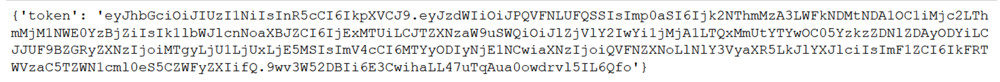
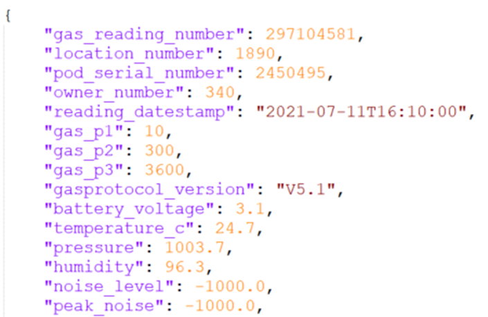
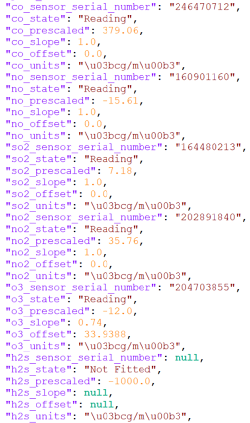
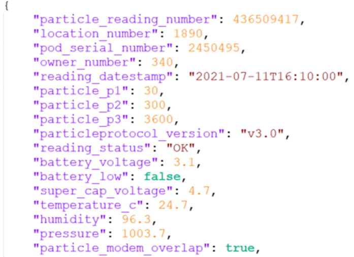

# AQMesh input agent

This agent is for maintaining data and the corresponding instances in the knowledge graph (KG) regarding the AQMesh air 
quality measuring station. It's only purpose is to retrieve new data (if available) from the API and download it into 
the corresponding database, as well as, instantiating KG instances and connection when called for the first time. The 
agent uses the [time-series client](https://github.com/cambridge-cares/TheWorldAvatar/tree/develop/JPS_BASE_LIB/src/main/java/uk/ac/cam/cares/jps/base/timeseries)
from the JPS base lib to interact with both the KG and database.

Before explaining the usage of the agent and other parts of the code, we will briefly summarize the AQMesh API that is
contacted by one of the classes in this package to retrieve data.

## AQMesh API

We will here briefly describe the AQMesh API. The official documentation can be found [here](https://www.aqmeshdata.net/api-documentation), 
but requires login credentials to access it.

### Token retrieval
Before accessing any other endpoint, a token needs to be requested that can be used as authorization to 
access data and pod / asset information.

The token can be retrieved from the following endpoint using an HTTP POST request:
```
https://api.aqmeshdata.net/api/Authenticate
```

The body of the request needs to contain the credentials, i.e. username and password, in form of a JSON object like the 
following example:
```json
{"username":"AQMeshAPIUser", "password":"AQMeshAPIPassword"}
```

The response should then contain the token in the response body if the request was successful, like shown here:



The token will be valid for 120 minutes for using it in following requests. To use the token it needs to be added to
the header of the request (how to exactly do it depends on which software and package is used for making the request):
```
Authorization: Bearer [token]
```
where `[token]` is the token retrieved contained in the response body shown above. In java, using the Apache Http library
it can be done like this:
```java
private void setTokenAuthorization(HttpRequest request) {
        String authHeader = "Bearer " + token;
        request.setHeader(HttpHeaders.AUTHORIZATION, authHeader);
}
```

### Server status
To check whether the server is available and whether the token is correctly set, there is a ping endpoint:
```
https://api.aqmeshdata.net/api/serverping
```

When available and if the GET request is correct, the response body should look similar to the following:


### Retrieve location number
The AQMesh API allows you to connect multiple pods to the same user. To retrieve new data (readings) from a specific pod,
its location number (identifier) is needed. Information about the assets, including the location number, is accessible 
through the asset endpoint via an HTTP GET request:
```
https://api.aqmeshdata.net/api/Pods/Assets
```

The response body will contain a JSON array with an JSON object for each asset (pod) containing information
about the pod. The following is an example of part of the JSON object for one pod:


### Data retrieval
There are two different ways to retrieve data from the API, namely *Next* and *Repeat*. From the *Next* endpoint one 
will retrieve all data that is available since the last call to the *Next* API, while the *Repeat* call repeats the last 
*Next* call.

For example, when data is retrieved at `2020-08-23T16:17:00` using the *Next* endpoint and the last call was at 
`2020-08-16T09:10:00`, all data between these two timestamps that was recorded will be returned. Let's assume the last 
recording was at `2020-08-23T16:00:00`. From
now on (until the *Next* endpoint is used again) a *Repeat* call will also return data between `2020-08-16T09:10:00` 
and `2020-08-23T16:00:00`. In the next *Next* call all data since `2020-08-23T16:00:00` will be returned, and so on.

Note, that there is only one "pointer", i.e. the starting timestamp for readings of a *Next* call, per user and pod.
If different agents, people or pieces of code use the same credentials to get readings for the same pod, they will 
reset / renew the pointer for all following endpoint accesses!

#### The endpoint
The actual endpoint has the following structure and controls what type of data is retrieved and in which form:
```
https://api.aqmeshdata.net/api/LocationData/Next/[location]/[Params]/[Units]/[TPC]
```
where `[location]` is the number of the specific pod that can be retrieved from the 
[asset endpoint](#retrieve-location-number), `[Params]` is 1 for gas and 2 for particle readings. The `[units]` 
are two digits, the first one controlling the temperature unit (0: Fahrenheit, 1: degree Celsius) and
the second controlling the sensor measure unit (0: ppb, 1: micrograms per cubic meter). The `[TPC]` path is only applicable for
particle readings and defines whether to return TPC (1) in the output or not (0).

For the agent we use 01 (= degree Celsius and micrograms per cubic meter) for the `[Units]` part and 1 for the `[TPC]` 
part.

#### Example readings
Readings are returned in the response body in form of a JSON array with one JSON object per timestamp. The following 
shows a single JSON object example contained in gas readings with units equal to 01:





The following shows a single JSON object example contained in particle readings with units equal to 01 and including the TPC:




## Usage 
This part of the README describes the usage of the input agent. The module itself can be packaged into an executable 
jar that can be executed to run the agent. Since it uses the time-series client which maintains both instances in a 
knowledge graph and a Postgres database to store the data, these will be required to be set-up before.  

The [next section](#requirements) will explain the requirements to run the agent and then both the steps for [running it 
as jar](#using-the-jar-directly) directly on a machine or in form of a [Docker container](#docker) are described.

### Requirements
Independent on whether the jar is used directly or the agent is run in form of a Docker container using a built image, it
is required to have access to a knowledge graph SPARQL endpoint and Postgres database. These can run on the same machine 
or need to be accessible from the host machine via a fixed URL.

This can be either in form of a Docker container or natively running on a machine. It is not in the scope of this README
to explain the set-up of a knowledge graph triple store or Postgres database.

### Property files
For running the agent, three property files are required:
- One [property file for the agent](#agent-properties) itself pointing to the mapping configuration.
- One [property file for the time-series client](#time-series-client-properties) defining how ot access the database and SPARQL endpoint.
- One [property file for the AQMesh API](#api-properties) defining the access credentials and pod to use.

#### Agent properties
The agent property file only needs to contain a single line:
```
aqmesh.mappingfolder=[mappings_folder]
```
where `[mappings_folder]` is the absolute path to a folder containing JSON key to IRI mappings 
(use '/' as path separator also on Windows). An example property file can be found in the `config` folder under 
`agent.properties`. See [this section](#mapping-files) of the README for an explanation of the mapping files.

#### Time-series client properties
The time-series client property file needs to contain all credentials and endpoints to access the SPARQL endpoint of
the knowledge graph and the Postgres database. It should contain the following keys:
- `db.url` the [JDBC URL](https://www.postgresql.org/docs/7.4/jdbc-use.html) for the Postgres database
- `db.user` the username to access the Postgres database
- `db.password` the password to access the Postgres database
- `sparql.query.endpoint` the SPARQL endpoint to query the knowledge graph
- `sparql.update.endpoint` the SPARQL endpoint to update the knowledge graph

More information can be found in the example property file `client.properties` in the `config` folder.

#### API properties
The API properties contain the credentials to authorize access to the AQMesh API (see the [API description](#aqmesh-api)),
as well as, the API URL and which pod index. It should contain the following keys:
- `aqmesh.username` the username to access the API.
- `aqmesh.password` the password to access the API.
- `aqmesh.url` the URL to use for the API. Normally this should be `https://api.aqmeshdata.net/api/`, but for testing
purposes `https://apitest.aqmeshdata.net/api/` can be used. Using the test api will not change the pointer of the actual
pod (see [Data retrieval](#data-retrieval)). This property also allows to adjust the agent, if the URL should change in the future.
- `aqmesh.podIndex` the index in the asset list (JSON array) of the pod the agent is responsible for (see 
[Retrieve location number](#retrieve-location-number)). This allows to have multiple versions of the agent, one for each
pod. Currently CARES only owns one pod, so the index should be 0. When using the test API the index should be 1, as the 
other test pod is currently not properly working.

More information can be found in the example property file `api.properties` in the `config` folder.

#### Mapping files
What are the mapping files and why are they required? The mapping files define how data received from the API is connected
to the knowledge graph (KG). Specifically, each JSON key in the readings (see [API description](#example-readings)) 
represents a specific measure that needs to be represented by an IRI, if it should be saved in the database.

Furthermore, measures can be grouped into one time-series (will result in one time-series instance per group in the KG).
This should be done so that all measures in one group are recorded at the same time interval, and so they come from 
the same readings, e.g. gas readings or particle readings, without mixing them together. However, it is possible to 
break down the readings into smaller, logical groups, e.g. general readings and actual measures.

The mapping is achieved in this package by using one property file per group. Each property file contains one line per 
JSON key that should be linked to an IRI, e.g. like:
```
co_slope=http:/example/co_slope
```
If the IRI is left empty (`co_slope=` in the example), i.e. because there is no instance that represents the measure yet, 
it will be automatically created when the agent is run for the first time. This automatically generated URI will have the
following form:
```
[prefix]/[key]_[UUID]
```
where the `[prefix]` is hardcoded into the `AQMeshInputAgent` class in a public, static field called `generatedIRIPrefix`
which is based on the time-series client namespace, `[key]` is the JSON key the URI is generated for, and `[UUID]` is a 
randomly generated UUID.

Note, that not all JSON keys need to be represented in the mapping files (the data will simply be ignored and not stored), 
but there needs to be a 1-1 mapping, i.e. no IRI can be used for multiple JSON keys.

To ensure that the same IRIs are used for each JSON key, the mapping files are saved back after each run (only really 
necessary when some of them are automatically generated). Note, that if you change any mapping in preceding runs, they 
will be seen as new time-series, which can result in inconsistencies in both the KG and database.

Examples for the structure of the mapping folder and files can be found in the `mapping` folder within the `config` 
folder. Here, the keys are grouped into three groups, where the particle readings are split into measures and general 
information, and for the gas readings general information already contained in the particle readings are ignored (see 
also [Example readings](#example-readings)).

### Using the jar directly

#### Building the jar
To build the jar file of this agent, you need to have [Maven](https://maven.apache.org/) installed. The current version
of the code was tested with version 3.8.1 running on Windows. In addition, the machine needs to be able to access the 
CMCL Maven repository for downloading the JPS base lib dependency and default logging configuration. Check the 
[wiki](https://github.com/cambridge-cares/TheWorldAvatar/wiki/Packages) for how to set it up. Example Maven settings 
files are provided in the `.m2` folder.

If everything is set up, the executable jar can be built using the following command in a terminal from within the 
`AQMeshInputAgent` folder (in which the `pom.xml` is located):
```
mvn clean package
```

Maven will automatically run all unit tests before packaging. As part of the packaging process, Maven will also download all 
dependencies in a specific folder inside the `target` folder that are required to run the jar, and the logging configuration 
from the CMCL repository.

A successful built should result in a `target` folder containing among other files:
- The jar `aqmesh_inputAgent-[version].jar`
- A folder containing all the dependencies called `aqmesh_inputAgent-[version].lib`
- A folder containing the logging configuration `aqmesh_inputAgent-[version].conf`

In all cases `[version]` is the current version number of the package 
(see also the rules about versioning on the [wiki](https://github.com/cambridge-cares/TheWorldAvatar/wiki/Versioning)).

#### Run the agent


### Docker

#### Building the docker image
To build the Docker image some set-up is required as all files and credentials that are required to run the agent need 
to be included in the image. Check out  

```
docker build -t test/aqmesh-input-agent -f Dockerfile .
```

#### Using the docker image
```
docker run -v ~/mappings:/app/config/mappings --rm test/aqmesh-input-agent
```
## API connector

