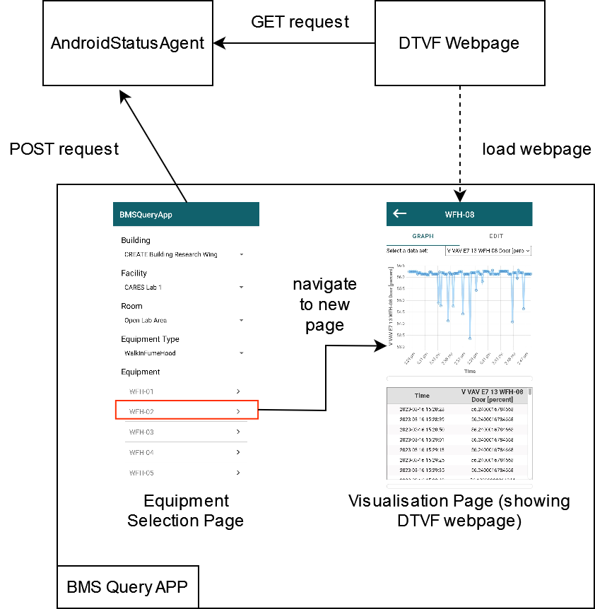

# Android Status Agent
AndroidStatusAgent is an agent used to assist the BMS Query App coporating with other JPS services. It logs the status of the App, so other services, such as DTVF, can access the status in the app and load the corresponding content.

## Example Use Case: Asisst Visualisation with DTVF in the App
An example use case for AndroidStatusAgent is to record the selected equipment, then the DTVF can retrieve this information from this agent and display the corresponding timeseries graph.

Because DTVF can only send request instead of taking in any, logging the status in this agent allows the app have more control on what to display.



# 1. Setup
This agent is designed to run in stack, which is spun up by [Stack Manager](https://github.com/cambridge-cares/TheWorldAvatar/tree/main/Deploy/stacks/dynamic/stack-manager).
A successful setup will result in 9 containers:
- 8 [default containers](https://github.com/cambridge-cares/TheWorldAvatar/tree/main/Deploy/stacks/dynamic/stack-manager#spinning-up-a-stack)
- AndroidStatusAgent

## 1.1 Config BMSQueryAgent in Stack
### 1) Build Docker Image
The AndroidStatusAgent is set up to use the Maven repository. You'll need to provide your credentials in single-word text files located like this:
```
./credentials/
    repo_username.txt
    repo_password.txt
```
repo_username.txt should contain your github username, and repo_password.txt your github [personal access token](https://docs.github.com/en/github/authenticating-to-github/creating-a-personal-access-token),
which must have a 'scope' that [allows you to publish and install packages](https://docs.github.com/en/packages/working-with-a-github-packages-registry/working-with-the-apache-maven-registry#authenticating-to-github-packages).

Then build image with:
```
docker build . -t android-status-agent:1.0.0
```


### 2) Add Config to Stack Manager
Copy `stack-manager-input-config-service/android-status-agent.json` to `TheWorldAvatar/Deploy/dynamic/stacks/stack-manager/inputs/config/services/`.

Create `TheWorldAvatar/Deploy/stacks/dynamic/stack-manager/inputs/config/<STACK NAME>.json` manually if it doesn't exist. If it exists already, append the agent to the file as follows:
```json
{
  "services": {
    "includes": [
      "android-status-agent",
      // ...
  ],
    "excludes": [
      // ...
  ]
  }
}
```

After this step, the `stack-manager/inputs/config` folder will have the following structure:
```
config/
|_ services/
   |_ android-status-agent.json
   |_ ...
|_ <STACK NAME>.json
```

More information about adding custom containers to the stack can be found [here](https://github.com/cambridge-cares/TheWorldAvatar/tree/main/Deploy/stacks/dynamic/stack-manager#adding-custom-containers).

## 1.2 Spin Up Stack
Follow these [steps](https://github.com/cambridge-cares/TheWorldAvatar/tree/main/Deploy/stacks/dynamic/stack-manager#spinning-up-a-stack) to spin up the stack.

# 2. Usage
This agent support both POST and GET requests.
## Log App Status
```
curl -X POST 'http://localhost:3838/android-status-agent/set?equipmentIRI=http://www.example.com/test-element'
```

There will be no return message for POST request. A successful request will have 200 status code.

## Retrieve App Status
```
curl -X GET 'http://localhost:3838/android-status-agent/get'
```
This request will return the previously set status.
```json
{
    "equipmentIRI": "http://www.example.com/test-element"
}
```

If there is no status set, it will return:
```json
{}
```