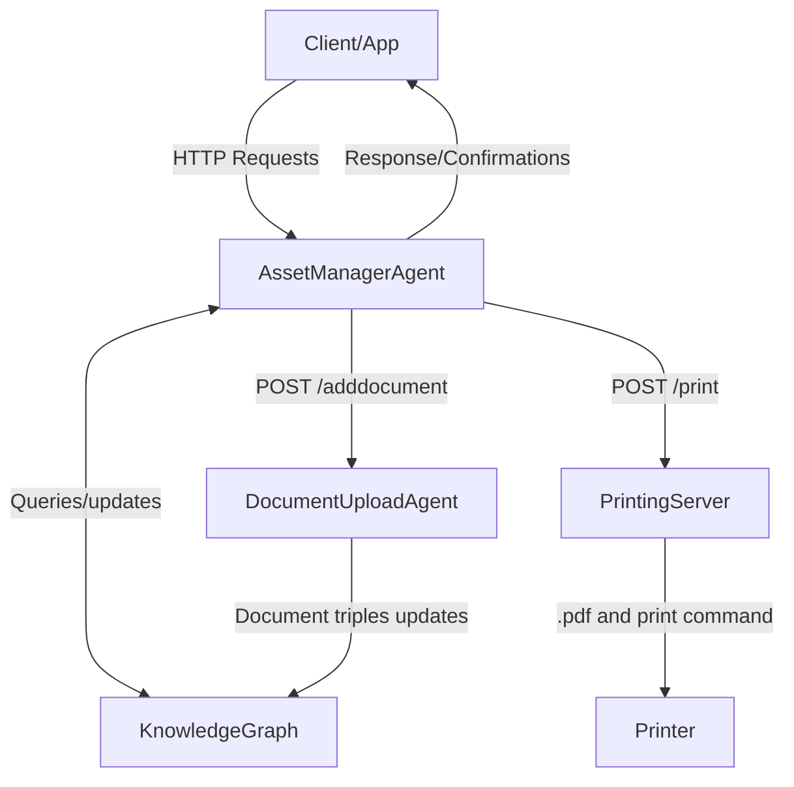

# Asset Manager Agent
An agent designed to manage the asset instances in the knowledge graph. The agent is designed to work together with the [Asset Management App](LINK TO APP REPO HERE).

Currently, the agent is capable of:
- Instantiating asset data
- Print asset QR code
- Retrieving asset data
- Deleting asset data
- Handling asset maintenance

## Structure
The agent is composed of 2 parts, the agent and the printing server. 
The agent handles all interaction between the client and both the knowledge graph and printing server, while the printing server will handle the interaction with the printer. The asset management agent also relies on the document upload agent to upload and instantiate files/documents. The document upload agent will store the files in a mounted directory, which allows the file to be accessed from outside the container of the document upload agent for access by nginx or other agents. The interaction between the client, agents, printer and knowledge graph is outlined in the following graph:



*NOTE: The QR printing system is chosen as it is not possible to install the printer inside the Docker container. The agent may also not be able to access the printer from the container. Even if it could, the printer may not be available for the host machine’s OS or it may not be connected to the printer.*

The agent instantiates the asset information into several namespace depending on the information contained. Asset management information is mainly stored in the `asset` namespace. This includes the ID/serial/model numbers of the asset, the assignee, and supplier and manufacturer.

The agent also handles the instantiation of purchase documents such as purchase orders and delivery orders. These instances are then instantiated in a separate namespace from the other 2, the `purchasedocs` namespace. This namespace also contains the funding information used to acquire the asset.

Currently the agent is designed specifically to handle assets of CARES. The agent is designed to handle assets on 2 different locations, CARES office and the Research Wing.
Hence the agent relies on inputting the information regarding locations into 2 namespaces: the `lab` and `office` namespace in the knowledge graph. Assets on other locations are put into the `office` namespace as default, where their location will only be recorded as a literal. 

As this agent is designed to work together with the asset management app, the app requires a check whether the asset has some sort of timeseries attached to its concept when retrieved (for example, a fumehood’s air consumption). This timeseries is commonly contained in the `bms` namespace and will be used as default for this search, since currently the agent is designed specifically to handle assets of CARES. The details of this timeseries search on retrieve can be read further at [/retrieve](#--retrieve).


## Installation
### Printing Server
The target printer need to be installed first in the host of the server. The installation of this printer may vary between printer types, but generally a printer driver is needed to connect to the printer. Please check with your respective printer manufacturer for the printer driver. Keep in mind some printer driver may only be available for certain OS. Once the printer is installed, the printer can be identified under specific names. Currently the printer server is designed to run on a Windows environment. If a Linux environment is used instead, a CUPS server is recommended instead.

The printing server could be packaged as either a .exe file or run as is a Flask server. The .exe format is provided in case running the server as a Python application is unfavourable. **It is recommended to create a new virtual environment before installing/ running the server.**
A requirement.txt file is included in the repository to use:
```bash
pip install -r ./PrintingServer/requirements.txt
```
To run the printing server, go to `./PrintingServer/`:
```bash
python PrinterServer.py
```
If successful, a terminal showing the IP address of the printing server will be shown.*Do keep in mind this server produced from this is a development server.*

The printing server will look for an environment variable called `PRINTERSERVER_PRINTER`. This value of the variable should be the target printer name. 

### Agent
Update the following environment variables in `./stack-manger-input-config-service/asset-manager-agent.json`:
- `ENDPOINT_KG_[NAMESPACE]`: The SPARQL endpoint of each respective NAMEPSACE. The namespaces are divided based on the explanation in [Structure](#structure).
- `AUTH_KG_USER` and `AUTH_KG_PASS`: Blazegraph authentication. Can be left blank if no authentication is needed.
- `ENDPOINT_PRINTER`: Printer server endpoint.
- `TARGET_QR_SIZE`: QR code size target in cm.
- `URL_MANUAL`: URL for the accessing the asset’s manual. The URL produced will have the manual name appended to the end of the URL.
- `URL_DOCUPLOAD`: URL to the document upload agent for uploading files

Update the following files in the `./config` folder:
- `/ontologyMap.properties`: A map of the asset type and their IRIs. Refer to the available values in [AssetClass](#instantiation)

- `/tsSearch.properties`: Parameters of asset timeseries data search on retrieve. The details of this timeseries search on retrieve can be read further at [/retrieve](#--retrieve).
    - `depth`: Search depth for looking for asset timeseries existence
    - `predicate`: Triple's predicate used to detect if an asset have a timeseries or not. An array of IRI (please use the full IRI, don't use prefixes) separated by a comma (`,`).

Update the following files in the `./credentials` folder:
 - Add your git credentials with your git username and token in respectively `repo_username.txt` and `repo_password.txt`.

Update `./docker-compose.yml`:
 - Volumes: Change the bind mount folder location for the agent to store the manuals. In case the Stack is used, this may need to be changed

#### For use in The Stack
Update  `./stack-manager-input-config-service/asset-manager-agent.json`:
 - Update the bind mount to where the manuals are to be stored


The agent could be built using the following command:
```bash
docker-compose up -d
```


    
## Features
### Agent
All the following parameters will be enclosed in a JSONObject with key `AssetData`.
#### Instantiation
##### - `/instantiate`
For instantiating assets. 
Takes in asset data in the request parameter. **If any data is missing please use blank (`""`) in the request**. By default, the non-mandatory items are generated by the agent. Specific rules when generating the instances are mentioned below. The required parameter (and which must have a value) are:


| Parameter        | Mandatory Value in Request Body         | 
|:----------------:|:---------------------------------------:|  
| Prefix (DEPRECATED) |                                      |           
| AssetClass       | Y                                       |             
| ID               |                                         |
| deliveryDate     |                                         |            
| Name             | Y                                       |
| serialNum        |                                         |
| modelNumber      |                                         |
| SupplierName     |                                         |
| ManufacturerName |                                         |
| SpecSheet        |                                         |
| SpecSheetPage    |                                         |
| Manual           |                                         |
| ManualURL        |                                         |
| BuildingLocation |  Y                                      |
| FacilityLocation |                                         |
| RoomLocation     | If in CARES office or Research Wing     |
| WorkspaceName    |                                         |
| storage          |                                         |
| AssignedTo       |                                         |
| ItemComment      |                                         |
| InvoiceNum       |                                         |
| DeliveryOrderNum |                                         |
| PurchaseOrderNum |                                         |
| BudgetCat        |                                         |
| ServiceCode      |                                         |
| price            |                                         |
| currency         |                                         |
| existingIRIs     |                                         |

The parameters:
- Prefix (DEPRECATED): 
    **NOTE: As of the newest version the `Prefix` key is deleted as the asset type is now instantiated differently. Requests for the previous version of the agent will have the `Prefix` key ignored, but should still be updated.**

    The prefix to be used to describe the type of the asset. The list of accepted prefixes are: 
    - ontodevice
    - ontolab
    - ontosystem
    - ontoinma
    - ontoelectricalpowerequipment
    - ontoems

    The prefix can be left blank on request and the asset instantiated will have the prefix mapped from `.\config\ontologyMap.properties`

    
- AssetClass : The class of the asset type. Available classes are:
    - LabEquipment
    - Laptop
    - Monitor
    - OtherIT
    - Printer
    - Workstation

- ID : Asset ID. The format accepted for the ID is `YYYY-MM-DD/[ID#]`, where the `ID#` is an integer. If an asset is part of another asset the format for `ID#` of `[int].[int].[int]. ...` is also accepted, where the hierarchy of the item is suggested by the point. This is usually used for systems of devices. When left blank, the delivery date  will be used as provided in `deliveryDate` and the largest `ID# + 1` will be used. If `deliveryDate` is left blank, then the date of when the command was sent will be used instead.

- Name : The name of the asset or a brief description of the asset
- deliveryDate: The date of delivery of the assets. To be used when generating ID. The format used is `yyyy-MM-dd`

- serialNum : The serial number of the asset
- modelNumber : The model number of the asset
- SupplierName : The company that provide the asset. Where the asset is bought from
- ManufacturerName  : The company that manufacture the asset
- SpecSheet : The specification sheet location. Usually a URL to a .pdf.
- SpecSheetPage : The page on which the specification of the asset is located on the spec sheet.
- Manual : File name for the manual.
- ManualURL : The URL from where the manual can be accessible
- BuildingLocation : Main location of the asset. Which building is it located in. Mainly accepts CARES Research Wing and CREATE Tower. If the input is any building other than these two, the building will be instantiated as literals
- FacilityLocation : The facility on which the asset is located, for example: labs, office areas. As only the lab and office locations in CARES Research Wing and CREATE Tower are instantiated, only when the building location is between the two of those and valid facilities locations were used will the agent instantiate the asset 
- RoomLocation : The room in the facility in which the asset is located. Mandatory when instantiating assets in CARES Research Wing and Tower. The room instances must exist beforehand or an error will be thrown.
- WorkspaceName : The workspace in which the asset is located in.
- storage : Assets or cabinets in which the assets are stored in. The ID is used when the asset is stored in another asset. Assumes the asset to exist beforehand 
- AssignedTo : The name of the person whom the asset is assigned to.
- ItemComment : Any additional remark regarding the asset
- InvoiceNum : ID# of the invoice from when the asset is purchased
- DeliveryOrderNum : ID# of the delivery order from when the asset is purchased
- PurchaseOrderNum : ID# of the purchase order from when the asset is purchased
- BudgetCat : The budget source category used for purchasing the asset
- ServiceCode : The service code of the budget category
- price : asset price on purchase
- currency : currency used on purchase. Currently accepts as String: SGD, GBP, EUR, JPY, CNY, USD. Defualts to SGD if not provided
- existingIRIs : Uses provided existing IRIs instead of generating a new one. Can be left empty or not included if all IRIs are to be generated. As it is a hotfix, it is currently only implemented for the follwoing: device IRI, item IRI, workspace IRI (please refer to the asset management ontology for futher detail).

The example request and successful result:
- Request:
```
POST /asset-manager-agent/instantiate HTTP/1.1
Content-Type: application/json

{"assetData": {"Prefix": "", "AssetClass": "OtherIT", "ID": "2015-12-04/130", "Name": "Projector Screen", "serialNum": "", "modelNumber": "", "SupplierName": "J Nissi International Pte Ltd/audionetz", "ManufacturerName": "", "SpecSheet": "", "SpecSheetPage": "", "Manual": "", "ManualURL": "", "BuildingLocation": "CREATE Tower", "FacilityLocation": "CARES Office", "RoomLocation": "R01", "WorkspaceName": "", "storage": "", "AssignedTo": "Markus KRAFT", "ItemComment": "", "invoiceNum": "15111-IV005(B)", "DeliveryOrderNum": "1511-IV005(A)", "PurchaseOrderNum": "", "BudgetCat": "A2.1", "ServiceCode": "HQ COMP & WS (<6K)", "price": "710", "existingIRIs": {"deviceIRI": "https://www.theworldavatar.com/kg/ontodevice/Device_fdaa745d-c447-4a90-ab13-b00e0d95675c"}}}
```
- Result:
```json
{"Result":[{"deviceIRI":"https://www.theworldavatar.com/kg/ontodevice/Device_fdaa745d-c447-4a90-ab13-b00e0d95675c","ID":"2015-12-04/130"},"Command Success"]}
```

The endpoint also accepts instantiating a set of assets where the ID generated will have the `[int].[int].[int]. ...` format. The main ID number will have the largest number of `ID# + 1`. The ID generated in order from the first item in the request body :`largestID# + 1 . 0`, `largestID# + 1 . 1`, `largestID# + 1 . 2`, ...

The content of the request are contained in a key `setData`, which value is a JSONArray containing the above format for asset-wise instantiation. The ID provided in the desiredID or generated by the agent will overwrite the ID in the `setData` JSONObject. An example of this request:
```
POST /asset-manager-agent/instantiate HTTP/1.1
Content-Type: application/json

{"assetData":
    {   
    "desiredID" : "838",
    "deliveryDate": "2019-07-29",
    "setData": [
        {"Prefix": "", "AssetClass": "Workstation","ID":"", "Name": "Customized Cpu E5 2693v3 For Dft Use.", "serialNum": "", "modelNumber": "E52693v3", "SupplierName": "Tiantian Resouces Pte Ltd", "ManufacturerName": "", "SpecSheet": "", "SpecSheetPage": "", "Manual": "", "ManualURL": "", "BuildingLocation": "CREATE Research Wing", "FacilityLocation": "CARES Lab 2", "RoomLocation": "Electrochemical Analysis Area", "WorkspaceName": "TB1-23", "storage": "", "AssignedTo": "Sun Libo", "ItemComment": "", "invoiceNum": "ICRES9861", "DeliveryOrderNum": "ICRES9861", "PurchaseOrderNum": "POC4T2_00392", "BudgetCat": "", "ServiceCode": "P2_IRP2 - MID RANGE LAB EQUIP (NON FA) - CARES", "price": "3899", "existingIRIs": {"deviceIRI": "https://www.theworldavatar.com/kg/ontodevice/Workstation_80014994-a9f2-4654-bad9-cb9c88645a8f", "itemIRI": "https://www.theworldavatar.com/kg/ontoassetmanagement/Item_25b6d14c-701c-4be3-9e9d-c46d3077d1a0", "workspaceIRI": "https://www.theworldavatar.com/kg/ontoassetmanagement/Workspace_d9844075-0789-403f-ba33-36c50c80be3e"}},
        {"Prefix": "", "AssetClass": "Workstation", "ID": "2019-08-29/838.2", "Name": "Customized Cpu(seagate) E5 2693v3 For Dft Use.", "serialNum": "", "modelNumber": "", "SupplierName": "Tiantian Resouces Pte Ltd", "ManufacturerName": "", "SpecSheet": "", "SpecSheetPage": "", "Manual": "", "ManualURL": "", "BuildingLocation": "CREATE Research Wing", "FacilityLocation": "CARES Lab 2", "RoomLocation": "Electrochemical Analysis Area", "WorkspaceName": "TB1-23", "storage": "", "AssignedTo": "Sun Libo", "ItemComment": "", "invoiceNum": "ICRES9861", "DeliveryOrderNum": "ICRES9861", "PurchaseOrderNum": "POC4T2_00392", "BudgetCat": "", "ServiceCode": "P2_IRP2 - MID RANGE LAB EQUIP (NON FA) - CARES", "price": "3899", "existingIRIs": {"deviceIRI": "https://www.theworldavatar.com/kg/ontodevice/Workstation_24f1a5a5-78c4-450a-ac5e-10848422e493", "itemIRI": "https://www.theworldavatar.com/kg/ontoassetmanagement/Item_227d1643-f16f-40cf-a477-8d30aa7eeb1c", "workspaceIRI": "https://www.theworldavatar.com/kg/ontoassetmanagement/Workspace_d9844075-0789-403f-ba33-36c50c80be3e"}}
        ]
    }
}
```

The resulting response will contain the ID and IRI of the successful instances and errors of the failed ones. For the above request, if both assets are successfully instantiated, the response will be:
```json
{"Result":[{"InstanceResults":[{"deviceIRI":"https://www.theworldavatar.com/kg/ontodevice/Workstation_80014994-a9f2-4654-bad9-cb9c88645a8f","ID":"2019-07-29/838.1"}, {"deviceIRI":"https://www.theworldavatar.com/kg/ontodevice/Workstation_24f1a5a5-78c4-450a-ac5e-10848422e493","ID":"2019-08-29/838.2"}]}, "Command Success"]}
``` 

##### - `/addmaintenance`
For adding maintenance instances of the assets.
The parameters:
- ID: ID of the asset to have the maintenance schedule
- LastService: When the service is last performed
- NextService: When the next service will be performed
- Interval: If the service will be regular, how often will the service be performed **in months**.
- ServiceProvider: The organization who performs the maintenance

The request at least has to have either/both LastService or NextService. ID and ServiceProvider are mandatory.

All time data regarding maintenance will be stored in scale of days (`yyyy-MM-dd`) and for interval in months. In case the next service is not given, but the interval and last service time is given, the next service time will automatically be inferred as `last service time + interval`.

Multiple maintenance data is allowed. This endpoint creates new maintenance data on every call to allow for maintenance by several party and adding irregular maintenance on top of regular ones. Hence the responsibility of maintaining the maintenance data will lie on the user.

##### - `/addmanual`
For instantiating manual instances to the assets. This agent relies on the Document Upload agent for instantiating and uploading the document to a server. The file is sent as a base64 representation of the file sent in the request. 
The parameters (all mandatory, leave blank if no value is provided):
- targetID : The ID of the asset that the manual is meant for
- comments : A remark regarding the manual
- documentType : Whether the document is a `Manual` or a `SpecSheet`
- encoded : Base-64 encoding of the datasheet pdf
- fileName : The name of the file the manual is to be saved as
- overwrite : Whether to overwrite an existing file upon upload or not. If the overwrite is False, the document upload agent will not instantiates the triple if the file already exist. This is to prevent file conflict/duplicates and keeping the document up to date.

Example request and successful result:
- Request:
```
POST /asset-manager-agent/addmanualpdf HTTP/1.1
Content-Type: application/json
{"assetData":{"fileName":"test.pdf",
    "targetID":"2023-10-27/4",
    "comments":"",
    "documentType":"https://www.theworldavatar.com/kg/ontoassetmanagement/SpecSheet",
    "overwrite":true,
    "encoded":"JVBERi0xLjUNCiW1tbW1DQox..."}}
```
- Result:
```json
{"Result":["Command Success"]}
```

##### - `/addassetimage`
For instantiating images and uploading the image of an asset. Also used the Document Upload agent for upload and instantiating the image file. The image instance will have a `rdf:type` of `http://xmlns.com/foaf/0.1/Document`.
The parameters (all mandatory, leave blank if no value is provided):
- targetID : The ID of the asset that the manual is meant for
- encoded : Base-64 encoding of the datasheet pdf
- fileName : The name of the file the manual is to be saved as
- overwrite : Whether to overwrite an existing file upon upload or not. If the overwrite is False, the document upload agent will not instantiates the triple if the file already exist. This is to prevent file conflict/duplicates and keeping the document up to date.

Example request and successful result:
- Request:
```
POST /asset-manager-agent/addmanualpdf HTTP/1.1
Content-Type: application/json
{"assetData":{"fileName":"test.png",
    "targetID":"2023-10-27/4",
    
    "overwrite":true,
    "encoded":"JVBERi0xLjUNCiW1tbW1DQox..."}}
```
- Result:
```json
{"Result":["Command Success"]}
```

##### - `/addpurchdocfile`
For instantiating purchase documents and uploading the file. Also used the Document Upload agent for uploading the documents. This endpoint however does not instantiate the triples that attach the document to the asset and instead is only designed to upload the files and instantiate the files triples. This is to prevent the possibility that an asset has more than 1 of the same purchase document type. Hence, it is expected to have the assets instantiated before the documents are uploaded.
The parameters (all mandatory, leave blank if no value is provided):
- targetID : The ID of the asset that the manual is meant for
- encoded : Base-64 encoding of the datasheet pdf
- fileName : The name of the file the manual is to be saved as
- overwrite : Whether to overwrite an existing file upon upload or not. If the overwrite is False, the document upload agent will not instantiates the triple if the file already exist. This is to prevent file conflict/duplicates and keeping the document up to date.

Example request and successful result:
- Request:
```
POST /asset-manager-agent/addmanualpdf HTTP/1.1
Content-Type: application/json
{"assetData":{"documentNumber":"ICRES9861",
    "documentType":"https://www.theworldavatar.com/kg/ontoassetmanagement/E-Invoice",
    "fileName":"ICRES9861.pdf",
    "overwrite":true,
    "encoded":"JVBERi0xLjUNCiW1tbW1DQox..."}}
```
- Result:
```json
{"Result":["Command Success"]}
```

#### Printing
##### - `/printbulk`
Print QR code for a list of assets. Accepts either IRI or ID or mix of both
The parameters are:
- IRI : A JSONArray of IRIs or ID
Example request and succesful response:
- Request:
```
POST /asset-manager-agent/printbulk HTTP/1.1
Content-Type: application/json

{
    "assetData":{
        "IRI":["https://www.theworldavatar.com/kg/ontodevice/Laptop_a9b476a1-55f3-417d-8477-0d03f35b809a", "https://www.theworldavatar.com/kg/ontodevice/Workstation_5113ea7d-ee32-42f6-bb7f-b00b927a8d3a", "https://www.theworldavatar.com/kg/ontodevice/Monitor_2bc85bfa-181e-4599-bbb3-5374c9eacfad", ...]
    }
}
```
- Response:
```json
{"Result":["Bulk printing job initiated for ID: ...", "Command Success"]}
```


##### - `/print`
Print QR code for a single asset. 
Uses the same functionality with `/printbulk`, but accepts a single IRI/ID as the request parameter.
Example:
- Request:
```
POST /asset-manager-agent/print HTTP/1.1
Content-Type: application/json
{
    "assetData" : {
        "IRI" : "Monitor_6fff83e0-f47b-4a72-a325-ba1e840cbcb5"
    }
}
```

- Response:
```json
{"Result":["Bulk printing job initiated for ID: ...", "Command Success"]}
```

#### Retrieval
##### - `/retrieve`
Retrieve asset information regarding an asset given ID/IRI.

The request is composed of the ID or IRI of the target device.
The response will be composed of:
- ID: JSONArray, the first element is the ID and the second the IRI.
- Result : The retrieved data. Composed of three element, in order:
    - A JSONArray of the literals and IRIs of the agent-created instances.
    - A boolean of whether the asset has a related timeseries in the KG. Uses the BMS endpoint as default for this purpose.
    - Confirmation command succeed.
Example:
- Request
```
POST /asset-manager-agent/retrieve HTTP/1.1
Content-Type: application/json

{
    "assetData":{
        "ID":"https://www.theworldavatar.com/kg/ontodevice/Furnace_3e38a41e-97ec-4c94-a84b-03ded5bf093d"
    }
}
```
- Response
```json
{"ID":["2021-02-08/960","https://www.theworldavatar.com/kg/ontodevice/Monitor_ecf602dc-7bb2-43fa-8403-f3f4e142fb19"],
"Result":[{"locationIRI":"https://www.theworldavatar.com/kg/caresOffice/Building_ad6bad2b-74d7-43d0-ade9-cb1efaa31557","Manual":"","IFCReprIRI":"https://www.theworldavatar.com/kg/caresOffice/IfcRoomRepresentation_dc7814b7-0db5-4480-8886-3dc5bbecce9d","ManufacturerNameIRI":"","SupplierNameIRI":"https://www.theworldavatar.com/kg/ontoassetmanagement/OrganizationName_c21cf763-b8db-4676-9fe9-c6840e238de3","priceIRI":"https://www.theworldavatar.com/kg/ontoassetmanagement/Price_ab968a7e-73a0-498f-9002-59d0fbb3e617","personIRI":"https://www.theworldavatar.com/kg/ontoassetmanagement/Person_9058de02-5b87-4b65-a94c-948389f2a9b1","PurchaseOrderNum":"POCIT000006","itemName":"Dell P92719h 27 Inch","facilityIRI":"https://www.theworldavatar.com/kg/caresOffice/Office_333f4a32-dc2a-4c6d-9226-3750b14c577e","priceMeasureIRI":"https://www.theworldavatar.com/kg/ontoassetmanagement/Measure_c1384d4b-897d-45c7-831f-d89532591595","price":"package with 2021-02-08/957","cabinetIRI":"","ServiceCategoryIRI":"https://www.theworldavatar.com/kg/ontoassetmanagement/ServiceCategory_a9e55a59-2aab-4ac5-b184-a557f0aa22a7","DeliveryOrderLineIRI":"https://www.theworldavatar.com/kg/ontoassetmanagement/DeliveryOrderLineIRI_58cca04c-1271-4df5-a6cf-341de0a4ee85","ManualIRI":"","workspaceIRI":"","itemComment":"","deviceType":"Monitor","serialNum":"150X223","ManufacturerName":"","SupplierOrgIRI":"https://www.theworldavatar.com/kg/ontoassetmanagement/FormalOrganization_dcaa9944-6016-4a40-8f50-8b3e688cda5d","deviceIRI":"https://www.theworldavatar.com/kg/ontodevice/Monitor_ecf602dc-7bb2-43fa-8403-f3f4e142fb19","roomName":"Open Area","locationIFCReprIRI":"https://www.theworldavatar.com/kg/lab/IfcBuildingRepresentation_98a02158-7bc6-4831-b551-17673c64ca11","buildingName":"CREATE Tower","manufacturerURL":"","ServiceCodeIRI":"https://www.theworldavatar.com/kg/ontoassetmanagement/ServiceCode_736d5a6a-f785-4d66-a797-fa202e110050","InvoiceLineIRI":"","DeliveryOrderNum":"D370101","roomIRI":"https://www.theworldavatar.com/kg/caresOffice/Room_97b7faec-8961-4211-adec-464599e99eb0","SpecSheetIRI":"","ServiceCategory":"F2.1 ","SpecSheetPage":"","personNameIRI":"https://www.theworldavatar.com/kg/ontoassetmanagement/PersonName_c1621796-0546-4603-ac51-2c463a380a35","storage":"","facilityTypeIRI":"https://www.theworldavatar.com/kg/ontobim/Facility","assignedTo":"Sandra Deng Xinhong","ManufacturerIRI":"","DeliveryOrderIRI":"https://www.theworldavatar.com/kg/ontoassetmanagement/DeliveryOrder_7ac2f93f-f9ff-4b52-9ece-1ec5e0dcfa20","ServiceCode":"CITIES - DESKTOP COMPUTERS - CARES","InvoiceIRI":"","workspaceName":"","facilityName":"CARES Office","PriceDetailsIRI":"https://www.theworldavatar.com/kg/ontoassetmanagement/PriceDetails_040f9e22-5007-4544-89ed-b60aac301e27","cabinetTypeIRI":"","amtMoney":"https://www.theworldavatar.com/kg/ontodevice/AmountOfMoney_d57c1782-b9cf-4401-80a0-e989aba5b43f","deviceTypeIRI":"https://www.theworldavatar.com/kg/ontoassetmanagement/Monitor","label":"Dell P92719h 27 Inch","PurchaseOrderLineIRI":"https://www.theworldavatar.com/kg/ontoassetmanagement/PurchaseOrderLineIRI_0266d7d2-9c61-484b-b23e-50da8180ff9e","maintenanceSchedule":[{"lastServiceTime":"","maintenanceScheduleIRI":"","nextServiceTime":"","durationYear":"","durationMonth":"","maintenanceTaskIRI":""}],"storageIRI":"","itemIRI":"https://www.theworldavatar.com/kg/ontoassetmanagement/Item_112683b4-520e-4be3-adcb-ef1ca35fde26","roomTypeIRI":"https://www.theworldavatar.com/kg/ontobim/Room","BudgetCategoryIRI":"https://www.theworldavatar.com/kg/ontoassetmanagement/BudgetCategory_aecad291-ad19-4faa-87ac-e0abf097b758","SupplierName":"Jk Technology Pte Ltd","currencyIRI":"http://www.ontology-of-units-of-measure.org/resource/om-2/SingaporeDollar","modelNumber":"P2719H","PurchaseOrderIRI":"https://www.theworldavatar.com/kg/ontoassetmanagement/PurchaseOrder_aff45d3e-10f5-4ca1-8c41-fc40eca54563","SpecSheet":"","Location":"","storageID":"","InvoiceNum":""},
false,
"Command Success"]}
```
###### ***About timeseries search***
Since there were no fixed way to check whether a certain asset has a timeseries (the classes of the assets were extremely varied before certain modifications to the instantiation method were done), a specific SPARQL query could not be constructed back then. To counter this issue, a BFS-like search to a certain depth for predicates that usually indicates a timeseries triple is instead done on the knowledge graph. The parameters of this search can be provided via request body, but by default, the parameters are specified in the `./config/tsSearch.properties` file. To modify this search parameter, the following modification can be added to the request body:
- dbName: The namespace where the timeseries search is to be conducted. By default, it will be the `bms` namespace specified in the `./config/agent.properties` file. 
- checkedPredicates: JSONArray of IRI strings. The predicate of the triples checked that usually indicates a timeseries. Provided in `./config/tsSearch.properties` under `predicate`.
- searchDepth: An integer that shows how many layer of BFS search should be done. Keep in mind increasing the layer too much can greatly decrease performance.

*Developer note*: Should this method stick around? Probably no, since the asset types are all now standardised under a single type IRI, a more standardised method could be used and prevent too many call to the graph (probably FIA?). However in case a universal search is needed this method seems to be working properly up to a certain depth.

##### - `/retrievebydocs`
Retrieve all asset IRI associated with the given set of financial documents.

The parameter of the request:
- ID:
    - DO : Delivery Order number
    - invoice : invoice number
    - PO : Purchase Order number
    These parameters are optional, allowing any to be left blank. The agent will search for any asset with any given document, with or without the blank parameter. For example, if the DO is left blank, it will return assets with given invoice and PO number whether they have a DO or not. The agent currently does not have a restrictive option on this endpoint as its deemed unnecessary.

An example of a request and successful response:
- Request:
```
POST /asset-manager-agent/retrievebydocs HTTP/1.1
Content-Type: application/json

{
    "assetData": {
        "ID": {
            "DO": "https://www.theworldavatar.com/kg/ontoassetmanagement/DeliveryOrder_f8b82930-bae3-4ff8-a001-5c5a57030dbb",
            "invoice": "https://www.theworldavatar.com/kg/ontoassetmanagement/Invoice_8e59a755-2110-42f6-874b-2b0df985c832",
            "PO": "https://www.theworldavatar.com/kg/ontoassetmanagement/PurchaseOrder_17358fa9-f2bd-438a-9a7e-c919eff6305d"
        }
    }
}
```
- Response : 
```json
{"Result":
    [
        [
            {"assetIRI":"https://www.theworldavatar.com/kg/ontodevice/Monitor_4ae9d7f2-99eb-4f30-a8ab-dab5d02c8ca6","assetID":"2021-12-06/1087","itemIRI":"https://www.theworldavatar.com/kg/ontoassetmanagement/Item_718c9ded-997b-4212-b062-3b376808d8d2"},
            {"assetIRI":"https://www.theworldavatar.com/kg/ontodevice/Monitor_a0bfb761-716a-4ca1-a017-a74fd229dd30","assetID":"2021-12-06/1088","itemIRI":"https://www.theworldavatar.com/kg/ontoassetmanagement/Item_6bf026b2-8931-4374-8f5d-45eac3bff496"},
            ...
        ],
        "Command Success"
    ]
}
```

##### - `/getuidata`
Retrieve information for the UI of the AssetManagementApp on load. The information retrieved includes (Names and IRIs):
- User : All person in the knowledge graph
- Workspace : All pair of room and workspace
- Element : All pair of asset and workspace
- Supplier : Supplier organizations
- Manufacturer : Manufacturers organizations
- Invoice : All invoice
- PurchaseOrder : All Purchase Order
- DeliveryOrder : All Delivery Order

This endpoint does not accept any request parameter other than the default "assetData":
- Request:
```
POST /asset-manager-agent/getuidata HTTP/1.1
Content-Type: application/json

{
    "assetData": {}
}
```

#### Delete
##### - `/delete`
Deletes asset information from all namespace. As if the asset is never instantiated.

The delete is done by using `/retrieve` to retrieve asset-related IRI of the asset. Some of these IRIs are then used to find triples with the asset IRI and/or item IRI as either subject or object in the provided namespace to be deleted. (*NOTE:This is why it takes ~ 10s per delete. A better delete query could be made, but it will be more specific and require development time. As this was a hotfix for a previous mistake, this is the easiest and fast developed universal delete I can come up with at the moment*). Therefore this does not delete instances not directly affiliated with the asset, for example, the person instances of the user and the organizations. This is done in case the instance is affiliated with other triples which is important for other assets / agents.

The delete command records the deleted asset in a log file in `\app\deleteLog.log` in the container. Each triple deleted will be associated to a UUID in the following format:
```
[UUID]::[endpoint triple is deleted from]::{"subject":[IRI], "predicate":[IRI], "object":[IRI]}
```
This is meant as a precaution of mis-delete, an undo feature. The actual undo however is not yet implemented as currently the deletion works fine (Its best to have the undo implemented eventually). The deleted triple recorded is obtained by doing a SELECT query with a similar query to the delete query before each deletion. (*NOTE: Again, also why each delete takes ~10s per delete.*). 


***You may want to backup `\app\deleteLog.log` before updating/deleting the container***


The parameter accepted:
- ID : The ID or IRI of the device.

Example request:
- Request
```
POST /asset-manager-agent/delete HTTP/1.1
Content-Type: application/json

{
    "assetData":{
        "ID": "https://www.theworldavatar.com/kg/ontoelecpowerequipment/ACPowerQualityAnalyser_8bb4aef6-459e-49e7-9a79-e0c313455e15"
    }
}
```

This endpoint does not return any response except a `"Command Success"` confirmation when successful.

##### - `/deletemaintenance`
Deletes existing maintenance schedule given a maintenance schedule IRI. 
Parameter:
- ID: IRI of the maintenance schedule

Example:
```
POST /asset-manager-agent/deletemaintenance HTTP/1.1
Content-Type: application/json

{
    "assetData":{
        "ID": "https://www.theworldavatar.com/kg/ontoassetmanagement/MaintenanceSchedule_a2807cde-3079-4fcf-90df-fbdaabd3ba9e"
    }
}
```

Upon successful delete will return a `"Command Success"` confirmation.

### Update

#### - `/updatetime`
Update time of maintenance of all maintenance schedule. This endpoint is designed to update regular maintenance schedule and past maintenances; setting past maintenance as last service time and calculate the next maintenance schedule if a regular interval is set up. Ideally, this endpoint is triggered every day at a specific hour. Returns the updated time of the maintenance schedule.
This endpoint deletes the maintenance schedule triples if it’s past, calculate the next maintenance schedule if any, and re-instantiate the triple with updated time. 

Sends an empty `assetData` JSONObject.
Example:
```
POST /asset-manager-agent/deletemaintenance HTTP/1.1
Content-Type: application/json

{
    "assetData":{
        
    }
}
```


#### QR image return
##### - `/getqrcode`
Returns the QR code of the given asset data IRI to the Post request.

The parameter accepted:
- ID : The ID or IRI of the device.

Example request:
- Request
```
POST /asset-manager-agent/getqrcode HTTP/1.1
Content-Type: application/json

{
    "assetData":{
        "ID": "https://www.theworldavatar.com/kg/ontoelecpowerequipment/ACPowerQualityAnalyser_8bb4aef6-459e-49e7-9a79-e0c313455e15"
    }
}
```
- cURL command to save the QR code image as an image file, as command line cannot display image
```
curl -X POST "http://localhost:3838/asset-manager-agent/getqrcode"   -H "Content-Type: application/json"   -d '{
    "assetData": {
      "IRI": "https://www.theworldavatar.com/kg/ontoelecpowerequipment/ACPowerQualityAnalyser_8bb4aef6-459e-49e7-9a79-e0c313455e15"
    }
  }'   --output qr.png
```

### *Regarding Unit Tests*

The unit tests were not tested to the fullest and currently is encountering the following issue:
- Instantiate somehow failed. It returned: `{"Result":"Request parameters are not defined correctly."}`, yet it shouldn't as the /instantiate endpoint should not throw this error unless the environment variable for the agent.properties location does not exist. However printing this environment variable shows the agent do retrieve the env var correctly. As the instantiate is vital for the the rest of the tests, the rest of the tests were not tested yet.
- More detailed tests are needed. It currently only calls the agent with the required parameters and check the returned message. However, its best to also check the triples when possible. This includes:
    -  Checking triples created and literal values in add functions (/instantiate, /addmaintenance for example) and updates(/updatetime) 
    -  Checking triples existence after delete functions
