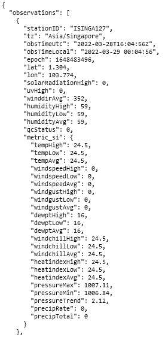
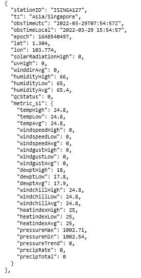
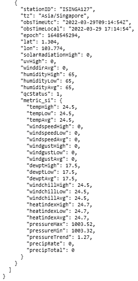

# CARES Weather Station input agent

This agent is for maintaining data and the corresponding instances in the knowledge graph (KG) regarding the weather station located in the vicinity of the CARES Lab. Its only purpose is to retrieve new data (if available) from the API and download it into 
the corresponding database, as well as, instantiating KG instances and connection when called for the first time. The 
agent uses the [time-series client](https://github.com/cambridge-cares/TheWorldAvatar/tree/develop/JPS_BASE_LIB/src/main/java/uk/ac/cam/cares/jps/base/timeseries)
from the JPS_BASE_LIB to interact with both the KG and database.

Before explaining the usage of the agent, we will briefly summarize the weather station API that is
contacted by one of the classes in this package to retrieve data.

## Weather Station API

Here, we will briefly describe the weather station API. The official documentation can be found at this [link](https://docs.google.com/document/d/1eKCnKXI9xnoMGRRzOL1xPCBihNV2rOet08qpE_gArAY/edit).


### Data retrieval
The daily weather readings are returned. A new reading is made by the sensor in an interval of 5 minutes.

#### The endpoint
The actual endpoint has the following structure: 
```
https://api.weather.com/v2/pws/observations/all/1day?stationId=[<stationId>]&format=json&units=s&numericPrecision=decimal&apiKey=[<apiKey>]
```
where `[stationId]` is the id of the weather station which is taking the physical readings.  The `[apiKey]` is the key needed to access the API. By setting `units=s` one ensures that the values of the readings correspond to SI units. 
Finally, the option `numericPrecision=decimal` enables the numerical readings to be returned in decimal values (unless according to the API the field under observation can only return an integer. See also the [API documentation](#Weather-Station-API)).
The endpoint controls what type of data is retrieved and its form.

#### Example readings
Readings are returned to the response body in form of a JSON Object which consist of key-value pair. The JSONObject has the 
key:"observations", which contains a JSONArray containing JSONObjects. Each of these individual JSONObjects found within the JSONArray
provide the weather readings corresponding to a particular timestamp.
The following images are examples of what the JSONObject looks like with the first and last image corresponding to the first and last entry of the JSONArray. The second image corresponds to weather data readings
taken at a timestamp between the first and third image.





## Usage 
This part of the README describes the usage of the input agent. The module itself can be packaged into an executable war, deployed as a web servlet on tomcat. Sending the appropriate request to the correct URL will initiate the agent. 

The agent instantiates the weather reading retrieved via the API as timeseries in the knowledge graph. In addition, it will check and instantiate the ABoxes for the weather station and the quantities it measures based on these ontologies [ontology-of-units-of-measure](https://github.com/cambridge-cares/OM/tree/master), [OntoDevice](https://github.com/cambridge-cares/TheWorldAvatar/blob/main/JPS_Ontology/ontology/ontodevice/OntoDevice.owl), [OntoEMS](https://github.com/cambridge-cares/TheWorldAvatar/blob/main/JPS_Ontology/ontology/ontoems/OntoEMS.owl), , [OntoTimeSeries](https://github.com/cambridge-cares/TheWorldAvatar/blob/main/JPS_Ontology/ontology/ontotimeseries/OntoTimeSeries.owl). An example of the ABox is shown below:
```
<ReportingStation> rdf:type ontoems:ReportingStation ;
                   ontoems:reports <Quantity> .

<Quantity> rdf:type ontoems:DewPoint ;
           om:hasValue <measure> ;
           om:hasAggregateFunction <om:minimum> .

<measure> rdf:type om:Measure ;
          ontotimeseries:hasTimeSeries <timeseries> .

<timeseries> rdf:type ontotimeseries:InstantaneousTimeSeries ;
             ontotimeseries:hasRDB "JDBC URL" ;	
             ontotimeseries:hasTimeUnit	"OffsetDateTime" .

<om:minimum> rdf:type om:Function ;
             rdfs:label "minimum" .		 
```

The agent will also retrieve the coordinates of the weather station and instantiate it in postGIS and Geoserver.

### Property files
For running the agent, three property files are required:
- One [property file for the agent](#agent-properties) itself pointing to the mapping configuration.
- One [property file for the time-series client](#time-series-client-properties) defining how to access the database and SPARQL endpoint.
- One [property file for the weather station API](#api-properties) defining the api_key, stationId and the api_url.

#### Agent properties
The agent property file only needs to contain a single line:
```
caresWeatherStation.mappingfolder=CARESWeatherStation_AGENT_MAPPINGS
```
where `CARESWeatherStation_AGENT_MAPPINGS` is the environment variable pointing to the location of a folder containing JSON key to IRI mappings.An example property file can be found in the `config` folder under 
`agent.properties`. See [this section](#mapping-files) of the README for an explanation of the mapping files.

#### Time-series client properties
The time-series client property file needs to contain all credentials and endpoints to access the SPARQL endpoint of the knowledge graph and the Postgres database. It should contain the following keys:
- `db.url` the [JDBC URL](https://www.postgresql.org/docs/7.4/jdbc-use.html) for the Postgres database
- `db.user` the username to access the Postgres database
- `db.password` the password to access the Postgres database
- `sparql.query.endpoint` the SPARQL endpoint to query the knowledge graph
- `sparql.update.endpoint` the SPARQL endpoint to update the knowledge graph
- `sparql.username` the username to access the SPARQL endpoint
- `sparql.password` the password to access the SPARQL endpoint

More information can be found in the example property file `client.properties` in the `config` folder.

#### API properties
The API properties contain the credentials to authorize access to the weather Station API (see the [API description](#Weather-Station-API)),
as well as, the url of the API and the identifier of the weather station. More specifically, the API properties file should contain the following keys:
- `weather.api_key` the key needed to access the API.
- `weather.stationId` the stationId associated with the sensor.
- `weather.api_url` the URL to use for the API. (see [Data retrieval](#data-retrieval)). This property also allows to adjust the agent, if the URL should change in the future.

More information can be found in the example property file `api.properties` in the `config` folder.

#### Mapping files
What are the mapping files and why are they required? The mapping files define how data received from the API is connected
to the knowledge graph (KG). Specifically, each JSON key in the readings (see [Example readings](#example-readings)) 
represents a specific measure that needs to be represented by an IRI, if it should be saved in the database.

Furthermore, measures can be grouped into one time-series (will result in one time-series instance per group in the KG).
This should be done so that all measures in one group are recorded at the same time interval, and so they come from 
the same readings

The mapping is achieved in this package by using one property file per group. Each property file contains one line per 
JSON key that should be linked to an IRI, e.g. like:
```
dewptAvg=http:/example/dewptAvg
```
If the IRI is left empty (`dewptAvg=` in the example), i.e. because there is no instance that represents the measure yet, 
it will be automatically created when the agent is run for the first time. This automatically generated URI will have the
following form:
```
[prefix]/[key]_[UUID]
```
where the `[prefix]` is hardcoded into the `CARESWeatherStationInputAgent` class in a public, static field called `generatedIRIPrefix`
which is based on the time-series client namespace, `[key]` is the JSON key the URI is generated for, and `[UUID]` is a 
randomly generated UUID.

Note, that not all JSON keys need to be represented in the mapping files (the data will simply be ignored and not stored), 
but there needs to be a 1-1 mapping, i.e. no IRI can be used for multiple JSON keys.

To ensure that the same IRIs are used for each JSON key, the mapping files are saved back after each run (only really 
necessary when some of them are automatically generated). Note, that if you change any mapping in preceding runs, they 
will be seen as new time-series, which can result in inconsistencies in both the KG and database.

Examples for the structure of the mapping folder and files can be found in the `mapping` folder within the `config` 
folder.  (see 
also [Example readings](#example-readings)).

### Building the CARESWeatherStation Agent

The CARESWeatherStation Agent is set up to use the Maven repository at https://maven.pkg.github.com/cambridge-cares/TheWorldAvatar/ (in addition to Maven central). You'll need to provide your credentials in single-word text files located like this:
```
./credentials/
    repo_username.txt
    repo_password.txt
```
repo_username.txt should contain your github username, and repo_password.txt your github [personal access token](https://docs.github.com/en/github/authenticating-to-github/creating-a-personal-access-token),
which must have a 'scope' that [allows you to publish and install packages](https://docs.github.com/en/packages/working-with-a-github-packages-registry/working-with-the-apache-maven-registry#authenticating-to-github-packages).

The agent is designed to function as part of the stack.

#### Stack Deployment

Modify `api.properties` and `client.properties` in the `config` folder accordingly.

In the `Dockerfile`, there are three variables that affects where the geolocation information will be uploaded to in postGIS and the Geoserver, modify them accordingly:
- `LAYERNAME` the name of the layer in Geoserver, this will also be the name of the table in the postGIS database that will be used to store the geolocation information
- `DATABASE` the name of the database in postGIS to store the geolocation information
- `GEOSERVER_WORKSPACE` the name of the workspace in Geoserver to store the geolocation information

Open up the command prompt in the same directory as this README, run the command below to build the docker image:
```
docker compose build
```
Open `stack-manager-input-config-service/cares-weather-station-agent.json` and under the `Mounts` section, modify the `Source` and insert the filepath of where the `config` folder is located at (For Windows users using WSL on Docker, the file path should start with `/mnt/c/`, which is equivalent to `C://`).

Copy `stack-manager-input-config-service/cares-weather-station-agent.json` to the services folder under your stack-manager directory (By default it should be `TheWorldAvatar/Deploy/stacks/dynamic/stack-manager/inputs/config/services/`) and start up the stack.

##### Run the agent
To run the agent, a POST request must be sent to http://localhost:3838/cares-weather-station-agent/retrieve with a correct JSON Object.
Follow the request shown below.

```
POST http://localhost:3838/cares-weather-station-agent/retrieve
Content-Type: application/json
{"agentProperties":"CARESWeatherStation_AGENTPROPERTIES","apiProperties":"CARESWeatherStation_APIPROPERTIES","clientProperties":"CARESWeatherStation_CLIENTPROPERTIES"}
```
In curl syntax:
```
curl -X POST --header "Content-Type: application/json" -d "{\"agentProperties\":\"CARESWeatherStation_AGENTPROPERTIES\",\"apiProperties\":\"CARESWeatherStation_APIPROPERTIES\",\"clientProperties\":\"CARESWeatherStation_CLIENTPROPERTIES\"}" http://localhost:3838/cares-weather-station-agent/retrieve
```

If the agent runs successfully, you should see a returned JSON Object that is similar to the one shown below.
```
{"Result":["Input agent object initialized.","Time series client object initialized.","API connector object initialized.","Retrieved 10 weather station readings.","Data updated with new readings from API.","Timeseries Data has been updated."]}
```