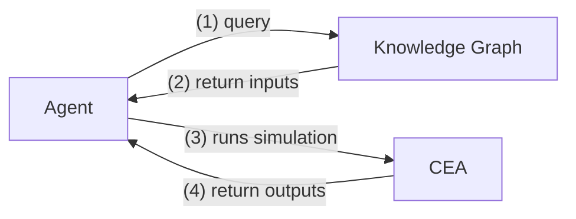

# CEA Agent

The CEA agent is used to interact with the [City Energy Analyst (CEA)](https://www.cityenergyanalyst.com/) platform to simulate building energy demand and installable solar energy generators based on inputs from the knowledge graph. Presently, the CEA agent queries for the following inputs:

- Building Geometry
- Geometry of surrounding buildings _[OPTIONAL]_
- Building usage _[OPTIONAL]_
- Historical weather data _[OPTIONAL]_

Note: Default values are set for the optional inputs if unavailable. More information is available in the [Supplementary section](#4-supplementary-information).

The agent instantiates the following simulation outputs into the knowledge graph:

- Energy demand
- Potential energy generated by solar energy generators (photovoltaic panels, photovoltaic-thermal collectors, and solar collectors)

## 1. Build Instructions

The CEA agent is available as a Docker image in this [package](https://github.com/orgs/cambridge-cares/packages/container/package/cea-agent). Users need not build the image unless they are developing a newer version. The latest version can be pulled from this [repository](https://github.com/orgs/cambridge-cares/packages/container/package/cea-agent).

Keep reading if you need to build the image for any reason or skip to the [deployment section](#2-deployment-instructions).

#### Build Step 1

This agent is set up to use this [Maven repository](https://maven.pkg.github.com/cambridge-cares/TheWorldAvatar/) (in addition to Maven central). You'll need to provide your credentials (GitHub username/personal access token) in a single-word text files located like this:

```
./credentials/
    repo_username.txt
    repo_password.txt
```

repo_username.txt should contain your Github username. repo_password.txt should contain your Github [personal access token](https://docs.github.com/en/github/authenticating-to-github/creating-a-personal-access-token),
which must have a 'scope' that [allows you to publish and install packages](https://docs.github.com/en/packages/working-with-a-github-packages-registry/working-with-the-apache-maven-registry#authenticating-to-github-packages).

#### Build Step 2

Run the following at the `<root>` directory containing this README to build the Docker image:

```
docker compose build
```

If changes have been made to the agent, update the version number or append a `-SNAPSHOT` qualifier to the image field in the `docker-compose.yml` before building the image. Once the changes have been merged, push the image to the GitHub container registry by running:

```
docker push ghcr.io/cambridge-cares/cea-agent:X.Y.Z
```

where X.Y.Z is the new version number.

## 2. Deployment Instructions

The agent is designed to run in the stack as a Docker container and other deployment workflows may not work. Before starting the stack, read the instructions below.

### 2.1. Default Service configuration

The agent employs a configuration file - [CEAAgentConfig.properties], the contents of which will be read during runtime. The following fields in the file can be edited before starting the agent based on your requirements:

1. `cea.database`: The RDB database name for storing all time series outputs. This database must be set up in the stack's RDB before running the agent.
2. `cea.label`: The namespace of the SPARQL endpoint for storing CEA outputs. This namespace must be set up in the stack's SPARQL endpoint before running the agent. If your SPARQL endpoint is `http://www.example.org/blazegraph/namespace/test/sparql`, the corresponding namespace is 'test'
3. `weather.label`: _Optional_ field for the namespace of the SPARQL endpoint containing weather inputs. This must correspond to the `route.label` field in OpenMeteoAgent's [config.properties](https://github.com/cambridge-cares/TheWorldAvatar/blob/main/Agents/OpenMeteoAgent/openmeteo-agent/src/main/resources/config.properties).
4. `terrain.database`: _Optional_ field for the RDB database name containing the terrain data.
5. `terrain.table`: _Optional_ field for the RDB table containing the terrain data.

The file location of `CEAAgentConfig.properties` can be set in the stack service configuration file at [cea-agent.json]. The default location is set to the [current file location](./cea-agent/src/main/resources/CEAAgentConfig.properties) and need not be modified if you transfer the [cea-agent.json] to the [stack manager's services](https://github.com/cambridge-cares/TheWorldAvatar/tree/main/Deploy/stacks/dynamic/stack-manager/inputs/config/services) directory.

### 2.2. Agent Dependencies

The CEA agent have the following agent dependencies. The stack deployment instructions for each agent are available on the respective agent's directory.

> Access Agent

The [Access Agent](../AccessAgent) must be deployed on the same stack for the CEA Agent to function. The routing information for the SPARQL endpoint (corresponding to `cea.label` in [CEAAgentConfig.properties]) must be uploaded on the Access Agent. Uploading the routing information on to the `cea.label` endpoint is not recommended and will not work by default.

> OpenMeteoAgent _[OPTIONAL]_

If the user requires real-time weather data, the [OpenMeteoAgent](https://github.com/cambridge-cares/TheWorldAvatar/tree/main/Agents/OpenMeteoAgent) must be deployed on the same stack. The CEA agent will attempt to communicate with this agent to retrieve the required weather data.

Notes:

- `weather.label` in [CEAAgentConfig.properties] MUST correspond to `route.label` in OpenMeteoAgent's [config.properties](https://github.com/cambridge-cares/TheWorldAvatar/blob/main/Agents/OpenMeteoAgent/openmeteo-agent/src/main/resources/config.properties)
- If the agent communication request is unsuccessful, the CEA agent will employ default values for weather conditions. Hence, this agent is not mandatory.

> OSMAgent _[OPTIONAL]_

If the user requires building usage information, the [OSMAgent](https://github.com/cambridge-cares/TheWorldAvatar/tree/main/Agents/OSMAgent) must be deployed on the same stack. Ensure that the OSMAgent has successfully instantiated the building usage information in the RDB before running the CEA agent.

### 2.3. Data Requirements

The CEA agent requires **building geometry** in the RDB. This must be uploaded via the [stack-data-uploader] after starting the stack. As the building geometry must be exposed as a SPARQL endpoint, please ensure the corresponding building OBDA is also uploaded via the [stack-data-uploader]. Without any building geometry data, the CEA agent cannot function.

If terrain data is required, upload the terrain data as raster files via the [stack-data-uploader]. Please ensure that the `terrain.database` and `terrain.table` in [CEAAgentConfig.properties] matches the RDB database and table containing the uploaded terrain data. Otherwise, the agent will adopt the default terrain values.

### 2.4. Stack Environment

The minimal workflow for the CEA agent using the default setup has the following steps:

1. Transfer the `./stack-manager-input-config/cea-agent.json` and the access agent's service config to the `stack-manager/inputs/config/services` directory.
2. Start the stack by running `./stack.sh start <STACK NAME>` in the [stack-manager] directory. Replace `<STACK NAME>` with your stack name.
3. Create the CEA RDB and SPARQL endpoint, corresponding with the `config.properties` file.
4. Set up routing information on the Access Agent's specified SPARQL endpoint. This is not the SPARQL endpoint indicated in `cea.label`.
5. Upload building geometry and obda using the [stack-data-uploader].
6. Send the required HTTP request to the agent to execute its tasks. Please scroll down to find out more

If all goes well, the CEA Agent is reachable at `http://localhost:3838/cea-agent`. `3838` is the default port number used by stack manager.
If another port number was specified, please replace `3838` accordingly.

### 2.5. Debugging

To debug, put `./stack-manager-input-config/cea-agent-debug.json` instead of `./stack-manager-input-config/cea-agent.json`. Ensure that the `Source` option in the `Mounts` tag of [cea-agent-debug.json] points to your required `CEAAgentConfig.properties`.

Run `./stack.sh start <STACK NAME>` in the [stack-manager] directory to start this service. Once available, the debugger port will be available at 5005.

### 2.6. Visualisation

Visualisation of CEA outputs can be achieved with the [TWA Visualisation Framework] and [FeatureInfoAgent]. The [TWA Visualisation Framework] can be deployed according to the [documentation](https://github.com/cambridge-cares/TheWorldAvatar/tree/main/Deploy/stacks/dynamic/stack-manager#example---including-a-visualisation).

For the [FeatureInfoAgent], the `.sparql` and `.json` files for CEA data is available at [feature-info-agent-input](./feature-info-agent-input). This must be placed inside the `stack-manager/input/data/fia-queries` directory following the [FeatureInfoAgent] instructions.

Once both the visualisation and FeatureInfoAgent is running on the stack, one should see the following CEA results upon clicking a building:

- solar suitable area **[SCALAR]**
- annual building energy demands **[SCALAR]**
- annual solar potentials for PV panels, solar collectors, PV-thermal collectors **[SCALAR]**
- building demands **[24H TIME SERIES]**
- solar potentials for PV panels, solar collectors, PV-thermal collectors **[24H TIME SERIES]**

## 3. Agent Routes

The CEA agent provides three routes:

- `/run` (http://localhost:3838/cea-agent/run): Agent runs CEA simulation
- `/update` (http://localhost:3838/cea-agent/update): Agent updates the knowledge graph based on CEA outputs
- `/query` (http://localhost:3838/cea-agent/run): Agent returns CEA aggregated outputs as a JSON object

### 3.1. Run Route

A `POST` request should be sent to this route for running the CEA simulation. The `/run` route accepts the following request parameters:

- `iris`: array of building IRIs.
- `geometryEndpoint`: (optional) SPARQL endpoint containing the geospatial information of the corresponding buildings from `iris`; defaults to Ontop endpoint
- `usageEndpoint`: (optional) SPARQL endpoint containing the building usage information of the corresponding buildings from `iris`; defaults to Ontop endpoint
- `ceaEndpoint`: (optional) Intended SPARQL endpoint for storing CEA output triples, i.e. energy demand and photovoltaic potential information; defaults to the `cea.label` in [CEAAgentConfig.properties]
- `weatherEndpoint`: (optional) SPARQL endpoint containing historical weather information; defaults to the `weather.label` in [CEAAgentConfig.properties]
- `terrainDatabase` (optional) RDB database containing terrain data; defaults to `terrain.database` in [CEAAgentConfig.properties]
- `terrainTable`: (optional) RDB table, inclusive of schema prefix, containing terrain data; defaults to `terrain.table` in [CEAAgentConfig.properties]
- `solarProperties`: (optional) Solar panel related parameters as a single object; defaults to CEA default assumptions
  - Allowable parameters
    - `annual-radiation-threshold`: Panels are only considered on surfaces that receive annual radiation threshold above the defined threshold kwh/m2/yr(default:800)
    - `max-roof-coverage`: Maximum panel coverage of roof surfaces that reach the `annual-radiation-threshold` (valid values between 0 and 1) (default: 1.0)
    - `panel-tilt-angle`: solar panel tilt angle (degrees) (default: optimal tilt angle, automatically calculated by CEA, will be used)
    - `t-in-sc`: Inlet temperature of solar collectors (Celsius) (default: 60 for flat plate solar collectors and 75 for evacuated tube solar collectors)
    - `t-in-pvt`: Inlet temperature of PV-thermal panels (Celsius) (default: 35)

Example `POST` request:

```
// One building and no optional parameters
curl -X POST 'http://localhost:3838/cea-agent/run' -H "Content-Type: application/json" -d '{"iris": ["https://www.theworldavatar.com/kg/Building/0004c6a2-f58a-48a1-8488-09318dfac5da"]}'


// Building geometry is queried from geometryEndpoint while CEA outputs are instantiated into ceaEndpoint
curl -X POST 'http://localhost:3838/cea-agent/run' -H "Content-Type: application/json" -d '{"iris": ["https://www.theworldavatar.com/kg/Building/0004c6a2-f58a-48a1-8488-09318dfac5da"], "geometryEndpoint" : "http://localhost:3838/access-agent/kingslynnEPSG27700", "ceaEndpoint": "http://localhost:3838/access-agent/outputs"}'
```

The workflow for this route can be illustrated as follows:



(1)/(2): Inputs include building geometry, surrounding buildings' geometry, building usage, historical weather data, and terrain data

(4): The CEA outputs are returned to the `/update` route for instantiation

### 3.2. Update

A request should be sent to this `/update` route to instantiate the CEA outputs into the knowledge graph. However, requests to this route is automatically sent after the `/run` route completes successfully. Users should **NOT** be sending any request to this route.

### 3.3. Query

A request should be sent to this route to retrieve the aggregate CEA outputs for the specified buildings from the knowledge graph. Before sending the request, ensure that the `/run` route has been executed for the specified buildings. The `/query` route accepts the following request parameters:

- `iris`: array of building IRIs.
- `ceaEndpoint`: (optional) SPARQL endpoint containing CEA output triples, i.e. energy demand and photovoltaic potential information; Defaults to the `cea.label` in [CEAAgentConfig.properties]

Example `POST` request:

```
curl -X POST 'http://localhost:3838/cea-agent/query' -H "Content-Type: application/json" -d '{"iris": ["https://www.theworldavatar.com/kg/Building/0004c6a2-f58a-48a1-8488-09318dfac5da"]}'
```

If the agent is successful, the user will receive the following response:

```
{
    "path": "/cea-agent/query",
    "iris": [
        "https://www.theworldavatar.com/kg/Building/0004c6a2-f58a-48a1-8488-09318dfac5da"
    ],
    "acceptHeaders": "*/*",
    "method": "POST",
    "requestUrl": "http://localhost:3838/cea-agent/query",
    "ceaOutputs": [
        {
            "EastWallSolarSuitableArea": "106.29 m^2",
            "Annual PVTPlateWallSouth Heat Supply": "58659.89 kWh",
            "SouthWallSolarSuitableArea": "74.82 m^2",
            "Annual PVRoof Electricity Supply": "14837.76 kWh",
            "Annual PVWallNorth Electricity Supply": "2149.17 kWh",
            "Annual ThermalPlateRoof Heat Supply": "124592.48 kWh",
            "Annual PVTPlateWallNorth Electricity Supply": "1705.71 kWh",
            "Annual PVTPlateWallWest Electricity Supply": "9670.28 kWh",
            "Annual HeatingConsumption": "55132.02 kWh",
            "Annual PVTTubeRoof Electricity Supply": "31488.02 kWh",
            "Annual ThermalTubeWallWest Heat Supply": "2419.43 kWh",
            "Annual ElectricityConsumption": "5897.54 kWh",
            "Annual PVTTubeWallEast Heat Supply": "22086.78 kWh",
            "Annual ThermalPlateWallEast Heat Supply": "699.96 kWh",
            "Annual PVWallSouth Electricity Supply": "5414.0 kWh",
            "Annual PVTTubeWallSouth Electricity Supply": "11508.16 kWh",
            "Annual PVTTubeWallEast Electricity Supply": "12317.57 kWh",
            "Annual PVTTubeWallNorth Heat Supply": "9826.32 kWh",
            "Annual ThermalTubeRoof Heat Supply": "53682.57 kWh",
            "Annual PVTPlateWallWest Heat Supply": "7347.86 kWh",
            "Annual PVTPlateWallSouth Electricity Supply": "12017.34 kWh",
            "Annual PVWallWest Electricity Supply": "2673.61 kWh",
            "Annual PVTTubeWallSouth Heat Supply": "49508.46 kWh",
            "Annual PVTPlateWallNorth Heat Supply": "6394.9 kWh",
            "Annual ThermalTubeWallSouth Heat Supply": "41769.6 kWh",
            "Annual GridConsumption": "5897.54 kWh",
            "WestWallSolarSuitableArea": "106.29 m^2",
            "Annual PVTTubeWallNorth Electricity Supply": "1696.94 kWh",
            "Annual PVTTubeRoof Heat Supply": "71644.21 kWh",
            "Annual PVTPlateWallEast Electricity Supply": "12464.7 kWh",
            "Annual ThermalPlateWallWest Heat Supply": "4080.53 kWh",
            "Annual PVTTubeWallWest Heat Supply": "4561.7 kWh",
            "Annual ThermalPlateWallSouth Heat Supply": "50605.26 kWh",
            "NorthWallSolarSuitableArea": "74.82 m^2",
            "Annual PVWallEast Electricity Supply": "8051.66 kWh",
            "Annual ThermalPlateWallNorth Heat Supply": "2765.64 kWh",
            "Annual PVTTubeWallWest Electricity Supply": "3442.28 kWh",
            "Annual ThermalTubeWallEast Heat Supply": "17521.69 kWh",
            "Annual PVTPlateRoof Electricity Supply": "36713.79 kWh",
            "Annual PVTPlateRoof Heat Supply": "152928.79 kWh",
            "Annual ThermalTubeWallNorth Heat Supply": "5332.34 kWh",
            "Annual PVTPlateWallEast Heat Supply": "4701.85 kWh",
            "RoofSolarSuitableArea": "98.21 m^2"
        }
    ],
    "body": "{\"iris\": \r\n[\"http://www.theworldavatar.com:83/citieskg/namespace/kingslynnEPSG27700/sparql/cityobject/UUID_0595923a-3a83-4097-b39b-518fd23184cc/\"]\r\n}",
    "contentType": "application/json"
}
```

## 4. Supplementary Information

This section details the programming logic behind the agent for the inputs.

### 4.1. Building Footprint and Coordinate Reference System (CRS)

The following query is executed to retrieve the building footprint and its Coordinate Reference System (CRS). If the query is successful, a shapefile will be generated that is passed to the CEA simulation as input. If no result is retrieved, the simulation fails to start without any valid footprint geometry.

```
PREFIX geo: <http://www.opengis.net/ont/geosparql#>
PREFIX bldg: <http://www.opengis.net/citygml/building/2.0/>
PREFIX grp:	 <http://www.opengis.net/citygml/cityobjectgroup/2.0/>
PREFIX geof: <http://www.opengis.net/def/function/geosparql/>

SELECT ?wkt (geof:getSRID(?wkt) AS ?crs)
WHERE
{
  <buildingIRI> bldg:lod0FootPrint ?fp .
  ?g grp:parent ?fp;
    geo:asWKT ?wkt .
}
```

### 4.2. Building Height

The following query is executed to retrieve the building height. If the query is unsuccessful, the agent assumes a **DEFAULT** value of 10.0m.

```
PREFIX bldg: <http://www.opengis.net/citygml/building/2.0/>
SELECT ?height
WHERE
{
  <buildingIRI> bldg:measuredHeight ?height .
}
```

### 4.3. Building Usage

The following query is executed to retrieve the building usage and the usage share for multi-usage buildings. If no building usage is returned from the query, the agent assumes a **DEFAULT** value of `MULTI_RES` building usage, following the default building usage type in the CEA.

```
PREFIX ontobuiltenv: <https://www.theworldavatar.com/kg/ontobuiltenv/>

SELECT  ?BuildingUsage ?UsageShare
WHERE
{
    <buildingIRI> ontobuiltenv:hasPropertyUsage  ?usage .
    ?usage a ?BuildingUsage
    OPTIONAL
      {?usage ontobuiltenv:hasUsageShare ?UsageShare}
}
ORDER BY DESC(?UsageShare)
```

In the event multiple usages for one building is retrieved, we first map the related `OntoBuiltEnv` concepts to the CEA defined types according to the following mappings. Given that CEA allows up to three usage types per building, only the top three mapped usages and their usage share are passed to CEA as input.

| `OntoBuiltEnv` concepts | Mapped to CEA usage type |
| :---------------------: | :----------------------: |
|        Domestic         |        MULTI_RES         |
|    SingleResidential    |        SINGLE_RES        |
|    MultiResidential     |        MULTI_RES         |
|    EmergencyService     |         HOSPITAL         |
|       FireStation       |         HOSPITAL         |
|      PoliceStation      |         HOSPITAL         |
|       MedicalCare       |         HOSPITAL         |
|        Hospital         |         HOSPITAL         |
|         Clinic          |         HOSPITAL         |
|        Education        |        UNIVERSITY        |
|         School          |          SCHOOL          |
|   UniversityFacility    |        UNIVERSITY        |
|         Office          |          OFFICE          |
|   RetailEstablishment   |          RETAIL          |
|    ReligiousFacility    |          MUSEUM          |
|   IndustrialFacility    |        INDUSTRIAL        |
|   EatingEstablishment   |        RESTAURANT        |
|  DrinkingEstablishment  |        RESTAURANT        |
|          Hotel          |          HOTEL           |
|     SportsFacility      |           GYM            |
|    CulturalFacility     |          MUSEUM          |
|    TransportFacility    |        INDUSTRIAL        |
|      Non-Domestic       |        INDUSTRIAL        |

Note that there are 19 defined building usage types in CEA and 23 classes for building usage type in the `OntoBuiltEnv` ontology, as depicted below.

| CEA available usage types | `OntoBuiltEnv` concepts |
| :-----------------------: | :---------------------: |
|         COOLROOM          |        Domestic         |
|         FOODSTORE         |    SingleResidential    |
|            GYM            |    MultiResidential     |
|         HOSPITAL          |    EmergencyService     |
|           HOTEL           |       FireStation       |
|        INDUSTRIAL         |      PoliceStation      |
|            LAB            |       MedicalCare       |
|          LIBRARY          |        Hospital         |
|         MULTI_RES         |         Clinic          |
|          MUSEUM           |        Education        |
|          OFFICE           |         School          |
|          PARKING          |   UniversityFacility    |
|        RESTAURANT         |         Office          |
|          RETAIL           |   RetailEstablishment   |
|          SCHOOL           |    ReligiousFacility    |
|        SERVERROOM         |   IndustrialFacility    |
|        SINGLE_RES         |   EatingEstablishment   |
|         SWIMMING          |  DrinkingEstablishment  |
|        UNIVERSITY         |          Hotel          |
|                           |     SportsFacility      |
|                           |    CulturalFacility     |
|                           |    TransportFacility    |
|                           |      Non-Domestic       |

### 4.4. Historical Weather Data

The CEA platform requires an `EPW` file for weather data. This agent generates the required file by querying weather data for the building's location from the knowledge graph. However, the weather data available **MUST be at least 1 year duration in hourly format**.

In the event that the weather data does not satisfy the requirement or is unretrievable, the agent defaults to the default `EPW` file defined by CEA's own database as the weather input.

**WARNING: Please note that the CEA Agent, by default, assumes that the historical weather data is stored in the Blazegraph and PostgreSQL of the same stack as this agent.**

### 4.5. Terrain Data

The agent will attempt to retrieve terrain data for an area containing the target building(s) from the stack RDB. The queried area will be positioned to ensure that the specified building(s) are in the center, as well as encompassing the surrounding buildings retrieved in the surroundings query.

[CEAAgentConfig.properties]: ./cea-agent/src/main/resources/CEAAgentConfig.properties
[cea-agent.json]: ./stack-manager-input-config/cea-agent.json
[cea-agent-debug.json]: ./stack-manager-input-config/cea-agent-debug.json
[stack-data-uploader]: https://github.com/cambridge-cares/TheWorldAvatar/tree/main/Deploy/stacks/dynamic/stack-data-uploader
[stack-manager]: https://github.com/cambridge-cares/TheWorldAvatar/tree/main/Deploy/stacks/dynamic/stack-manager
[stack-manager config services]: https://github.com/cambridge-cares/TheWorldAvatar/tree/main/Deploy/stacks/dynamic/stack-manager/inputs/config/services
[TWA Visualisation Framework]: https://github.com/cambridge-cares/TheWorldAvatar/tree/main/web/twa-vis-framework
[FeatureInfoAgent]: https://github.com/cambridge-cares/TheWorldAvatar/tree/main/Agents/FeatureInfoAgent
