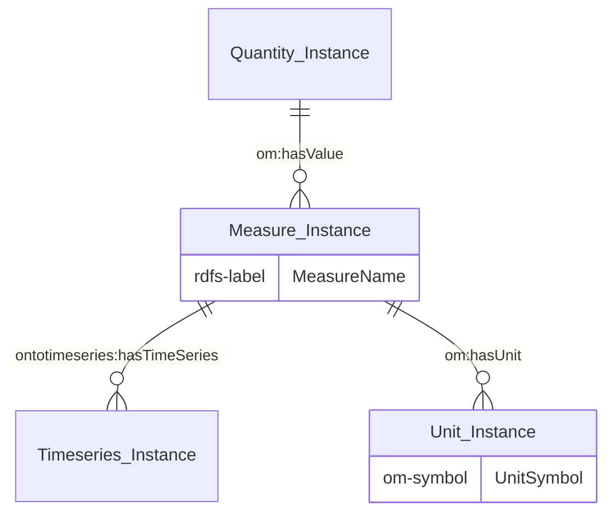
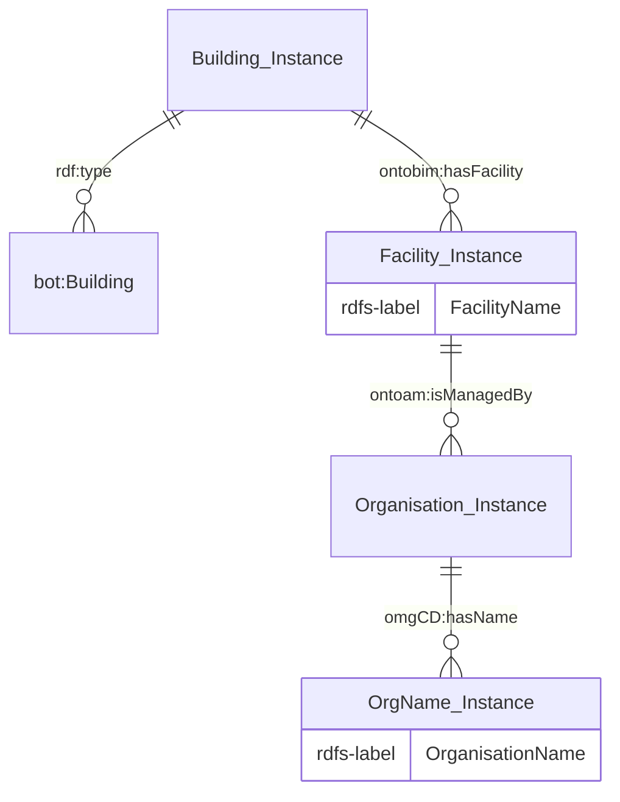
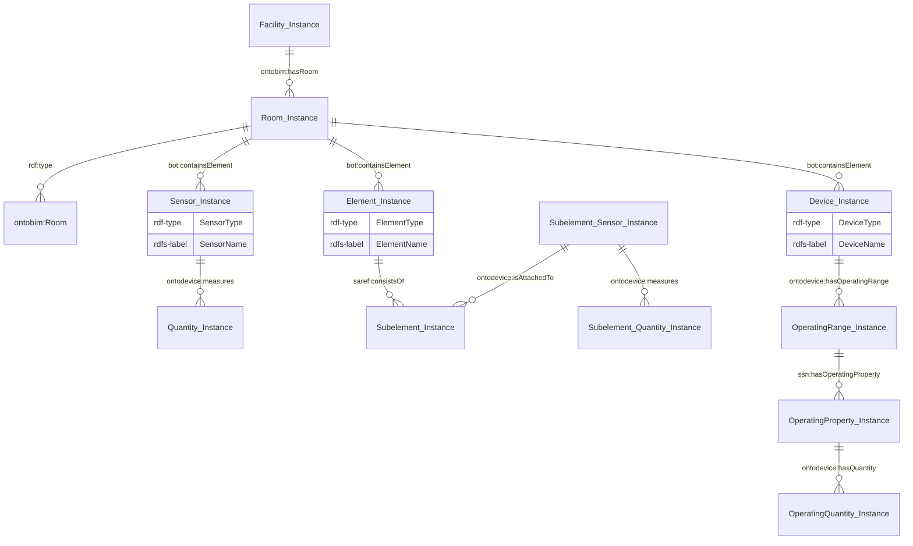
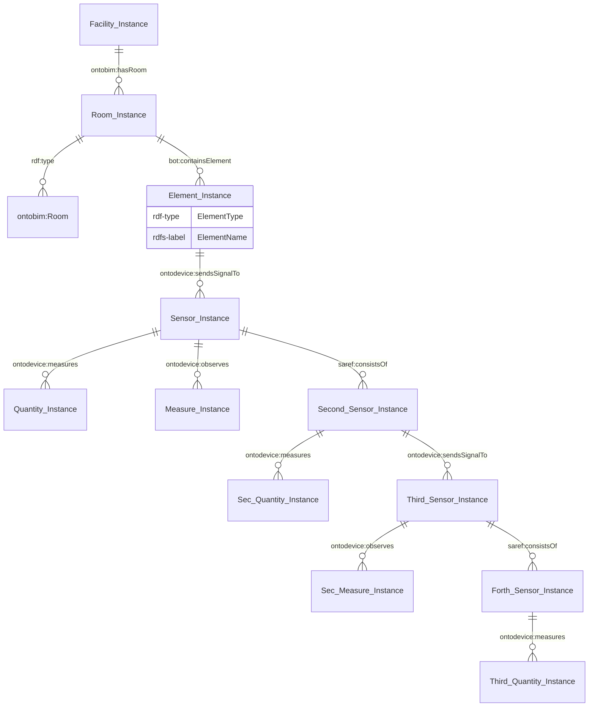
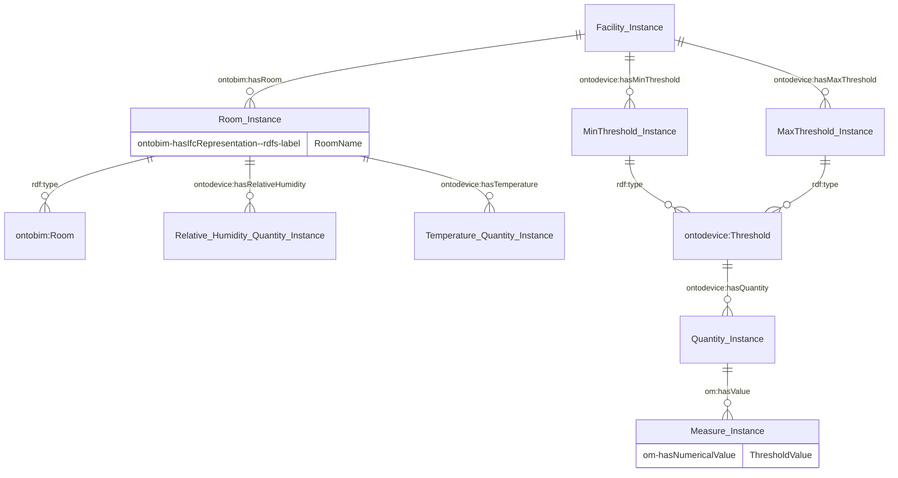
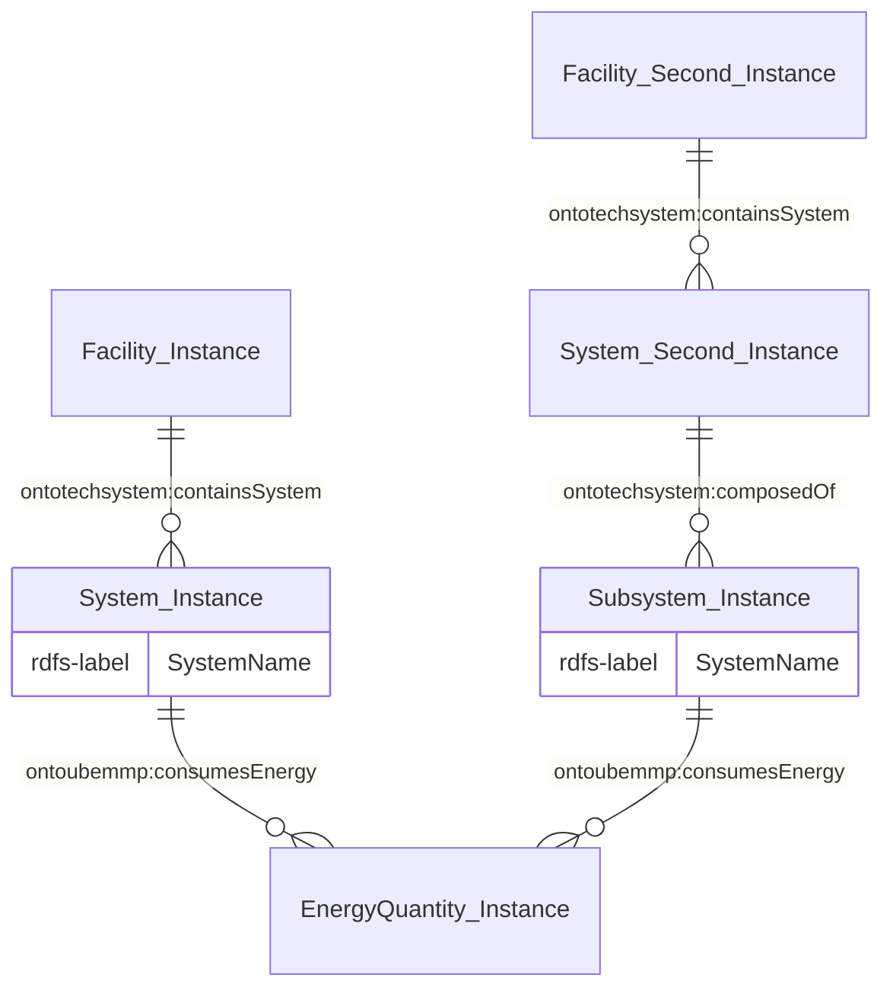

# Dashboard Agent
The Dashboard Agent is designed to set up and populate dashboards within a stack. These dashboards will require both spatial topological and time series data to be available within the stack.
Namely, it will require the concept of buildings, facilities, rooms, elements and connected sensors/devices from at minimal the [OntoBIM](https://github.com/cambridge-cares/TheWorldAvatar/tree/main/JPS_Ontology/ontology/ontobim) and [OntoDevice](https://github.com/cambridge-cares/TheWorldAvatar/tree/main/JPS_Ontology/ontology/ontodevice) ontologies.

## Instructions
Before you can use the Dashboard Agent, there are some requirements you need to meet. Follow the steps below to ensure you have everything you need to successfully run the agent.
### 1. Agent Deployment
The agent is designed for execution through a Docker container within a stack. It cannot run as a standalone container, and other deployment workflows are beyond the scope of this document. 
Follow the steps below to build and deploy the agent for either the test or production environment.

#### 1.1 Preparation
##### Maven Repository credentials
This agent is set up to use this [Maven repository](https://maven.pkg.github.com/cambridge-cares/TheWorldAvatar/) (in addition to Maven central).
You'll need to provide your credentials in a single-word text files located like this:
```
./credentials/
    repo_username.txt
    repo_password.txt
```
repo_username.txt should contain your Github username. repo_password.txt should contain your Github [personal access token](https://docs.github.com/en/github/authenticating-to-github/creating-a-personal-access-token),
which must have a 'scope' that [allows you to publish and install packages](https://docs.github.com/en/packages/working-with-a-github-packages-registry/working-with-the-apache-maven-registry#authenticating-to-github-packages).

##### Stack containers
This agent requires the following tools, which **MUST** run on the same stack. Please read more from the [stack manager page](https://github.com/cambridge-cares/TheWorldAvatar/tree/main/Deploy/stacks/dynamic/stack-manager) for setting these containers up.

(1) [Grafana](https://grafana.com/docs/grafana/latest/) dashboard
- Requires the deployment of the built-in optional `grafana` service on the stack to configure and set up dashboards
- For deploying the service,
  - include `grafana` as a service following the [stack-manager configuration file](https://github.com/cambridge-cares/TheWorldAvatar/tree/main/Deploy/stacks/dynamic/stack-manager#stack-configuration)
  - include a `grafana_password` with your password as a Docker Secret in the `stack-manager/inputs/secrets` directory.
- Once deployed, the service can be accessed at the `/analytics` route with a default username of admin. 

(2) PostGIS database
- Contains the time series data

(3) SPARQL endpoint
- Contains triples linking time series to facilities and/or assets
- Mandatory structure:
  - A name must be appended to all buildings, facilities, rooms, assets, sensors, and measures/dataIRIs through the `Instance rdfs:label "name"^^xsd:string` triple.
  - All sensor measures are attached according to the [OntoDevice](https://github.com/cambridge-cares/TheWorldAvatar/tree/main/JPS_Ontology/ontology/ontodevice) ontology.
  - Units can be included into the dashboard through the `MeasureInstance om:hasUnit UnitInstance. UnitInstance om:symbol "symbols"^^xsd:string.` triples but are **OPTIONAL**.
  - Only temperature and relative humidity can be currently retrieved for any room measures. Do note to include a min and max threshold triples for the facility holding these rooms.
- ABox samples are documented [here](#3-data-model-requirements).

#### 1.2 Docker Deployment
**TEST ENVIRONMENT**
- Deploy the agent to execute the unit tests by running the following code in the CLI at the <root> directory. 
- The success of all tests must be verified through the Docker logs.
```
docker compose -f "./docker/docker-compose.test.yml" up -d --build
```
**PRODUCTION ENVIRONMENT**
- Build this agent's image by issuing `docker compose build` within this folder. Do not start the container.
- Copy the `dashboard-agent.json` file from the `stack-manager-input-config` folder into the `inputs/config/services` folder of the stack manager, adjusting the absolute path of the bind mount as required. 
Please review the [different routes](#2-agent-route) to understand the purpose of these bind mounts. See [sample bind mounts](https://github.com/cambridge-cares/TheWorldAvatar/tree/main/Deploy/stacks/dynamic/stack-manager#bind-mounts) for the configuration syntax.
- Start the stack manager as usual following [these instructions](https://github.com/cambridge-cares/TheWorldAvatar/tree/main/Deploy/stacks/dynamic/stack-manager).

### 2. Agent Route
The agent currently offers two API routes:
#### 2.1 GET ROUTE: `~url~/dashboard-agent/status` 
This route requires a GET request without any parameters, to retrieve the agent's current status. A sample request for curl syntax (in one line) is as follows:
```
curl localhost:3838/dashboard-agent/status 
```
If the agent ran successfully, a JSON Object would be returned as follows:
```
{"Result":["Agent is ready to receive requests."]}
```

#### 2.2 GET ROUTE: `~url~/dashboard-agent/reset`
This route requires a GET request without any parameters, to reset the agent and the queries it retrieves from the knowledge graph. A sample request for curl syntax (in one line) is as follows:
```
curl localhost:3838/dashboard-agent/reset 
```
If the agent ran successfully, a JSON Object would be returned as follows:
```
{"Result":["Agent has been successfully reset!"]}
```

#### 2.3 GET ROUTE: `~url~/dashboard-agent/setup`
This route will communicate with the stack's dashboard container to set up a live analytical dashboard.

To execute this route, please send a GET request without any parameters. A sample request for curl syntax (in one line) is as follows:
```
curl localhost:3838/dashboard-agent/setup 
```
If the agent ran successfully, a JSON Object would be returned as follows.
```
{"Result":["Dashboard has been successfully set up!"], "Runtime": time}
```

### 3. Data model requirements
This agent can retrieve the measures and their time series associated with a facility from the knowledge graph. Please ensure that the measure and time series triples conform to [TWA's time series standards](https://github.com/cambridge-cares/TheWorldAvatar/tree/dev-cities-ontologies/JPS_BASE_LIB/src/main/java/uk/ac/cam/cares/jps/base/timeseries) and the standard `OM` model as illustrated in Figure 1.

*Figure 1. Standard Time Series Measure ABox*


The legend for the prefix-namespace is available below.

**Legend**
Prefix | Namespace
--- | ---
[bot](https://w3c-lbd-cg.github.io/bot/) | `https://w3id.org/bot#`
[ontoam](https://github.com/cambridge-cares/TheWorldAvatar/tree/main/JPS_Ontology/ontology/ontoassetmanagement) | `https://www.theworldavatar.com/kg/ontoassetmanagement/`
[ontobim](https://github.com/cambridge-cares/TheWorldAvatar/tree/main/JPS_Ontology/ontology/ontobim) | `https://www.theworldavatar.com/kg/ontobim/`
[ontodevice](https://github.com/cambridge-cares/TheWorldAvatar/tree/main/JPS_Ontology/ontology/ontodevice) | `https://www.theworldavatar.com/kg/ontodevice/`
[ontotechsystem](https://github.com/cambridge-cares/TheWorldAvatar/tree/main/JPS_Ontology/ontology/ontotechnicalsystem) | `https://www.theworldavatar.com/kg/ontotechnicalsystem/`
[ontotimeseries](https://github.com/cambridge-cares/TheWorldAvatar/tree/main/JPS_Ontology/ontology/ontotimeseries) | `https://www.theworldavatar.com/kg/ontotimeseries/`
[ontoubemmp](https://github.com/cambridge-cares/TheWorldAvatar/tree/main/JPS_Ontology/ontology/ontoubemmp) | `https://www.theworldavatar.com/kg/ontoubemmp/`
[om](https://github.com/HajoRijgersberg/OM) | `http://www.ontology-of-units-of-measure.org/resource/om-2/`
[omgCD](https://www.omg.org/spec/COMMONS/Designators) | `https://www.omg.org/spec/Commons/Designators/`
[saref](https://saref.etsi.org/core/) | `https://saref.etsi.org/core/`
[ssn](https://www.w3.org/TR/vocab-ssn/) | `http://www.w3.org/ns/ssn/systems/`

#### 3.1 Facility data model
The core model in *Figure 2* must be available to support the retrieval of time series measures within a facility at the asset, room, and system level.

*Figure 2. Core Facility ABox*


##### 3.1.1 Asset data model
This agent retrieves measures for sensors and other devices within the facility. The permitted ontologies are included in Figures 3 and 4. Figure 3 shows the different structure and relationships that can be retrieved from the knowledge graph. Whereas Figure 4 shows how nested devices can be retrieved.

*Figure 3. Snippet of possible device ABox*


*Figure 4. Snippet of nested sensor ABox*


##### 3.1.2 Room data model
At the moment, this agent can only retrieve humidity and temperature measures for rooms within the facility. The required ontology is included in Figure 5.

*Figure 5. Snippet of a room ABox*


##### 3.1.3 System data model
At the moment, this agent can only retrieve energy-related consumption measures for the systems and its subsystems within the facility. The required ontology is included in Figure 6.

*Figure 6. Snippet of a system ABox*
