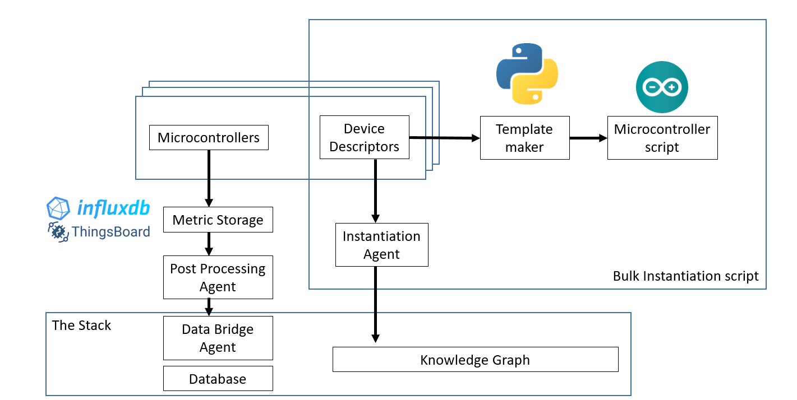
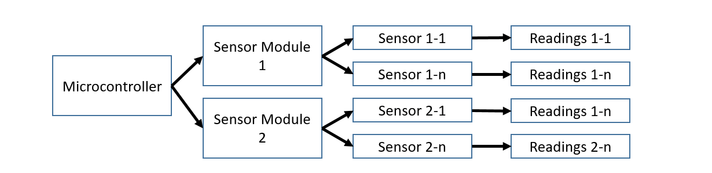
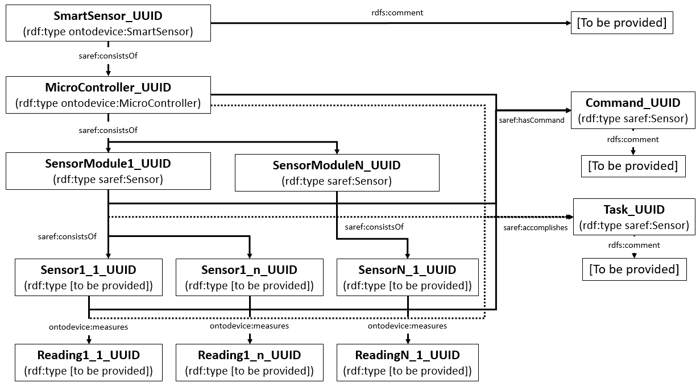

# Device Instantiation Agent

This agent is responsible for instantiating sensors, microcontrollers and devices in a knowledge graph. The agent took in informations from a `.json` file (the device descriptor) and instantiates microcontroller modules with their respective sensor and readings instances. The agent is designed with the device instantiation framework in mind.

Instantiation is based on ontodevice ontology.

## Requirements

### Device Instantiation framework
The device instantiation framework is a framework to allow fast and consistent sensor instantiation on the knowledge graph to allow faster deployment and development. It can be summarised in the following figure:


Sensors will be connected to a microcontroller and it will send data to an IoT database. For this agent, Thingsboard is used for the development of the agent. The Post-Processing agent will pull the data from the database and instantiate a timeseries of the data on the knowledge graph. This agent work with and without the use of the stack. If the stack is used, the agent will send the data to the [data bridge agent](https://github.com/cambridge-cares/TheWorldAvatar/tree/main/Agents/DataBridgeAgent) for instantiation. 

The post processing agent will also be responsible for instantiating agent and derivation instances when needed. THe post processing agent is also responsible for creating the timeseries instances. Hence, for different projects, different post processing agnets may be needed. An example of this post-processing agent is the [FHAgent](https://github.com/cambridge-cares/TheWorldAvatar/tree/main/Agents/FHAgent) which is responsible for handling fumehood occupancy timeseries data and derivation instances. 

 The device instantiaion agent will be responsible for instantiating the sensors and devices in the knowledge graph using a device descrpitor file written by the user.  

### Descriptors
The agent require a description of the device instantiated. This description must be written in a `.json` format for the agent to take in. A template of the file is provided in the repository. The file is composed of IDs which will be used to find the IRI in the IRI Mapper in the json file.

Each device will require 1 descriptor. A descriptor can be composed of 1 microcontroller and several sensor modules. Each sensor modules can be composed of several sensors. Each sensor will have 1 type of sensor reading. The diagram of the json structure is shown in image below.


The file can be sparated into 3 different main keys, namely: 
- MicroController: The descriptor of the device. Contains informations of the sensors and readings.
    - type: The type of microcontroller used (ESP32, etc.).
    - name : The unique id of the microntroller
    - label: The rdfs:Label of the microcontroller 
    - MainSensorMap: The map of the sensor modules connected to the microcontroller.  Composed of a JSONObject that maps the sensor names and their respective information. Each sensor map is composed of (relevant to the device instantiation agent): sensor type, output, output datatype and unit, Thingsboard field name.

- IRIMapper: Map of all IRIs. An IRI can be readily provided by the user. However, in case a new IRI is to be generated, the user can provide a keyword `gen`. This will create a new IRI for the given ID in the device descrpitor, with default prefix of ontodevice. The IRI will also have a UUID v4 attached in the pattern of `prefix:ID_UUID`. If the IRI already exist containing a unique string pattern, the keyword `find` can be used. THe agent will search the graph for instance containing the ID. If more than one is found, an error will be thrown and the IRI need to be provided manually or to be generated instead. 

At the moment, the sensor type IRIs are checked against ontodevice and SAREF to ensure that the concept exist. If the concept does not exist, an error will be thrown and the device will not be instantiated. 

- AdditionalQuery: For update queries that are not automatically ran by the agent. Instances created automatically by the agent can be found in the following section. *Please do not use prefixes in the additional queries.* The use of the `gen` and `find` pattern could also be used with the following format in the triples: 

  - For gen: `IRIMapper=gen;ID;prefix`
  - For find: `IRIMapper=find;ID`

  - For examples:
```
"IRIMapper=find;ProximitySensor_FH-02 https://www.theworldavatar.com/kg/ontodevice/isAttachedTo http://example.com/prefix/WFH",
"IRIMapper=gen;testingGen;http://example.com/prefix/ http://www.w3.org/1999/02/22-rdf-syntax-ns#type",
"IRIMapper=Length"
```

An important note: update query for additional queries are done **after** the normal queries. Therefore, use the `find` keyword for the finding the IRI generated by the agent outside the additional query. For example:
We are trying to instantiate a microcontroller instance by cgenerating a new IRI. We then want to use the generated IRI for a different triple in the additional query, showing the location of the microcontroller.
```
...
IRIMapper:{
    "ESP32": "gen",
    ...
},
"AdditionalQuery": {
    "http://example.com/prefix/OPENLABAREA https://w3id.org/bot#containsElement IRIMapper=find;ESP32",
    ...
}

```
The ESP32 instance will be generated by the agent first. The additional query triples will then be executed. To find the previously generated IRI, we use the `find` keyword.

- Task : A JSONArray filled with the tasks the sensor is supposed to do. In accordance to [saref:Device requirement for all Device instance to have Task](https://saref.etsi.org/core/v3.1.1/#saref:Device). The task will be connected to any subcalss of Device: SmartSensor, Sensor and any of its subclass. Not mandatory, if not included or left empty, the task generted will be composed of `"NotProvided"`.
- Command : A JSONArray filled with the commands the sensor is capable of receiving. Based on [saref:Command](https://saref.etsi.org/core/v3.1.1/#saref:Command). Not mandatory, if not included or left blank, no commands will be instantiated.

The file also contain informations such as the pin connections of the sensors and as the json file is also used in the template maker to make the arduino script for the microcontroller. However these inforamtions are not vital to the device instantiation agent and can be ignored if the user does not plan to use the template maker for their microcontroller scripts. 

### Instantiation format

Generally the following instances are created by the agent without any additional queries:



### Bulk instantiation
To isntantiate a large amount of sensors, a simple bulk instantiation script is provided. Given a folder filled with .json files, the script will automatically extract the json descriptors files and send a POST request to the agent. Only files ending with .json will be used. At the end of the script a log will be shown containing the success/fail of the instantiation.

The script can be run by the following command:
```bash
python ./bulk_inst.py url={AGENT ENDPOINT URL} folder={FOLDER CONTAINING DEVICE DESCRIPTORS}
```

### Template Maker
A template maker is provided in the `.\templatemaker` folder to ease the sensor development. The template maker uses the same device descriptors as the instantiation part of the agent. The script generates a .ino files and 3 headers: credentials, getter and setter, as per the template provided in `./templatemaker/templates`. The script was developed with ESP32 arduino and Thingsboard in mind. The getter.h produced need to be modified according to the usage of the sensor. Ideally the rest of the script shouldn't need any modifications and are ready to be used, however it is open to any modification as needed.

The template could also be used separately from the template maker. In the template provided in `./templatemaker/templates`, several lines are marked by flags in the form of comments in all capital, for example: `//TEMPLATE PIN` or `"//TEMPLATE GET`. These flags are used by the template maker to change specific lines with informations provided in the descriptor. Any willing user could also provide such changes by paying attention to these flags if manual development of the arduino script is desired.

The template maker can be run by changing the `SENSOR_JSON` and `SENSOR_JSON_LOC` variable in the file to the name of the target descriptor and the folder it is located. a new folder in the `SENSOR_JSON_LOC` folder named `result` will contain the resulting script. To run the script, simply call:
```bash
python ./templatemaker/templatemaker.py
```

## Running the agent

The agent could be build using the following command in the folder of the repo:
```
docker-compose up -d
```

The agent will be available at port `1017/instantiate`. 
The agent accepts a POST request containing:
- `CLIENTPROPERTIES` : The location of the client properties file containing the SPARQL endpoint of the KG. File location is stored in an environment variable `CLIENTPROPERTIES`.
- `Descriptor`: The device descriptor.

An example of the request:
```
POST http://localhost:1017/dev-inst-agent/instantiate
Content-Type: application/json
{
  "CLIENTPROPERTIES" : "CLIENTPROPERTIES",
  "Descriptor" : {"MicroController":{
          "type": "ESP32",
          "name": "ProximitySensor_FH-02",
          "label" : "Occupancy detection sensor for fumehood FH_02",

          "MainSensorMap":{
              "HCSR04":{
                  "HCSR04_ProximitySensor": {
                      "type": "ProximitySensor",
                      "ext_lib":[],
                      "description":"",
                      "pin":[
                          {"pinnum":null, "pintype":null, "label": null, "isIO": false},
                          {"pinnum":null, "pintype":null, "label": null, "isIO": false}
                      ],
                      "output" : {
                          "datatype" : "Double",
                          "fieldname" : "AvgDist_FH02",
                          "defval" : 350,
                          "type": "Length",
                          "unit" : "cm"
                      }
                  }
              }
          }
      },
      "IRIMapper":{
          "ESP32": "gen",
          "ProximitySensor_FH-02":"gen",
          "HCSR04":"gen",
          "HCSR04_ProximitySensor":"gen",
          "ProximitySensor":"https://www.theworldavatar.com/kg/ontodevice/ProximitySensor",
          "AvgDist_FH02" : "find",
          "Length" : "http://www.ontology-of-units-of-measure.org/resource/om-2/Length",
          "cm" : "http://www.ontology-of-units-of-measure.org/resource/om-2/centimetre"
      },
      "AdditionalQuery":[
          "http://example.com/prefix/OPENLABAREA https://w3id.org/bot#containsElement IRIMapper=find;ProximitySensor_FH-02",
          "http://example.com/prefix/OPENLABAREA https://w3id.org/bot#containsElement http://example.com/prefix/WFH",
          "IRIMapper=find;ProximitySensor_FH-02 https://www.theworldavatar.com/kg/ontodevice/isAttachedTo http://example.com/prefix/WFH"
      ],
    "Task":["Get occupancy of a fumehood"],
    "Command":[]
  }
}

```

