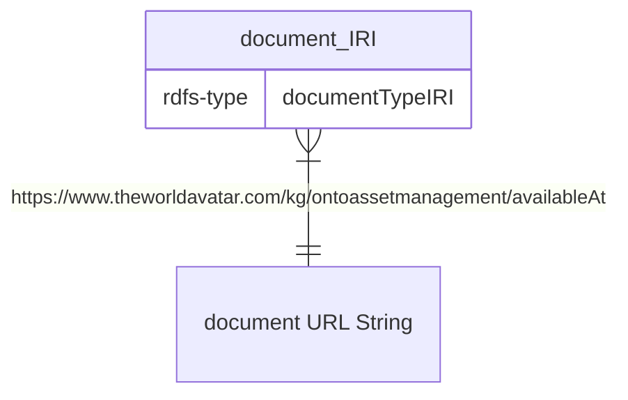

# DocumentUpload Agent
An agent designed to save a document on a server and instantiate documents triples in a KG. 

## Working Details
The agent will accept base64 encoding of the file
The agent will save the file in a mounted volume, to allow access from outside of the container. The triples generated by this agent will have the following format:


The document type can be provided from the request. If its not provided, it will default to: `http://xmlns.com/foaf/0.1/Document`. 

The agent will decode the base64 attached to the request before instantiating the triples. Hence, if the file failed to be saved the triples are not created.
### Security Concerns
Yes, this agent is also a vulnerability that may allow malicious file to be placed in the server. The agent is designed to accept mainly .pdf and images(.png , .jpeg , etc.) as part of the asset manager agent. However, no checks were developed to prevent ANYone (no auth implemented on this agent.) from uploading, say, a malicious executable. If said server does not prevent execution of such file, a very dangerous vulnerability is created here.

There is also no file size check on the agent or the network, so DDOS-ing by sending a very large request body or zip bombing the agent is *very* possible. (The agent does not support sharding the file to smaller pieces yet).

There is little to no way to actually check and prevent these issues. We can try to check for signature patterns (pdf in base64 always start with "JVBER"), but this gets complicated for more complex file types and different encodings. This also does not solve the second security issue of file size and DDOS. 

The best solution I cna suggest for now to secure this is create credentials for trusted few clients that uses this agent, create a session, and the client will send the document type and size for confirmation before actually sending any encoded file. This secures *who* uploaded it (which hopefully secures *what* is uploaded) and *how big* the uploaded files are. Although this will, naturally, complicate the agent a lot more than it currently is. An easier fix is to secure the endpoint to not be accessible from outside network (only accessible from agents like the asset manager agent). This may also limit the problem, but does not resolve issue 2, from accidentally uploading massive files.

## Installation
Update the following files in the `./config` folder:
- `/agent.properties`:
    - `url.manual`: URL for the accessing the asset's manual. The URL produced will have the manual name appended to the end of the URL.

Update the following files in the `./credentials` folder:
 - Add your git credentials with your git username and token in respectively `repo_username.txt` and `repo_password.txt`.

Update `./docker-compose.yml`:
 - Volumes: Change the bind mount folder location to your need for the agent to store the manuals. In case the Stack is used, this may need to be changed

#### For use in The Stack
Update  `./stack-manager-input-config-service/document-upload-agent.json`:
 - Update the bind mount to where the manuals are to be stored


The agent could be built using the following command:
```bash
docker-compose up -d
```

## Features

The agent only accepts 1 URL pattern: `/adddocument`. The parameters of the endpoint:
- documentIRI (Optional): The IRI to be used when instantiating the document. If this key does not exist or is blank, the agent will generate the IRI.
- documentType: The document type IRI. Can be left blank and the agent will use `http://xmlns.com/foaf/0.1/Document` as the rdfs:type .
- encoded: The base64 encoded file.
- fileName: The filename the encoded file will be saved as. ALso used when creating the URL for accesing the file.
- overwrite: Boolean. If set to `true`, will overwrite existing file with the same name on the server. Otherwise, it will throw an error if the filename already exists. To prevent doubles of the same document.
- instantiate: Boolean. Set to `true` to instantiate the document triples. Otherwise the agent will only save the file.


