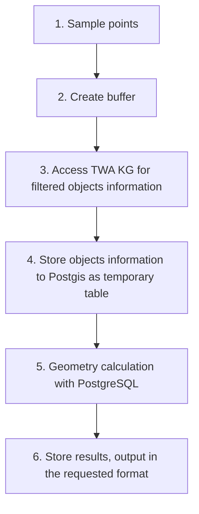

# Environment Exposure Calculation Agent
This agent serves as an exploration on environment calculation and there will be no further development on this agent.

## Workflow Overview


After stage 4, the buffered points and environment features are all stored in the Postgis database and ready for calculation directly without passing parameters in SQL.

Table created in stage 4 is implemented as normal SQL table but will be overriden each time a new request is sent, so the data are considered as temporary.

## Agent Setup

This agent is designed to run with [Singapore-sea-level-rise](https://github.com/cambridge-cares/TheWorldAvatar/tree/main/Deploy/stacks/Singapore-sea-level-rise) stack setup but used data not yet available in the stack. Check [Experiment](#experiment) for more information about data. For easy setup, you may use `Singapore-sea-level-rise` services configuration but import the dataset mentioned in [Experiment](#experiment) only.

### Development Setup
This guide is for VSCode remote debug with docker container. The development image doesn't have the code files. Instead, files are attached to the container as bind mount, so changes made to the code can be reflected in the container right away and benefits from the flask hot reloading.

1. Build development image as 
    ```
    docker build --target debug -t environmental-exposure-calculation-agent:<Version_NO> .
    ```

2. Copy the [stack-manager/environment-exposure-calculation-agent-dev.json](./stack-manager/environment-exposure-calculation-agent-dev.json) to stack manager inputs config.

3. Start sea-level-rise stack with stack manager.

4. After the agent container is launched, run `Python Debugger: Remote Attach` in VSCode. Make sure the path for `localRoot` and `remoteRoot` are mapped properly. Following is a sample configuration for the debug configuration `launch.json`, with EnvironmentExposureCalculationAgent folder as the current local workplace.
    ```
    {
        "version": "0.2.0",
        "configurations": [
        
            {
                "name": "Python Debugger: Remote Attach",
                "type": "debugpy",
                "request": "attach",
                "connect": {
                    "host": "localhost",
                    "port": 5678
                },
                "pathMappings": [
                    {
                        "localRoot": "${workspaceFolder}/agent",
                        "remoteRoot": "/app/agent"
                    }
                ]
            }
        ]
    }
    ```

After these steps, the agent should be running with hot reload and debugger attached . However, changes made to `app.py` and `route.py` will require a container restart for the changes to be effective.

### Production Setup
Notice: The production setup hasn't been fully tested.

1. Build production image as
    ```
    docker build --target prod -t environmental-exposure-calculation-agent:<Version_NO> .
    ```

2. Copy the [stack-manager/environment-exposure-calculation-agent.json](./stack-manager/environment-exposure-calculation-agent.json) to Singapore-sea-level-rise stack manager inputs config folder.

3. Start Singapore-sea-level-rise stack with stack manager.

## Usage 
The agent supports different methods of calculation, and they are specified as request arguments. Each method may have parameters and are defined in the request body.
- point_selection
    - postal_code: use postalcode data stored in table `public.sgpostcode`
    - self_defined_region: sample points regularly in the provided rectangle region
        - param
            ```
            "lng_start": lng_start,
            "lng_end": lng_end,
            "lng_step": lng_step_in_degree,
            "lat_start": lat_start,
            "lat_end": lat_end,
            "lat_step": lat_step_in_degree,
            ``` 
    - selected_points (Not implemented)
    - regions (Not implemented)
- boundary
    - buffer: create a circular buffer around the selected points
        - param
            ```
            "boundary_radius": <RADIUE_IN_METER> 
            ```
- algorithm
    - intersect

The above request arguments and request body will be used to generate an unique request id to identify the request, so the results can be reused in the future. 

There are optional request body parameters, and it won't be included in the request id generation.
- output_format 
    - csv: return downloadable csv files as zip package
    - json: return the result as json
    - If no value provided for the output_format, the request id will be returned.

Here is a sample request with postal code as input points and  1000m buffer radius. The exposure is calculated with geometry intersection and results are exported as zip file.
```bash
curl --location 'http://localhost:3838/environment-exposure-calculation-agent/calculate?point_selection=postal_code&boundary=buffer&algorithm=intersect' \
--header 'Content-Type: application/json' \
--data '{
    "boundary_radius": 1000
}'
--output 'parks.zip'
```

## Experiment
### Greenspace Exposure
The experiment is aimed at finding the greenspace exposure counts and areas around postcode locations in different years. The result is generated with code at commit [cec8893](https://github.com/cambridge-cares/TheWorldAvatar/commit/cec8893b1ed064de33d9bfa09e003afd9eb42c53).

Input variables
- Boundary radius size (m): [400, 800, 1000]
- Greenspace data: [NParksParksandNatureReserves, MasterPlan2019SDCPParkandOpenSpacelayer, MP14SDCPPWPLANParksandOpenSpaceSHP]

Output values
- greenspace exposure counts
- greenspace exposure area


#### Data Used
- Postcode 
- NParksParksandNatureReserves (Year 2023)
- MasterPlan2019SDCPParkandOpenSpacelayer (Year 2019)
- MP14SDCPPWPLANParksandOpenSpaceSHP (Year 2016)

Please refer to the project data **Dropbox** folder `HD4 Programme\WP1\Data` for the meta data and raw files. Paste the raw files in the corresponding [data folders](./stack-data-uploader/inputs/data/) for uploading.

Each dataset comes with obda mapping. However, the mapping for parks is not final and used to facilitate exposure calculation only. The computed results are not affected by the obda mapping and using the same dataset should always generate the same results. Check [Result Generation](#result-generation) section for more result generation information.

#### Data Upload Configuration & Preprocessing
Data are uploaded to the stack with stack data uploader. The upload config can be found at [stack-data-uploader](./stack-data-uploader/). 

**Notice**: data pre-processing has been performed on parks data
- MP14SDCPPWPLANParksandOpenSpaceSHP
    - Add parks with PRP_STATUS=EXISTING **only**
- MasterPlan2019SDCPParkandOpenSpacelayer
    - Extract PRP_STATUS from Description
    - Add parks with PRP_STATUS=EXISTING **only**

Preprocessing code can be found in [inputs/data/parks/sql](./stack-data-uploader/inputs/data/parks/sql/) and [inputs/config/parks.json](./stack-data-uploader/inputs/config/parks.json).

#### Stack Data Upload
Upload data with the following commands:
```bash
# navigate to the stack-data-uploader folder
cd stack-data-uploader

# run stack data uploader after stack has been launched
./stack.sh start sea-level
```

#### Result Generation
Since the ontology design hasn't captured dataset version information and feature timebound yet, **manual modification to obda is needed at runtime**.

1. Get results for different boundary radius in the same year
    For agent deployed at `localhost:3838`, replace <BOUNDARY_RADIUS> with value from [400, 800, 1000]. It will download the summary data for the query as zip file.  
    ```bash
    curl --location 'http://localhost:3838/environment-exposure-calculation-agent/calculate?point_selection=postal_code&boundary=buffer&algorithm=intersect' \
    --header 'Content-Type: application/json' \
    --data '{
        "boundary_radius": <BOUNDARY_RADIUS>
    }'
    --output '<OUTPUT_FILE_NAME>.zip'
    ```
    After running the request with all 3 boundary sizes (in separate request, one by one), 3 zip files will be downloaded.

    The zip file contains 1 file:
    - summary.csv: aggregated result for the exposure calculation

2. Inspect the `/ontop/ontop.obda` in ontop container, and change the greenspace mapping to another year. For examples,
    ```
    mappingId	Park
    ...
    source		SELECT "ogc_fid",  ST_ASTEXT(wkb_geometry) as wkt
                FROM "public"."parks_2019"
    ```
    change to
    ```
    mappingId	Park
    ...
    source		SELECT "ogc_fid",  ST_ASTEXT(wkb_geometry) as wkt
                FROM "public"."parks_2016"
    ```
    Rerun the command to get the result in another year.
3. After running all the boundary sizes for all years (9 seperate requests), mannually consolidate the summary result 