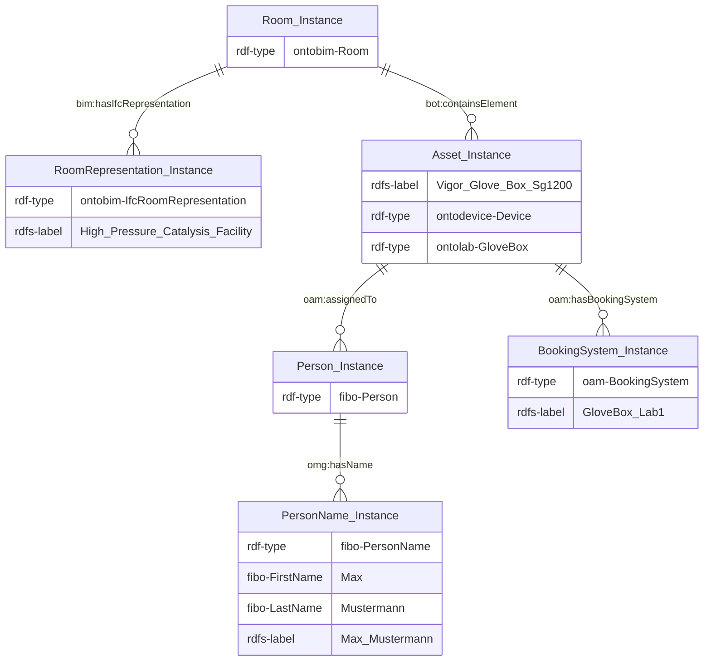
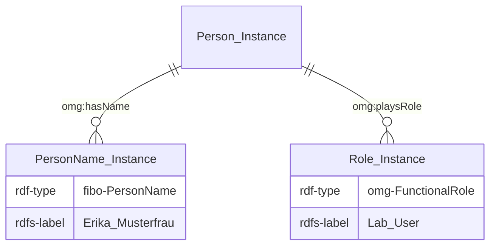
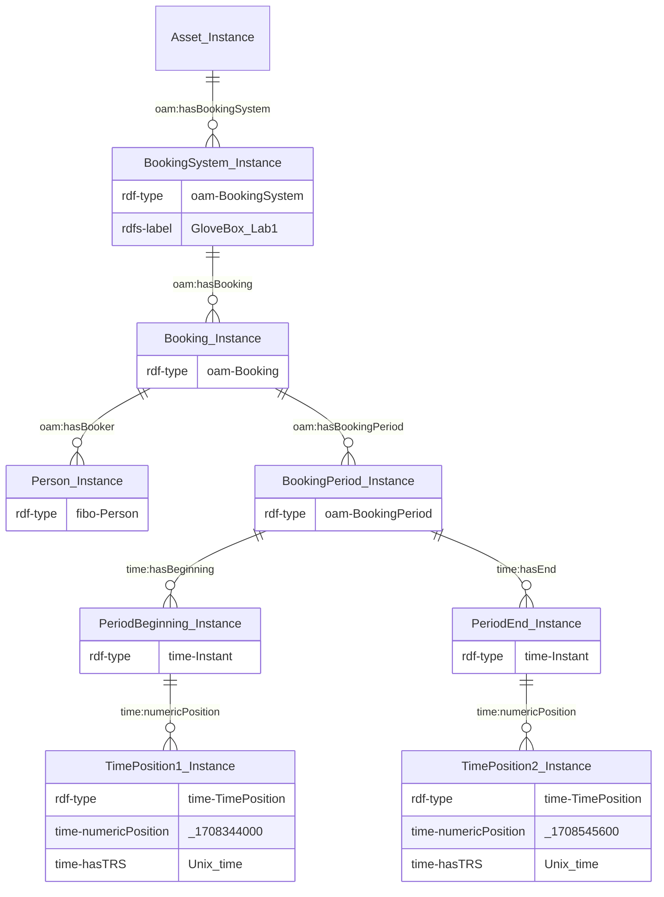

# Equipment Booking Agent
The Equipment Booking Agent is a standalone application for booking equipment through a browser-based UI. This will require bookable assets as well as eligible persons to be instantiated and annotated with booking intervals. 

## Instructions

### Installation
Add individual configuration parameters to conf/equipment_booking_agent_conf.py:
- SPARQL_QUERY_ENDPOINT: URL address of available SPARQL endpoint where assets and users are instantiated
- SPARQL_UPDATE_ENDPOINT: URL address of available SPARQL endpoint where bookings will be instantiated
- KG_USERNAME: if required, credentials to access the SPARQL endpoint
- KG_PASSWORD: if required, credentials to access the SPARQL endpoint

This agent can be built via pip install. Running entry_point.py spins up the agent on http://localhost:5000, waiting for the debugger to attach. To attach to the container and start debugging, please use the provided Python: Debug Flask within Docker debug configuration.

### Usage
Go to 'Book Equipment', select user, select equipment, and booking interval. If equipment is not available at the selected interval, you will be informed.
Go to 'Overview' for a  daily list of all booked assets in 15 minute increments.
Go to 'Edit bookings' for a list of all active bookings for a certain equipment where they can be deleted.
Go to 'Add user' to add a new lab user that can make bookings.

The 'Back' button on each page brings you back to the main menu.

## Data model
**Legend**
Prefix | Namespace
--- | ---
[bot](https://w3c-lbd-cg.github.io/bot/) | `https://w3id.org/bot#`
[fibo](https://github.com/edmcouncil/fibo/tree/master/FND/AgentsAndPeople) | `https://spec.edmcouncil.org/fibo/ontology/FND/AgentsAndPeople/People/`
[ontoam](https://github.com/cambridge-cares/TheWorldAvatar/tree/main/JPS_Ontology/ontology/ontoassetmanagement) | `https://www.theworldavatar.com/kg/ontoassetmanagement/`
[ontobim](https://github.com/cambridge-cares/TheWorldAvatar/tree/main/JPS_Ontology/ontology/ontobim) | `https://www.theworldavatar.com/kg/ontobim/`
[ontodevice](https://github.com/cambridge-cares/TheWorldAvatar/tree/main/JPS_Ontology/ontology/ontodevice) | `https://www.theworldavatar.com/kg/ontodevice/`
[ontolab](https://github.com/cambridge-cares/TheWorldAvatar/tree/main/JPS_Ontology/ontology/ontolab) | `https://www.theworldavatar.com/kg/ontolab/`
[ontotechsystem](https://github.com/cambridge-cares/TheWorldAvatar/tree/main/JPS_Ontology/ontology/ontotechnicalsystem) | `https://www.theworldavatar.com/kg/ontotechnicalsystem/`
[ontotimeseries](https://github.com/cambridge-cares/TheWorldAvatar/tree/main/JPS_Ontology/ontology/ontotimeseries) | `https://www.theworldavatar.com/kg/ontotimeseries/`
[time](https://www.w3.org/TR/owl-time/) | `http://www.w3.org/2006/time#`

### Requirements
A bookable asset is required to which a booking system can be attached to. These can be of type ontodevice:Device, ontotechsystem:TechnicalSystem, or bot:Element. One example is shown in *Figure 1*. In the utils folder, utility scripts are available to add a booking system to an asset or combine existing devices to a system so they can be booked together.

*Figure 1. Bookable asset example ABox*

An eligible lab user is required to carry out the booking of an asset. These are of type fibo:Person and have been assigned the role of lab user. One example of a lab user is shown in *Figure 2*, additional lab users can be added via the user interface.

*Figure 2. Eligible user example ABox*

### Operating principle
Adding a booking to the system attaches a new booking instance to the booking system instance of the asset in question. This will look similar to the example in *Figure 3*.

*Figure 3. Booking example ABox* 
