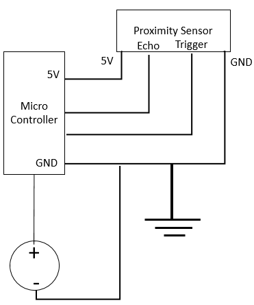

# Fumehood Occupancy Detection Sensor

This folder contains information regarding the fumehood occupancy sensor.

## Working Details

### Working Principles
The system uses an ultrasonic proximity sensor to detect the distance between sensor and the closest object.
If the distance between the sensor and the closest object is below a certain threshold, then the fumehood is considered occupied.
To prevent noise on the readings, a tally system is used to average the reading data as follows:

1. Set a counter to 0
2. if the detected distance is below threshold (something nearby the sensor), add a certain increase factor to the counter
3. Reduce the counter by a certain decrease factor
4. Ensure the values are within a certain range (counter within tally max and tally min)
5. if the counter is above a tally limit, then the fumehood is considered occupied
6. Repeat step 2. to 5.

The tally system setup is done on the fumehood agent. The microcontroller will be sending distance readings to a Thingsboard server where the agent will retrieve the data.

### Hardware setup
The circuit diagram can be seen as below:

The details of the hardware used:

| Module | Product |
|:---:|:---:| 
| Microcontroller | [ESP32 NODEMCU Module WiFi Development Board with CP2102](https://www.az-delivery.de/en/products/esp32-developmentboard) |
| Proximity Sensor | [HC-SR04 Proximity sensor](https://cdn.sparkfun.com/datasheets/Sensors/Proximity/HCSR04.pdf)  |

The system is powered from an AC outlet (standard Singapore 220V AC) through a power adapter(12V DC, 5 A adapter). The sensor receives power from the micorcontroller to ensure a controlled voltage. The microcontroller already includes a wifi adapter and hence, for this setup no external wifi module is used.

The circuit is connected using a breadboard and attached to the fumehood using the adhesive on the back of the breadboard.

#### Positional setup
As the sensor has a limited measuring angle (15 degrees), the sensor is placed 2 metres above the ground at 40-45 degrees of angle. This is to allow the whole area in front of the fumehood to be covered by just 1 sensor with no dead-zone where the sensor could not detect the user.

#### Known issues
As the sensor uses an ultrasonic sensor, any apparatus emitting sound at ultrasonic frequencies has been known to interfere with the signal. This causes the fumehood to always be detected as occupied when its not, whenever such apparatus such as an ultrasonic cleaner is used. Since this is directly tied to how the sensor works, there is no workaround other than changing the sensor type.

The adhesive behind the breadboard is known to stick less and less on every removal from gathering dust, causing the whole module to fall off the fumehood. It is recommended to not remove the breadboard once its sticked to the fumehood. A different solution by using a magnet as the fumehood cover is magnetic is proposed, although it is not yet tested.

### Software setup
#### Board and Library setup
An Arduino code for the sensor is provided in this folder in `.\FHProximitySensor.ino`.
Its recommended to use Arduino IDE to develop the sensor and flash the microcontroller.
The code requires the following board to be installed:
- esp32 by Espressif System (v2.0.9). Installation can be [done via Arduino IDE](https://docs.espressif.com/projects/arduino-esp32/en/latest/installing.html#installing-using-arduino-ide)

The code requires the following libraries installed:
- esp_wpa2.h : wifi module of ESP32. Included in the board: esp32 by Espressif System (v2.0.9)
- Thingsboard.h (v0.9.7): Library for interacting with Thingsboard. Check [here](https://github.com/thingsboard/thingsboard-client-sdk) for installation and usage.

##### Library dependencies
The module has been tested on Thingsboard v0.9.7 and this library requires specific version of dependency libraries. These should be installed automatically when installing Thingsboard library, but it has been noted that incompatible version of libraries causes an error and may require extra care when compiling the code. These noted dependencies and the recommended versions are:
- ArduinoJson: v6.20.1 (v7.0 and above has been noted to cause an error).
- TBPubSubClient: v2.9.1

#### Code setup
Before flashing the microcontroller, the following variables of the code should be updated:

- ECHOPIN (int): Pin connected to the echo pin of the proximity sensor
- TRIGGERPIN (int): Pin connected to the trigger pin of the proximity sensor
- ssid (char*): WiFi SSID name used to connect to Thingsboard
- pass (char*): Password to said WiFi
- numread (int): Number of reading done to be averaged before sending to Thingsboard.
- thingsboardServer (char*): Address of the Thingsboard server to send readings.
- TOKEN (char*): Authentication token issued by Thingsboard to send readings.
- fieldName (char*): Field name in Thingsboard

The microcontroller can then be flashed (Arduino IDE recommended) and assuming the hardware is setup correctly, the sensor should be ready to use.
