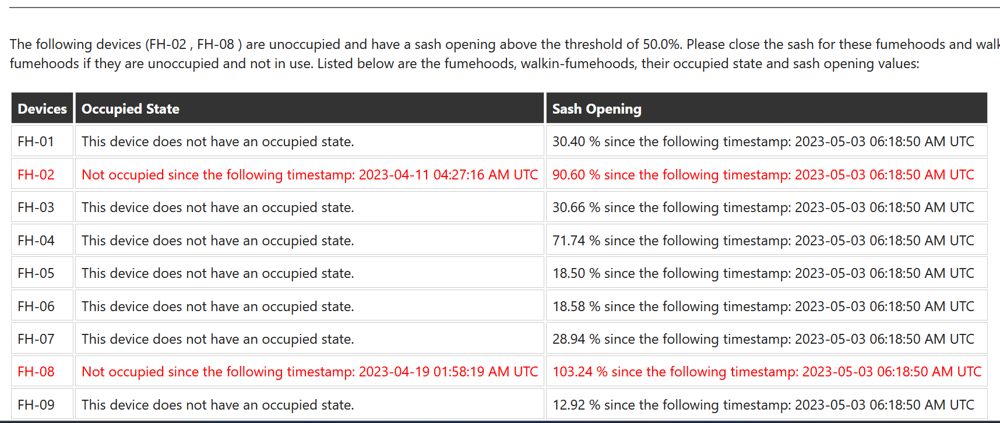

# Fumehood Sash And Occupancy Agent

This agent is designed to query for the sash opening percentage and occupied state of fumehoods and walkin-fumehoods, if any of the fumehoods and walkin-fumehoods is unoccupied and has a sash opening percentage higher than a certain threshold, an email will be sent to the relevant personnel via the [EmailSender class in the JPS Base Lib](https://github.com/cambridge-cares/TheWorldAvatar/blob/main/JPS_BASE_LIB/src/main/java/uk/ac/cam/cares/jps/base/email/EmailSender.java) and the [Email Agent](https://github.com/cambridge-cares/TheWorldAvatar/tree/main/Agents/EmailAgent). The agent uses the [time-series client](https://github.com/cambridge-cares/TheWorldAvatar/tree/develop/JPS_BASE_LIB/src/main/java/uk/ac/cam/cares/jps/base/timeseries) and [remote store client](https://github.com/cambridge-cares/TheWorldAvatar/blob/main/JPS_BASE_LIB/src/main/java/uk/ac/cam/cares/jps/base/query/RemoteStoreClient.java) from the JPS_BASE_LIB to interact with both the KG and database.

## Usage 
This part of the README describes the usage of the agent. The module itself can be packaged into an executable war, deployed as a web servlet on tomcat. Sending the appropriate request to the correct URL will initiate the agent. Since it uses the time-series client and remote store client to interact with the KG and database, the KG and database will be required to be set-up beforehand.  

The [next section](#requirements) will explain the requirements to run the agent.

### Requirements
1) It is required to have access to a knowledge graph SPARQL endpoint and Postgres database. These can run on the same machine or need to be accessible from the host machine via a fixed URL. This can be either in the form of a Docker container or natively running on a machine. It is not in the scope of this README to explain the set-up of a knowledge graph triple store or Postgres database.

2) It is required to have the [Email Agent](https://github.com/cambridge-cares/TheWorldAvatar/tree/main/Agents/EmailAgent) set up beforehand.

3) It is required to have the fumehoods and walkin-fumehoods devices already instantiated in the knowledge graph based on [ontoBMS](https://github.com/cambridge-cares/TheWorldAvatar/tree/main/JPS_Ontology/ontology/ontobms) and [ontoDevice](https://github.com/cambridge-cares/TheWorldAvatar/tree/main/JPS_Ontology/ontology/ontodevice). 

4) In order for the agent to work properly, it is also necessary for the fumehoods and walkin-fumehoods instances to have occupied states and sash opening percentages. 

5) The occupied states and sash opening percentages should be instantiated as timeseries in the knowledge graph via the [time-series client](https://github.com/cambridge-cares/TheWorldAvatar/tree/develop/JPS_BASE_LIB/src/main/java/uk/ac/cam/cares/jps/base/timeseries). 

An example of the instance can be found below:
```
<https://www.theworldavatar.com/kg/ontobms/FH-02_4daa1d7c-f156-43c3-bdfb-4abdf5f6fc3d> rdf:type <https://www.theworldavatar.com/kg/ontobms/FumeHood>;
     <https://saref.etsi.org/core/hasState>	<https://www.theworldavatar.com/kg/ontotimeseries/fh_occupiedState_FH-02_77db3462-3a82-46fd-89cf-3ccb8c53a59a>	;
     <https://www.theworldavatar.com/kg/ontobms/hasSashOpenPercentage>	<https://www.theworldavatar.com/kg/ontobms/SashOpenPercentage_a7c7bc95-c53b-48dc-bce7-eaf7b80ab702> .

<https://www.theworldavatar.com/kg/ontotimeseries/fh_occupiedState_FH-02_77db3462-3a82-46fd-89cf-3ccb8c53a59a> rdf:type <https://www.theworldavatar.com/kg/ontodevice/OccupiedState> ;
     <https://www.theworldavatar.com/kg/ontotimeseries/hasTimeSeries>	<https://www.theworldavatar.com/kg/ontotimeseries/Timeseries_809be8cb-2241-44b6-840d-7bd0ac9922fa>	.

<https://www.theworldavatar.com/kg/ontobms/SashOpenPercentage_a7c7bc95-c53b-48dc-bce7-eaf7b80ab702> rdf:type <http://www.ontology-of-units-of-measure.org/resource/om-2/Percentage> ;
     <http://www.ontology-of-units-of-measure.org/resource/om-2/hasDimension>	<http://www.ontology-of-units-of-measure.org/resource/om-2/dimensionOne> ;
     <http://www.ontology-of-units-of-measure.org/resource/om-2/hasValue>	<https://www.theworldavatar.com/kg/ontobms/V_VAV_E7_08_FH02_Door>	.

<https://www.theworldavatar.com/kg/ontobms/V_VAV_E7_08_FH02_Door> rdf:type <http://www.ontology-of-units-of-measure.org/resource/om-2/Measure> ;
     <http://www.ontology-of-units-of-measure.org/resource/om-2/hasUnit>	<http://www.ontology-of-units-of-measure.org/resource/om-2/percent> ;
     <https://www.theworldavatar.com/kg/ontotimeseries/hasTimeSeries>	<https://www.theworldavatar.com/kg/ontotimeseries/Timeseries_98c31f56-667b-4f02-885e-b53df4d42550>	.
```

### Property file
For running the agent, two properties files are required:
- One [property file for the occupied state timeseries client](#occupied-state-timeseries-client-properties) defining how to access the database and SPARQL endpoints where the occupied state triples and timeseries data is located at.
- One [property file for the sash opening timeseries client](#sash-opening-timeseries-client-properties) defining how to access the database and SPARQL endpoints where the sash opening triples and timeseries data is located at.

#### Occupied state timeseries client properties
The timeseries client properties file needs to contain all credentials and endpoints to access the SPARQL endpoint of the knowledge graph and the Postgres database. It should contain the following keys:
- `db.url` the [JDBC URL](https://www.postgresql.org/docs/7.4/jdbc-use.html) for the Postgres database
- `db.user` the username to access the Postgres database
- `db.password` the password to access the Postgres database
- `sparql.query.endpoint` the SPARQL endpoint to query the knowledge graph
- `sparql.update.endpoint` the SPARQL endpoint to update the knowledge graph
- `bg.username` the username to access the SPARQL endpoint if any exist
- `bg.password` the password to access the SPARQL endpoint if any exist

#### Sash opening timeseries client properties
The timeseries client properties file needs to contain all credentials and endpoints to access the SPARQL endpoint of the knowledge graph and the Postgres database. It should contain the following keys:
- `db.url` the [JDBC URL](https://www.postgresql.org/docs/7.4/jdbc-use.html) for the Postgres database
- `db.user` the username to access the Postgres database
- `db.password` the password to access the Postgres database
- `sparql.query.endpoint` the SPARQL endpoint to query the knowledge graph
- `sparql.update.endpoint` the SPARQL endpoint to update the knowledge graph
- `bg.username` the username to access the SPARQL endpoint if any exist
- `bg.password` the password to access the SPARQL endpoint if any exist

More information can be found in the example property file `tsClientForOccupiedState.properties` and `tsClientForSashOpening.properties` in the `config` folder.

### Building the Fumehood Sash And Occupancy Agent
The Fumehood Sash And Occupancy Agent is set up to use the Maven repository at https://maven.pkg.github.com/cambridge-cares/TheWorldAvatar/ (in addition to Maven central). You'll need to provide your credentials in single-word text files located like this:
```
./credentials/
    repo_username.txt
    repo_password.txt
```
repo_username.txt should contain your github username, and repo_password.txt your github [personal access token](https://docs.github.com/en/github/authenticating-to-github/creating-a-personal-access-token),
which must have a 'scope' that [allows you to publish and install packages](https://docs.github.com/en/packages/working-with-a-github-packages-registry/working-with-the-apache-maven-registry#authenticating-to-github-packages).


Modify `tsClientForOccupiedState.properties` and `tsClientForSashOpening.properties` in the `config` folder accordingly. Do note that the properties files are mounted onto the agent's docker container thus any changes in the properties files does not require the docker container to be rebuilt.

Modify the `Dockerfile` found in the same directory as this README and change `EMAIL_AGENT_URL` according to where your Email Agent instance is located at.

The agent can be deployed both [out of the stack](#Out-of-the-stack) and [in the stack](#In-the-stack). 

#### Out of the stack
To build and start the agent, open up the command prompt in the same directory as this `README`, run
```
docker-compose up -d
```
The agent is reachable at "fh-sash-and-occupancy-agent/" on localhost port 1025.

To run the agent, a request must be sent to http://localhost:1025/fh-sash-and-occupancy-agent/. There's currently three types of request:
1) This request gets the status of the agent. The request has the following format:
```
curl -X GET http://localhost:1025/fh-sash-and-occupancy-agent/status
```
and it should return:
```
{"description":"FHSashAndOccupancyAgent is ready."}
```
2) This request runs the agent's main function. The request has the following format:
```
curl -X POST --header "Content-Type: application/json" -d "{\"sashThreshold\":\"35\",\"delayMinutes\":\"15\"}" http://localhost:1025/fh-sash-and-occupancy-agent/retrieve
```
Change the sashThreshold and delayMinutes values accordingly. The agent will take sashThreshold as the threshold for the sash opening percentage. If the fumehood or walkin-fumehood is unoccupied and it's sash opening percentage is higher than the threshold, it will wait for a certain number of minutes as indicated by delayMinutes before it checks the sash opening percentage and occupancy again, if the fumehood or walkin-fumehood is unoccupied and it's sash opening percentage is higher than the threshold, an email will be crafted and sent to the relevant personnel to alert them of the situation. 

If the agent runs successfully, it should return:
```
{"result":"Agent has successfully query and check through all fumehoods and walkin-fumehoods."}
```
3) This request retrieves the latest sash opening percentage for the provided fumehood or walkin-fumehood IRI. The request has the following format:
```
curl -X GET http://localhost:1025/fh-sash-and-occupancy-agent/latestsash?deviceIri=<fumehood_iri>
```
and it should return:
```
{"sash":"65.7","time":"2023-09-12 04:26:39 AM UTC"}
```

#### In the stack
To build the agent's image, open up the command prompt in the same directory as this `README`, run
```
docker-compose build
```
Open `stack-manager-input-config-service/fh-sash-and-occupancy-agent.json` and under the `Mounts` section, modify the `Source` and insert the filepath of where the `config` folder is located at (For Windows users using WSL on Docker, the file path should start with `/mnt/c/`, which is equivalent to `C://`).

Copy `stack-manager-input-config-service/fh-sash-and-occupancy-agent.json` to the services folder under your stack-manager directory (By default it should be `TheWorldAvatar/Deploy/stacks/dynamic/stack-manager/inputs/config/services/`) and start up the stack.

The agent is reachable at "fh-sash-and-occupancy-agent/" on localhost port 3838 by default.

To run the agent, a request must be sent to http://localhost:3838/fh-sash-and-occupancy-agent/. There's currently three types of request:
1) This request gets the status of the agent. The request has the following format:
```
curl -X GET http://localhost:3838/fh-sash-and-occupancy-agent/status
```
and it should return:
```
{"description":"FHSashAndOccupancyAgent is ready."}
```
2) This request runs the agent's main function. The request has the following format:
```
curl -X POST --header "Content-Type: application/json" -d "{\"sashThreshold\":\"35\",\"delayMinutes\":\"15\"}" http://localhost:3838/fh-sash-and-occupancy-agent/retrieve
```
Change the sashThreshold and delayMinutes values accordingly. The agent will take sashThreshold as the threshold for the sash opening percentage. If the fumehood or walkin-fumehood is unoccupied and it's sash opening percentage is higher than the threshold, it will wait for a certain number of minutes as indicated by delayMinutes before it checks the sash opening percentage and occupancy again, if the fumehood or walkin-fumehood is unoccupied and it's sash opening percentage is higher than the threshold, an email will be crafted and sent to the relevant personnel to alert them of the situation. 

If the agent runs successfully, it should return:
```
{"result":"Agent has successfully query and check through all fumehoods and walkin-fumehoods."}
```
3) This request retrieves the latest sash opening percentage for the provided fumehood or walkin-fumehood IRI. The request has the following format:
```
curl -X GET http://localhost:3838/fh-sash-and-occupancy-agent/latestsash?deviceIri=<fumehood_iri>
```
and it should return:
```
{"sash":"65.7","time":"2023-09-12 04:26:39 AM UTC"}
```

### Email Content
The email sent by the agent will consist of a table that lists down all the information of the fumehoods and walkin-fumehoods, their sash opening, occupied state etc. For the fumehoods or walkin-fumehoods that are unoccupied and have a sash opening percentage higher than the threshold, their values will be highlighted in red. An example can be found below:

