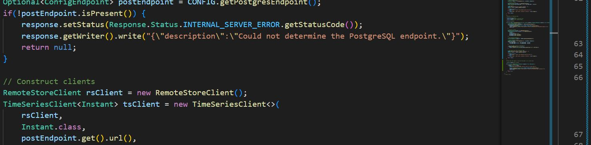

# Feature Info Agent

This Feature Info Agent (FIA) acts as a single access point for [DTVF Visualisations](https://github.com/cambridge-cares/TheWorldAvatar/wiki/Digital-Twin-Visualisations) to query for both meta and time series data of an individual feature (i.e. a single geographical location) before display within the side panel of the visualisation.

## Overview

The FIA is a relatiely simple HTTP Agent built using the JPS Base Lib's agent framework. When a new request is received, the internal process proceeds as follows:

1. Check if the configuration has been loaded.
   1. If not, then load it.
   2. Dynamically discover the Ontop endpoint.
   3. Dynamically discover the PostGreSQL endpoint.
   4. Dynamically discover all endpoints provided by Blazegraph.
2. Check the incoming route.
   1. Throw error if an unknown route.
3. If `/status` route:
   1. Return current status of the agent.
4. If `/get` route:
   1. Check validity of incoming request.
      1. If malformed, send a BAD_REQUEST response.
      2. Determine the class representing the IRI.
         1. If query successful but no class returned, send a NO_CONTENT response.
      3. Look up corresponding meta query for that class.
         1. If none found, send a NO_CONTENT response.
      4. Run query to get metadata.
      5. Parse resulting metadata into approved DTVF format.
      6. Look up corresponding timeseries query for that class.
         1. If none found, log warning but continue.
         2. If found, run query.
            1. If no data found, quietly continue.
      7. Build and return final JSON object.

Note that the agent's configuration file is read and its contents cached when the system first boots (meaning any changes to the file will require a restart), but the individual query files are read as-needed (i.e. once a request has been recieved) and are not currently cached (meaning any changes to these will take effect upon subsequent requests without the requirement for a restart).

It's also worth noting that in the current version of the FIA, any queries to the knowledge graphs are sent to all discovered namespace endpoints via federation. Whilst this will marginally increase processing times, these queries should be pretty quick, and shouldn't be triggered too often, so the risk of delay is hopefully less than the benefit of not having to specify the endpoint beforehand.

## Restrictions

At the time of writing, the FIA has a few restrictions that all users should be aware of. These are as follows:

- The FIA can only be run within a [stack](https://github.com/cambridge-cares/TheWorldAvatar/tree/main/Deploy/stacks/dynamic/stack-manager).
- The FIA can only report on metadata and timeseries that are contained within the same stack.
- The FIA can only return timeseries data on series that use the Instant class.
- The FIA cannot handle large, intensive queries (i.e. anything that takes more than a minute or so to return).

## Requirements

For the FIA to function, a number of configuration steps need to take place before deployment. Additionally, incoming HTTP requests to the agent must meet a set format. These are detailed in the subsections below. It is also neccessary for users to have good knowledge of Docker, JSON, and to be familiar with management of the Stack system.

### Configuration

Follow the below configuration steps within the local `queries` directory.

- Create a JSON configuration file named `fia-config.json`.
  - This configuration file should be a JSON object containing the following parameters:
    - `queries`: This is a **required** array of objects defining a mapping between class names and the names of files containing pre-written SPARQL queries. Each object needs to contain the following string parameters:
      - `class`: Full IRI of the class.
      - `metaFile`: Name of the file (inc. extension) that contains the query to run when gathering metadata.
      - `timeFile`: Optional, name of the file (inc. extension) that contains the query to run when gathering timeseries measurement details.
      - `timeLimit`: Optonal, this is an integer parameter that defaults to 24. When set, timeseries data from the last N hours will be pulled (or all data if the value is set to below 0).
      - `databaseName`: Optional, but **required** if setting a timeFile. It should match the PostGreSQL database name that contains your timeseries data.
  - Add the aforementioned metadata and timeseries query files.

An example configuration file is provided within the [queries] directory. Furthermore, two example `.sparql` files are provided to retrieve the meta and time series data, respectively. Both of these files refer to the example data as listed <a href="#example">below</a>.

#### Query Restrictions

To properly parse the metadata and timeseries queries, the agent requires the results from queries to fulfill a set format. For each type of query a number of placeholder tokens can be added that will be populated by the agent just before execution. These are:

- `[IRI]`: The IRI of the **feature** of interest, i.e. the feature selected within the DTVF (the IRI will be injected here into the request)
- `[ONTOP]`: The URL of the Ontop service within the stack will be injected

<ins>Queries for metadata</ins> should not concern themselves with data relating to timeseries (that can be handled within the timeseries query). Queries here need to return a table with two (or optionally three) columns. The first column should be named `Property` and contains the name of the parameter we're reporting, the second should be `Value` and contain the value. The optional third column is `Unit`. **These are case sensitive and any other columns will be ignored**.


<p align="center">
    
</p>

<ins>Queries for timeseries</ins> data need to return the measurement/forecast IRIs, i.e. the IRIs which are connected via `ts:hasTimeSeries` to the actual timeseries instances. Those IRIs will be used to grab the actual values from PostGreSQL as well as parameters associated with each measurement/forecast. Required columns are `Measurement` containing the IRI, `Name` containing a user facing name for this entry, and `Unit` containing the unit (which can be blank). In this case, any other columns reported by the query **will** be picked up and passed back to the visualisation as regular key-value properties.


<p align="center">
    
</p>

<a id="example"></a>
### Example queries

The provided example `.sparql` queries refer to a reporting station instantiated using the [OntoEMS] ontology:

```
prefix rdfs: <http://www.w3.org/2000/01/rdf-schema#>
prefix rdf: <http://www.w3.org/1999/02/22-rdf-syntax-ns#>
prefix om:  <http://www.ontology-of-units-of-measure.org/resource/om-2/>
prefix ts:  <https://www.theworldavatar.com/kg/ontotimeseries/>
prefix ems: <https://www.theworldavatar.com/kg/ontoems/>
prefix : <https://www.example.com/>

:ReportingStation_1 rdf:type ems:ReportingStation ; 
                    rdfs:label "Reporting Station 1" ;
                    ems:hasIdentifier "Example identifier" ;
                    ems:hasObservationElevation "100"^^xsd:double ;
                    ems:reports :Quantity_1 . 
:Quantity_1 rdf:type ems:RelativeHumidity ; 
            om:hasValue :Measure_1 ;  
            ems:hasForecastedValue :Forecast_1 .
:Measure_1 ts:hasTimeSeries :Timeseries_1 ; 
           om:hasUnit om:kilometrePerHour .
:Forecast_1 ts:hasTimeSeries :Timeseries_2 ; 
            ems:createdOn "2021-01-01T00:00:00Z"^^xsd:dateTime ;
            om:hasUnit om:kilometrePerHour .

# Defined by ontology of units of measure
om:kilometrePerHour om:symbol "km/h"^^xsd:string .
```


### Requests

All incoming requests should use the `/get` route, containing a `query` parameter that has a JSON body (compatible with the agent framework in the JPS Base Lib), which in turn contains a single `iri` parameter. In this version of the agent, **no** other parameters (e.g. `endpoint`, `namespace`) are required.

## Deployment

The Docker image for this agent should be automatically built and pushed by GitHub whenever a pull request to the main branch is approved and merged. However, it is worth noting that the user that triggers this will require an active GitHub token that has permissions to push packages to the GitHub registry.

Local building can be carried out using the provided docker-compose files as creating `repo_username.txt` and `repo_password.txt` files within the `credentials` directory.

To build the Agent image and deploy it to the spun up stack, please run the following commands from the FeatureInfoAgent directory wherever the stack is running (i.e. potentially on the remote VM):

# Build the agent image
bash ./stack.sh build
# Deploy the agent
bash ./stack.sh start <STACK_NAME>

After deploying the agent, the NGINX routing configuration of your stack may need to be adjusted to ensure the agent is accessible via the `/feature-info-agent` route.

In order to avoid this problem (as well as associated CORS issues), copy the `json` file (with the absolute path of the bind mount adjusted as required) from the `stack-manager-input-config` folder into the `inputs/config` folder of the stack manager before starting it. This should set up the NGINX routing correctly, as well as add CORS headers to requests.

It is worth noting that the docker compose setup for this agent creates a bind mount between the `queries` directory on the host machine, and the `/app/queries` directory within the container. This means that simply adding your configuration and query files to the former before running the container should automatically make them available to the agent.

<!-- Links -->
[queries]: queries
[OntoEMS]: https://github.com/cambridge-cares/TheWorldAvatar/blob/main/JPS_Ontology/ontology/ontoems/OntoEMS.owl

# Automated actions

TBD??????