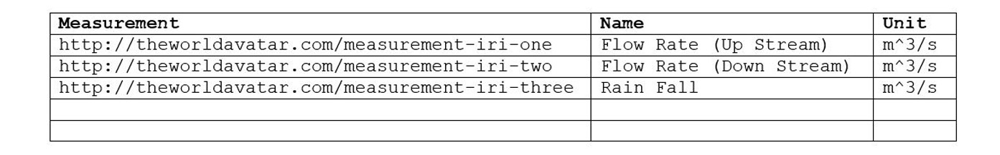

# Feature Info Agent


This Feature Info Agent (FIA) acts as a single access point for [TWA Visualisations](https://github.com/cambridge-cares/TheWorldAvatar/wiki/TWA-Visualisations) to query for both meta and time series data of an individual feature (i.e. a single geographical location) so that it can then be displayed within the side panel of the visualisation.

Please see the [CHANGELOG](./CHANGELOG.md) file for details on recent changes; the latest available image of the FIA can be determined by viewing its [GitHub package page](https://github.com/cambridge-cares/TheWorldAvatar/pkgs/container/feature-info-agent).


## Overview

The FIA is a relatively simple HTTP agent built using the TWA agent framework. Its goal is to take in the IRI of a single feature then use it to query the knowledge graphs for metadata, and the relational databases for time series data before formatting and returning it as a JSON object.

At the time of writing, automatic discovery of data is not feasible, as such the developer deploying an instance of the FIA is responsible for writing SPARQL queries to both return the raw metadata as well as the data IRIs of time series data (so that these can then be looked up in the relational databases to actually get the time series data).

These SPARQL queries are written on a class-by-class (T-Box) basis; this should mean that, for example, all IRIs that are A-Box instances of the `https://theworldavatar.io/ontobuildings/Building` T-Box class will reuse the same SPARQL query as they _should_ have data in the same format.

## Restrictions

At the time of writing, the FIA has a few restrictions that all deploying developers should be aware of. These are as follows:

- The FIA can only be run within a [TWA Stack](https://github.com/cambridge-cares/TheWorldAvatar/tree/main/Deploy/stacks/dynamic/stack-manager).
- The FIA can only report meta and time data that is contained within the same stack as the agent itself.
- The FIA can only return time series data on series that uses the [Instant](https://docs.oracle.com/javase/8/docs/api/java/time/Instant.html) class.
  - This is due to a limitation with the underlying TimeseriesClient class from the JPS Base Library.

### Class discovery

In addition to the above restrictions, the FIA uses a hardcoded SPARQL query to ask the KG what classes the received A-Box IRI belongs to. In essence, the query asks what `rdf:type` the A-Box IRI has, and what the super class of any returned T-Box IRI is, producing a list of the class hierarchy all the way up to `rdf:Resource`. It has been written in a way that uses all of the Blazegraph and Ontop endpoints within the stack, to be robust to the A-Boxes and T-Boxes being stored separately.

If the query fails to return any results, then the FIA will not function; developers may need to update their triples/mapping until at least one of the queries does return something.

```
prefix rdf:     <http://www.w3.org/1999/02/22-rdf-syntax-ns#>
prefix rdfs:    <http://www.w3.org/2000/01/rdf-schema#>

SELECT DISTINCT ?class WHERE {
    VALUES ?all_endpoints {
        [ENDPOINTS-ALL]
    }    
    VALUES ?kg_endpoints {
        [ENDPOINTS-BLAZEGRAPH]
    }
            
    SERVICE ?all_endpoints {
        [IRI] a ?type.
    } 
    SERVICE ?kg_endpoints {
        ?type rdfs:subClassOf* ?class .
    }
            
    FILTER (!isBlank(?class))
} 
```

## Definitions

Before diving into the details on how to write the queries to retrieve the aforementioned data, it's worth clarifying some terms used within this documentation. For more details on time series, check out the documentation for the JPS Base Lib project.

- **Time Series:**
  - As per the time series ontology, a time series is defined as a collection of entities (each of which represents a column of dependent, or Y, values) that are grouped by a single column of independent (or X) time values.
  - Confusingly, the entity representing the independent values is referred to as a "Time Series"; there is no generic name for the entities representing the dependent values (see below).
  - Neither the entities representing the independent or dependent columns have values within the knowledge graph, only the IRIs are present and are used to link to the actual values stored within the relational database.

- **Measurable:**
  - As there's no ontological term for the entities representing dependent columns, the FIA (within the code and documentation) is going to referred to them as "Measurables".
  - Each of these "Measurable" instances will normally have some sort of `hasUnit` predicate/
  - A "Measurable" can be a series of values of any time (number, string, boolean etc.).
  - Any existing entity in the KG can become a "Measurable", as such one cannot write a generic "show me all measurables" SPARQL query that works for all data sets. 

## Requirements

For the FIA to function, a number of configuration steps need to take place before deployment, these are detailed in the subsections below. It is also necessary for users to have good knowledge of Docker, JSON, and to be familiar with management of the TWA Stack system.

### Configuration

**Note:** As of version `3.0.0` of the FeatureInfoAgent, the configuration format has changed to support new options. The new format is documented below, but the older format is also supported. To support the newer features, it is recommended that developers write new configurations using the new format, and existing configurations are manually updated wherever possible.

Follow the below configuration steps within the `fia-queries` subdirectory of the TWA stack manager's data directory. Volumes that are used by containers running with the TWA Stack are populated by named subdirectories within the stack manager's [data directory](https://github.com/cambridge-cares/TheWorldAvatar/tree/main/Deploy/stacks/dynamic/stack-manager/inputs/data). For more details, read the [TWA Stack Manager documentation](https://github.com/cambridge-cares/TheWorldAvatar/tree/main/Deploy/stacks/dynamic/stack-manager).

The configuration file should be a JSON file named `fia-config.json`, contained within it should be:

- `entries`: This is a **required** array of objects defining a mapping between (T-Box) class IRIs and the names of files containing pre-written SPARQL queries. Each object needs to contain the following parameters:
   - Required:
     - `class`: Full IRI of the class.
   - Optional:
      - `meta`: Object containing configurations for meta data retrieval.
      - `time`: Object containing configurations for time series retrieval.


The `meta` object should contain the following parameters:
- Required:
  - `queryFile`: Location of file with SPARQL query used to get meta data (relative to configuration file).

The `time` object should contain the following parameters:
- Required:
  - `queryFile`: Location of file with SPARQL query used to get measurable IRIs (relative to configuration file).
  - `database`: Name of PostGRES database containing values.
- Optional:
  - `limit`: Non-zero integer, defaults to "24". Limit used when calculating boundaries of time data to query.
  - `unit`: Unit of above limit, defaults to "hours". One of:
    - "days"
    - "hours"
    - "minutes"
    - "seconds"
    - "milliseconds"
  - `reference`: Reference point for bounds calculation, defaults to "now". One of:
    - "all" (limit parameter unused in this case)
    - "now" (server time at request)
    - "latest" (furthest forward time value in RDB)
    - "first" (furthest back time value in RDB)

For clarification, the `limit` value supports both positive and negative integers. For reference types of `now` and `latest` it is multiplied by **-1** then **added** to the reference time during the calculation of retrieval times. For references of `first` is is simply **added** to the reference time.

For example, a value of `24` with a reference of `now` will provide all values generated within the last real-world day. Whereas a value of `24` with a reference of `first` will return all values generated between the first data point and one real-world day afterwards.

Within the [samples/fia/fia-config.json](./samples/fia/fia-config.json) file, a mock configuration can be found.

### Expected query formats

To properly parse the meta data and time series queries, the agent requires the results from queries to fulfil a set formats. For each type of query a number of placeholder tokens can be added that will be populated by the agent just before execution. These are:

- `[IRI]`: The IRI of the feature (A-Box) of interest, i.e. the feature selected within the TWA-VF (the IRI will be injected by the agent).
- `[ONTOP]`: The internal URL of the Ontop service within the stack (the URL will be injected by the agent).
- `[ENDPOINTS-ALL]`: Internal URLs of all Blazegraph and Ontop endpoints, good for use with "SERVICE" keyword.
- `[ENDPOINTS-BLAZEGRAPH]`: Internal URLs of all Blazegraph endpoints, good for use with "SERVICE" keyword.

#### Meta data queries

Queries for meta data should not concern themselves with data relating to time series. Queries here need to return a table with two (or optionally three) columns. The first column should be named `Property` and contains the name of the parameter we're reporting, the second should be `Value` and contain the value. The optional third column is `Unit`; any other columns are currently ignored.

Queries that generate multiple rows with the same property name are supported, their values will be combined into a single JSON array by the agent.

<p align="center">
   
</p>
<p align="center">
   <em>Results of a valid SPARQL query for metadata.</em>
</p>

An example of a meta data SPARQL query [can be seen here](./sample/fia/CastleMeta.sparql); note that this is for a sample data set defined in a simple ontology [here](./sample/sample-tboxes.csv).

#### Queries for measurables (time series)

Queries for measurable entities need to return the IRIs of the entities representing the dependent value columns (i.e. "Measurable" instances), rather than that of the time series instance itself. Those IRIs will be used to grab the actual values from the relational database as well as parameters associated with each measurement/forecast. 

Required columns are `Measurable` (`Measurement` also supported for backwards compatibility) containing the entity IRI, `Name` containing a user facing name for this entry, and `Unit` containing the unit (which can be blank); any other columns are currently ignored

<p align="center">
    
</p>
<p align="center">
   <em>Results of a valid SPARQL query for measurable entity IRIs.</em>
</p>

An example of a meta data SPARQL query [can be seen here](./sample/fia/CastleTime.sparql); note that this is for a sample data set defined in a simple ontology [here](./sample/sample-tboxes.csv).

## Requests

The following HTTP request routes are available for the agent:

- `/get`
  - Run algorithm to gather metadata and time series.
  - Requires the `iri` parameter.
  - Supports optional `endpoint` parameter to direct KG queries to a specific endpoint rather than federating across all of them.

- `/status`
  - Reports the agent's current status.

- `/refresh`
  - Forces the agent to re-scan for available Blazegraph endpoints.

## Enabling the FIA in a stack

The FIA container is an optional built-in service in the stack; to enable it you need to create/modify the configuration file for that stack. An example of the changes required are described in the stack-manager readme file [here](../../Deploy/stacks/dynamic/stack-manager/README.md#adding-the-feature-info-agent). After spinning up the stack the agent should be accessible via the `/feature-info-agent` route.

Note that the version of the FIA run by the stack is determined by the stack manager itself; to use a custom (or newer) version, developers will need ensure the newer FIA image is built (either locally or uploaded to GitHub), then provide a custom service configuration (ideally a near-copy of the stack's default configuration for the FIA, found [here](https://github.com/cambridge-cares/TheWorldAvatar/blob/main/Deploy/stacks/dynamic/stack-clients/src/main/resources/com/cmclinnovations/stack/services/built-ins/feature-info-agent.json)) within the stack manager's `inputs/config/services` directory.

## Automated actions

The FIA is currently set up with two automated GitHub actions:

- **Test the FeatureInfoAgent:**
  - Only runs when files within the agent have changed AND on commits that are part of a non-draft PR to the main branch.
  - Tests the FIA by running its unit tests and compiling a Docker image (which is NOT pushed at this stage).
  
- **Push the FeatureInfoAgent:**
  - Only runs when files within the agent are changed AND on commits to the main branch (i.e. after a PR is approved and merged).
  - Builds the FIA's Docker image (inc. running the unit tests again) AND pushes it to the TWA GitHub image registry.

## Examples

A number of different projects have made use of the FeatureInfoAgent, some good examples to use as starting points are:

- [UK Base World](../../web/uk-base-world/): Project showing power plant locations across the UK.
- [TWA-VF Tutorial](../../web/twa-vis-framework/): The Mapbox tutorial from the TWA-VF documents using the FIA in a simple case with NHS data.

Packaged within this directory is also a number of configuration and data files used to spin up a [small sample stack](./sample/) used to manually test the FIA. Whilst this has not been put together to act as a shining example of the FIA, one is free to look at the configuration files to determine proper syntax.

## Tutorial

A tutorial that walks through how to use the FIA can be found in the associated [FIA Tutorial document](./docs/tutorial.md).

## Troubleshooting

For troubleshooting and FAQs, please see the [FIA Troubleshooting](./docs/troubleshooting.md) document.

## Development

The FIA is a simple HTTP agent written using the existing TWA agent framework. The core functionality of the agent is split across 4 classes; the central `FeatureInfoAgent` class that acts as the receiver and transmitter for HTTP requests, and classes that actually run logic (which should be self-explanatory): `ClassHandler`, `MetaHandler`, and `TimeHandler`.

The algorithm used to find, format, and return data after a request is received is detailed in the Mermaid diagram [here](./docs/mermaid-get-request.md) (although you can also read the in-code documentation for more details).

Building the Docker image for the FIA is automatically triggered under certain conditions (see above), but developers can also build a local copy using the provided `build.sh` script after supplying the required `repo_username.txt` and `repo_password.txt` files within the `credentials` directory.

## Support

For support, please file an issue in GitHub using the `FeatureInfoAgent` project, or contact the CMCL technical team.