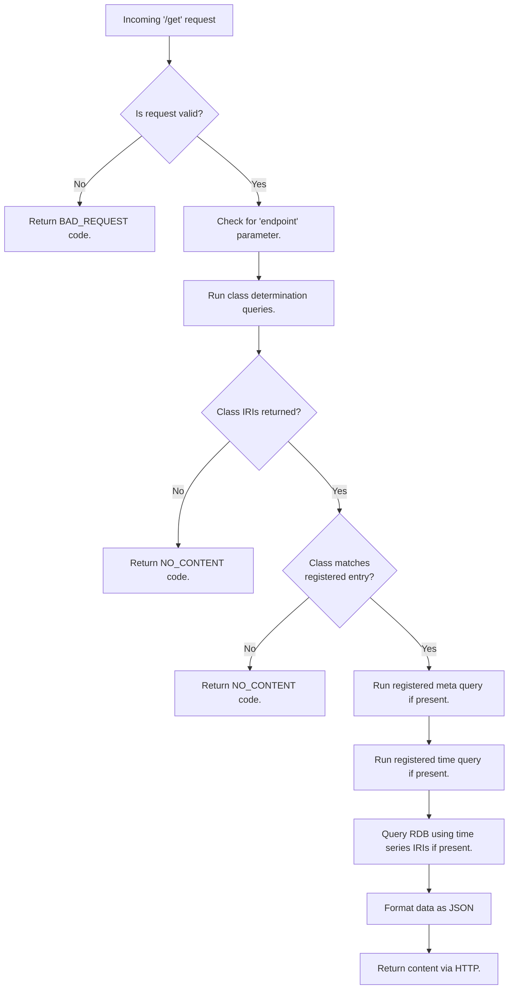

```mermaid
graph TD
   A[Incoming '/get' request] --> B{Is request valid?};
   B -- No --> C[Return BAD_REQUEST code.];
   B -- Yes --> D[Check for 'endpoint' parameter.];
   D --> E[Run class determination queries.];
   E --> F{Class IRIs returned?};
   F -- No --> G[Return NO_CONTENT code.];
   F -- Yes --> H{Class matches\nregistered entry?};
   H -- No --> I[Return NO_CONTENT code.];
   H -- Yes --> J[Run registered meta query if present.];
   J --> K[Run registered time query if present.];
   K --> L[Query RDB using time series IRIs if present.];
   L --> M[Format data as JSON];
   M --> N[Return content via HTTP.];
```