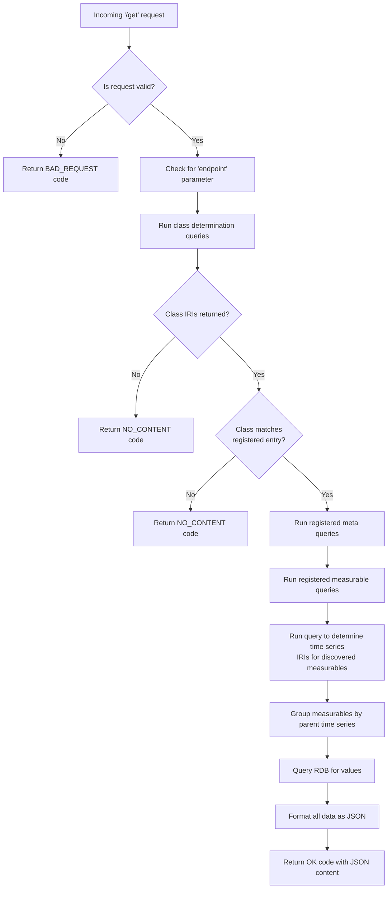

```mermaid
graph TD
   A[Incoming '/get' request] --> B{Is request valid?};
   B -- No --> C[Return BAD_REQUEST code];
   B -- Yes --> D[Check for 'endpoint' parameter];
   D --> E[Run class determination queries];
   E --> F{Class IRIs returned?};
   F -- No --> G[Return NO_CONTENT code];
   F -- Yes --> H{Class matches\nregistered entry?};
   H -- No --> I[Return NO_CONTENT code];
   H -- Yes --> J[Run registered meta queries];
   J --> K[Run registered measurable queries];
   K --> L[Run query to determine time series\nIRIs for discovered measurables];
   L --> M[Group measurables by parent time series];
   M --> N[Query RDB for values];
   N --> O[Format all data as JSON];
   O --> P[Return OK code with JSON content];
```