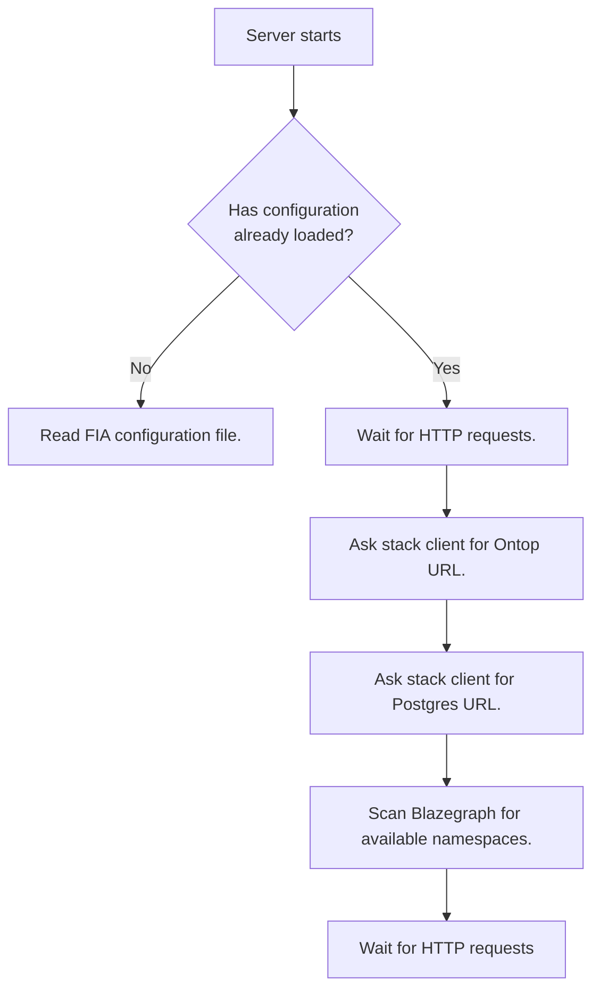

```mermaid
graph TD
   A[Server starts] --> B{Has configuration\nalready loaded?};
   B -- No --> C[Read FIA configuration file.];
   B -- Yes --> D[Wait for HTTP requests.];
   D --> E[Ask stack client for Ontop URL.];
   E --> F[Ask stack client for Postgres URL.];
   F --> G[Scan Blazegraph for available namespaces.];
   G --> H[Wait for HTTP requests];
```