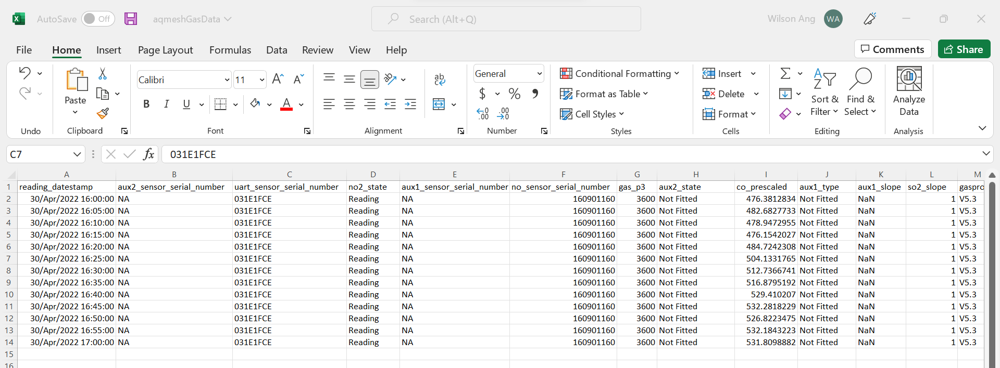
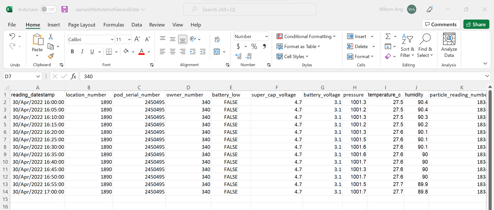
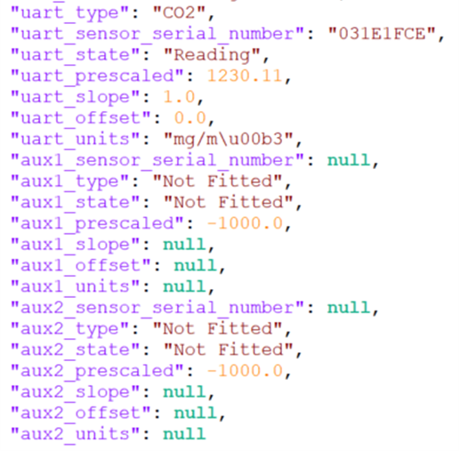
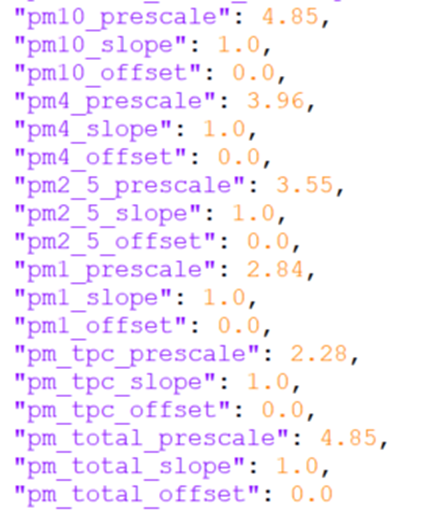

# Historical AQMesh Agent

This agent is for maintaining data and the corresponding instances in the knowledge graph (KG) regarding the AQMesh air 
quality measuring station. It's only purpose is to retrieve new/historical data from excel files and download it into 
the corresponding database, as well as, instantiating KG instances and connection when called for the first time. The 
agent uses the [time-series client](https://github.com/cambridge-cares/TheWorldAvatar/tree/develop/JPS_BASE_LIB/src/main/java/uk/ac/cam/cares/jps/base/timeseries)
from the JPS base lib to interact with both the KG and database.

### Data retrieval and pre-processing
This agent is designed to work with Excel 2007 or later versions. Some pre-processing might be required in order to ensure
that the excel files are compatible with the agent. 

Firstly, The AQMesh data must be split into two files, one for gas data and one for particle and general data. The gas data excel file should be named
aqmeshGasData. The particle and general data excel file should be named aqmeshParticleAndGeneralData. Both files needs to be in the xlsx format and they should be placed in the `config` folder.

Secondly, the keys for each column in the excel files must correspond with the keys found in the gas.properties, particle.properties 
and general.properties files. These properties files can be found in the `mapping` folder under the `config` folder.

Lastly, the timestamps in the excel files must be in UTC timezone. The agent will then convert the timestamps to a local 
date time with offset.

The following shows the content of compatible excel file for gas readings:


The following shows the content of compatible excel file for particle and general readings:



#### Example readings
Readings are retreived from the excel file in the form of a JSON array with one JSON object per timestamp. The following 
shows a single JSON object example for gas readings:




The following shows a single JSON object example for particle readings:




## Usage 
This part of the README describes the usage of the agent. The module itself can be packaged into an executable war, deployed as 
a web servlet on tomcat. Sending the appropriate request to the correct URL will initiate the agent. Since it uses the time-series
client which maintains both instances in a knowledge graph and a Postgres database to store the data, these will be required to be 
set-up beforehand.  

The [next section](#requirements) will explain the requirements to run the agent.

### Requirements
It is required to have access to a knowledge graph SPARQL endpoint and Postgres database. These can run on the same machine 
or need to be accessible from the host machine via a fixed URL.

This can be either in form of a Docker container or natively running on a machine. It is not in the scope of this README
to explain the set-up of a knowledge graph triple store or Postgres database.

### Property and xlsx files
For running the agent, three property files and two xlsx files are required:
- One [property file for the agent](#agent-properties) itself pointing to the mapping configuration.
- One [property file for the time-series client](#time-series-client-properties) defining how to access the database and SPARQL endpoint.
- One [property file for the excel file connector](#excel-connector-properties) defining the number of columns/keys for the gas readings excel file and for the particle and general readings excel file..
- One xlsx file for gas readings with the name "aqmeshGasData.xlsx" needs to be included in the `config` folder. An example xlsx file can be found at HistoricalAQMeshAgentCode\data\aqmeshGasData.xlsx.
- One xlsx file for particle and general readings with the name "aqmeshParticleAndGeneralData.xlsx" needs to be included in the `config` folder. An example xlsx file can be found at HistoricalAQMeshAgentCode\data\aqmeshParticleAndGeneralData.xlsx.

#### Agent properties
The agent property file only needs to contain a single line:
```
aqmesh.mappingfolder=HISTORICALAQMESH_AGENT_MAPPINGS
```
where `HISTORICALAQMESH_AGENT_MAPPINGS` is the environment variable pointing to the location of a folder containing JSON key to IRI mappings. 
An example property file can be found in the `config` folder under `agent.properties`. See [this section](#mapping-files) of the README for an 
explanation of the mapping files.


#### Time-series client properties
The time-series client property file needs to contain all credentials and endpoints to access the SPARQL endpoint of
the knowledge graph and the Postgres database. It should contain the following keys:
- `db.url` the [JDBC URL](https://www.postgresql.org/docs/7.4/jdbc-use.html) for the Postgres database
- `db.user` the username to access the Postgres database
- `db.password` the password to access the Postgres database
- `sparql.query.endpoint` the SPARQL endpoint to query the knowledge graph
- `sparql.update.endpoint` the SPARQL endpoint to update the knowledge graph

More information can be found in the example property file `client.properties` in the `config` folder.

#### Excel connector properties
The Excel connector properties contain the number of columns/keys for each of the excel files.
It should contain the following keys:
- `numOfGasKeys` the number of columns/keys in the gas readings excel file.
- `numOfParticleAndGeneralKeys` the number of columns/keys in the particle and general readings excel file.

More information can be found in the example property file `xlsxconnector.properties` in the `config` folder.

#### Mapping files
What are the mapping files and why are they required? The mapping files define how data received from the API is connected
to the knowledge graph (KG). Specifically, each JSON key in the readings (see [Example readings](#example-readings)) 
represents a specific measure that needs to be represented by an IRI, if it should be saved in the database.

Furthermore, measures can be grouped into one time-series (will result in one time-series instance per group in the KG).
This should be done so that all measures in one group are recorded at the same time interval, and so they come from 
the same readings, e.g. gas readings or particle readings, without mixing them together. However, it is possible to 
break down the readings into smaller, logical groups, e.g. general readings and actual measures.

The mapping is achieved in this package by using one property file per group. Each property file contains one line per 
JSON key that should be linked to an IRI, e.g. like:
```
co_slope=http:/example/co_slope
```
If the IRI is left empty (`co_slope=` in the example), i.e. because there is no instance that represents the measure yet, 
it will be automatically created when the agent is run for the first time. This automatically generated URI will have the
following form:
```
[prefix]/[key]_[UUID]
```
where the `[prefix]` is hardcoded into the `HistoricalAQMeshAgent` class in a public, static field called `generatedIRIPrefix`
which is based on the time-series client namespace, `[key]` is the JSON key the URI is generated for, and `[UUID]` is a 
randomly generated UUID.

Note, that not all JSON keys need to be represented in the mapping files (the data will simply be ignored and not stored), 
but there needs to be a 1-1 mapping, i.e. no IRI can be used for multiple JSON keys.

To ensure that the same IRIs are used for each JSON key, the mapping files are saved back after each run (only really 
necessary when some of them are automatically generated). Note, that if you change any mapping in preceding runs, they 
will be seen as new time-series, which can result in inconsistencies in both the KG and database. To retrieve the
mapping files from a running docker container, you have to type in the following into the command line:

```
docker cp <Docker container ID>://root/mappings/<name of properties file> <destination filepath on your machine>
```

For example, to retrieve the gas.properties mapping file from the docker container, the following line have to be entered into the command line:

```
docker cp 7956ce42351d://root/mappings/gas.properties C:\Users\USER01\Desktop\gas.properties
```

Examples for the structure of the mapping folder and files can be found in the `mapping` folder within the `config` 
folder. Here, the keys are grouped into three groups, where the particle readings are split into measures and general 
information, and for the gas readings general information already contained in the particle readings are ignored (see 
also [Example readings](#example-readings)).

### Building the Historical AQMesh Agent
The Historical AQMesh Agent is set up to use the Maven repository at https://maven.pkg.github.com/cambridge-cares/TheWorldAvatar/ (in addition to Maven central).
You'll need to provide  your credentials in single-word text files located like this:
```
./credentials/
    repo_username.txt
    repo_password.txt
```

repo_username.txt should contain your github username, and repo_password.txt your github [personal access token](https://docs.github.com/en/github/authenticating-to-github/creating-a-personal-access-token),
which must have a 'scope' that [allows you to publish and install packages](https://docs.github.com/en/packages/working-with-a-github-packages-registry/working-with-the-apache-maven-registry#authenticating-to-github-packages).

Modify `api.properties` and `client.properties` in the `config` folder accordingly. You should not modify the `agent.properties` file as the Dockerfile will set the environment variable 
HISTORICALAQMESH_AGENT_MAPPINGS to point towards the location of the mapping folder. The Dockerfile will copy all 3 properties files and mapping folder and set environment variables pointing 
to their location thus you do not need to shift the properties files and mapping folder nor add in environment variables manually.

The two xlsx files `aqmeshGasData.xlsx` containing gas readings and `aqmeshParticleAndGeneralData.xlsx` containing particle and general readings have to be included in the `config` folder. Example xlsx files can be found in the `data` folder.

To build and start the agent, open up the command prompt in the same directory as this README, run
```
docker-compose up -d
```

The agent is reachable at "historical-aqmesh-agent/retrieve" on localhost port 1025.


#### Run the agent
To run the agent, a POST request must be sent to http://localhost:1025/historical-aqmesh-agent/retrieve with a correct JSON Object.
Follow the request shown below.

```
POST http://localhost:1025/historical-aqmesh-agent/retrieve
Content-Type: application/json
{"agentProperties":"HISTORICALAQMESH_AGENTPROPERTIES","xlsxConnectorProperties":"HISTORICALAQMESH_XLSXCONNECTORPROPERTIES","clientProperties":"HISTORICALAQMESH_CLIENTPROPERTIES"}
```
In curl syntax
```
curl -X POST --header "Content-Type: application/json" -d "{\"agentProperties\":\"HISTORICALAQMESH_AGENTPROPERTIES\",\"xlsxConnectorProperties\":\"HISTORICALAQMESH_XLSXCONNECTORPROPERTIES\",\"clientProperties\":\"HISTORICALAQMESH_CLIENTPROPERTIES\"}" localhost:1025/historical-aqmesh-agent/retrieve
```
If the agent run successfully, you should see a JSON Object returned back that is similar to the one shown below.
```
{"Result":["Data updated with new readings from API.","Timeseries Data has been updated."]}
```
