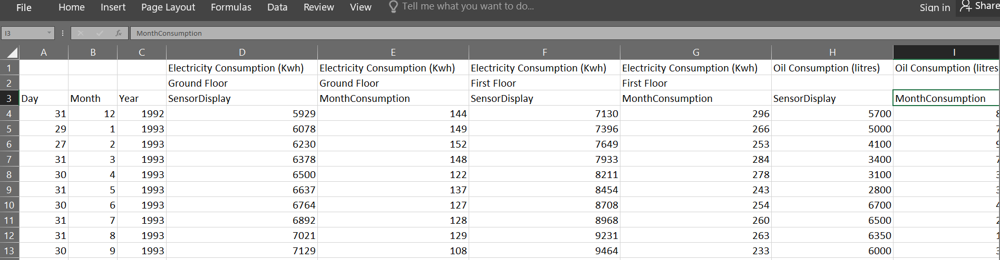

# Historical House45 Utilities Agent

Using the JPS-base-lib's [time-series client](https://github.com/cambridge-cares/TheWorldAvatar/tree/develop/JPS_BASE_LIB/src/main/java/uk/ac/cam/cares/jps/base/timeseries),
this agent extracts time series data from an Excel workbook, and stores them and their corresponding instances into the 
knowledge graph (KG) and a relational database (RDB). 

When called for the first time, it will initialize the KG and RDB. Subsequently, only new data will be updated or inserted.
More details on the classes, public methods, and documentation is available in the source code.

At present, this agent can only work with Dates. If time information is required, an additional class will have to be developed to handle this input.

## Instructions
### 1. Requirements
#### 1.1 Excel pre-processing
This agent is designed to work with any Excel version in .xls or .xlsx format. An Excel workbook must be placed in the
 `data/` directory. Some pre-processing might be required in order to ensure that the Excel content are compatible with the agent.

The following shows the content of a compatible Excel file with multi-column Date data:


Notes:
- .csv files are incompatible at this moment, and an alternate solution is to copy and paste the .csv content into an Excel sheet.
- Date can be stored as 1 column (`2020-11-31`) or separated into 3 numeric columns (`col1: 31, col2:11, col3:2020` to store `31/11/2020`). 
  - For the 1 column, any Excel Date format is valid, but it must be in Excel Date format.
  - If 3 columns are required, please set the column indices in the `dateArrays` field of the `HistoricalHouse45UtilitiesAgent` class.
- Contents do not need to start at the first sheet or second row. This can be set in the `HistoricalHouse45UtilitiesAgent` class.
- All numeric data are return as `Double.class` or `Date.class` in Java at the moment.
- The agent can only process one workbook at a time. Please do not put more than one workbook for processing.

#### 1.2 KG and RDB Endpoint access file
Access to a KG SPARQL database and RDB (PostgreSQL) endpoint from the host machine is required. 
The access port is either local or external, and must be running on a server or from a Docker container. 
It is not within this document's scope to explain the set-up of a KG or RDB database.

In this agent, these access ports are defined in a .properties file for the time-series client to function. This should be 
placed in the `config` directory, preferably named as `client.properties`. A sample file have been provided for illustration.
It should contain the following credentials and endpoints:
- `db.url` the [JDBC URL](https://www.postgresql.org/docs/7.4/jdbc-use.html) for the Postgres database ^
  - As this url will be reflected in the triples, please specify the IP address to grant easy access for production. Do not use `localhost` or `host.docker.internal` for production
- `db.user` the username to access the PostgreSQL database
- `db.password` the password to access the PostgreSQL database
- `sparql.query.endpoint` the SPARQL endpoint to query the knowledge graph ^
- `sparql.update.endpoint` the SPARQL endpoint to update the knowledge graph ^

^ Please ensure that the KG namespace and RDB database name has been created and specified accordingly. 

#### 1.3 Mapping file
The mapping files define how data retrieved from Excel is related to the KG and RDB. Specifically, each column represents 
a specific measure, that needs to be represented as a class in the KG through a data IRI. This is achieved through a 
properties file, containing one line per column and linked to an IRI. **The mapping must be 1-1** ie no dataIRI should 
be linked to multiple columns or vice versa.

The agent will automatically generate this file from the Excel if it is missing on the first build process. If there is 
a preceding  properties file with established dataIRI, please place the `excel.properties` file in the `data` 
directory to retain the relations. When the IRI is left empty, the agent will generate one and save the changes to file.

```
// dataIRI format 
[prefix]/[columnName]_[UUID]

// Sample line 
oilconsumption=http:/example/oilconsumption_150252

//Sample empty IRI
oilconsumption=
```
*Note that the `[prefix]` is hardcoded into the `HistoricalHouse45UtilitiesAgent` class as the `iriPrefix` field.

*If any mappings are modified from preceding builds, any data inputs are perceived as a *"new"* time series. This can result 
in inconsistencies in both KG and RDB. In such circumstances, please reset the namespaces and database to  a clean slate.

*The mapping file can be retrieved from the `data` directory.

### 2. Building the Agent
This agent is designed to be an executable war and deployed as a web servlet on Tomcat. Then, a POST request would
need to be sent to the specific URL to initiate the agent. This is achieved using the Docker platform. Alternative
build processes are not within this document's scope.  

#### 2.1 Preparation
This agent is set up to use this [Maven repository](https://maven.pkg.github.com/cambridge-cares/TheWorldAvatar/) (in addition to Maven central).
You'll need to provide  your credentials in a single-word text files located like this:
```
./credentials/
    repo_username.txt
    repo_password.txt
```

repo_username.txt should contain your Github username. repo_password.txt should contain your Github [personal access token](https://docs.github.com/en/github/authenticating-to-github/creating-a-personal-access-token),
which must have a 'scope' that [allows you to publish and install packages](https://docs.github.com/en/packages/working-with-a-github-packages-registry/working-with-the-apache-maven-registry#authenticating-to-github-packages).

In the `root/config` directory, modify the `client.properties` to specify the KG and RDB endpoints accordingly. This must be done before creating the image.

This agent is designed for easy modifications and generalization. All modifiable inputs are available in the `HistoricalHouse45UtilitiesAgent` class:
- `rowStart` field
- `dateKey`field at `processRequestParameters` method
- `dateArrays`field at `processRequestParameters` method 
- `iriPrefix`field

#### 2.2 Docker Deployment
Deploy the agent and its dependencies by running the following code in the command prompt at the `<root>` directory:
```
docker-compose up -d
```

Please disable the `DateTSClientDecoratorIntegrationTest` and `QueryHandlerTest` when building the agent in Docker. 
The test containers are unable to access the host Docker daemon from within the container. The test runs when building locally in Maven.

#### 2.3 Running the Agent
##### 2.3.1 Precursor
In the `root/data` directory, please place the Excel workbook, and if there is a preceding file, the [mapping file](#13-mapping-file),
which must be named as `excel.properties`. Note that the mapping file will be automatically generated otherwise.

##### 2.3.2 POST Request Parameters
The agent currently accepts two parameters.

1. Client.properties File Path - Mandatory
This is the file path to retrieve the login credentials necessary to access the SPARQL and RDB endpoints. It can be invoked with the `clientProperties` key.

2. OntoCityGML Building IRI - Optional
This links the OntoBIM Building instance to the building instance in the OntoCityGML ontology via the `hasOntoCityGMLRepresentation` property. 
It is not required to link the building instances if they do not exist.

It can be invoked with the `cityGmlBuildingIri` key.

##### 2.3.3 POST Request
Run the agent by sending a POST request with the required JSON Object to `http://localhost:3050/historical-house45-utilities-agent/retrieve`.
Two parameters are required. A sample request is as follows:
```
POST http://localhost:3050/historical-house45-utilities-agent/retrieve
Content-Type: application/json
{"clientProperties":"TIMESERIES_CLIENTPROPERTIES", "cityGmlBuildingIri": "http://IPADDRESS:PORTNUM/namespace/NAMESPACE/sparql/GRAPH/INST/}

// Written in curl syntax (as one line)
curl -X POST --header "Content-Type: application/json" -d "{'clientProperties':'TIMESERIES_CLIENTPROPERTIES', 'cityGmlBuildingIri': 'http://IPADDRESS:PORTNUM/namespace/NAMESPACE/sparql/GRAPH/INST/'}" localhost:3050/historical-house45-utilities-agent/retrieve
```
If the agent ran successfully, a JSON Object would be returned as follows:
```
{"Result":["Data updated with new readings from Excel Workbook.","Timeseries Data has been updated."]}
```
#### 2.4 Post-Build
All the data are available in both the KG and RDB. The mapping files can be retrieved from the `data` directory.