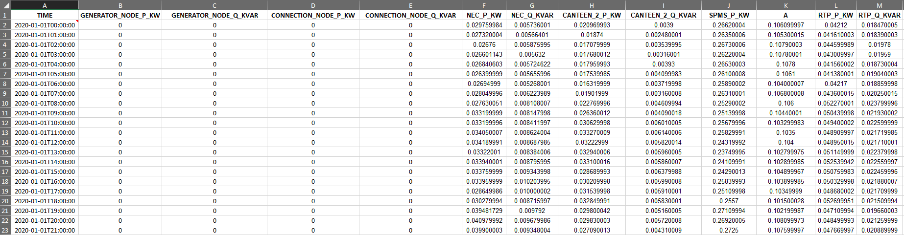

# Historical NTUEnergy Agent

The Historical NTU Energy Agent is designed to manage data and corresponding instances in the knowledge graph (KG) 
related to the energy readings of Nanyang Technological University (NTU). Its primary purpose is to retrieve new or 
historical data from Excel files and upload it into the associated database. Additionally, the agent is responsible 
for initializing KG instances and connections when invoked for the first time. To interact with both the KG and the database, 
the agent employs the Time-series Client from the JPS Base Library.

# 1. Data retrieval and pre-processing
This agent is designed to work with Excel 2007 or later versions. Some pre-processing might be required in order to ensure
that the Excel files are compatible with the agent

There are few things to take note for the Excel data file to be compatible with the agent.
1. The NTU Energy data in Excel format must be named NTU_Energy_Consumption.xlsx and placed in the `config` folder.
2. The keys for each column in the Excel file must correspond with the keys found in the energy.properties
files. These properties files can be found in the `mapping` folder under the `config` folder.
3. The timestamps in the Excel files must be in UTC timezone. The agent will then convert the timestamps to a local date time with offset.

The following shows the content of compatible Excel file for NTU Energy:


#### Example readings
Readings are retreived from the Excel file in the form of a JSON array with one JSON object per timestamp. The following
shows a single JSON object example for Energy readings:

```
"GENERATOR_NODE_P_KW"=0
"GENERATOR_NODE_Q_KVAR"=0
"CONNECTION_NODE_P_KW"=0
"CONNECTION_NODE_Q_KVAR"=0
"NEC_P_KW"=0.029759984
"NEC_Q_KVAR"=0.005736001
"CANTEEN_2_P_KW"=0.020969993
"CANTEEN_2_Q_KVAR"=0.0039
"SPMS_P_KW"=0.26620004
"SPMS_Q_KVAR"=0.106099997
"RTP_P_KW"=0.04212
"RTP_Q_KVAR"=0.018470005
"N1_3_P_KW"=0.07400001
"N1_3_Q_KVAR"=0.0183
"N_2_P_KW"=0.022709971
"N_2_Q_KVAR"=0.004809972
"N_2_1_P_KW"=0.018199989
"N_2_1_Q_KVAR"=0.007699982
"SBS_P_KW"=0.21566999
"SBS_Q_KVAR"=0.053040015
"PIONEER_HALL_P_KW"=0.016668339
"PIONEER_HALL_Q_KVAR"=0.002011665
"THE_WAVE_P_KW"=0.002389999
"THE_WAVE_Q_KVAR"=-0.000520001
"HALL_4_P_KW"=0.011159994
"HALL_4_Q_KVAR"=-0.003280001
"EMB_P_KW"=0.101707703
"EMB_Q_KVAR"=4.02891E-05
"NYA_P_KW"=0.002770001
"NYA_Q_KVAR"=0.000400001
```


# 2. Setup and Running
This part of the README describes the setup of the agent. The module itself can be packaged into an executable war, deployed as
a web servlet on tomcat. Sending the appropriate request to the correct URL will initiate the agent. Since it uses the time-series
client which maintains both instances in a knowledge graph and a Postgres database to store the data, these will be required to be
set-up beforehand.

## 2.1 Agent Setup
It is required to have several config files setup before running the agent. In specific, one mapping file, two property files and one xlsx file are required:
- The [mapping file](#mapping-files) contains the mapping between the keys in the Excel file and the IRI of the KG instances.
- The [agent.properties](#agent-properties) file points to the mapping configuration.
- One [xlsxconnector.properties](#excel-connector-properties) file defines the number of columns/keys for the power readings Excel file.
- One data file for energy readings in Excel format needs to be named `NTU_Energy_Consumption.xlsx` and included in the `config` folder. An example data file can be found at HistoricalNTUEnergyAgent\data\NTU_Energy_Consumption_Example.xlsx.

### Mapping files
The mapping files define how data received from the API is connected
to the knowledge graph (KG). Specifically, each JSON key in the readings 
represents a specific measure that needs to be represented by an IRI, if it should be saved in the database.
The mapping is achieved in this package by using one property file per group. Each property file contains one line per
JSON key that should be linked to an IRI, e.g. like:
```
N1_3_P_KW=http:/example/N1_3_P_KW
```
If the IRI is left empty (`N1_3_P_KW=` in the example), i.e. because there is no instance that represents the measure yet,
it will be automatically created when the agent is run for the first time. This automatically generated URI will have the
following form:
```
[prefix]/[key]_[UUID]
```
where the `[prefix]` is hardcoded into the `HistoricalNTUEnergyAgent` class in a public, static field called `generatedIRIPrefix`
which is based on the time-series client namespace, `[key]` is the JSON key the URI is generated for, and `[UUID]` is a
randomly generated UUID.

### Agent properties
The agent property file only needs to contain a single line:
```
aqmesh.mappingfolder=HISTORICALAQMESH_AGENT_MAPPINGS
```
where `HISTORICALAQMESH_AGENT_MAPPINGS` is the environment variable pointing to the location of a folder containing JSON key to IRI mappings.
An example property file can be found in the `config` folder under `agent.properties`. See [this section](#mapping-files) of the README for an
explanation of the mapping files.

### Excel connector properties
The Excel connector properties contain the number of columns/keys for each of the Excel files.
It should contain the following keys:
- `numOfEnergyKeys` the number of columns/keys in the energy readings Excel file.
More information can be found in the example property file `xlsxconnector.properties` in the `config` folder.

The [next section](#Setup) will explain the detailed instructions to run the agent.

## 2.2 Docker Setup

### 2.2.1 Build Docker Image
The NTUEnergyAgent is set up to use the Maven repository. You'll need to provide your credentials in single-word text files located like this:
```
./credentials/
    repo_username.txt
    repo_password.txt
```
repo_username.txt should contain your Github username, and repo_password.txt your Github [personal access token](https://docs.github.com/en/github/authenticating-to-github/creating-a-personal-access-token),
which must have a 'scope' that [allows you to publish and install packages](https://docs.github.com/en/packages/working-with-a-github-packages-registry/working-with-the-apache-maven-registry#authenticating-to-github-packages).

Then build image with:
```
docker build .
```
The Dockerfile will automatically copy all properties files and mapping folder and set environment variables pointing
to their location. Therefore, you do not need to shift the properties files and mapping folder nor add in environment variables manually.

### 2.2.2 Config Stack Manager
This agent is designed to run in stack, which is spun up by [Stack Manager](https://github.com/cambridge-cares/TheWorldAvatar/tree/main/Deploy/stacks/dynamic/stack-manager).
A successful setup will result in 9 containers (optional 10):
- Default containers
    - Stack Manager (exits when spins up all other containers)
    - Blazegraph
    - Nginx
    - Postgis
    - Adminer
    - Ontop
    - Gdal
    - Geoserver
- HistoricalNTUEnergyAgent
- FeatureInfoAgent (Optional)
Note: The FeatureInfoAgent is optional and is only required if you want to visualize the result via DTVF.

#### Add Config to Stack Manager
Before running the stack manager, you need to add the config files to the stack manager. The config files are located in `TheWorldAvatar/Deploy/dynamic/stack-manager/inputs/config/`.

Copy `stack-manager-config/historical-ntuenergy-agent.json` to `TheWorldAvatar/Deploy/dynamic/stack-manager/inputs/config/services/`.

Create `TheWorldAvatar/Deploy/dynamic/stack-manager/inputs/config/<STACK NAME>.json` manually if it doesn't exist. If it exists already, append the agent to the file as follows:
```json
{
  "services": {
    "includes": [
      "historical-ntuenergy-agent",
      // ...
  ],
    "excludes": [
      // ...
  ]
  }
}
```

After this step, the stack-manager/inputs/config folder will have the following structure:
```
config/
|_ services/
   |_ historical-ntuenergy-agent.json
   |_ ...
|_ <STACK NAME>.json
```
More information about adding custom containers to the stack can be found [here](https://github.com/cambridge-cares/TheWorldAvatar/tree/main/Deploy/stacks/dynamic/stack-manager#adding-custom-containers).


### 2.2.3 Spin Up Stack
Follow the [steps](https://github.com/cambridge-cares/TheWorldAvatar/tree/main/Deploy/stacks/dynamic/stack-manager#spinning-up-a-stack) to spin up the stack.


## 2.3 Run the Agent
Once the stack is up and running, the agent can be activated by sending a Curl request as shown below:
```
curl -X POST --header "Content-Type: application/json" -d "{\"agentProperties\":\"HISTORICALNTUENERGY_AGENTPROPERTIES\",\"xlsxConnectorProperties\":\"HISTORICALNTUENERGY_XLSXCONNECTORPROPERTIES\"}" localhost:8080/historical-ntuenergy-agent/retrieve
```
If the agent run successfully, you should see a JSON Object returned back that is similar to the one shown below.
```
{"Result":["Data updated with new readings from API.","Timeseries Data has been updated."]}
```
This indicates that the agent has instantiated the Knowledge Graph of NTU Power Network and updated the database with the latest readings from the Excel datafile. 