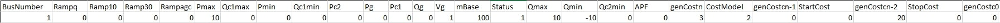
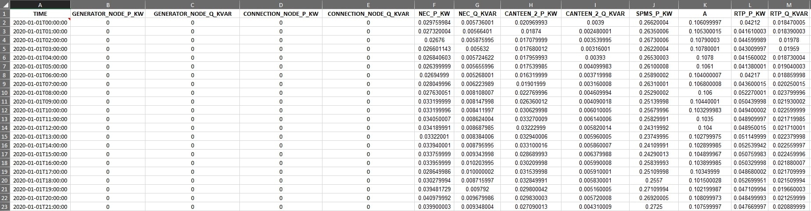

# Historical NTUEnergy Agent

The Historical NTU Energy Agent is designed to instantiate data and corresponding instances in the knowledge graph (KG) of a power system. Its primary purpose is to
retrieve timeseries power readings from Excel files and upload them into the associated database. The agent is responsible for initializing KG instances and connections when invoked for the first time.

Additionally, the agent will instantiate class schedule and venue information.

# 1. Agent Setup

## 1.1 Power System Configuration Files

The agent requires several Excel files as input, each containing configurations for a major power system component, including Bus Nodes, Branches, Generators, and Photovoltaic Generators. 
These files should be placed in the `config` folder. The required configuration files include:
-  `Bus_node_specs.xlsx`
   
- `Branch_specs.xlsx`
  
- `Generator_specs.xlsx`
  
- `PV_specs.xlsx`
  

## 1.2  Energy Reading File
The agent requires an energy reading file as input, named `NTU_Energy_Consumption.xlsx`. 
This file should adhere to the following guidelines to ensure compatibility with the agent:

There are few things to take note for the energy reading file to be compatible with the agent.
1. The NTU Energy data in Excel format must be named `NTU_Energy_Consumption.xlsx`  and placed in the `config` folder (same as the Power System Configuration Files).
2. The keys for each column in the Excel file must correspond with the keys found in the `energy.properties` file, which can be found in the `mapping` folder under the `config` folder.
3. The timestamps in the Excel files must be in UTC timezone. The agent will then convert the timestamps to a local date time with offset.

### Example readings
Readings are retrieved from the Excel file as a JSON array, with one JSON object per timestamp. 
The following shows a single JSON object example for Energy readings:


```
"GENERATOR_NODE_P_KW"=0
"GENERATOR_NODE_Q_KVAR"=0
"CONNECTION_NODE_P_KW"=0
"CONNECTION_NODE_Q_KVAR"=0
"NEC_P_KW"=0.029759984
"NEC_Q_KVAR"=0.005736001
"CANTEEN_2_P_KW"=0.020969993
"CANTEEN_2_Q_KVAR"=0.0039
"SPMS_P_KW"=0.26620004
"SPMS_Q_KVAR"=0.106099997
"RTP_P_KW"=0.04212
"RTP_Q_KVAR"=0.018470005
"N1_3_P_KW"=0.07400001
"N1_3_Q_KVAR"=0.0183
"N_2_P_KW"=0.022709971
"N_2_Q_KVAR"=0.004809972
"N_2_1_P_KW"=0.018199989
"N_2_1_Q_KVAR"=0.007699982
"SBS_P_KW"=0.21566999
"SBS_Q_KVAR"=0.053040015
"PIONEER_HALL_P_KW"=0.016668339
"PIONEER_HALL_Q_KVAR"=0.002011665
"THE_WAVE_P_KW"=0.002389999
"THE_WAVE_Q_KVAR"=-0.000520001
"HALL_4_P_KW"=0.011159994
"HALL_4_Q_KVAR"=-0.003280001
"EMB_P_KW"=0.101707703
"EMB_Q_KVAR"=4.02891E-05
"NYA_P_KW"=0.002770001
"NYA_Q_KVAR"=0.000400001
```
These readings represent the values of active and reactive power for different locations in the NTU energy system. Active power (P) is measured in kilowatts (KW) and represents the power that is actually used by the electrical equipment to perform useful work, 
while reactive power (Q) is measured in kilovolt-ampere reactive (KVAR) and represents the power that is used to establish and maintain the electric and magnetic fields in the equipment.

## 1.3 Class schedule and venue information

These files should be placed in the `config` folder. The required configuration files include:
-	`venue_info.xlsx`
-	`minimised_class_schedule.xlsx`

##  1.4 Agent Property Files
Before running the agent, several configuration files need to be set up:
-  `energy.properties`: This file contains the mapping between the keys in the Energy Reading file and the IRI of the KG instances.
- `agent.properties`: This file points to the mapping configuration.
- `client.properties`: This file defines how to access the database and SPARQL endpoint (Note: this file is not required when the agent runs within the stack)
- `xlsxconnector.properties`: This file defines the number of columns/keys for the Energy Reading file.

#### energy.properties
The  `energy.properties` files define how data read from the excel file is connected to the knowledge graph (KG). Specifically, each JSON key in the readings represents a specific measure that needs to be represented by an IRI, if it should be saved in the database. 
The mapping is achieved in this package by using one property file per group. Each property file contains one line per JSON key that should be linked to an IRI, e.g. like:
```
N1_3_P_KW=http:/example/N1_3_P_KW
N1_3_Q_KVAR=http:/example/N1_3_Q_KVAR
N_2_P_KW=http:/example/N_2_P_KW
```
If the IRI is left empty (`N1_3_P_KW=` in the example), i.e. because there is no instance that represents the measure yet,
it will be automatically created when the agent is run for the first time. This automatically generated URI will have the
following form:
```
[prefix]/[key]_[UUID]
```
where the `[prefix]` is hardcoded into the `HistoricalNTUEnergyAgent` class in a public, static field called `generatedIRIPrefix` which is based on the time-series client namespace, `[key]` is the JSON key the URI is generated for, and `[UUID]` is a
randomly generated UUID.

#### agent.properties
The `agent.properties` file only needs to contain a single line:
```
ntuenergy.mappingfolder=HISTORICALNTUENERGY_AGENT_MAPPINGS
```
where `HISTORICALNTUENERGY_AGENT_MAPPINGS` is the environment variable pointing to the location of a folder containing JSON key to IRI mappings.
An example property file can be found in the `config` folder under `agent.properties`.

#### client.properties
Note: this file is not required when the agent runs within the stack.

The `client.properties` file needs to contain all credentials and endpoints to access the SPARQL endpoint of the knowledge graph and the Postgres database. It should contain the following keys:
- `db.url` the JDBC URL for the Postgres database
- `db.user` the username to access the Postgres database
- `db.password` the password to access the Postgres database
- `sparql.query.endpoint` the SPARQL endpoint to query the knowledge graph
- `sparql.update.endpoint` the SPARQL endpoint to update the knowledge graph

#### xlsxconnector.properties
The `xlsxconnector.properties` file contain the number of columns/keys for each of the Excel files. It should contain the following key:
- `numOfEnergyKeys` the number of columns/keys in the Energy Reading file.


# 2. Build
This part of the README explain the instruction to build the agent.
This agent is designed to run in two modes: as a standalone docker container, or run in a docker stack. The following sections will explain the detailed instructions to run the agent in either mode.

### [Option 1] Build in a Standalone Docker Container
This agent can be built and ran in a standalone docker container for testing in local environment.  
It is required to setup blazegraph and Postgres Database either locally or
The NTUEnergyAgent is set up to use the Maven repository. You'll need to provide your credentials in single-word text files located like this:
```
./credentials/
    repo_username.txt
    repo_password.txt
```
`repo_username.txt` should contain your Github username, and `repo_password.txt` your Github [personal access token](https://docs.github.com/en/github/authenticating-to-github/creating-a-personal-access-token), which must have a scope that [allows you to publish and install packages](https://docs.github.com/en/packages/working-with-a-github-packages-registry/working-with-the-apache-maven-registry#authenticating-to-github-packages).

Then build image with:
```
docker build -t historical-ntuenergy-agent:1.0.0 .
```
The Dockerfile will automatically copy all properties files and mapping folder and set environment variables pointing to their location. Therefore, you do not need to shift the properties files and mapping folder nor add in environment variables manually.

### [Option 2] Run in a Docker Stack
**Note: Please follow instructions in Option 1 to build the agent first before proceeding with Option 2. **

Running this agent in a docker stack is a more advanced option as it facilitate interactions between other agents for deployment and visualization. The stack is spun up by [Stack Manager](https://github.com/cambridge-cares/TheWorldAvatar/tree/main/Deploy/stacks/dynamic/stack-manager).
A successful setup will result in 9 containers (optional 10):
- Default containers
  - Stack Manager (exits when spins up all other containers)
  - Blazegraph
  - Nginx
  - Postgis
  - Adminer
  - Ontop
  - Gdal
  - Geoserver
- HistoricalNTUEnergyAgent
- FeatureInfoAgent (Optional)
  Note: The FeatureInfoAgent is optional and is only required if you want to visualize the result via DTVF.

##### Add Config to Stack Manager
Before running the stack manager, you need to add the config files to the stack manager. The config files are located in `TheWorldAvatar/Deploy/dynamic/stack-manager/inputs/config/`.
- Copy `stack-manager-config/historical-ntuenergy-agent.json` to `TheWorldAvatar/Deploy/stacks/dynamic/stack-manager/inputs/config/services/`.
- Create `TheWorldAvatar/Deploy/stacks/dynamic/stack-manager/inputs/config/<STACK NAME>.json` manually if it does not exist, following the below structure.
```json
{
  "services": {
    "includes": [
      "historical-ntuenergy-agent",
      // Other agents you wish to spin up...
    ],
    "excludes": [
      // ...
    ]
  }
}
```

After this step, the stack-manager/inputs/config folder will have the following structure:
```
config/
|_ services/
   |_ historical-ntuenergy-agent.json
   |_ ...
|_ <STACK NAME>.json
```
More information about adding custom containers to the stack can be found [here](https://github.com/cambridge-cares/TheWorldAvatar/tree/main/Deploy/stacks/dynamic/stack-manager#adding-custom-containers).

##### Spin Up Stack
Follow the [steps](https://github.com/cambridge-cares/TheWorldAvatar/tree/main/Deploy/stacks/dynamic/stack-manager#spinning-up-a-stack) to spin up the stack.


# 3. Run
Before running the agent to instantiate a knowledge graph, please make sure you have created a namespace `ntuenergy` in your blazegraph.
### [Option 1] Run in a Standalone Docker Container
Once the agent is up and running in a standalone docker container, it can be activated by sending a Curl request as shown below:
```
curl -X POST --header "Content-Type: application/json" -d "{\"agentProperties\":\"HISTORICALNTUENERGY_AGENTPROPERTIES\",\"xlsxConnectorProperties\":\"HISTORICALNTUENERGY_XLSXCONNECTORPROPERTIES\",\"clientProperties\":\"HISTORICALNTUENERGY_CLIENTPROPERTIES\"}" localhost:8080/historical-ntuenergy-agent/retrieve
```

### [Option 2] Run in a docker stack
Once the stack is up and running, the agent can be activated by sending a Curl request as shown below:
```
curl -X POST --header "Content-Type: application/json" -d "{\"agentProperties\":\"HISTORICALNTUENERGY_AGENTPROPERTIES\",\"xlsxConnectorProperties\":\"HISTORICALNTUENERGY_XLSXCONNECTORPROPERTIES\"}" localhost:8080/historical-ntuenergy-agent/retrieve
```
Unlike Option 1, this request does not include parameter `client.properties` because the endpoint and credentials to access the database and knowledge graph are retrieved using `EndpointCofig.java` module.

If the agent run successfully, you should see a JSON Object returned back that is similar to the one shown below.
```
{"Result":["Data updated with new readings from API.","Timeseries Data has been updated."]}
```
This indicates that the agent has instantiated the Knowledge Graph of NTU Power Network and updated the database with the latest readings from the Excel datafile. 