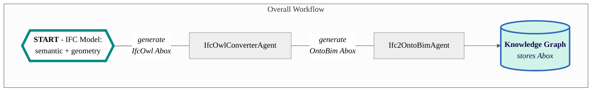

# Ifc2OntoBim Agent

This agent instantiates IFC models using the OntoBIM ontology into the specified endpoint.
It requires support from the [IfcOwlConverterAgent](https://github.com/cambridge-cares/TheWorldAvatar/tree/main/Agents/IfcOwlConverterAgent).



## Instructions
### 1. Requirements
#### 1.1 IFC File
This agent is designed to work with the [IFC2x3 TC1 schema](https://technical.buildingsmart.org/standards/ifc/ifc-schema-specifications/). IFC4 schema are not yet included.
The scope coverage is also non-exhaustive at this point, including only the relevant concepts.

Some excluded concepts are:
 - Property Sets
 - Niche Geometries
 - Material Information

Notes:
- In the IFC schema, only certain elements (IfcFurnishingElement, IfcBuildingElementProxy) are linked to their Spaces. 
Other elements are always linked to their Storey, even if there is a Space defined. 
- For all elements that are not the building structure components like walls, floors, doors, windows, roofs etc, please export them as IfcFurnishingElement or IfcBuildingElementProxy.
Otherwise, they will not be instantiated.
- Triples related to the OntoBIM:Facility concept will have to be manually instantiated as there is no equivalent concept from IFC.

#### 1.2 Technical Requirements
- Java 11
- Apache Maven 3.8+
- Docker
- At least 16GB of RAM

### 2. Building the Agent
The agent is designed for execution through a Docker container. Other deployment workflows are beyond the scope of this document.

#### 2.1 Preparation
This agent is set up to use this [Maven repository](https://maven.pkg.github.com/cambridge-cares/TheWorldAvatar/) (in addition to Maven central).
You'll need to provide  your credentials in a single-word text files located like this:
```
./credentials/
    repo_username.txt
    repo_password.txt
```

repo_username.txt should contain your Github username. repo_password.txt should contain your Github [personal access token](https://docs.github.com/en/github/authenticating-to-github/creating-a-personal-access-token),
which must have a 'scope' that [allows you to publish and install packages](https://docs.github.com/en/packages/working-with-a-github-packages-registry/working-with-the-apache-maven-registry#authenticating-to-github-packages).

#### 2.2 Docker Deployment
**TEST ENVIRONMENT**
- Deploy the agent to execute the unit and integration tests by running the following code in the CLI at the <root> directory. 
- Do note that there are two containers (for the test environment and a test RDF database), and the test will ONLY run after they are started.
- The success of all tests must be verified through the Docker logs.
```
docker compose -f "./docker/docker-compose.test.yml" up -d --build
```

**DEVELOPMENT ENVIRONMENT**
- Deploy the agent for development by running the following code in the CLI at the directory. The remote JVM endpoint for debugging will be available at port 5005.
```
docker compose -f "./docker/docker-compose.debug.yml" up -d --build
```

**PRODUCTION ENVIRONMENT**
- An image of [IfcOwlConverterAgent](https://github.com/cambridge-cares/TheWorldAvatar/tree/main/Agents/IfcOwlConverterAgent) 
will need to be first created on your local Docker environment with the credentials stored.*  
Run the following code in the CLI at the `<root>` directory of that agent:
```
docker build .
```
- Deploy the agent and its dependencies by running the following code in the CLI at the `<root>` directory:
```
docker-compose up -d
```

*WIP to transfer these Maven credentials over agents, instead of being implemented as Docker instructions

*Both development and production environment have set the default JVM Heap size to use 8GB of RAM in their respective docker-compose files. 
Check if you have sufficient technical specifications by ensuring agent is running after deployment. 
If not, please remove the environment values or set it to use less RAM.

#### 2.3 Running the Agent
The agent currently offers three API routes:
##### 2.3.1 GET ROUTE: `~url~/ifc2ontobim-agent/status` 

This route requires a GET request without any parameters, to retrieve the agent's current status. A sample request is as follows:
```
// Written in curl syntax (as one line)
curl localhost:3025/ifc2ontobim-agent/status 
```
If the agent ran successfully, a JSON Object would be returned as follows:
```
{"Result":["Agent is ready to receive requests."]}
```

##### 2.3.2 POST ROUTE: `~url~/ifc2ontobim-agent/convert`
The agent will require two inputs to convert the IFC model:

First, the IFC file should be placed at the `<root>/data/` directory. This is directly linked to the relevant directory in a Docker container. 
Only one IFC file can be instantiated and uploaded at a time.

Second, a configuration file called `config.properties` should be placed at the `<root>/config/` directory. This will contain the
configuration for:
- `sparql.query.endpoint`: The SPARQL query endpoint
- `sparql.update.endpoint`: The SPARQL update endpoint to upload the instantiated triples
- `ifc.owl.agent`: The IfcOwlConverterAgent dependency's API endpoint

###### POST request parameters
Once both inputs are ready, a POST request can be sent to this route to convert IFC models to TTL formats with the following parameter:
1. Base URI - Mandatory

This sets the base URI for all instances. Examples of valid URIs include `http://www.theworldavatar.com/ifc/` and  `https://www.theworldavatar.com/bim#`.

A default URI of `http://www.theworldavatar.com/ifc/resources_16UUID/` is also available. Please access this with a request of `"uri":"default"`.

Note that the instantiation process can be memory-intensive, and will require at least 8GB of RAM allocated for more complex IFC models. However, if your specifications
are too low, you may instantiate only the core triples, (excluding the geometry triples), by sending a POST request to `~url~/ifc2ontobim-agent/convert-no-geom`.

###### Sample POST request
Run the agent by sending a POST request with the required JSON Object to `http://localhost:3025/ifc2ontobim-agent/convert`. A sample request is as follows:
```
POST http://localhost:3025/ifc2ontobim-agent/convert
Content-Type: application/json
{"uri":"http://www.theworldavatar.com/ifc/building/"}

// Written in curl syntax (as one line)
curl -X POST --header "Content-Type: application/json" -d "{'uri':'http://www.theworldavatar.com/ifc/building/'}" localhost:3025/ifc2ontobim-agent/convert 
```

If the agent ran successfully, a JSON Object would be returned as follows, and the triples can be accessed at the specified endpoint.
```
{"Result":["IFCNAME.ifc has been successfully instantiated and uploaded to ENDPOINT"]}
```