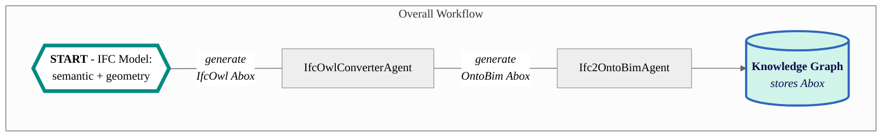

# Ifc2OntoBim Agent

This agent converts IFC files into TTL files defined by the OntoBIM ontology, and may upload them to the specified endpoint.
It requires support from the [IfcOwlConverterAgent](https://github.com/cambridge-cares/TheWorldAvatar/tree/main/Agents/IfcOwlConverterAgent).



## Instructions
### 1. Requirements
#### 1.1 IFC File
This agent is designed to work with IFC2x3 TC1 schema. IFC4 schema are not yet included. The scope coverage is also 
non-exhaustive at this point, including only the relevant concepts.

Some excluded concepts are:
 - Property Sets
 - Niche Geometries
 - Material Information

Notes:
- In the IFC schema, only certain elements (IfcFurnishingElement, IfcBuildingElementProxy) are linked to their Spaces. 
Other elements are always linked to their Storey, even if there is a Space defined.

#### 1.2 Technical Requirements
- Java 11
- Apache Maven 3.8+
- Docker


### 2. Building the Agent
The agent is designed for execution through a Docker container. Other deployment workflows are beyond the scope of this document.

#### 2.1 Preparation
This agent is set up to use this [Maven repository](https://maven.pkg.github.com/cambridge-cares/TheWorldAvatar/) (in addition to Maven central).
You'll need to provide  your credentials in a single-word text files located like this:
```
./credentials/
    repo_username.txt
    repo_password.txt
```

repo_username.txt should contain your Github username. repo_password.txt should contain your Github [personal access token](https://docs.github.com/en/github/authenticating-to-github/creating-a-personal-access-token),
which must have a 'scope' that [allows you to publish and install packages](https://docs.github.com/en/packages/working-with-a-github-packages-registry/working-with-the-apache-maven-registry#authenticating-to-github-packages).

#### 2.2 Docker Deployment
**TEST ENVIRONMENT**
- Deploy the agent to execute the unit and integration tests by running the following code in the CLI at the <root> directory:
```
docker compose -f "./docker/docker-compose.test.yml" up -d --build
```

**DEBUGGER ENVIRONMENT**
- Deploy the agent for debugging by running the following code in the CLI at the directory. The debugger will be available at port 5005.
```
docker compose -f "./docker/docker-compose.debug.yml" up -d --build
```

**PRODUCTION ENVIRONMENT**
- An image of [IfcOwlConverterAgent](https://github.com/cambridge-cares/TheWorldAvatar/tree/main/Agents/IfcOwlConverterAgent) 
will need to be first created on your local Docker environment with the credentials stored.*  
Run the following code in the CLI at the `<root>` directory of that agent:
```
docker build .
```
- Deploy the agent and its dependencies by running the following code in the CLI at the `<root>` directory:
```
docker-compose up -d
```

*WIP to transfer these Maven credentials over agents, instead of being implemented as Docker instructions

#### 2.3 Running the Agent
The agent currently offers two API routes:
##### 2.3.1 GET ROUTE: `~url~/ifc2ontobim-agent/status` 

This route requires a GET request without any parameters, to retrieve the agent's current status. A sample request is as follows:
```
// Written in curl syntax (as one line)
curl localhost:3025/ifc2ontobim-agent/status 
```
If the agent ran successfully, a JSON Object would be returned as follows:
```
{"Result":["Agent is ready to receive requests."]}
```

##### 2.3.2 POST ROUTE: `~url~/ifc2ontobim-agent/convert`
This route requires a POST request with the following parameters, to convert IFC models to TTL formats. Before attempting to
send the request, please place your IFC file into the `<root>/data/` directory. This is directly linked to the relevant directory in a Docker container.
The agent is able to convert multiple IFC files at once. However, it is unable to upload them into separate endpoints or namespaces 
at one go. 

###### POST request parameters
The route currently accepts two parameters. 
1. Base URI - Mandatory

This sets the base URI for all instances. Examples of valid URIs include `http://www.theworldavatar.com/ifc/` and  `https://www.theworldavatar.com/bim#`.

A default URI of `http://www.theworldavatar.com/ifc/resources_16UUID/` is also available. Please access this with a request of `"uri":"default"`.

2. SPARQL Endpoint - Optional

The TTL file generated will be uploaded to the namespace indicated in the endpoint (Please create this namespace). 
Do note that the upload is ONLY APPLICABLE when there is ONLY ONE IFC input. 
Multiple IFC inputs will NOT be uploaded automatically.   

Valid format: `http://IPv4ADDRESS:PORTNO/blazegraph/namespace/NAMESPACE/sparql`.
Example: `http://docker.internal.host:9999/blazegraph/namespace/ifc/sparql`.

If you do not want to upload the TTL file, do not send this parameter in the request.

###### Sample POST request
Run the agent by sending a POST request with the required JSON Object to `http://localhost:3025/ifc2ontobim-agent/convert`. A sample request is as follows:
```
POST http://localhost:3025/ifc2ontobim-agent/convert
Content-Type: application/json
{"uri":"http://www.theworldavatar.com/ifc/building/","endpoint","http://IPv4ADDRESS:PORTNO/blazegraph/namespace/ifc/sparql"}

// Written in curl syntax (as one line)
curl -X POST --header "Content-Type: application/json" -d "{'uri':'http://www.theworldavatar.com/ifc/building/','endpoint':'http://IPv4ADDRESS:PORTNO/blazegraph/namespace/ifc/sparql'}" localhost:3025/ifc2ontobim-agent/convert 
```

If the agent ran successfully, a JSON Object would be returned as follows:
```
// When endpoint is left out
{"Result":["File.ttl has been successfully converted!","All ttl files have been generated in OntoBIM. Please check the directory."]}
// Full results
{"Result":["File.ttl has been successfully converted!","File.ttl has been uploaded to endpoint","All ttl files have been generated in OntoBIM. Please check the directory."]}
```

###### Post-task
The generated TTL files can be retrieved at the `<root>/data/` directory.

If an endpoint has been provided and only ONE IFC input is provided, the triples would be uploaded to the endpoint as well.