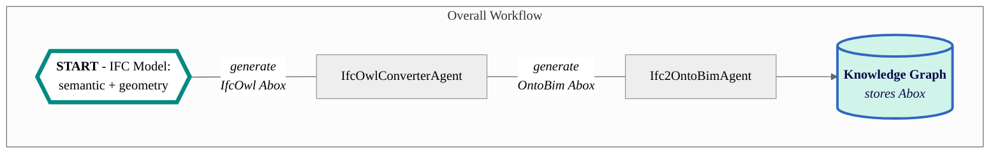

# Ifc2OntoBim Agent

The Ifc2OntoBim Agent is designed to convert Industry Foundation Classes (IFC) models into the OntoBIM ontology. This process allows for the semantic enrichment of building information models, making them more accessible and usable for various applications. This agent is designed to work within a Docker container and requires support from the [IfcOwlConverterAgent](https://github.com/cambridge-cares/TheWorldAvatar/tree/main/Agents/IfcOwlConverterAgent).

Below is a flowchart that illustrates the overall workflow of the Ifc2OntoBim Agent. It shows how an IFC model is converted into the OntoBIM ontology and stored in a knowledge graph.


## Instructions

Before you can use the Ifc2OntoBim Agent, there are some requirements you need to meet. Follow the steps below to ensure you have everything you need to successfully run the agent.

### 1. Requirements
#### 1.1 IFC File
This agent is designed to work with the [IFC2x3 TC1 schema](https://technical.buildingsmart.org/standards/ifc/ifc-schema-specifications/). IFC4 schema are not yet included.
The scope coverage is also exhaustive at this point, including only the relevant concepts.

Some excluded concepts are:
 - Property Sets
 - Niche Geometries
 - Material Information

*Address*
- In instantiating the address, please ensure the `Location` set in the Revit file follows the format: `<City, State PostalCode, Country>`.
  - Address lines should be added to the `Project Address` field on the `Project Information` settings in Revit.
  - Feel free to omit the terms as necessary for the location. Do note that if state is omitted, postal code will always be generated as state.
- For directly editing the address in the IFC file. Please search for the `IfcPostalAddress` class and edit the address accordingly. If the town or region is unnecessary, please replace them with `$` to indicate there isn't any values.
```
IFCPOSTALADDRESS($,$,$,$,('AddressLines'),$,'Town','Region','PostalCode','Country');
```

*Building Name*
- In order to include the building name, please populate the `Building Name` field on the `Project Information` settings in Revit.
- For directly editing the building name in the IFC file, please search for the `IfcBuilding` class and edit the `NAME` field accordingly. It should be the third field. Note that you may change the `LONGNAME` field as well, but this agent will only instantiate the name using the `NAME` field.
- Similarly, site, storey, and room names can be modified directly based on `IfcSite`, `IfcBuildingStorey` and `IfcSpace` respectively. Note that the `NAME` field is the representation for their names in the context of this agent.
```
IFCSITE('GlobalID',#20,'NAME',$,$,#126,$,'LONGNAME',.ELEMENT.,(RefLatitude),(RefLongitude),RefElevation,$,$);
IFCBUILDING('GlobalID',#20,'NAME',$,$,#16,$,'LONGNAME',.ELEMENT.,$,$,#100);
IFCBUILDINGSTOREY('GlobalID',#20,'NAME',$,'Object Type',#115,$,'LONGNAME',.ELEMENT.,Elevation);
IFCSPACE('GlobalID',#20,'NAME',$,$,#132,#154,'LONGNAME',.ELEMENT.,.INTERNAL.,$);
```

*Elements*
- In the IFC schema, only certain elements (`IfcFurnishingElement`, `IfcBuildingElementProxy`) are linked to their Spaces.
  Other elements are always linked to their Storey, even if there is a Space defined. 
- By default, only building structure components like walls, floors, doors, windows, roofs etc are instantiated. For all other assets, please export them as `IfcFurnishingElement`, `IfcBuildingElementProxy`, `IfcFlowSegment` or `IfcFlowTerminal`.
  Otherwise, they will not be instantiated.
- Element names are based on the `Family` type created in Revit. The naming format follows the `Family Name: Type Name: ID` convention.
  - As these values are generated by the system, please only modify the family name for the [Ifc2TilesetAgent](https://github.com/cambridge-cares/TheWorldAvatar/tree/main/Agents/Ifc2TilesetAgent) to extract the element name in the generated 3D Tilesets. Do read [this section](https://github.com/cambridge-cares/TheWorldAvatar/blob/main/Agents/Ifc2TilesetAgent/README.md#4-tips-for-bim-processing) to understand which keywords must be included to extract the element separately from the building.
  - In order to locate your element, please search for the unique Global ID of that element, and edit the corresponding family name in the third position. Do note that the agent currently processes only the following types of IfcElement classes. 
```
IFCBUILDINGELEMENTPROXY('GlobalID',#20,'Family Name:Type Name:ID',$,'Family Name:Type Name',#236416,#236408,'486119',$);
IFCFURNISHINGELEMENT('GlobalID',#20,'Family Name:Type Name:ID',$,'Family Name:Type Name',#207731,#207723,'847025');
#254518=IFCFLOWTERMINAL('GlobalID',#20,'Family Name:Type Name:ID',$,'Family Name:Type Name',#254517,#254511,'488855');
IFCFLOWSEGMENT('GlobalID',#20,'Family Name:Type Name:ID',$,'Family Name:Type Name',#387045,#387060,'614409');
```
 
*End notes*
- Triples related to the OntoBIM:Facility concept will have to be manually instantiated as there is no equivalent concept from IFC.

#### 1.2 Technical Requirements

To run the Ifc2OntoBim Agent, you'll need Java 11, Apache Maven 3.8+, Docker, and at least 16GB of RAM.

### 2. Building the Agent

The agent is designed for execution through a Docker container. Other deployment workflows are beyond the scope of this document. Follow the steps below to build and deploy the agent.

#### 2.1 Preparation
This agent is set up to use this [Maven repository](https://maven.pkg.github.com/cambridge-cares/TheWorldAvatar/) (in addition to Maven central).
You'll need to provide your credentials in a single-word text files located like this:
```
./credentials/
    repo_username.txt
    repo_password.txt
```

repo_username.txt should contain your Github username. repo_password.txt should contain your Github [personal access token](https://docs.github.com/en/github/authenticating-to-github/creating-a-personal-access-token),
which must have a 'scope' that [allows you to publish and install packages](https://docs.github.com/en/packages/working-with-a-github-packages-registry/working-with-the-apache-maven-registry#authenticating-to-github-packages).

Please note that this agent will require at least 16GB RAM due to the large size of IFC models. This has been set in the `docker-compose.yml` files of both development and production environments.
If you have less free RAM available, it is possible to set 8GB RAM for smaller IFC models. For much larger IFC models, please increase RAM allocation.
To change the memory allocation to the JVM Heap, please open the respective `docker-compose.yml` files, and update the `-Xms16g -Xmx16g` options at line 11.
`-Xms16g` refers to the minimum heap size while `-Xmx16g` represents the maximum heap size. If you are running this agent inside a stack, you will need to make this change in the stack manager input config json file (editing the docker compose file will have no effect).

#### 2.2 Docker Deployment
**TEST ENVIRONMENT**
- Deploy the agent to execute the unit and integration tests by running the following code in the CLI at the <root> directory. 
- Do note that there are two containers (for the test environment and a test RDF database), and the test will ONLY run after they are started.
- The success of all tests must be verified through the Docker logs.
```
docker compose -f "./docker/docker-compose.test.yml" up -d --build
```

**DEVELOPMENT ENVIRONMENT**
- There is no need to build and spin up the [IfcOwlConverterAgent](https://github.com/cambridge-cares/TheWorldAvatar/tree/main/Agents/IfcOwlConverterAgent) separately. 
- Deploy both agents for development by running the following code in the CLI at the directory. The remote JVM endpoint for debugging the Ifc2OntoBIM agent will be available at port 5005. There is no debug endpoint for the other agent.
- If successfully deployed, the IfcOwlConverterAgent will be running on `port 3024` and the Ifc2OntoBIMAgent will be running on `port 3025`.
```
docker compose -f "./docker/docker-compose.debug.yml" up -d --build
```

**PRODUCTION ENVIRONMENT**
- There is no need to build and spin up the [IfcOwlConverterAgent](https://github.com/cambridge-cares/TheWorldAvatar/tree/main/Agents/IfcOwlConverterAgent) separately.
- Deploy both agents and its dependencies by running the following code in the CLI at the `<root>` directory:
```
docker-compose up -d
```
- If successfully deployed, the IfcOwlConverterAgent will be running on `port 3024` and the Ifc2OntoBIMAgent will be running on `port 3025`.

**STACK DEPLOYMENT**

If you want to spin up both this agent and the IfcOwlConverterAgent as part of a stack, do the following:
- Copy the contents of `config/client.properties_stack` into `config/client.properties`, inserting the name of your stack and the desired namespaces.
- Build both images by issuing `docker compose build` in this folder. There is no need to build the IfcOwlConverterAgent separately. Do not start the containers.
- Copy the `json` file from the `stack-manager-input-config` folder of both agents into the `inputs/config/services` folder of the stack manager, adjusting the absolute path of the bind mounts as required. The `data` bind mount for both agents **MUST** be the same, ideally in the `.../stack-manager/inputs/data` directory. See [sample bind mounts](https://github.com/cambridge-cares/TheWorldAvatar/tree/main/Deploy/stacks/dynamic/stack-manager#bind-mounts) for the configuration syntax.
- Start the stack manager as usual. This should start both containers.

#### 2.3 Running the Agent
The agent currently offers three API routes:
##### 2.3.1 GET ROUTE: `~url~/ifc2ontobim-agent/status` 

This route requires a GET request without any parameters, to retrieve the agent's current status. A sample request is as follows:
```
// Written in curl syntax (as one line)
curl localhost:3025/ifc2ontobim-agent/status 
```
If the agent ran successfully, a JSON Object would be returned as follows:
```
{"Result":["Agent is ready to receive requests."]}
```

##### 2.3.2 POST ROUTE: `~url~/ifc2ontobim-agent/convert`
The agent will require two inputs to convert the IFC model:

First, the IFC file should be placed at the `<root>/data/` directory. This is directly linked to the relevant directory in a Docker container. 
Only one IFC file can be instantiated and uploaded at a time.

Second, a configuration file called `config.properties` should be placed at the `<root>/config/` directory. This will contain the
configuration for:
- `sparql.query.endpoint`: The SPARQL query endpoint
- `sparql.update.endpoint`: The SPARQL update endpoint to upload the instantiated triples
- `ifc.owl.agent`: The IfcOwlConverterAgent dependency's API endpoint. This should not be edited from the default.

**WARNING**: Any TTL files generated or used as inputs in the `<root>/data/` directory will be deleted after the agent has completed the instantiation and upload task. Do note that no OntoBIM ABox is generated as a TTL file any time during the process. In the event that there is any leftover TTL file(s), please do not treat it as an OntoBIM ABox and rerun the agent instead.

###### POST request parameters
Once both inputs are ready, a POST request can be sent to this route to convert IFC models to TTL formats with the following parameter:
1. Base URI - Mandatory

This sets the base URI for all instances. Examples of valid URIs include `http://www.theworldavatar.com/ifc/` and  `https://www.theworldavatar.com/bim#`.

A default URI of `http://www.theworldavatar.com/ifc/resources_16UUID/` is also available. Please access this with a request of `"uri":"default"`.

Note that the instantiation process can be memory-intensive, and will require at least 8GB of RAM allocated for more complex IFC models. However, if your specifications
are too low, you may instantiate only the core triples, (excluding the geometry triples), by sending a POST request to `~url~/ifc2ontobim-agent/convert-no-geom`.

2. Boolean for running ifcOwl conversion - Optional

In situations where this agent's request to the `IfcOwlConverterAgent` time-outs and ends the task, this parameter becomes crucial and mandatory. By default, please ignore this parameter in the POST request.
The `isIfcOwl` parameter sets a boolean that determines whether the agent should instantiate directly from an IFC model or a TTL file generated by the [IfcOwlConverterAgent](https://github.com/cambridge-cares/TheWorldAvatar/tree/main/Agents/IfcOwlConverterAgent).

If this parameter is set to `true`, please convert the IFC model into a TTL file containing the IfcOwl ABox via the [IfcOwlConverterAgent](https://github.com/cambridge-cares/TheWorldAvatar/tree/main/Agents/IfcOwlConverterAgent) first. The IFC model can be placed into this agent's `data` folder, before sending the required POST request to the IfcOwlConverter Agent.
Then place only the TTL file into this agent's `data` directory, and send the POST request following the next section. Please do note that the TTL file containing the IfcOwl ABox will be deleted after the conversion and upload process.

###### Sample POST request
Run the agent by sending a POST request with the required JSON Object to `http://localhost:3025/ifc2ontobim-agent/convert`. A sample request is as follows:
```
POST http://localhost:3025/ifc2ontobim-agent/convert
Content-Type: application/json
{"uri":"http://www.theworldavatar.com/ifc/building/"}

// Written in curl syntax (as one line)
curl -X POST --header "Content-Type: application/json" -d '{"uri":"http://www.theworldavatar.com/ifc/building/"}' localhost:3025/ifc2ontobim-agent/convert 

// Only when you require the 'isIfcOwl' boolean
curl -X POST --header "Content-Type: application/json" -d '{"uri":"http://www.theworldavatar.com/ifc/building/", "isIfcOwl":true}' localhost:3025/ifc2ontobim-agent/convert 
```

If running the agent within a stack, e.g.:
```
curl -X POST --header "Content-Type: application/json" -d '{"uri":"http://www.theworldavatar.com/ifc/building/", "isIfcOwl":true}' http://localhost:3838/ifc2ontobim-agent/convert
```

If the agent ran successfully, a JSON Object would be returned as follows, and the triples can be accessed at the specified endpoint.
```
{"Result":["IFCNAME.ifc has been successfully instantiated and uploaded to ENDPOINT"]}
```
