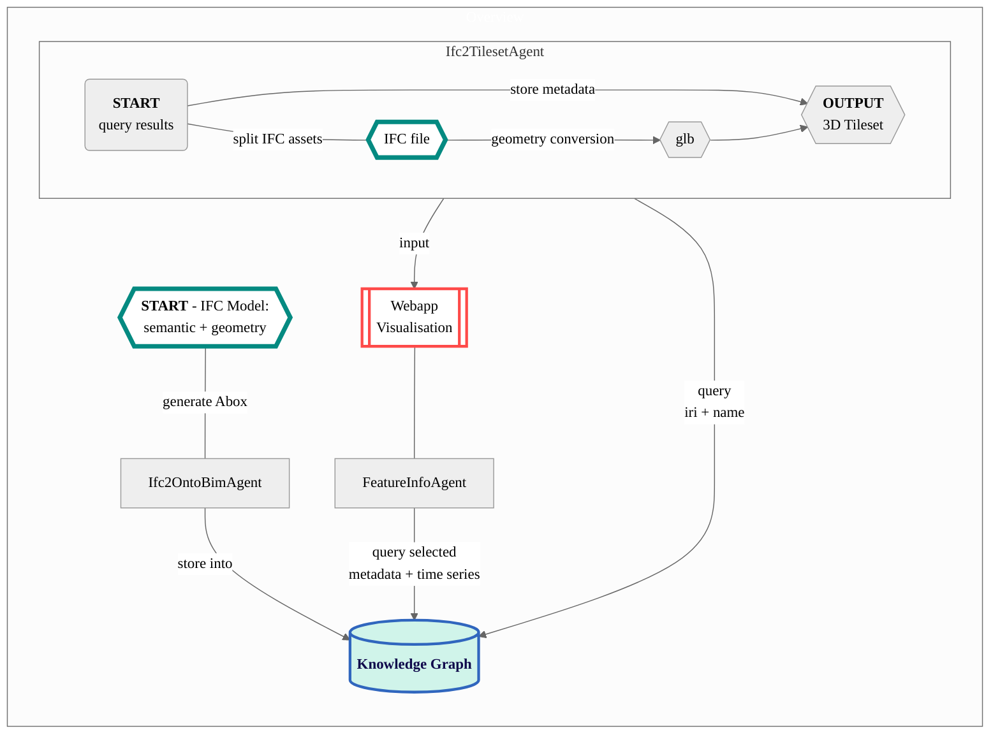

# IFC2Tileset Agent

## Description
This agent queries and processes the IFC data stored on a knowledge graph into the [3D Tiles Next](https://github.com/CesiumGS/3d-tiles/tree/main/next) specifications for visualisation in Cesium.
Before running this agent, the IFC model **MUST** be instantiated with the [Ifc2OntoBim agent](https://github.com/cambridge-cares/TheWorldAvatar/tree/main/Agents/Ifc2OntoBIMAgent). Please ensure that the IFC model has been preprocessed according to the [Tips for BIM processing](#4-tips-for-bim-processing) section. Tilesets and their geometry (`glb`) files will be generated in the output `data` directory.

A brief description of the workflow can be found below:
1. Instantiate the semantic and geometry data in IFC models using the [Ifc2OntoBim agent](https://github.com/cambridge-cares/TheWorldAvatar/tree/main/Agents/Ifc2OntoBIMAgent).
2. Queries the metadata (IFC uid, asset name, data IRI) of relevant assets from a specified endpoint.
3. Split the geometries in the IFC model based on these metadata into their individual assets (if necessary).* These are then converted into glb models that are stored locally.
4. 3D Tilesets are generated for the building, solar panels, and sewerage network (if they exist). The building tileset are supplemented with the queried asset and building metadata (if any). Root content metadata can also be added through the use of optional parameters.

**At the moment, this agent is unable to process the geometry data queried from the knowledge graph, and will require the same IFC model file as an input to create the geometry files.*



# Instructions
## 1. Building the agent
The agent is designed for deployment on [Docker](#12-docker-deployment). Although it can be deployed within a local development environment, this is not the recommended setup. 

### 1.1 Required dependencies:
These dependencies have been added to the Dockerfile. But in the event there is a need to update their links, please read the steps below on how to find and extract the dependencies.
1. **IfcOpenShell**
    - Required to load and parse IFC files
    - Download required version from https://blenderbim.org/docs-python/ifcopenshell-python/installation.html
    - Extract and place the `ifcopenshell` from `blenderbim/libs/site/packages/` to the `\Lib\site-packages` of either your temporary python environment `venv` or the python program
    - Delete the remaining extracted content
2. **IfcConvert.exe**
    - Required to convert IFC to glb format
    - Download IfcConvert.exe from: https://blenderbim.org/docs-python/ifcconvert/installation.html
    - Extract it to `<root>`

### 1.2 Docker Deployment:
**TEST ENVIRONMENT**
- Deploy the agent to execute the unit and integration tests by running the following code in the CLI at the `<root>` directory:
```
docker compose -f "./docker/docker-compose.test.yml" up -d --build 
```
- Verified that all tests have passed by looking at the container logs 
-- Container must be built (regardless of failure) to ensure services are running for tests.

**DEVELOPMENT ENVIRONMENT**
- Deploy the agent for development by running the following code in the CLI at the `<root>` directory. Developers can attach the debugger running at port 5678.
```
docker compose -f "./docker/docker-compose.debug.yml" up -d --build 
```
- **Visual Studio Code**: 
    - Developers will navigate to the `Run and Debug` tab and click the button. 
    - If there is a missing launch.json, please open the `Command Palette` in any `.py` file, and run “Debug: Start Debugging”. Choose “Remote Attach”, and select `localhost` and `5678` as host and port. This should create a file at `<root>/.vscode/launch.json`
    - Once the container has been built and the `launch.json` is available, click the green arrow at the top left corner to run the debugger. Debugging capabilities should now be available.

**PRODUCTION ENVIRONMENT**
- Deploy the agent and its dependencies by running the following code in the command prompt at the `<root>` directory:
```
docker-compose up -d 
```

**STACK DEPLOYMENT**
If you want to spin up this agent as part of a stack, do the following:
- Build the image by issuing `docker compose build` in this folder. Do not start the container.
- Copy the `json` file from the `stack-manager-input-config` folder into the `inputs/config/services` folder of the stack manager, adjusting the absolute path of the bind mounts as required. 
    - Do note that this agent requires the `data` bind mount to have a nested `ifc` and `glb` folder, where the IFC model must be placed in the `ifc` folder. It is not recommended to target the same bind mount as the other IFC agents.
    - The `config` bind mount MUST have a `properties.yaml` containing the contents of `config/properties.yaml_stack`. Please edit the contents with the name of your stack and desired namespaces.
- Start the stack manager as usual. This should start the container.

## 2. Running the agent
### 2.1 Precursor
Place only one IFC file in `<root>\data\ifc\`. This directory is directly linked to the relevant directory in the Docker container. The agent is only able to convert ONE IFC model at a time.

Please modify the following properties in `config/properties.yaml`:
- `query_endpoint`^ : SPARQL endpoint for Query operations
- `update_endpoint`^ : SPARQL endpoint for UPDATE operations
^*Endpoints are required to query for metadata in tileset and interactions during visualisation*

In `config/properties.yaml`, there are also optional properties for appending IRI and name for the solar panel or sewage tileset. If required, please ensure both IRI and name are populated for the corresponding tileset. When not in use, please leave an empty string.
- bim_tileset_iri* : IRI appended to default tileset generated
- bim_tileset_name* : Name appended to default tileset generated
- solar_panel_tileset_iri
- solar_panel_tileset_name
- sewage_tileset_iri
- sewage_tileset_name

**Note that this will be ignored if there are no root contents or a `building.glb` is generated. When there is a `building.glb`, the corresponding building instance and name in the Knowledge Graph will take precedence. If the building name is NOT available, NO name will be appended to the tileset. Please check the [Ifc2OntoBim agent's documentation](https://github.com/cambridge-cares/TheWorldAvatar/tree/main/Agents/Ifc2OntoBIMAgent) to add the building name.*

If you are deploying this on the stack, ensure that your `properties.yaml` and IFC file is placed at the corresponding bind mount location. A sample stack-based properties is available in `config/properties.yaml_stack` but requires editing for the name of your stack, desired namespaces, and optional IRIs or names.

### 2.2 API
Instructions for the agent and its various API routes can be found at the API root `http://localhost:5105/`. Users can visit this route in any browser to verify if the agent is running.

A brief overview is as follows:
- **POST** request to convert an IFC model to 3D Tileset, and output tileset.json files. Accepted parameters:
    1. `assetUrl`  
    - Sets the file path to directory or url holding the glb assets in the tilesets generated.
    - Valid formats include `"."`, `"./file/path"`, `"../../file/path"`, and `"http://www.example.com"`. Please do not add an ending `/`, which will be generated in the code itself.

```
/api
```

### 2.3 POST Request
Run the agent by sending a POST request with the required JSON Object to the necessary endpoint. A sample request in `curl` syntax is as follows:
```
curl -X POST localhost:5105/api -H 'Content-Type: application/json' -d '{"assetUrl":"./glb"}'  

# For VSCode's powershell, please append \ to the " for parameters
curl -X POST localhost:5105/api -H 'Content-Type: application/json' -d '{\"assetUrl\":\"./glb\"}'  
```

If running the agent within a stack:
```
curl -X POST --header "Content-Type: application/json" -d '{"assetUrl":"./glb"}' http://localhost:3838/ifc2tileset-agent/api
```

If the agent ran successfully, a JSON Object would be returned as follows:
```
{"Result":["IFC model has successfully been converted. Please visit the 'data' directory for the outputs"]}
```

## 3. For Developers
The agent have been packaged into the following submodules:
- `agent/app.py` is the agent's entry point that accepts and processes all HTTP requests
- `agent/config` contain functions to retrieve the properties in `config/properties.yaml`
- `agent/exceptions` contain the exceptions encountered in this agent
- `agent/kgutils` contain miscellaneous functions to access and query the Knowledge graph
- `agent/utils` contain miscellaneous functions for searching, validating inputs, and system operations
- `agent/ifc2gltf` contain functions to query the metadata, and process the IFC input into their individual geometry files for each asset
- `agent/ifc2tileset` contain functions to generate the tileset and write them to json

As Git does not allow empty directories, `.gitignore` files have been added to the subdirectories  of `<root>\data\`. This is important to set up the file structure for the code to run. 

## 4. Tips for BIM processing
> Building name
- In order to include the building name within the tileset, please ensure that a building name has been added in the IFC file before running the [Ifc2OntoBim agent](https://github.com/cambridge-cares/TheWorldAvatar/tree/main/Agents/Ifc2OntoBIMAgent).
- In Revit, you may add this information in the `Projection Information` under the `Manage` tab
    - In the pop-up box, add your desired name to the `Building Name` field.

>Geo-referencing
- Do not move the Project Base Point or Survey Point when creating a new Revit file
    - Do not attempt to add any georeferenced point in the physical model, except as a parameter of a property set
    - If the file has already shifted these points, you will need to manually reset them close to 0,0,0 and attempt to shift the model to that position
        - EITHER *create a new file, and copy and paste the contents as group*
            - You may need to transfer project standards under the Manage Tab
        - OR *move the content directly and altering the point coordinates*
- During the conversion into 3D Tiles format, the IFC coordinate systems are currently not properly translated into Cesium's CRS (Coordinate Reference System). Any attempt to place the tileset into the actual coordinate is likely incorrect, and requires further workaround. 
- Thus, it is recommended to exclude geolocation information in the IFC model, and include them directly through Cesium 

>Material Display
- For exports to IFC, only materials viewable in `Visual Style: Shaded` will appear. Other material information is not retained
- Visit the `Material Browser` under the `Manage` tab -> `Materials`,
    - Check the following option if you want the visuals to look like the render: `Graphics` -> `Shading` -> `Use Render Appearance`
    - If not, do not check the option, and select your own color or transparency
- To create your own custom material, duplicate any existing material, rename the copy, unlink them to other copies, and change the options
- Have yet to test how materials using images can work, and might require additional files and complexity

>Classifying the furniture and building element appropriately
- Determine the purpose of an asset 
    - Picking individual asset to get their meta data in pop-ups
    - Merely a background element
- Selecting individual assets' names
    - Their names must include the following supported words:
        - Sensors
        - Meters
        - Weather Station
        - Solar Panels
        - Fridge
    - For new asset types, please include their name into `classify_filename()` at `agent/ifc2gltf/kghelper.py`
    - Do not include their name if they are supposed to be a background element

>Classifying the solar panel
- In generating a tileset holding solar panel, the relevant assets must include the "Solar Panel" keywords
- Do note that when the keyword is included in the asset name, the corresponding asset will NOT be attached to other tilesets.

>Classifying the sewage network
- In generating a tileset for the sewage network, the relevant assets must include the following supported keywords:
    - Sewage (for pipes)
    - Manhole
- Do note that when these keywords are included in the asset name, the corresponding asset will NOT be attached to other tilesets.