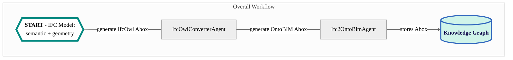

# IfcOwlConverter Agent

This agent converts IFC models into TTL files defined by the IfcOwl ontology. It is designed to support the 
[Ifc2OntoBIM Agent](https://github.com/cambridge-cares/TheWorldAvatar/tree/main/Agents/Ifc2OntoBIMAgent) to instantiate IFC models into the ontoBim Abox, and is NOT intended to be run independently. Although you can build the image and container for this agent individually, there is no need to do so. Please proceed directly to the [Ifc2OntoBIM Agent](https://github.com/cambridge-cares/TheWorldAvatar/tree/main/Agents/Ifc2OntoBIMAgent) to instantiate and store your IFC Abox. If you are following the instructions of the Ifc2OntoBIM Agent, ignore any of these instructions here; they are not applicable.



## Instructions
### 1. Requirements
#### 1.1 IFC Model
An IFC file must be placed in the `data` directory. It must conform to the [BuildingSmart's technical specifications](https://technical.buildingsmart.org/standards/ifc/ifc-schema-specifications/).

#### 1.2 Technical Requirements
- Java 11
- Apache Maven 3.8+
- Docker
- [IFCtoRDF](https://github.com/pipauwel/IFCtoRDF)
  - The agent uses the Maven library, which requires specific (outdated) versions of their dependencies.

### 2. Building the Agent
The agent is designed for execution through a Docker container. Other deployment workflows are beyond the scope of this document.

#### 2.1 Preparation
This agent is set up to use this [Maven repository](https://maven.pkg.github.com/cambridge-cares/TheWorldAvatar/) (in addition to Maven central).
You'll need to provide  your credentials in a single-word text files located like this:
```
./credentials/
    repo_username.txt
    repo_password.txt
```

repo_username.txt should contain your Github username. repo_password.txt should contain your Github [personal access token](https://docs.github.com/en/github/authenticating-to-github/creating-a-personal-access-token),
which must have a 'scope' that [allows you to publish and install packages](https://docs.github.com/en/packages/working-with-a-github-packages-registry/working-with-the-apache-maven-registry#authenticating-to-github-packages).

#### 2.2 Docker Deployment
**TEST ENVIRONMENT**
- Deploy the agent to execute the unit and integration tests by running the following code in the CLI at the <root> directory:
```
docker compose -f "./docker/docker-compose.test.yml" up -d --build
```

**DEBUGGING**
- Deploy the agent for debugging by running the following code in the CLI at the <root> directory. The debugger will
be available at port 5005.
```
docker compose -f "./docker/docker-compose.debug.yml" up -d --build
```

**PRODUCTION ENVIRONMENT**
- Deploy the agent and its dependencies by running the following code in the CLI at the `<root>` directory:
```
docker-compose up -d
```

#### 2.3 Running the Agent
##### 2.3.1 Precursor
Place your IFC file(s) into the `<root>/data/` directory. This is directly linked to the relevant directory in a Docker container. The agent is able to convert multiple IFC files at once. 

##### 2.3.2 POST Request Parameters
The agent currently accepts one parameter. 
1. Base URI - Mandatory

This sets the base URI for all instances. Examples of valid URIs include `http://www.theworldavatar.com/ifc/` and  `https://www.theworldavatar.com/bim#`.

A default URI of `http://www.theworldavatar.com/ifc/resources_16UUID/` is also available. Please access this with a request of `"uri":"default"`.


##### 2.3.3 POST Request
Run the agent by sending a POST request with the required JSON Object to `http://localhost:3024/ifcowlconverter/`. A sample request is as follows:
```
POST http://localhost:3024/ifcowlconverter/
Content-Type: application/json
{"uri":"default"}

// Written in curl syntax (as one line)
curl -X POST --header "Content-Type: application/json" -d "{'uri':'default'}" http://localhost:3024/ifcowlconverter/
```

If the agent ran successfully, a JSON Object would be returned as follows:
```
{"Result":["IfcOwl conversion is successfully completed!"]}
```

#### 2.4 Post-Build
The generated TTL files can be retrieved at the `<root>/data/` directory.
