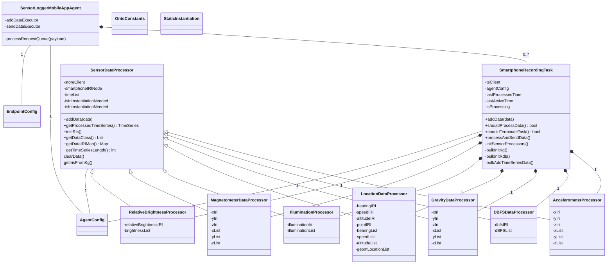

# SensorLoggerMobileAppAgent
## 1. Description
The SensorLoggerMobileAppAgent is an agent which receives HTTP POST requests containing JSON payload sent from the [SensorLogger](https://github.com/tszheichoi/awesome-sensor-logger) mobile application, subsequently instantiate it as time series following the [OntoDevice](https://github.com/cambridge-cares/TheWorldAvatar/tree/main/JPS_Ontology/ontology/ontodevice) ontology. The information instantiated from SensorLogger includes: Smartphone device, Acceleration vector, Gravity vector, Magnetic flux density vector, Sound pressure level, Illuminance, Relative brightness, Location. 

The agent functions as below:
1) The agent receives JSON payload from the SensorLogger and parse the received JSON Array.
2) It downsamples the received timeseries data via the [Downsampling](https://github.com/cambridge-cares/TheWorldAvatar/tree/main/core/downsampling) library, and instantiates the data using the [TimeSeriesClient](https://github.com/cambridge-cares/TheWorldAvatar/tree/main/JPS_BASE_LIB/src/main/java/uk/ac/cam/cares/jps/base/timeseries). 
3) The [OntoDevice](https://github.com/cambridge-cares/TheWorldAvatar/tree/main/JPS_Ontology/ontology/ontodevice) triples are instantiated in Ontop.

### 1.1 Concurrency Design
The agent manages a phone ID to recording task map, where each phone ID will have a corresponding recording task. The recording task is responsible for sensor data processing, knowldge graph instantiation and postgres table initiation and data upload. Each recording task has different types of sensor processors, which are responsible for the sensor IRI query and generation, downsampling and data formulation for individual types. The following class diagram highlight the relations between class and omit some details of some classes for simlicity.



To handle multi-user cases, this agent implements a task queue and thread pool model for concurrent processing. Tasks are managed by the agent. There are four types of thread used by the agent:
- Agent Main thread: The main thread is used to receive requests from clients. When a request is sent to the agent, this thread checks the validaty of the request, submit an 'Add Data' task to the 'Add Data Thread' pool and return to the request to the client. This thread **should not be used for any heavy task** to ensure fast response to clients.
- Agent Timer Thread: This thread wakes up every certain time duration to checks whether the SmartphoneRecordingTask should be processed by comparing `lastProcessedTime` and the current time. If the SmartphoneRecordingTask should be processed, this thread will submit a 'Send Data' task to the 'Send Data Thread Pool'. This task **should not be used for any heavy task** and only used for scanning the tasks map. 
- Add Data Thread Pool: This thread pool will attend to 'Add Data' tasks, which processes the raw data from request and add the data to the corresponding SmartphoneRecordingTask, whenever there is free thread available in the pool. The default number of threads in the pool is 5.
- Send Data Thread Pool: This thread pool will attend to 'Send Data' tasks, which performs data downsampling on vaious types of sensor data based on the configuration and bulk initialization, KG instantiation and upload of sensor data, whenever there is free thread available in the pool. The default number of threads in the pool is 5.

The recording task uses three states `lastProcessedTime`, `lastActiveTime` and `isProcessing` to control the process. 
- `lastProcessedTime`: This state is used to control the rate of performing data downsample and writing to postgres database
- `lastActiveTime`: This state monitors whether there were data received from a phone in a duration of time. If there isn't any data from the device, the agent will terminate the task for the device.
- `isProcessing`: If this task is already been processing by a 'Send Data' thread, other 'Send Data' threads should skip this task.

The following chart shows an example when 
- phone3 sends request to the agent and the main thread create a task for the Add Data Pool
- Timer thread wakes up and is checking whether should process the `SmartphoneRecordingTask`s. It finds that SmartphoneRecordingTask 2 needs to be processed and is creating the relevant task to the Send Data Pool.


## 2. Pre-requisites
### 2.1 SensorLogger mobile application setup 
The SensorLogger mobile application can downloaded either from [GooglePlay](https://play.google.com/store/apps/details?id=com.kelvin.sensorapp&hl=en&gl=US) or [IOS](https://apps.apple.com/us/app/sensor-logger/id1531582925), depending on the operating mobile OS. The steps to configure the endpoints in SensorLogger mobile app can be found [here](https://github.com/tszheichoi/awesome-sensor-logger#Live-Data-Streaming), which is summarized as below:
1) Enable HTTP PUSH under settings 
2) Specify PUSH URL following `http://<LOCAL-URL>:3838/sensorloggermobileappagent/update`
3) Replace `<LOCAL-URL>` with the same network connected from both your local environment and your phone. `<LOCAL-URL>` can be obtained from the IPv4 Address under Wireless LAN adapter Wi-Fi of your server by running `ipconfig` on command prompt.

## 3. Agent Configuration 
#### Downsampling frequency
The downsampling method and frequency for the different measurements can be configured in [config.properties](sensorloggermobileappagent/src/main/resources/config.properties).
- `DSResolution` sets the time interval in seconds of the timeseries data to be downsampled.
- `DStype` refers to the downsampling method used which the enum types can be found [here](https://github.com/cambridge-cares/TheWorldAvatar/tree/main/core/downsampling#downsampling-type). 

#### Timer Delay and Timer Frequency
- `timerDelay` sets the initial time delay in seconds before the first timeseries instantiation.
- `timerFrequency` sets the time in seconds between each subsequent timeseries instantiation.
- `taskInactiveTime` sets the time in seconds to remove a `SmartPhoneRecording` task when it no longer receives data from the corresponding device.

## 4. Deploy 
### 4.1 Retrieving SensorLoggerMobileAppAgent's image
The SensorLoggerMobileAppAgent should be pulled automatically with the stack-manager, if not you can pull the latest version from [cambridge_cares package](https://github.com/orgs/cambridge-cares/packages/container/package/sensorloggermobileappagent) using `docker pull ghcr.io/cambridge-cares/sensorloggermobileappagent:<LATEST-VERSION>`

### 4.2 Starting with the stack-manager
The agent has been implemented to work in the stack, which requires the SensorLoggerMobileAppAgent Docker container to be deployed in the stack. To do so, place [sensorloggermobileappagent.json](stack-manager-config/inputs/config/services/sensorloggermobileappagent.json) in the [stack-manager config directory].

Then, run `./stack.sh start <STACK NAME>` in the [stack-manager] main folder. This will spin up the agent in the stack.

### 4.3 Configuring AccessAgent endpoints 
On this same directory run, replace `STACK-NAME` with your stack-manager name.
```
./copy.sh start <STACK-NAME>
```

### 4.4 Start recording
Once all the configurations and server has been set, press the Start Recording button inside the SensorLogger mobile app to begin session. 

## 5. Build and debug
## 5.1 Credentials
The docker image uses TheWorldAvatar maven repository (`https://maven.pkg.github.com/cambridge-cares/TheWorldAvatar/`).
You will need to provide your credentials (GitHub username/personal access token) in single-word text files as follows:
```
./credentials/
        repo_username.txt
        repo_password.txt
```

### 5.2 Building Docker Image
In the same directory as this README, run `./stack.sh build`. This will build the SensorLoggerMobileAppAgent local Docker Image. 

### 5.2 Spinning up with stack-manager
To debug the agent, replace [`sensorloggermobileappagent-debug.json`](stack-manager-config/inputs/config/services/sensorloggermobileappagent-debug.json) instead of [`sensorloggermobileappagent.json`](stack-manager-config/inputs/config/services/sensorloggermobileappagent.json) in the [stack-manager config directory]. 

Spin up with `./stack.sh start <STACK NAME>` in the [stack-manager]'s main folder.
The debugger port will be available at 5005.

### 5.3 Testing resources
You may use the [SamplePOST request](sensorloggermobileappagent/src/main/resources/SamplePOST.http) for testing any changes made to the code, this HTTP request contains a sample of the recording for testing purposes.

[stack-manager]: https://github.com/cambridge-cares/TheWorldAvatar/tree/main/Deploy/stacks/dynamic/stack-manager
[stack-manager config directory]: https://github.com/cambridge-cares/TheWorldAvatar/tree/main/Deploy/stacks/dynamic/stack-manager/inputs/config/services