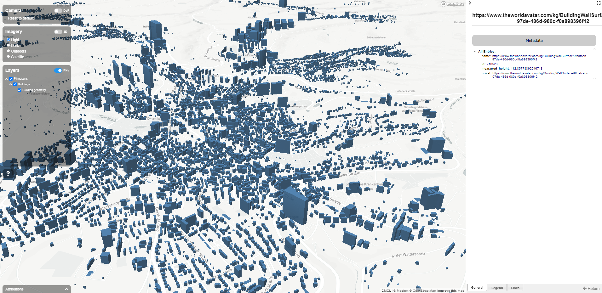

# Pirmasens Flood Routing Digital Twin Visualisation Framework (DTVF)

This visualization serves as a proof of concept for visualization of buildings, routing use cases in Pirmasens

The instantiated data is visualised using the Digital Twin Visualisation Framework ([DTVF]) version `3.3.4`. The configuration file structure (i.e. `data.json`) is based on the [example Mapbox visualisation].




## Creating the Visualisation
### Prerequisite
A valid Mapbox API token must be provided in your `index.html` file.

```
# To build the Image:
docker-compose -f ./docker/docker-compose.yml build --force-rm

# To generate a Container (i.e. run the Image):
docker-compose -f ./docker/docker-compose.yml up -d --force-recreate
```

<!-- Links -->
[DTVF]: https://github.com/cambridge-cares/TheWorldAvatar/wiki/Digital-Twin-Visualisations
[example Mapbox visualisation]: https://github.com/cambridge-cares/TheWorldAvatar/tree/main/web/digital-twin-vis-framework/example-mapbox-vis
[FeatureInfoAgent]: https://github.com/cambridge-cares/TheWorldAvatar/tree/main/Agents/FeatureInfoAgent

<!-- repositories -->
[FeatureInfoAgent subdirectory]: /DTVF/FeatureInfoAgent
[FeatureInfoAgent queries]: FeatureInfoAgent/queries
[DTVF subdirectory]: /DTVF
[icons]: /DTVF/data/icons
[index.html]: index.html
[data.json]: /DTVF/data.json