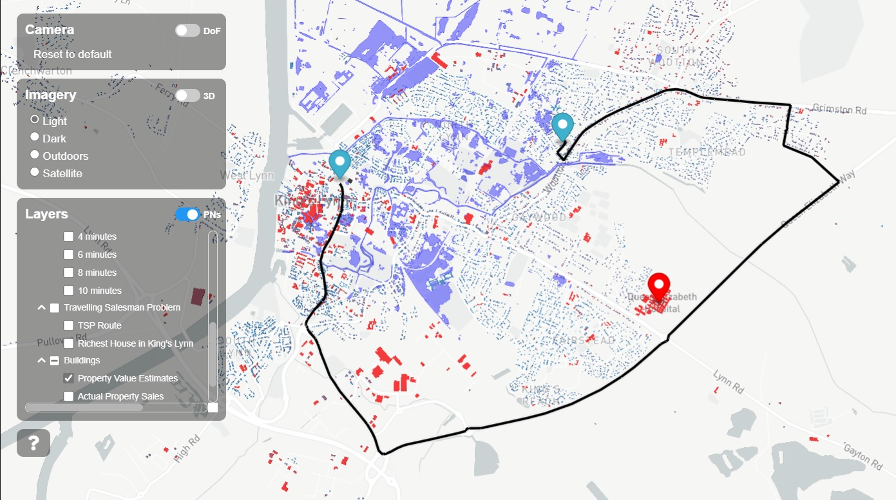

# Singapore Digital Twin Visualisation Framework (DTVF)

This visualization serves as a proof of concept for routing avoiding the roadworks, accidents.

The instantiated data is visualised using the Digital Twin Visualisation Framework ([DTVF]) version `3.3.4`. The configuration file structure (i.e. `data.json`) is based on the [example Mapbox visualisation].




## Important Pre-requisites
### Raw OSM data
1) [BBBike.org](https://extract.bbbike.org/) allows you to extract selected region. 
2) [Geofabrik](https://download.geofabrik.de/) allows you to download OSM data via region/country 

Note: 
Downloading cropped map from BBBike.org is currently the best option. If OSM map data is downloaded from Geofabrik and subsequently cropped by using tool such as osmium or osmium will result in leaving out certain nodes, subsequently when imported via osm2pgrouting will lead to invisible/non-existent road.

### Upload the map data to the stack
1) [Stack-manager](https://github.com/cambridge-cares/TheWorldAvatar/tree/808-add-pgrouting-dataset-type-to-stack-data-uploader/Deploy/stacks/dynamic/stack-data-uploader) has to be running. 
2) Upload the `.osm` data using [stack-data-uploader](https://github.com/cambridge-cares/TheWorldAvatar/tree/808-add-pgrouting-dataset-type-to-stack-data-uploader/Deploy/stacks/dynamic/stack-data-uploader) to the same stack. 


## Creating the Visualisation
### Prerequisite
A valid Mapbox API token must be provided in your [index.html].

### Setting up SQL View
Configure new SQL view in Geoserver as a new layer.
- Under `Layers` tab, select `Add layer from: YOUR-STORE`
- Select `Configure new SQL View` 

#### Nearest_vertex
```
SELECT
  v.id,
  v.the_geom
FROM
  routing_ways_vertices_pgr AS v,
  routing_ways AS e
WHERE
  v.id = (SELECT
            id
          FROM routing_ways_vertices_pgr
          ORDER BY the_geom <-> ST_SetSRID(ST_MakePoint(%lon%, %lat%), 4326) LIMIT 1)
  AND (e.source = v.id OR e.target = v.id)
GROUP BY v.id, v.the_geom
```

- Guess new parameters, specify any numbers for the default value.
- Deselect Escape special SQL characters. 
- Validataion regular expression `^[\d\.\+-eE]+$`
- Geometry type: Point
- Change SRS to EPSG:4326
- Specify Bounding Boxes MinX:-180, MinY:-90, MaxX:180,MaxY:90 for both fields.
- Ensure Tile Image Formats: application/json;type=geojson is enabled under `Tile Caching` 

#### Shortest_paths
```
SELECT
min(r.seq) AS seq,
e.gid AS id,
sum(e.cost) AS cost,
ST_Collect(e.the_geom) AS geom 
FROM pgr_dijkstra('SELECT gid as id, source, target, cost_s as cost, reverse_cost_s   as reverse_cost FROM routing_ways WHERE routing_ways.tag_id IN (100, 101, 102, 103, 104, 105, 106, 107, 108, 109, 110, 111, 112, 113, 115, 116, 121, 123, 124, 125, 401)',%source%,%target%,false) AS r,routing_ways AS e WHERE r.edge=e.gid GROUP BY e.gid
```

- Guess new parameters, specify any numbers for the default value.
- Specify any numbers for the default value 
- Deselect Escape special SQL characters. 
- Validataion regular expression `^[\d]+$`
- Geometry type: Multi-Line String. 
- Change SRS to EPSG:4326
- Specify Bounding Boxes MinX:-180, MinY:-90, MaxX:180,MaxY:90 for both fields.
- Ensure Tile Image Formats: application/json;type=geojson is enabled under `Tile Caching` 

Both of the steps above, create SQL views as a layers. Based on the endpoints of this SQL view, modify the geojson endpoint in [index.html] as accordingly. 

### Road Display
```
SELECT w.name, w.length_m, c.tag_value AS road_type, w.oneway, w.maxspeed_forward, w.maxspeed_backward,  w.the_geom
FROM routing_ways w
JOIN configuration c ON w.tag_id = c.tag_id
```

Based on the endpoints of this SQL view, modify the geojson endpoint in [data.json] as accordingly. 

### Spinning up the DTVF
```
# To build the Image:
docker-compose -f ./docker/docker-compose.yml build --force-rm

# To generate a Container (i.e. run the Image):
docker-compose -f ./docker/docker-compose.yml up -d --force-recreate
```

Do take note to use incognito mode to open the browser to prevent any caching. 


<!-- Links -->
[DTVF]: https://github.com/cambridge-cares/TheWorldAvatar/wiki/Digital-Twin-Visualisations
[example Mapbox visualisation]: https://github.com/cambridge-cares/TheWorldAvatar/tree/main/web/digital-twin-vis-framework/example-mapbox-vis
[FeatureInfoAgent]: https://github.com/cambridge-cares/TheWorldAvatar/tree/main/Agents/FeatureInfoAgent

<!-- repositories -->
[FeatureInfoAgent subdirectory]: /DTVF/FeatureInfoAgent
[FeatureInfoAgent queries]: FeatureInfoAgent/queries
[DTVF subdirectory]: /DTVF
[icons]: /DTVF/data/icons
[data.json]: /DTVF/data.json
[index.html]: /webspace/index.html