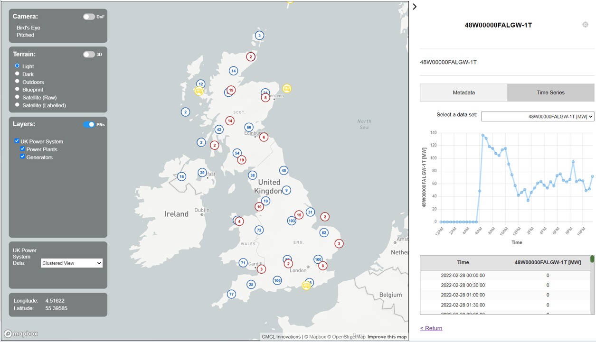

# UK Power Generation Analysis Tool #

## Generic Description ##

This tool retrieves generation data for UK generation units. These units are also mapped to stations, and are consistent between the BMRS and DUKES data sources.

## Data Source ##

This script imports data from the BMRS (<https://www.bmreports.com/bmrs/?q=eds/main>) which includes information on the output of generation units.

## Visualisation ##

Following the successful execution of the tool, you will view a visualisation identical to the one below.

## Tool Execution Details ##

'generation_data_importer.py', 'generate_visualisation_data.py' are the main scripts, but to run this locally from scratch there are a number of steps.

## Steps to run ##

1. Copy external files:
Copy to this folder all files from path: 'Dropbox (Cambridge CARES)\IRP3 CAPRICORN shared folder\_JPS Development\data\ukpowergeneration\COPY_FILES'
So 'Input-Template-Auto.csv' and 'LocalOnlyBMRSKey.txt' should both be copied to the folder level of this 'README.txt' file.
Note that a local copy of this csv is reccomended if you want to switch to using that, but the external dropbox version may also be used - so probably best to copy, but keep in mind that the remote one may be in use (and that saving to this might not occur, even if in the code).
This step only needs to be done once, so long as the files are present a redo is not required.

2. Then, initialise a virtual environment (for example, in VISUALSTUDIO) using the associated commands:
The first of these is not essential for all PCs, but depending on your PC it may be required.
Note that "..." in the lines below will be the local path start to theworkdavatar, eg. "c:/JPS-CARES/".
The commands to initialise the virtual environment are as follows (to be run from the same folder as this README):
...\theworldavatar\UK_Power_Generation_Units_BMRS\Python\Code\ukpowergeneration> Set-ExecutionPolicy -Scope Process -ExecutionPolicy Bypass
...\theworldavatar\UK_Power_Generation_Units_BMRS\Python\Code\ukpowergeneration> python -m venv py4jps
...\theworldavatar\UK_Power_Generation_Units_BMRS\Python\Code\ukpowergeneration> py4jps\Scripts\Activate
If it worked, new lines in the console should begin with (py4jps). If this is still present then this step is not required to be done again.

3. Install all required Python libraries using the command below:
pip install -r requirements.txt

4. Follow these steps:

   (a) Run TOMCAT (for BLAZEGRAPH) and PGADMIN.

   (b) Upload power plant and generator RDF data from the following location:
   'Dropbox (Cambridge CARES)\IRP3 CAPRICORN shared folder\_JPS Development\data\ukpowergeneration\GeneratorKBDataWithUploader'
   to a Blazegraph endpoint.

   (c) You can label the Blazegraph namespace as 'ukpowergeneration' and update the
   endpoints in the 'resources\ukpowergeneration.properties' file.

   (d) You can keep the same name for the databse. If you decide to do so, update the value of 'db.url' in the .properties file
   as 'jdbc:postgresql:ukpowergeneration'.

5. With TOMCAT, PGADMIN, and the virtual environment all started, it's time to run the script with the following command:
...\theworldavatar\UK_Power_Generation_Units_BMRS\Python\Code\ukpowergeneration> & ...theworldavatar/UK_Power_Generation_Units_BMRS/Python/Code/ukpowergeneration/py4jps/Scripts/python.exe ...theworldavatar\UK_Power_Generation_Units_BMRS\Python\Code\ukpowergeneration\generation_data_importer.py
Of course, you can also run it as a python file more typicaly, but the above line may be used if that does not work.
This script may take some time to fully run.
Now there should be data / information in PGADMIN / BLAZEGRAPH.

6. More information, however, is required. If you are running locally, you'll need the GPS and generator station interconnection information:
To import this information follow the steps of the README below:
(i.e. If you are running locally, you may need to import the powerplants and mapping file.)
Go here: 'Dropbox (Cambridge CARES)\IRP3 CAPRICORN shared folder\_JPS Development\data\ukpowergeneration\Local\DUKES_and_GPS'
Then follow the README there.  
Once these two commands (in the aboe README) are run, this information should now be included.

7. Run the visulisation script 'generate_visualisation_data.py':
This script will take the information / data you have now created / imported, and make the required json files.
...\theworldavatar\UK_Power_Generation_Units_BMRS\Python\Code\ukpowergeneration> & ...theworldavatar/UK_Power_Generation_Units_BMRS/Python/Code/ukpowergeneration/py4jps/Scripts/python.exe ...theworldavatar\UK_Power_Generation_Units_BMRS\Python\Code\ukpowergeneration\generate_visualisation_data.py

8. Visualisation result:
Now the files for visualisation are made.
Run DOCKER and make sure there is no site running.
Once that is done go to the 'visualisation' folder (within this folder).
Therein is a README.md file. Follow the instructions within (two lines to run from withing the visualisation folder (cd there) path).
Once these are run, you should see a new docker container running. To see this, click 'open in browser' from the options.

If everything worked you should now have a webpage running and visualising the data.

Also:
The 'mapping' folder is not run as part of the main program(s), and its functionally seperate. The readme within details its use.

DATA STORAGE NOTE:
Finally, a record of previous days will be saved to "\ScriptMapQuery\DataStorage" under the date
of the queried day.
