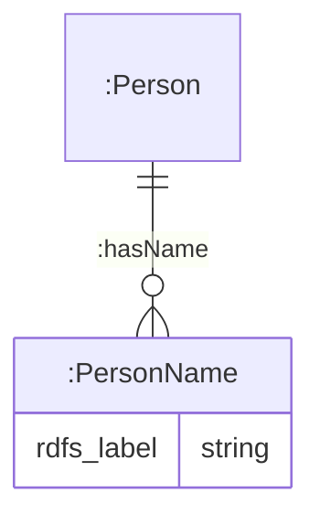

# Vis Backend Agent

The Vis-Backend Agent is a supporting service to The World Avatar's [visualisation platform (ViP)](https://github.com/cambridge-cares/TheWorldAvatar/tree/main/web/twa-vis-platform). It is designed to manage all visualisation-related requests from a single point of access to for example, filter map layers, generate dynamic controls, or query, add, delete, and update instances within the registry. By abstracting the backend implementation details (such as which other agents to call), it provides a unified access point to the data within its specific stack. This design allows the ViP to be deployed on a separate stack while retaining the capability to ingest data from multiple stacks seamlessly.

## Table of Contents

- [Vis Backend Agent](#vis-backend-agent)
  - [1. Agent Deployment](#1-agent-deployment)
    - [1.1 Preparation](#11-preparation)
    - [1.2 Docker Deployment](#12-docker-deployment)
  - [2. Agent Route](#2-agent-route)
    - [2.1 Status Route](#21-status-route-baseurlvis-backend-agentstatus)
    - [2.2 Geocoding Route](#22-geocoding-route-baseurlvis-backend-agentlocation)
      - [2.2.1 Geocoding route](#221-geocoding-route)
      - [2.2.2 Address search route](#222-address-search-route)
    - [2.3 Form Route](#23-form-route-baseurlvis-backend-agentformtype)
    - [2.4 Concept Metadata Route](#24-concept-metadata-route-baseurlvis-backend-agenttypetype)
    - [2.5 Instance Route](#25-instance-route)
      - [2.5.1 Add route](#251-add-route)
      - [2.5.2 Delete route](#252-delete-route)
      - [2.5.3 Update route](#253-update-route)
      - [2.5.4 Get route](#254-get-route)
    - [2.6 Service Lifecycle Route](#26-service-lifecycle-route)
      - [2.6.1 Draft route](#261-draft-route)
      - [2.6.2 Schedule route](#262-schedule-route)
      - [2.6.3 Service commencement route](#263-service-commencement-route)
      - [2.6.4 Unfulfilled service report route](#264-unfulfilled-service-report-route)
      - [2.6.5 Cancel service route](#265-cancel-service-route)
      - [2.6.6 Service order route](#266-service-order-route)
      - [2.6.7 Archive contract route](#267-archive-contract-route)
  - [3. SHACL Restrictions](#3-shacl-restrictions)
    - [3.1 Form Generation](#31-form-generation)
    - [3.2 Automated Data Retrieval](#32-automated-data-retrieval)
  - [4. Schemas](#4-schemas)
    - [4.1 Instantiation](#41-instantiation)
    - [4.2 Geocoding](#42-geocoding)

## 1. Agent Deployment

The agent is designed for execution through a Docker container within [The World Avatar's stack](https://github.com/cambridge-cares/TheWorldAvatar/tree/main/Deploy/stacks/dynamic/stack-manager). It cannot run as a standalone container, and other deployment workflows are beyond the scope of this document.

### 1.1 Preparation

Before using this agent, follow the steps below to ensure you have everything you need to successfully run the agent.

##### Maven Repository credentials

This agent is set up to use this [Maven repository](https://maven.pkg.github.com/cambridge-cares/TheWorldAvatar/) (in addition to Maven central).
You'll need to provide your credentials in a single-word text files located like this:

```
./credentials/
    repo_username.txt
    repo_password.txt
```

repo_username.txt should contain your Github username. repo_password.txt should contain your Github [personal access token](https://docs.github.com/en/github/authenticating-to-github/creating-a-personal-access-token),
which must have a 'scope' that [allows you to publish and install packages](https://docs.github.com/en/packages/working-with-a-github-packages-registry/working-with-the-apache-maven-registry#authenticating-to-github-packages).

##### Environment variables

The agent requires the following environment variables. These variables must be set in their respective docker configuration files for the agent to function as intended.

- `NAMESPACE`: Specifies the SPARQL namespace identifier containing the corresponding instances (default: kb)

##### Files

**FORM TEMPLATE**

In generating the form template, users must create and upload [`SHACL` restrictions](#3-shacl-restrictions) into the `namespace` specified in the previous section. Users must also generate a corresponding identifier and target classes in `./resources/application-form.json`. This file must be copied into the Docker container via bind mounts. The target class must also correspond to the object of the `NodeShape sh:targetClass ?object` triple in order to function.

**REST ENDPOINT**

The agent will require at least two files in order to function as a `REST` endpoint to add, delete, insert, and retrieve instances within the registry in the ViP.

1. `./resources/application-service.json`: A file mapping the resource identifier to the target file name in (2)
2. At least one `JSON-LD` file at `./resources/jsonld/example.jsonld`: This file provides a structure for the instance that must be instantiated and will follow the schemas defined in [this section](#41-instantiation). Each file should correspond to one type of instance, and the resource ID defined in (1) must correspond to the respective file in order to function.

**GEOCODING ENDPOINT**

Users must add a geocoding endpoint to the `geocode` resource identifier at `./resources/application-service.json`. This geocoding endpoint is expected to be a `SPARQL` compliant endpoint with geocoding data instantiated. For more details about the ontologies and restrictions involved, please read [section 4.2](#42-geocoding).

### 1.2 Docker Deployment

**TEST ENVIRONMENT**

- Deploy the agent to execute the unit tests on a standalone container by running the following code in the CLI at the <root> directory.
- The success of all tests must be verified through the Docker logs.

```
docker compose -f "./docker/docker-compose.test.yml" up -d --build
```

**PRODUCTION ENVIRONMENT**

1. Build this agent's image by issuing `docker compose -f './docker/docker-compose.yml' build` within this directory. Do not start the container.
2. Update the environment variables in `./docker/vis-backend-agent.json` if required.
3. Copy the `./docker/vis-backend-agent.json` file into the `inputs/config/services` directory of the stack manager.
4. Ensure the bind mount path is correctly set in the stack configuration for `vis-resources`.
5. Start the stack manager as usual following [these instructions](https://github.com/cambridge-cares/TheWorldAvatar/tree/main/Deploy/stacks/dynamic/stack-manager).

**DEBUGGING ENVIRONMENT**
Follow the same steps as the **PRODUCTION ENVIRONMENT**, but use the `vis-backend-agent-debug.json` file instead in step 3.

If you are developing in VSCode, please add the following `launch.json` to the `.vscode` directory. Once the agent is running with the debug configuration, the developer can attach the debugger on the debug panel in VSCode.

```json
{
  // Use IntelliSense to learn about possible attributes.
  // Hover to view descriptions of existing attributes.
  // For more information, visit: https://go.microsoft.com/fwlink/?linkid=830387
  "version": "0.2.0",
  "configurations": [
    {
      "type": "java",
      "name": "Debug attach",
      "request": "attach",
      "port": 5007,
      "hostName": "localhost",
      "projectName": "vis-backend-agent"
    }
  ]
}
```

## 2. Agent Route

The agent currently offers the following API route(s):

### 2.1 Status Route: `<baseURL>/vis-backend-agent/status`

This route serves as a health check to confirm that the agent has been successfully initiated and is operating as anticipated. It can be called through a `GET` request with no parameters, as follows:

```
curl localhost:3838/vis-backend-agent/status
```

If successful, the response will return `Agent is ready to receive requests.`.

### 2.2 Geocoding Route: `<baseURL>/vis-backend-agent/location`

This route serves as a geocoding endpoint to interface with addresses and coordinates.

#### 2.2.1 Geocoding route

To retrieve the geographic coordinates, users can send a `GET` request to `<baseURL>/vis-backend-agent/location/geocode` with at least one of the following parameters:

1. `postal_code`: Postal code of the address
2. `block`: The street block of the address; Must be sent along with the street name
3. `street`: The street name of the address
4. `city`: The city name of the address
5. `country`: The country IRI of the address following [this ontology](https://www.omg.org/spec/LCC/Countries/ISO3166-1-CountryCodes)

If successful, the response will return the coordinates in the `[longitude, latitude]` format that is compliant with `JSON`.

#### 2.2.2 Address search route

To search for the address based on postal code, users can send a `GET` request to `<baseURL>/vis-backend-agent/location/addresses` with the following parameter:

1. `postal_code`: Postal code of the address

If successful, the response will return the addresses as an array in the following `JSON` format:

```json
[
  {
    "block": "block number",
    "street": "street name",
    "city": "city name",
    "country": "country IRI"
  },
  {
    "street": "street name",
    "city": "city name",
    "country": "country IRI"
  }
]
```

### 2.3 Form Route: `<baseURL>/vis-backend-agent/form/{type}`

This route serves as an endpoint to retrieve the corresponding form template for the specified target class type. Users can send a `GET` request to `<baseURL>/vis-backend-agent/form/{type}`, where `{type}` is the requested identifier that must correspond to a target class in `./resources/application-form.json`.

Users can also retrieve a form template for a specific instance by appending the associated `id` at the end eg `<baseURL>/vis-backend-agent/form/{type}/{id}`.

If successful, the response will return a form template in the following (minimal) JSON-LD format. Please note that the template does not follow any valid ontology rules at the root level, and is merely a schema for the frontend. However, its nested values complies with `SHACL` ontological rules.

```json
{
  "http://www.w3.org/ns/shacl#property": [
    {
      "@id": "PROPERTY IRI",
      "@type": "http://www.w3.org/ns/shacl#PropertyShape",
      "http://www.w3.org/ns/shacl#name": {
        "@value": "form field name"
      },
      "http://www.w3.org/ns/shacl#description": {
        "@value": "description."
      },
      "http://www.w3.org/ns/shacl#group": {
        "@id": "GROUP IRI"
      }
    },
    {
      "@id": "GROUP IRI",
      "@type": "http://www.w3.org/ns/shacl#PropertyGroup",
      "http://www.w3.org/2000/01/rdf-schema#comment": {
        "@value": "Description of group."
      },
      "http://www.w3.org/2000/01/rdf-schema#label": {
        "@value": "property group name"
      },
      "http://www.w3.org/ns/shacl#property": [
        {
          "@id": "PROPERTY IRI",
          "@type": "http://www.w3.org/ns/shacl#PropertyShape",
          "http://www.w3.org/ns/shacl#name": {
            "@value": "form field name"
          },
          "http://www.w3.org/ns/shacl#description": {
            "@value": "description."
          },
          "http://www.w3.org/ns/shacl#group": {
            "@id": "GROUP IRI"
          }
        },
        ...
      ]
    }
  ]
}
```

### 2.4 Concept Metadata Route: `<baseURL>/vis-backend-agent/type/{type}`

This route serves as an endpoint to retrieve all available ontology classes and subclasses along with their human readable labels and descriptions associated with the type. Users can send a `GET` request to `<baseURL>/vis-backend-agent/type/{type}`, where `{type}` is the requested identifier that must correspond to a target class in `./resources/application-form.json`.

If successful, the response will return an array of objects in the following format:

```json
{
  "type": {
    "type": "uri",
    "value": "instance IRI",
    "dataType": "",
    "lang": ""
  },
  "label": {
    "type": "literal",
    "value": "Label of the class instance",
    "dataType": "http://www.w3.org/2001/XMLSchema#string",
    "lang": "Optional language field"
  },
  "description": {
    "type": "literal",
    "value": "Description for the class instance",
    "dataType": "http://www.w3.org/2001/XMLSchema#string",
    "lang": "Optional language field"
  },
  "parent": {
    "type": "uri",
    "value": "parent class IRI",
    "dataType": "",
    "lang": ""
  }
}
```

### 2.5 Instance Route

This route serves as a `RESTful` endpoint to perform `CRUD` operations for any resources based on the `type` specified.

#### 2.5.1 Add route

To add a new instance, users must send a POST request with their corresponding parameters to

```
<baseURL>/vis-backend-agent/{type}
```

where `{type}` is the requested identifier that must correspond to a target file name in`./resources/application-service.json`. The request parameters will depend on the `JSON-LD` file defined. More information on the required schema can be found in [this section](#41-instantiation).

A successful request will return `{"message": "type has been successfully instantiated!", "iri" : "root iri that is instantiated"}`.

#### 2.5.2 Delete route

To delete an instance, users must send a DELETE request to

```
<baseURL>/vis-backend-agent/{type}/{id}
```

where `{type}` is the requested identifier that must correspond to a target file name in`./resources/application-service.json`, and `{id}` is the specific instance's identifier. The instance representation will be deleted according to the `JSON-LD` file defined for adding a new instance. More information on the required schema can be found in [this section](#41-instantiation).

A successful request will return `{"message": "Instance has been successfully deleted!", "iri" : "root iri that is instantiated"}`.

#### 2.5.3 Update route

To update an instance, users must send a PUT request with their corresponding parameters to

```
<baseURL>/vis-backend-agent/{type}/{id}
```

where `{type}` is the requested identifier that must correspond to a target file name in`./resources/application-service.json`, and `{id}` is the specific instance's identifier. The request parameters will depend on the `JSON-LD` file defined for adding a new instance. More information on the required schema can be found in [this section](#41-instantiation).

A successful request will return `{"message": "type  has been successfully updated for id!", "iri" : "root iri that is instantiated"}`.

#### 2.5.4 Get route

There are several routes for retrieving instances associated with a specific `type` to populate the records in the registry. The agent will automatically generate the query and parameters based on the SHACL restrictions developed. The agent will return **EITHER** a `JSON` array containing entities as their corresponding `JSON` object **OR** one Entity `JSON` object depending on which `GET` route is executed.

1. Get all instances
2. Get a specific instance
3. Get all instances with human readable fields
4. Get all instances in `csv` format
5. Get all instances associated with a specific parent instance
6. Get all instances matching the search criteria

##### Get all instances

Users can send a `GET` request to

```
<baseURL>/vis-backend-agent/{type}
```

where `{type}`is the requested identifier that must correspond to a target class in`./resources/application-form.json`.

##### Get a instance

Users can send a `GET` request to

```
<baseURL>/vis-backend-agent/{type}/{id}
```

where `{type}`is the requested identifier that must correspond to a target class in`./resources/application-form.json`, and `{id}` is the specific instance's identifier.

##### Get all instances with human readable fields

This route retrieves all instances with human-readable fields. Users can send a `GET` request to

```
<baseURL>/vis-backend-agent/{type}/label
```

where `{type}`is the requested identifier that must correspond to a target class in`./resources/application-form.json`.

##### Get all instances in csv format

This route retrieves all instances in the csv format. Users can send a `GET` request to

```
<baseURL>/vis-backend-agent/csv/{type}
```

where `{type}`is the requested identifier that must correspond to a target class in`./resources/application-form.json`.

##### Get all instances associated with a specific parent instance

Users can send a `GET` request to:

```
<baseURL>/vis-backend-agent/{parent}/{id}/{type}
```

where `{type}`is the requested identifier that must correspond to a target class in`./resources/application-form.json`, `{parent}` is the requested parent identifier that is linked to the type, and `{id}` is the specific parent instance's identifier to retrieve all instances associated with.

##### Get all instances matching the search criteria

Users can send a `POST` request with search criterias to:

```
<baseURL>/vis-backend-agent/{type}/search
```

where `{type}`is the requested identifier that must correspond to a target class in`./resources/application-form.json`. The search criterias should be sent as a `JSON` request body:

```json
{
  "parameter": "criteria",
  "parameter-two": "criteria-two"
}
```

### 2.6 Service Lifecycle Route

This `<baseURL>/vis-backend-agent/contracts/` route serves as an endpoint to manage the lifecycle of contracts and their associated services.

#### 2.6.1 Draft route

This endpoint serves to draft a new contract, inclusive of its lifecycle and the schedule, or retrieve all draft contracts that are awaiting approval.

> New/Edit draft contract

Users can _EITHER_ send a `POST` request to create a new instance _OR_ send a `PUT` request to update the draft contract at the following endpoint:

```
<baseURL>/vis-backend-agent/contracts/draft
```

Note that this route will interact with the [schedule route](#262-schedule-route) directly, and users should not sent a separate request to the schedule route unless they wish to interact with the schedule. The draft route will require the following `JSON` request parameters:

```json
{
  /* parameters */
  "id": "An identifier for the lifecycle",
  "contract": "The target contract IRI",
  "start date": "Date when the first service is to be delivered in the YYYY-MM-DD format",
  "end date": "Date of the final service in the YYYY-MM-DD format",
  "time slot start": "Beginning of the time window during which the service is scheduled to be delivered in the HH:MM format",
  "time slot end": "End of the time window during which the service is scheduled to be delivered in the HH:MM format",
  "recurrence": "Service interval in the ISO 8601 format eg P1D P7D P2D",
  "monday": "A boolean indicating if the service should occur on a monday",
  "tuesday": "A boolean indicating if the service should occur on a tuesday",
  "wednesday": "A boolean indicating if the service should occur on a wednesday",
  "thursday": "A boolean indicating if the service should occur on a thursday",
  "friday": "A boolean indicating if the service should occur on a friday",
  "saturday": "A boolean indicating if the service should occur on a saturday",
  "sunday": "A boolean indicating if the service should occur on a sunday"
}
```

A successful request will return `{"message": "Contract has been successfully drafted/updated!", "iri" : "root iri that is instantiated"}`.

> Get all draft contracts

Users can send a `GET` request to the `<baseURL>/vis-backend-agent/contracts/draft?type={type}` endpoint to retrieve all draft contracts, where `{type}`is the requested identifier that must correspond to the target contract class in`./resources/application-form.json`.

There is also an additional optional parameter `label` to retrieve draft contracts with only human readable values. Users may pass in `yes` if the response should all be labelled and `no` otherwise.

#### 2.6.2 Schedule route

The endpoint serves to assign the upcoming schedule for the services for the specified contract. **WARNING**: It is not intended that this route is called directly, as the [draft route](#261-draft-route) will call this route when a request is received. Users can _EITHER_ send a `POST` request to create a new instance _OR_ send a `PUT` request to update the draft lifecycle at the following endpoint:

```
<baseURL>/vis-backend-agent/contracts/schedule
```

Note that this route does require the following `JSON` request parameters:

```json
{
  /* parameters */
  "id": "An identifier for the scheduler",
  "contract": "The target contract IRI",
  "time slot start": "Beginning of the time window during which the service is scheduled to be delivered in the HH:MM format",
  "time slot end": "End of the time window during which the service is scheduled to be delivered in the HH:MM format",
  "recurrence": "Service interval in the ISO 8601 format eg P1D P7D P2D",
  "monday": "A boolean indicating if the service should occur on a monday",
  "tuesday": "A boolean indicating if the service should occur on a tuesday",
  "wednesday": "A boolean indicating if the service should occur on a wednesday",
  "thursday": "A boolean indicating if the service should occur on a thursday",
  "friday": "A boolean indicating if the service should occur on a friday",
  "saturday": "A boolean indicating if the service should occur on a saturday",
  "sunday": "A boolean indicating if the service should occur on a sunday"
}
```

A successful request will return `{"message": "Schedule has been successfully drafted for the contract! _OR_ Draft schedule has been successfully updated!", "iri" : "root iri that is instantiated"}`.

#### 2.6.3 Service commencement route

The endpoint serves to commence the delivery of services by approving the specified contract. Users must send a `POST` request to approve the contract at the following endpoint:

```
<baseURL>/vis-backend-agent/contracts/service/commence
```

Note that this route does require the following `JSON` request parameters:

```json
{
  /* parameters */
  "contract": "The target contract IRI",
  "remarks": "Remarks for the approval"
}
```

A successful request will return `{"message": "Contract has been approved for service execution!", "iri" : "root iri that is instantiated"}`.

#### 2.6.4 Unfulfilled service report route

The endpoint serves to report an unfulfilled service of a specified contract. Users must send a `POST` request to lodge a report at the following endpoint:

```
<baseURL>/vis-backend-agent/contracts/service/report
```

Note that this route does require the following `JSON` request parameters:

```json
{
  /* parameters */
  "contract": "The target contract IRI",
  "remarks": "Remarks for the report",
  "date": "Date of the unfulfilled service in the YYYY-MM-DD format; Date must be in the past or today"
}
```

A successful request will return `{"message": "Report for an unfulfilled service has been successfully lodged!", "iri" : "root iri that is instantiated"}`.

#### 2.6.5 Cancel service route

The endpoint serves to cancel an upcoming service of a specified contract. Users must send a `POST` request to lodge a report at the following endpoint:

```
<baseURL>/vis-backend-agent/contracts/service/cancel
```

Note that this route does require the following `JSON` request parameters:

```json
{
  /* parameters */
  "contract": "The target contract IRI",
  "remarks": "Remarks for the cancellation",
  "date": "Upcoming service date to be cancelled in the YYYY-MM-DD format; Date must be today or in future"
}
```

A successful request will return `{"message": "Service has been successfully cancelled!", "iri" : "root iri that is instantiated"}`.

#### 2.6.6 Service order route

The endpoint serves to retrieve all contracts that are currently in progress. Users can send a `GET` request to the `<baseURL>/vis-backend-agent/contracts/service?type={type}` endpoint to retrieve all in progress contracts, where `{type}`is the requested identifier that must correspond to the target contract class in`./resources/application-form.json`.

There is also an additional optional parameter `label` to retrieve in progress contracts with only human readable values. Users may pass in `yes` if the response should all be labelled and `no` otherwise.

#### 2.6.7 Archive contract route

The endpoint serves to archive in progress contracts as well as retrieve all contracts that have expired and are in archive.

> Get all archived contracts

Users can send a `GET` request to the `<baseURL>/vis-backend-agent/contracts/archive?type={type}` endpoint to retrieve all archived contracts, where `{type}`is the requested identifier that must correspond to the target contract class in`./resources/application-form.json`.

There is also an additional optional parameter `label` to retrieve archived contracts with only human readable values. Users may pass in `yes` if the response should all be labelled and `no` otherwise.

> Rescind an ongoing contract

Users must send a `POST` request to rescind an ongoing contract at the `<baseURL>/vis-backend-agent/contracts/archive/rescind` endpoint, with the following `JSON` request parameters:

```json
{
  /* parameters */
  "contract": "The target contract IRI",
  "remarks": "Reasons for the rescindment"
}
```

A successful request will return `{"message": "Contract has been successfully rescinded!", "iri" : "root iri that is instantiated"}`.

> Terminate an ongoing contract

Users must send a `POST` request to terminate an ongoing contract at the `<baseURL>/vis-backend-agent/contracts/archive/terminate` endpoint, with the following `JSON` request parameters:

```json
{
  /* parameters */
  "contract": "The target contract IRI",
  "remarks": "Reasons for the early termination"
}
```

A successful request will return `{"message": "Contract has been successfully terminated!", "iri" : "root iri that is instantiated"}`.

## 3. SHACL Restrictions

[SHACL](https://www.w3.org/TR/shacl/) is generally a language for validating RDF graphs against a set of conditions. The World Avatar incorporates these restrictions into our workflow to populate form structure and fields, as well as enabling automated data retrieval.

### 3.1 Form Generation

The query to generate the form template is available at `resources/query/construct/form.sparql`. Please read the documentation available on the [Visualisation Platform](https://github.com/cambridge-cares/TheWorldAvatar/tree/main/web/twa-vis-platform/doc/form.md) to understand how the form template generated from this agent should look like.

A sample SHACL format in (TTL) is described below:

```
base:NameOfConceptShape
  a sh:NodeShape ;
  sh:targetClass base:Concept ;
  sh:property [
    sh:name "dropdown" ;
    sh:order 1 ;
    sh:description "A sample property showing the structure for creating a new dropdown and its list of selections" ;
    sh:path base:hasDropdownOptions ;
    sh:in base:DropdownOption ;
    sh:minCount 1 ;
    sh:maxCount 1 ;
  ] ;
  sh:property [
    sh:name "text input";
    sh:description "A sample property showing the structure for creating a new text input field" ;
    sh:order 2 ;
    sh:path base:hasInput ;
    sh:datatype xsd:string ;
    sh:minCount 1 ;
    sh:maxCount 1 ;
  ] ;
  sh:property [
    sh:name "number input";
    sh:description "A sample property showing the structure for creating a new numerical input field" ;
    sh:order 3 ;
    sh:path base:hasInput ;
    sh:datatype xsd:decimal ;
    sh:minCount 1 ;
    sh:maxCount 1 ;
  ] ;
  sh:property [
    sh:name "date input";
    sh:description "A sample property showing the structure for creating a new date input field" ;
    sh:order 4 ;
    sh:path base:hasInput ;
    sh:datatype xsd:date ;
    sh:minCount 1 ;
    sh:maxCount 1 ;
  ] ;
  sh:property [
    sh:name "group" ;
    sh:description "A sample property showing the structure for creating a new property group" ;
    sh:order 5 ;
    sh:path base:hasGroup ;
    sh:node base:NestedConceptShape ;
    sh:minCount 1 ;
    sh:maxCount 1 ;
  ] .

base:NestedConceptShape
  a sh:NodeShape ;
  sh:targetClass base:NestedConcept ;
  sh:property [
    sh:name "nested input" ;
    sh:order 1 ;
    sh:description "A sample property showing the structure for creating a nested property input as part of a group" ;
    sh:path base:hasNestedProperty ;
    sh:datatype xsd:string ;
    sh:minCount 1 ;
    sh:maxCount 1 ;
  ] .
```

### 3.2 Automated Data Retrieval

This agent can dynamically query fields for different instances based on the `SHACL` restrictions in three steps:

1. Retrieve all the predicate paths set in `SHACL` to reach the field of interest
2. Generate a dynamic query based on these paths queried in (1)
3. Query the knowledge graph with the query generated in (2)

The query in (1) is available at `resources/query/get/property_path.sparql`. This path specifically requires the following `SHACL` properties in order to function:

1. `sh:path`: REQUIRED to generate the `SPARQL` query template. The subject of this predicate can either be one path IRI or a list of path IRI. An example in `TTL` is also available below:

```
base:ConceptShape
  a sh:NodeShape ;
  sh:targetClass ontoexample:Concept ;
  sh:property [
    ...
    sh:path ontoexample:onePath ;
    ...
  ];
  sh:property [
    ...
    sh:path (ontoexample:nestedPath rdfs:label);
    ...
  ];
  sh:property [
    ...
    sh:path (
      [sh:inversePath ontoexample:inversePath]
      ontoexample:inverseNestedPath
    );
    ...
  ].
```

2. `sh:hasValue`: Optional parameter to restrict the output of the query to a specific instance. This is useful if the same predicate path points to multiple instances as a subject and cannot be differentiated otherwise. For example: `fibo-fnd-dt-fd:RegularSchedule` has predicates `fibo-fnd-dt-fd:hasRecurrenceInterval` that may target Monday to Sunday as their subject values.
3. `sh:minCount`: Optional parameter to indicate that the variable is required in the template if set above one.
4. `sh:qualifiedValueShape`: Optional parameter to indicate that the variable is a parent variable that the instance is dependent on.
5. `sh:datatype`: Required parameter to generate min-max search criteria based on integer or decimal settings
6. `sh:property/sh:name "name"`: Optional `SHACL` property that provides property path(s) to the human-readable label of the field. This is required for any IRIs returned by any property if human-readable labels are necessary. This must be found in a property shape with `sh:targetClass` to function. Note that if your property is `sh:in` a (sub)class, the agent will automatically retrieve the `rdfs:label` of the associated class concept.

## 4. Schemas

### 4.1 Instantiation

The instantiation mechanism of this agent involves the employment of [`JSON-LD`](https://json-ld.org/) alongside the programmatic replacement of certain objects based on the request parameters to instantiate a new instance. Generally, the schema will follow the [`JSON-LD` specifications](https://www.w3.org/TR/json-ld/), except for values that should be dynamically replaced based on request parameters. For instance, the ontological representation of a person may be as follows.



It is expected that we should create a new ID and name for the person instance. To ensure that the ID and name is replaced according to the right input parameter, this agent requires a replacement `JSON` object within the `JSON-LD` file. The generic format of the replacement object is:

```json
{
  "@replace": "parameter name", # this may be a subset of the parameter name
  "@type": "iri", # expected request parameter type - iri or literal
  "datatype": "http://www.w3.org/2001/XMLSchema#date", # optional data type for LITERAL types if we wish to instantiate non-string literals
  "prefix": "http://example.org/prefix/me/" # optional prefix for IRI types if we require only the identifier but not the entire IRI of the request parameter
}
```

A sample file can be found at `./resources/example.jsonld`. It is recommended for users to first generate a valid schema using the [`JSON-LD` Playground](https://json-ld.org/playground/), and then replace the target literal or IRIs with the replacement object specified above. This validates the `JSON-LD` schema and ensure a consistent schema is adopted. **WARNING:** Please do not use short prefixes and include the full IRI throughout the schema in order for the agent to function as expected. This can be ensured by removing the "@context" field, which defines these prefixes.

### 4.2 Geocoding

The agent requires certain ontologies and `SHACL` restrictions in order to enable geocoding services for the frontend. The data instantiated in the knowledge graph must follow the following ontology. However, there are optional concepts such as the `PrimaryAddressNumber` for `block_number` that can be excluded.

```
:                   https://www.theworldavatar.com/kg/
fibo-fnd-arr-id:    https://spec.edmcouncil.org/fibo/ontology/FND/Arrangements/IdentifiersAndIndices/
fibo-fnd-plc-adr:   https://spec.edmcouncil.org/fibo/ontology/FND/Places/Addresses/
fibo-fnd-plc-loc:   https://spec.edmcouncil.org/fibo/ontology/FND/Places/Locations/
fibo-fnd-rel-rel:   https://spec.edmcouncil.org/fibo/ontology/FND/Relations/Relations/
geo:                http://www.opengis.net/ont/geosparql#
rdfs:	              http://www.w3.org/2000/01/rdf-schema#
xsd:                http://www.w3.org/2001/XMLSchema#

AddressInstance a fibo-fnd-plc-adr:ConventionalStreetAddress ;
  fibo-fnd-plc-adr:hasStreetAddress StreetAddressInstance  ;
  fibo-fnd-plc-adr:hasPostalCode {postal_code} ;
  fibo-fnd-plc-loc:hasCityName {city} ;
  fibo-fnd-plc-loc:hasCountry {<https://www.omg.org/spec/LCC/Countries/ISO3166-1-CountryCodes/Country>}
  fibo-fnd-arr-id:isIndexTo LocationInstance .
StreetAddressInstance a fibo-fnd-plc-adr:StreetAddress ;
    fibo-fnd-plc-adr:hasPrimaryAddressNumber StreetBlockInstance ;
    fibo-fnd-plc-adr:hasStreetName StreetNameInstance .
StreetBlockInstance a fibo-fnd-plc-adr:PrimaryAddressNumber ;
    fibo-fnd-rel-rel:hasTag {block_number} .
StreetNameInstance a fibo-fnd-plc-adr:StreetName ;
    fibo-fnd-rel-rel:hasTag {road_name} .
LocationInstance a fibo-fnd-plc-loc:PhysicalLocation ;
    geo:hasGeometry [
      a geo:Point;
      geo:asWKT "{geom}"^^geo:wktLiteral .
    ]
```

The `SHACL` property shape for location must target the `https://www.omg.org/spec/LCC/Countries/CountryRepresentation/Location` concept, and include a `PropertyShape` of the geopoint as well as the address. Note that the address may take any shape, but it is recommended to follow the following definitions in `TTL` format:

```
@prefix base:             <https://www.theworldavatar.io/kg/location/> .
@prefix address:          <https://www.theworldavatar.io/kg/address/> .
@prefix sh:               <http://www.w3.org/ns/shacl#> .
@prefix xsd:              <http://www.w3.org/2001/XMLSchema#> .
@prefix ontobim:          <https://www.theworldavatar.com/kg/ontobim/> .
@prefix ontoservice:      <https://www.theworldavatar.com/kg/ontoservice/> .
@prefix fibo-fnd-plc-adr: <https://spec.edmcouncil.org/fibo/ontology/FND/Places/Addresses/> .
@prefix fibo-fnd-plc-loc: <https://spec.edmcouncil.org/fibo/ontology/FND/Places/Locations/> .
@prefix fibo-fnd-rel-rel: <https://spec.edmcouncil.org/fibo/ontology/FND/Relations/Relations/> .
@prefix lcc-cr:           <https://www.omg.org/spec/LCC/Countries/CountryRepresentation/> .
@prefix geo:              <http://opengis.net/ont/geosparql#> .

base:ServiceLocationShape
  a sh:NodeShape ;
  sh:targetClass lcc-cr:Location ;
  sh:property [
    sh:name "id" ;
    sh:description "Identifier for the location." ;
    sh:order 1 ;
    sh:path (
      geo:hasGeometry
      [sh:inversePath geo:hasGeometry]
    ) ;
    sh:datatype xsd:string ;
    sh:minCount 1 ;
    sh:maxCount 1 ;
  ] ;
  sh:property [
    sh:name "geopoint" ;
    sh:description "The WKT serialization of the location." ;
    sh:order 2 ;
    sh:path (
      geo:hasGeometry
      geo:asWKT
    ) ;
    sh:datatype geo:wktLiteral ;
    sh:minCount 1 ;
    sh:maxCount 1 ;
  ] ;
  sh:property [
    sh:name "address" ;
    sh:description "Address of the service site." ;
    sh:order 3 ;
    sh:path (
      [sh:inversePath ontoservice:hasServiceLocation]
      fibo-fnd-plc-adr:hasAddress
    ) ;
    sh:node address:ConventionalStreetAddressShape ;
    sh:minCount 1 ;
    sh:maxCount 1 ;
  ] .

  address:ConventionalStreetAddressShape
  a sh:NodeShape ;
  sh:targetClass fibo-fnd-plc-adr:ConventionalStreetAddress ;
  sh:property [
    sh:name "id";
    sh:description "Identifier for the address.";
    sh:order 1;
    sh:path (
      fibo-fnd-plc-adr:hasPostalCode
      [sh:inversePath fibo-fnd-plc-adr:hasPostalCode]
    ) ;
    sh:datatype xsd:string ;
    sh:minCount 1 ;
    sh:maxCount 1 ;
  ] ;
  sh:property [
    sh:name "postal code";
    sh:description "Postal code";
    sh:order 2;
    sh:path fibo-fnd-plc-adr:hasPostalCode ;
    sh:datatype xsd:string ;
    sh:minCount 1 ;
    sh:maxCount 1 ;
    sh:minLength 6 ;
    sh:maxLength 6 ;
    sh:pattern "^\d+$" ;
  ] ;
  sh:property [
    sh:name "block";
    sh:description "The block number on the street if any";
    sh:order 3;
    sh:path (
        fibo-fnd-plc-adr:hasStreetAddress
        fibo-fnd-plc-adr:hasPrimaryAddressNumber
        fibo-fnd-rel-rel:hasTag
      );
    sh:datatype xsd:string ;
    sh:minCount 1 ;
    sh:maxCount 1 ;
  ] ;
  sh:property [
    sh:name "street";
    sh:description "The name of the street for the address";
    sh:order 4;
    sh:path (
        fibo-fnd-plc-adr:hasStreetAddress
        fibo-fnd-plc-adr:hasStreetName
        fibo-fnd-rel-rel:hasTag
      );
    sh:datatype xsd:string ;
    sh:minCount 1 ;
    sh:maxCount 1 ;
  ] ;
  sh:property [
    sh:name "city";
    sh:description "City";
    sh:order 5;
    sh:path fibo-fnd-plc-loc:hasCityName ;
    sh:datatype xsd:string ;
    sh:minCount 1 ;
    sh:maxCount 1 ;
  ] ;
  sh:property [
    sh:name "country";
    sh:description "Country";
    sh:order 6;
    sh:path (fibo-fnd-plc-loc:hasCountry <https://www.omg.org/spec/LCC/Countries/CountryRepresentation/hasEnglishShortName>);
    sh:in lcc-cr:Country ;
    sh:minCount 1 ;
    sh:maxCount 1 ;
  ] .
```
