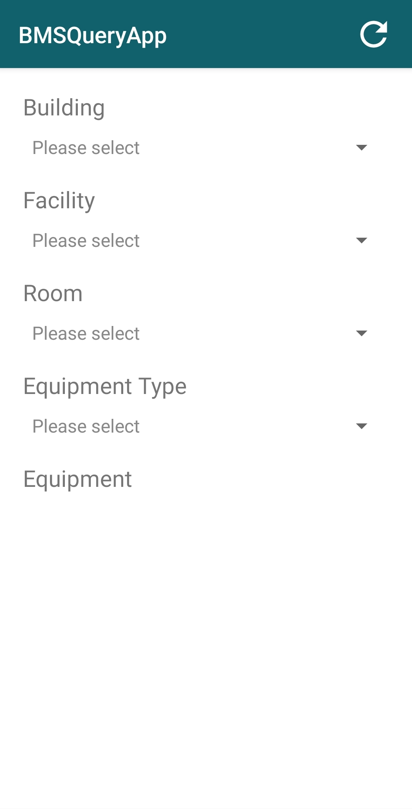
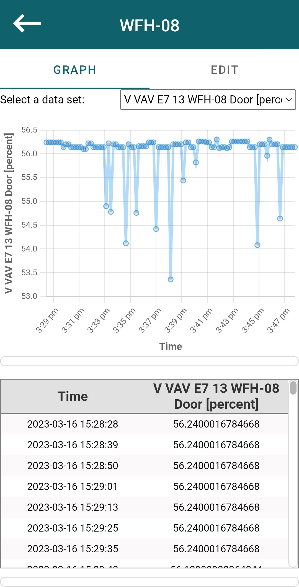
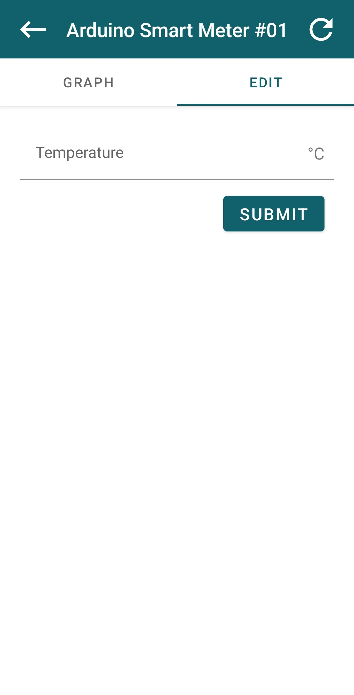

# BMSQueryApp

This is an Android app project to monitor and control lab devices. The minimum apk supported is 24 and it is targeted on apk 33.

## Setup
All agents and database should be deployed in a server with [stack](https://github.com/cambridge-cares/TheWorldAvatar/tree/main/Deploy/stacks/dynamic/stack-manager), and the app acts as a standalone frontend. This section is aimed for local development setup.

Agents required:
- [FeatureInfoAgent](https://github.com/cambridge-cares/TheWorldAvatar/tree/main/Agents/FeatureInfoAgent)
- [BMSQueryAgent](https://github.com/cambridge-cares/TheWorldAvatar/tree/main/Agents/BMSQueryAgent)
- [BMSWriteAgent](https://github.com/cambridge-cares/TheWorldAvatar/tree/main/Agents/BMSWriteAgent)

### Feature Info Agent Configuration
Before launching Feature Info Agent in the stack, config files need to be copied into the feature info agent folder. Copy all `.sparql` files in `feature-info-agent-queries/` to `TheWorldAvatar/Agent/FeatureInfoAgent/queries`.

Create `FeatureInfoAgent/queries/fia-config.json` if not exsits. Then append the queries section in `feature-info-agent-queries/fia-config.json` to `FeatureInfoAgent/queries/fia-config.json`.

More information about FeatureInfoAgent configuration can be found [here](https://github.com/cambridge-cares/TheWorldAvatar/tree/main/Agents/FeatureInfoAgent#configuration).

### Connect to the Local Stack
Change `HOST` in [Constansts.java](app/src/main/java/uk/ac/cam/cares/jps/bmsqueryapp/utils/Constants.java) to the address of the local stack.