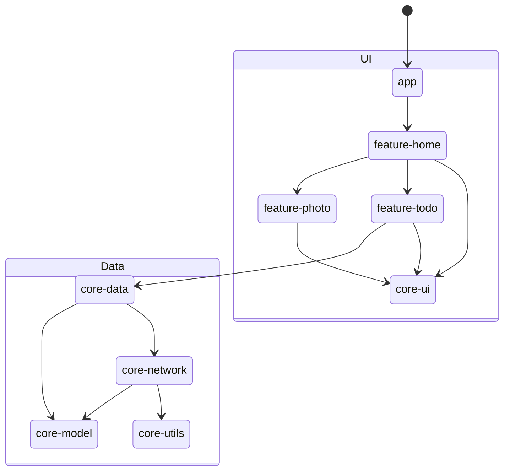
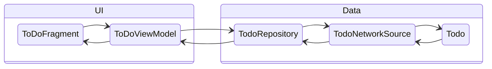
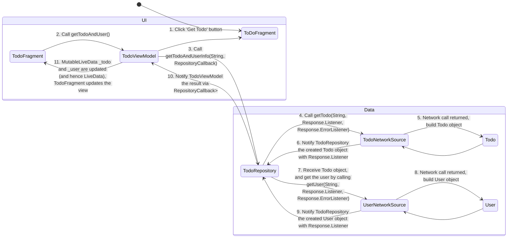

# Sample App Tutorial

Continuing from the `Getting Started` section, this tutorial introduces a starter app designed as a template for new mobile interfaces for The World Avatar. Our goal is to guide users through the Model-View-ViewModel (MVVM) architecture pattern, which cleanly separates the UI logic from the data layer.

In this tutorial, we'll demonstrate the implementation of fragments according to the MVVM pattern, namely for app navigation and how the views can be updated by the data layer in response to user interactions. As mentioned, the application is structured into three modules:

- `app` serves as the main entrypoint into the application, which starts a single activity.
- `core` contains mainly the data layer components and some reusable UI components.
- `feature` contains the user-facing functionalities for our application, which typically is implemented as a fragment for user interactions.

The diagram below depicts the overall workflow of the app within the UI - Data layers. Do note that the diagram does not illustrate the code dependencies accurately and is mainly to explain the logic flow.

## 1. Navigation

When a user starts the application, they will first see the view of `HomeFragment` in `feature/home`. Set this up by assigning the id of `/feature/home/src/main/res/navigation/home_map.xml` to the `app:startDestination` field in `/app/src/main/res/navigation/app_navigation.xml`.

Buttons are available for navigation to either the `PhotoFragment` or `ToDoFragment` views. `HomeFragment` demonstrates how to create these button links using `NavDeepLinkRequest` and `NavHostFragment`, whereas `PhotoFragment` demonstrates how developers can navigate back to the previous fragment view. Notably, Android adopts a navigation stack that records the user's navigation history, allowing for smooth navigation both forward and backwards.

Please note that all fragment links are stored as a string resource in `core/utils`.

## 2. View Model Updates

In the `ToDoFragment`, the view model is initially empty, resulting in a blank page on the second half. When an user taps on the `Get Todo` button, the view model retrieves data from the API through the Data Layer, and updates their state. If there are values, the `ToDoFragment` view will be populated with the retrieved data.

The mechanics is as follows:

## 3. Building the app

1. Open the `SampleApp` folder in Android Studio
2. Click on the `Run 'app'` button or `Shift + F10` 
3. The app should run in the selected emulator after building

# Architecture Example: Todo Pipeline
This section shows an example of the Android app architecture (Data Source - Repository - State Holders/ViewModel - UI elements) with the Todo feature. Todo and its user information are fetched from network, processed in repository and show in TodoFragment.

Note

3. The RepositoryCallback instance is defined in TodoViewModel. It tells TodoRepository what to do once it receives the result from network sources.
11. LiveData todo and user are observed in TodoFragment. The observer function will be triggered if changes of the object value are detected.