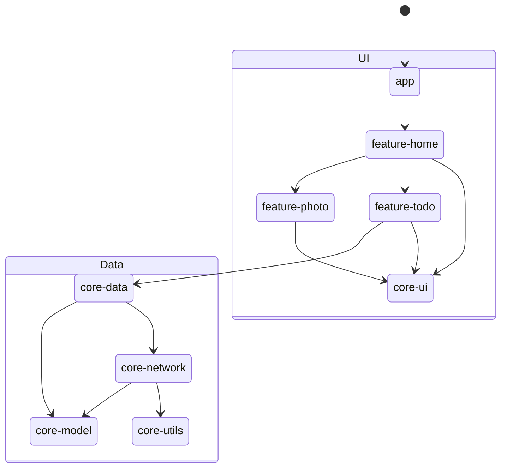
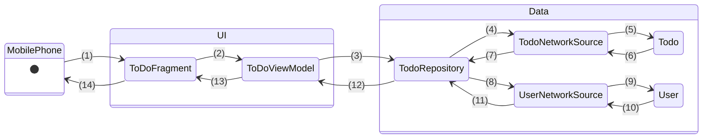

# Sample App Tutorial

Continuing from the `Getting Started` section, this tutorial introduces a starter app designed as a template for new mobile interfaces for The World Avatar. Our goal is to guide users through the Model-View-ViewModel (MVVM) architecture pattern, which cleanly separates the UI logic from the data layer.

In this tutorial, we'll demonstrate the implementation of fragments according to the MVVM pattern, namely for app navigation and how the views can be updated by the data layer in response to user interactions. As mentioned, the application is structured into three modules:

- `app` serves as the main entrypoint into the application, which starts a single activity.
- `core` contains mainly the data layer components and some reusable UI components.
- `feature` contains the user-facing functionalities for our application, which typically is implemented as a fragment for user interactions.

The diagram below depicts the overall workflow of the app within the UI - Data layers. Do note that the diagram does not illustrate the code dependencies accurately and is mainly to explain the logic flow.

## 1. Navigation

When a user starts the application, they will first see the view of `HomeFragment` in `feature/home`. Set this up by assigning the id of `/feature/home/src/main/res/navigation/home_map.xml` to the `app:startDestination` field in `/app/src/main/res/navigation/app_navigation.xml`.

Buttons are available for navigation to either the `PhotoFragment` or `ToDoFragment` views. `HomeFragment` demonstrates how to create these button links using `NavDeepLinkRequest` and `NavHostFragment`, whereas `PhotoFragment` demonstrates how developers can navigate back to the previous fragment view. Notably, Android adopts a navigation stack that records the user's navigation history, allowing for smooth navigation both forward and backwards.

Please note that all fragment links are stored as a string resource in `core/utils`.

## 2. View Model Updates

In the `ToDoFragment`, the view model is initially empty, resulting in a blank page on the second half. When an user taps on the `Get Todo` button, the view model retrieves data from the API through the Data Layer, and updates their state. If there are values, the `ToDoFragment` view will be populated with the retrieved data. We demonstrate this as TWA apps will typically retrieve data from agents, which are similar to APIs.

We depict an example of the Android app workflow (`Data Source - Repository - State Holders/ViewModel - UI elements`) below:

Description of steps:

1. Click 'Get Todo' button
2. Call `getTodoAndUser()`
3. Call `getTodoAndUserInfo(String, RepositoryCallback)`; The `RepositoryCallback` instance is defined in `TodoViewModel` and tells `TodoRepository` what to do once it receives the result
4. Call `getTodo(String, Response.Listener<Todo>, Response.ErrorListener)`
5. Parse the network response into a `Todo` object
6. Returns data in a `Todo` object
7. Notify `TodoRepository` that the data has been returned successfully with `Response.Listener<Todo>`
8. Passes `Todo` data model to retrieve the associated user data by calling `getUser(String, Response.Listener<User>, Response.ErrorListener)`
9. Parse the network response into a `User` object
10. Returns data in a `User` object
11. Notify `TodoRepository` that the data has been returned successfully with `Response.Listener<User>`
12. Notify `TodoViewModel` that the data has been returned successfully via `RepositoryCallback<Pair<Todo, User>>`
13. Updates the data using the observer function via `MutableLiveData` \_todo and \_user, which also updates their `LiveData` counterparts; The observer triggers whenever changes to the object values are detected
14. Updates the user interface with the retrieved data

## 3. Building the app

1. Open the `SampleApp` folder in Android Studio
2. Click on the `Run 'app'` button or `Shift + F10`
3. The app should run in the selected emulator after building

## 4. Dependency Injection
This project uses [Hilt](https://developer.android.com/training/dependency-injection) for dependency Injection. For basic definition and example of dependency injection, please refer to [this](https://developer.android.com/training/dependency-injection). This section covers a summary of the dependency injection tags used in this project and the files for dependency injection declaration. 

### Dependency Injection Tags
Android Specific
- `@HiltAndroidApp`: Trigger Hilt's code generation. It is added in app module's `SampleApplication.java`.
- `@AndroidEntryPoint`: An annotation adds to the Android class that needs dependency injection. Hilt currently supports `Activity`, `Fragment`, `View`, `Service`, `BroadcastReceiver`. It is added in `MainActivity.java`, `TodoFragment.java`.
- `@HiltViewModel`: An annotation adds to ViewModel for dependency injection. It is added in `TodoViewModel.java` to inject `TodoRepository` instance from core-data.
- `@ApplicationContext`: Inject application context. It is used in the core `NetworkModule.java`. 

General
- `@Inject`: Indicate that a variable is initialized with dependency injection. It can be used with constructor to indicate that all the variables are injected. It can also be used on a specific class member variable for injection. 
- `@Module`:  Define modules which are resposible for providing instances with `@Provides` and specifying interface default implementation with `@Binds`. It is used in `NetworkModule.java` and `DataModule.java` to indicate what instances to be injected for network sources and repositories.
- `@InstallIn`: To tell Hilt which Android class each module will be used or installed in. In this project, `SingeltonComponent.class` is used to install the dependecy as singelton.
- `@Provides`: Specify what instance will be injected for a certain class.  
- `@Singleton`: Indicate the injected instance is a singleton.

### Example
This section shows how a TodoViewModel object is created with dependency injection.

1. TodoViewMpdel dependes on TodoRepository. TodoRepository is provided by `DataModule.java` in core-data.
2. TodoRepository depends on TodoNetworkSource and UserNetworkSouce which are provided by `NetworkModule.java` in core-network.
3. TodoNetworkSource and UserNetworkSouce depends on Context, which is provided with `@ApplicationContext` and defined in `NetworkModule.java`. 