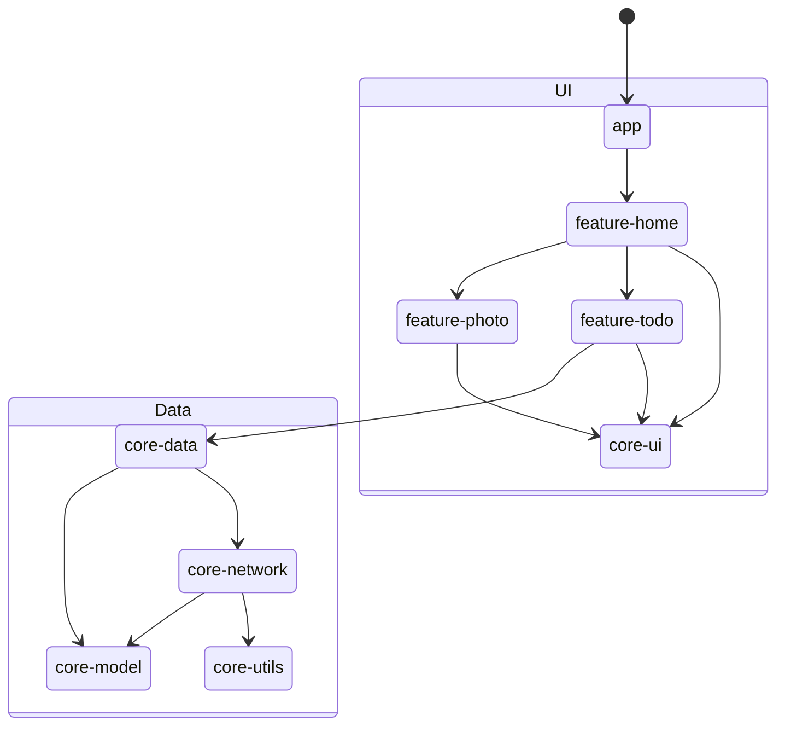
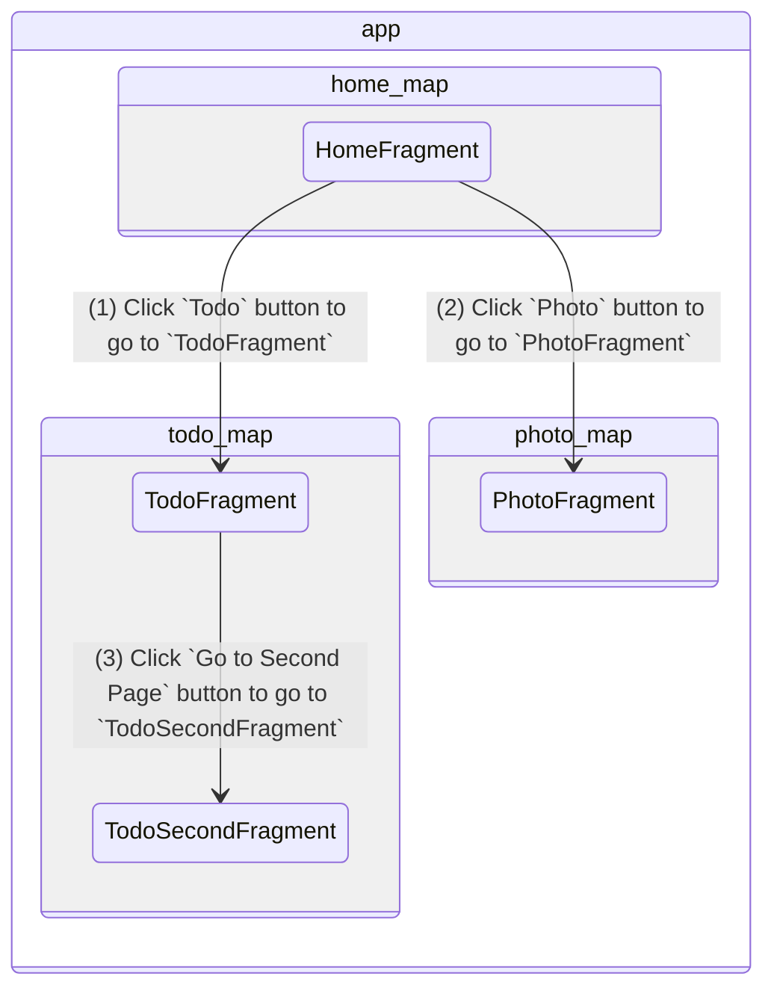
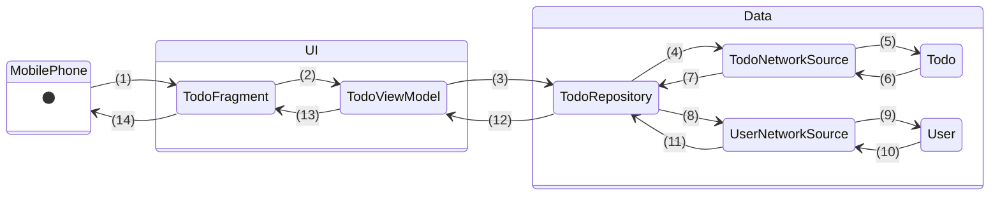

# Sample App Tutorial

Continuing from the `Getting Started` section, this tutorial introduces a starter app designed as a template for new mobile interfaces for The World Avatar (TWA). Our goal is to guide users through the Model-View-ViewModel (MVVM) architectural pattern, which cleanly separates the UI logic from the data layer. The app will contain our code recommendations for app navigation, propagating data from the data layer to the view model, UI design, and testing strategies. Please do note that the code base is still evolving and will be updated over time as we learn better practices.

## 1. Introduction

### 1.1 Core Concepts

As an introduction, Android developers must be familiar with the terms `Activity` and `Fragment`.

> Activity

An `Activity` is the basic building block of an Android app's user interface. Each activity serves as an entry point with a single, focused thing that the user can do through a single screen representation, such as a login or settings screen. A simple example is when one app (A) invokes another (B), the calling app (A) invokes an activity in the other app (B).

In TWA, the apps follow a Single Activity paradigm. Activities are responsible for managing their own lifecycle and UI components, handling user input, and responding to system events. When they end, any data or cache will no longer be available unless further configuration is set up. A single activity paradigm thus simplifies app architecture, navigation flow, and code maintenance by enabling all app functionality within a single activity for each application.

> Fragment

In facilitating the single activity paradigm, fragments are implemented as views that users can interact with. A `Fragment` is a modular section of an activity's user interface and behavior that MUST be hosted by an activity or another fragment. Fragments can be thought of as "sub-activities" that can be combined within an activity to build a multi-pane UI, allowing flexible and reusable UI components across different screen sizes and orientations.

### 1.2 Directory Structure

The application is structured as modules that can be injected for various purposes to ensure consistency, reusability, and maintainability. At the top level, common build configurations are available in the `<root>/common.gradle` and `<root>/ui.gradle` files, and three modules are available:

- `app`: Serves as the main entry point into the application, starting a single  activity and integrating functionality from the other two modules
- `core`: Contains foundational components and utilities that are shared across the entire application. Primarily contains data layer components and some reusable UI components
  - `data`: Provides data management functionalities, including data repositories and persisting data states shared acrosss modules. It typically calls the network module to execute data retrieval.
  - `model`: Defines the data models and entities used throughout the application.
  - `network`: Handles network operations, such as API requests and responses. It corresponds to the data source in the app architecture.
  - `ui`: Contains reusable UI components, themes, and styles that are used across multiple features.
  - `utils`: Houses utility classes and helper functions that provide common functionalities across the application.
- `feature`: Encapsulate specific features or user-facing functionalities of our application, which typically is implemented as a fragment for user interactions. Views and view models are typically added here.

Each module directory will have the following files:

- `src`
  - `main`
    - `java/sub.package.names.any.thing.goes`: Contains code
    - `res`: Contains various resources for designing the UI, such as layout XML files, drawable images, string values, colors, dimensions, navigation map and more.
    - `AndroidManifest.xml`: Describes essential information about the app to the Android system such as package name, permissions, services, and more
  - `test/java/sub.package.names.any.thing.goes`: Contains unit tests
  - `androidTest/java/sub.package.names.any.thing.goes`: Contains instrumented tests
- `build.gradle` : Build settings for the module
- Proguard configuration files to shrink, optimise, and obfuscate code for release.

### 1.3 Workflow

The diagram below depicts the overall workflow of the app within the UI - Data layers. When the app is initialised, the `HomeFragment` will be shown first. Users can then select button to move between the fragments. Do note that the diagram does not illustrate the code dependencies accurately and is mainly to explain the logic flow. But readers can find the detailed internal dependency graph in [core module](https://github.com/cambridge-cares/TheWorldAvatar/tree/main/Apps/SampleApp/core) and each module's `build.gradle` file to understand how each module is connected to each other.



## 2. Code Implementation

### 2.1 Navigation

Navigation refers to the actions that let users navigate across, into, and back out from the different pieces of content within your app. The [Navigation component library](https://developer.android.com/guide/navigation) is recommended for the following reasons:

1. The app's navigation paths are represented as a graph using resource files, which organises the navigation outside of the codebase and provides a graphical interface for editing these paths visually
2. Simplifies the underlying fragment transactions to work seamlessly with the single activity and multi fragments design, unlike the previous methods involving `startIntent()` and `FragmentManager`

The Navigation component can be set up by including the dependency in the `build.gradle`. We recommend defining the dependency in `ui.gradle` which is applied by all ui related modules (eg. app, features).

```groovy
    def nav_version = '2.7.5'
    implementation "androidx.navigation:navigation-fragment:$nav_version"
    implementation "androidx.navigation:navigation-ui:$nav_version"
```

#### 2.1.1 Navigation Graph

The navigation graph is employed by the Navigation component to manage app navigation. It is a data structure that contains each destination within your app and the connections between them. Given that the apps implements fragments as views, developers can opt to write the navigation host and graph directly in `XML`. In this tutorial, a navigation graph should be set up as follows:



1. Host the complete navigation graph by `MainActivity` with `FragmentContainerView` following `/app/src/main/res/layout/activity_main.xml`. It is expected that the complete graph will be created at `/app/src/main/res/navigation/app_navigation.xml`. In this container view, fragments can be hosted and managed by the navigation framework. Do note that if the app has common app bar and navigation bar, they should be defined outside of this `FragmentContainerView`.

```xml
<androidx.fragment.app.FragmentContainerView
  android:name="androidx.navigation.fragment.NavHostFragment"
  app:navGraph="@navigation/app_navigation"
  app:defaultNavHost="true"
  android:id="@+id/nav_host_fragment"
  android:layout_width="match_parent"
  android:layout_height="match_parent" />
```

2. Create the `app_navigation.xml`. It should define the connections to the subgraphs defined in the `feature` modules as well as indicate the initial fragment view when the app initialises using the `app:startDestination` field. An example is found in `/app/src/main/res/navigation/app_navigation.xml`.

3. Create the navigation subgraphs for each feature modules, and link them to the `app_navigation.xml`. It is crucial to note that the back navigation link is not implemented, as we recommend the use of the navigation stack to record the user's navigation history and return to the last destination with the `navigateUp()` method (See `feature:todo` and `feature:photo`). There are two ways to implement navigation:

- [Deep links](https://developer.android.com/guide/navigation/design/deep-link) for cross-module navigation as each feature are independent and unable to interact with each other and their references
- Actions for navigation within a single module as IDs can be referenced for navigation

All navigation subgraph details can be found in the following files:

- `/feature/home/src/main/res/navigation/home_map.xml`: Contains navigation graph for the home feature module
- `/feature/todo/src/main/res/navigation/todo_map.xml`: Contains navigation graph for the todo feature module
- `/feature/photo/src/main/res/navigation/photo_map.xml`: Contains navigation graph for the photo feature module
- `/core/utils/src/main/res/values/navigation_link.xml`: Storing the Deep Link URI as constants in the core utils module

#### 2.1.2 Deep Links

Deep links are a type of link that send users directly to specific in-app locations i.e. cross-module navigation. It is recommended to adopt implicit deep links over explicit deep links so that the navigation stack is available to navigate backwards.

- **Explicit deep link**: Requires a `PendingIntent` that redirects users to the specified app location. It is mainly used as part of notifications or an app widget, which redirects users when clicked. Note that the navigation stack is cleared.
- **Implicit deep link**: Can be matched by URI, intent actions, and MIME types to redirect users to an app location. The navigation stack may not be cleared depending on various configurations. A common use case is to redirect users within a browser and it is still possible to go back.

We recommend the use of URIs with implicit deep links to ensure that the navigation stack is available to go back to the previous link. One example in this tutorial is the navigation from the `HomeFragment` to the `PhotoFragment`. The first step is to define a string resource for the deep link URL in `/core/utils/src/main/res/values/navigation_link.xml`. The format typically follows `android-app://package.name.app/path`, where:

- `android-app://`: Prefix indicating the link is intended for an Android app
- `package.name.app`: Package name of the app
- `/path`: Path or destination within the app

The second step is to define the deep link (`<deepLink>`) for the destination fragment (`PhotoFragment`) using the string resource in the navigation map `photo_map.xml` within the `<fragment>` tag:

```xml
<navigation xmlns:android="http://schemas.android.com/apk/res/android"
  xmlns:app="http://schemas.android.com/apk/res-auto"
  xmlns:tools="http://schemas.android.com/tools"
  android:id="@+id/photo_map"
  app:startDestination="@id/photo_fragment">

  ...

  <fragment android:id="@+id/photo_fragment"
    android:name="uk.ac.cam.cares.jps.photo.PhotoFragment"
    tools:layout="@layout/photo_fragment">
    <deepLink
      app:uri="@string/photo_fragment_link">
    </deepLink>
  </fragment>
</navigation>
```

The last step is to implement navigation code within the origin fragment (`HomeFragment`) that references the string resource identified defined in the first step:

```java
NavDeepLinkRequest request = NavDeepLinkRequest.Builder
        .fromUri(Uri.parse(getString(uk.ac.cam.cares.jps.utils.R.string.photo_fragment_link)))
        .build();
NavHostFragment.findNavController(this).navigate(request);
```

#### 2.1.3 Action

Actions can be used for navigation within a module. One example is the navigation from the `TodoFragment` to the `TodoSecondFragment` within the `feature/todo` module. The first step is to define the action (`<action>`) with the reference id in the navigation map `todo_map.xml` within the `<fragment>` tag:

```xml
<navigation xmlns:android="http://schemas.android.com/apk/res/android"
    xmlns:app="http://schemas.android.com/apk/res-auto"
    xmlns:tools="http://schemas.android.com/tools"
    android:id="@+id/todo_map"
    app:startDestination="@id/todo_fragment">

    ...

    <fragment android:id="@+id/todo_fragment"
        android:name="uk.ac.cam.cares.jps.todo.TodoFragment"
        tools:layout="@layout/todo_fragment">
        ...
        <action
            android:id="@+id/action_todo_fragment_to_todo_second_setting"
            app:destination="@id/todo_second_fragment" />
    </fragment>
</navigation>
```

The last step is to implement the following code within the origin fragment (`TodoFragment`) that references the reference id defined in the previous step:

```java
NavHostFragment.findNavController(this).navigate(R.id.action_todo_fragment_to_todo_second_setting)
```

### 2.2 Data Transfer

For passing data between the various fragments, we recommend to share data using the `Data Source - Repository - State Holders/ViewModel - UI elements` workflow to ensure that modules are cleanly separated and can be reusable for different modules. It is possible to [pass data](https://developer.android.com/guide/navigation/use-graph/pass-data#bundle) with `Bundle` objects if we use action for navigation over deep links, but we do not recommend this approach.

We depict an example of the Android app workflow (`Data Source - Repository - State Holders/ViewModel - UI elements`) below. In the `TodoFragment`, the view model is initially empty, resulting in a blank page on the second half. When an user taps on the `Get To do` button, the view model retrieves data from the API through the Data Layer, and updates their state. If there are values, the `TodoFragment` view will be populated with the retrieved data. We demonstrate this as TWA apps will typically retrieve data from agents, which are similar to APIs.



Description of steps:

1. Click 'Get Todo' button
2. Call `getTodoAndUser()`
3. Call `getTodoAndUserInfo(String, RepositoryCallback)`; The `RepositoryCallback` instance is defined in `TodoViewModel` and tells `TodoRepository` what to do once it receives the result
4. Call `getTodo(String, Response.Listener<Todo>, Response.ErrorListener)`
5. Parse the network response into a `Todo` object
6. Returns data in a `Todo` object
7. Notify `TodoRepository` that the data has been returned successfully with `Response.Listener<Todo>`
8. Passes `Todo` data model to retrieve the associated user data by calling `getUser(String, Response.Listener<User>, Response.ErrorListener)`
9. Parse the network response into a `User` object
10. Returns data in a `User` object
11. Notify `TodoRepository` that the data has been returned successfully with `Response.Listener<User>`
12. Notify `TodoViewModel` that the data has been returned successfully via `RepositoryCallback<Pair<Todo, User>>`
13. Updates the data using the observer function via `MutableLiveData` \_todo and \_user, which also updates their `LiveData` counterparts; The observer triggers whenever changes to the object values are detected
14. Updates the user interface with the retrieved data

#### 2.2.1 Procedure

1. Create a `NetworkSource` interface and implement network sources that will retrieve data from an API. See the `core/network` module for an example. Note that data models should be created to store these data within the `core/model` module and a `RequestQueue` singleton should be provided in the `core/utils` module using dependency injection, which will be further explained in the [next section](#23-dependency-injection). The `RequestQueue` will queue and execute any requests on a single thread to streamline network requests.

2. Once the network sources are implemented, create a `di/NetworkModule.java` for injecting these network sources as dependencies using Hilt in the repository.

```java
@Provides
  @Singleton
  public NetworkSource<User> provideUserNetworkSource(RequestQueue requestQueue, @ApplicationContext Context context) {
    return new UserNetworkSource(requestQueue, context);
  }
```

3. Create a `GenericRepository` interface, and an implementation of the repository for storing both user and todo information. We recommend that repositories are created as singleton so that the view models will always access a single source of truth and display data consistently. Please also ensure that data is passed within a custom data model and do not use any classes such as `Pair` from the Android framework as this will be difficult to unit test.

```java
// In TodoRepository.java
public class TodoRepository implements GenericRepository<TodoWithUser> {
  private String userName;

  ...

  public String getUserName() {
    return userName;
  }
}
```

4. Create a `di/DataModule.java` to create the repository instance and inject it using Hilt into the view model.

```java
@Provides
@Singleton
public GenericRepository<TodoWithUser> provideTodoRepository(NetworkSource<Todo> todoNetworkSource, NetworkSource<User> userNetworkSource) {
    return new TodoRepository(todoNetworkSource, userNetworkSource);
}
```

5. Create a `ViewModel` class member that should be attached to the activity lifecycle. Given the single activity paradigm, data can still be shared even when switching fragments as the activity lifecycle has not eneded. The view model will fetch data from the repository whenever users make requests through certain user interactions.

```java
// In TodoViewModel.java
@HiltViewModel
public class TodoViewModel extends ViewModel {
  private final GenericRepository<TodoWithUser> todoRepository;

  @Inject
  public TodoViewModel(GenericRepository<TodoWithUser> todoRepository) {
      this.todoRepository = todoRepository;
  }

  public String getUserName() {
    return todoRepository.getUserName();
  }
  ...
}
```

6. Create a fragment that retrieves the view model instance within the `onCreateView` method.

```java
public class TodoFragment extends Fragment {
  ...
  @Nullable
  @Override
  public View onCreateView(@NonNull LayoutInflater inflater, @Nullable ViewGroup container, @Nullable Bundle savedInstanceState) {
    // create TodoViewModel instance which has activity lifecycle
    todoViewModel = new ViewModelProvider(this).get(TodoViewModel.class);
    ...
  }
  ...
}
```

### 2.3 Dependency Injection

Dependency Injection (DI) is a design pattern used in software development to manage dependencies between different components or classes in a more flexible and maintainable way. It involves passing the dependencies as a constructor parameter to decouple the component and its dependency components and facilitate testing strategies using test doubles. Read [this](https://developer.android.com/training/dependency-injection) for details and examples. In TWA, [Hilt](https://developer.android.com/training/dependency-injection) is our choice for managing dependency injection.

Hilt employs tags to create the dependencies and their links automatically. There are both Android-specific and general tags available. In this tutorial, dependency injection is utilised to transfer data from the network sources to the view model of the `TodoFragment`, which interacts with a remote data source.

1. `TodoViewModel` depends on `TodoRepository`, which is provided/injected by `DataModule.java` in core-data module
2. `TodoRepository` depends on `TodoNetworkSource` and `UserNetworkSouce`, which are provided by `NetworkModule.java` in core-network module
3. `TodoNetworkSource` and `UserNetworkSouce` depends on `Context`, which is provided with `@ApplicationContext` and defined in `NetworkModule.java`

> Android-specific Dependency Injection Tags

- `@HiltAndroidApp`: Trigger Hilt's code generation. It is added in app module's `SampleApplication.java`.
- `@AndroidEntryPoint`: An annotation adds to the Android class that needs dependency injection. Hilt currently supports `Activity`, `Fragment`, `View`, `Service`, `BroadcastReceiver`. It is added in `MainActivity.java` and `TodoFragment.java`.
- `@HiltViewModel`: An annotation adds to ViewModel for dependency injection. It is added in `TodoViewModel.java` to inject `TodoRepository` instance from core-data.
- `@ApplicationContext`: Inject a global context provided by the Android system. It provides access to application-specific resources and services, such as accessing files, databases, preferences, and starting activities. Unlike an activity context, the application context does not depend on the lifecycle of an activity and can be used safely throughout the entire application. It is used in the core-network `NetworkModule.java`.

> General Dependency Injection Tags

- `@Inject`: Indicate that a variable is initialised with dependency injection. It can be used with the constructor to indicate that all the variables are injected. It can also be used on a specific class member variable for injection.
- `@Module`: Define modules which are resposible for providing instances with `@Provides` and specifying interface default implementation with `@Binds`. It is used in `NetworkModule.java` and `DataModule.java` to indicate what instances should be injected for network sources and repositories.
- `@InstallIn`: To tell Hilt which Android class each module will be used or installed in. In this project, `SingletonComponent.class` is used to install the dependecy as singleton.
- `@Provides`: Specify what instance will be injected for a certain class.
- `@Singleton`: Indicate the injected instance is a singleton.

## 2.4 Testing Strategies

At present, we are exploring testing strategies for our apps and expect that this section will continue to be updated over time as we explore and consolidate best practices.

Any testing configuration and dependencies should be added to the common build settings at `<root>/common.gradle`. This will allow the test dependencies to be build across all modules. Please ensure that the `org.json:json` package is included as `testImplementation` to ensure that all related code can run. By default, JSON objects are not accessible during the testing mode.

At the moment, users have to individually run the tests at the module level in Android Studio. We are still looking into setting up a test suite to automate this aspect. To do so, right click on the module directory in Android Studio and select `Run 'All Tests'` to run the tests for that module.

### 2.4.1 Unit Tests

We recommend that unit tests are generated for the `core` modules (except the `core/ui` module) and view models, especially whenever data transformations or transfers are executed. For example, in the `core/network` module, we develop a separate `NetworkResponseParser` class to parse the network responses into the required data models as well as decouple the network requests for testing.

Interfaces should also be developed for repositories and network sources so that test doubles can be implemented for testing the corresponding view models and repositories. For example, a fake network source can be implemented to unit test the repository as seen in the `core/data/src/test/java/.../jps/data` package.

## 3. Building the app

1. Open the `SampleApp` folder in Android Studio
2. Click on the `Run 'app'` button or `Shift + F10`
3. The app should run in the selected emulator after building
