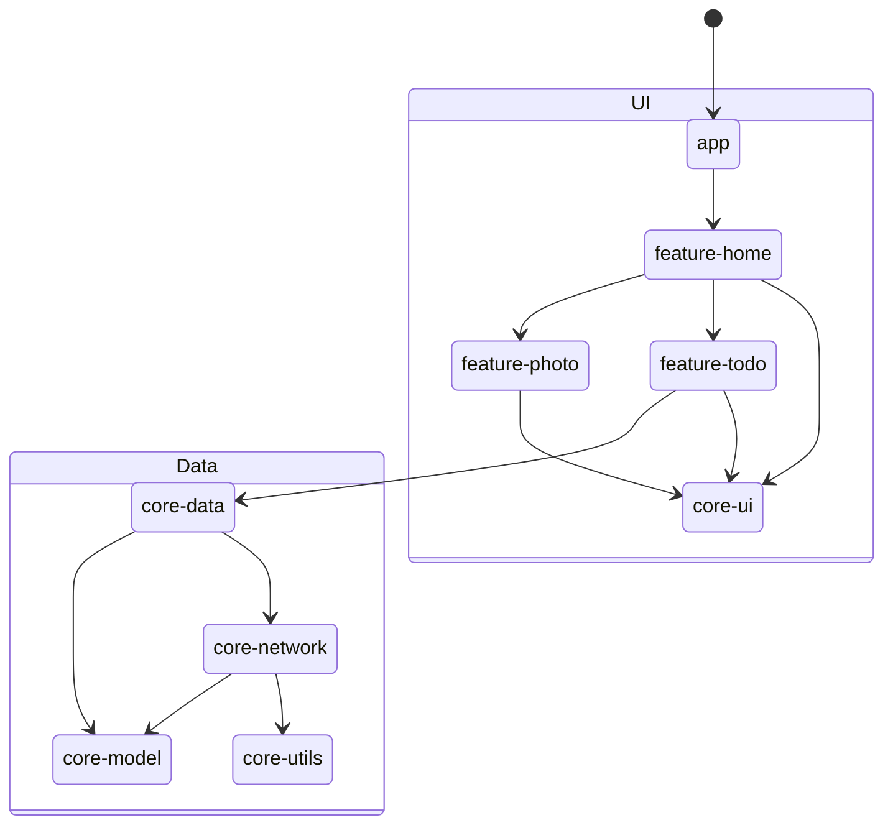
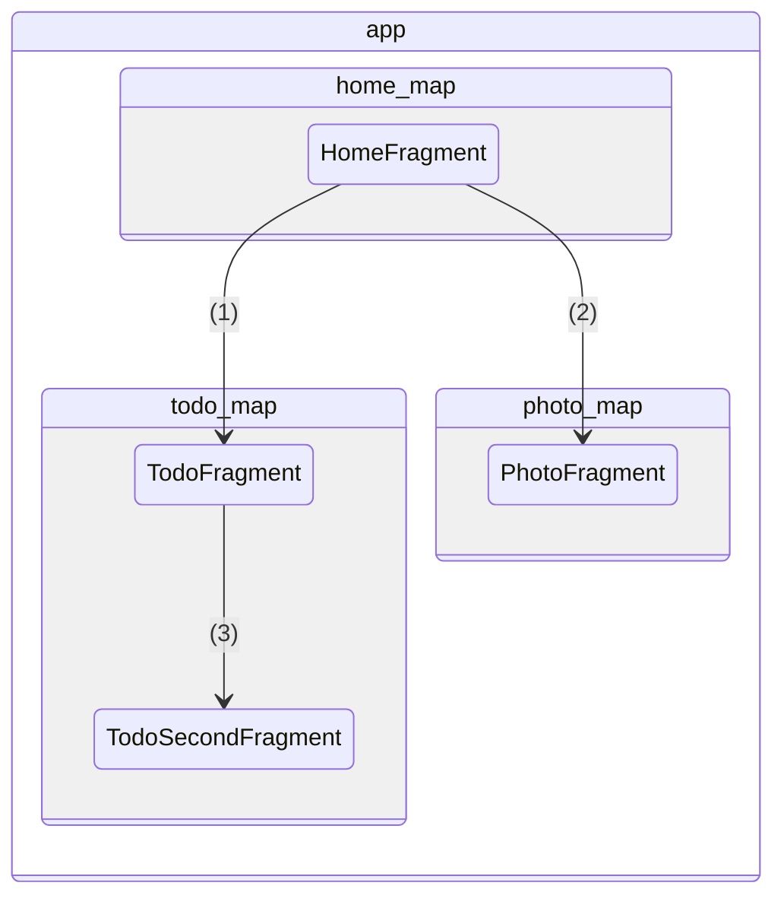
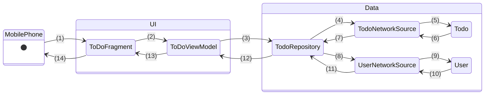

# Sample App Tutorial

Continuing from the `Getting Started` section, this tutorial introduces a starter app designed as a template for new mobile interfaces for The World Avatar. Our goal is to guide users through the Model-View-ViewModel (MVVM) architecture pattern, which cleanly separates the UI logic from the data layer.

In this tutorial, we'll demonstrate the implementation of fragments according to the MVVM pattern, namely for app navigation and how the views can be updated by the data layer in response to user interactions. As mentioned, the application is structured into three modules:

- `app` serves as the main entrypoint into the application, which starts a single activity.
- `core` contains mainly the data layer components and some reusable UI components.
- `feature` contains the user-facing functionalities for our application, which typically is implemented as a fragment for user interactions.

The diagram below depicts the overall workflow of the app within the UI - Data layers. Do note that the diagram does not illustrate the code dependencies accurately and is mainly to explain the logic flow.



## 1. Navigation

Navigation refers to the interactions that let users navigate across, into, and back out from the different pieces of content within your app. The [Navigation component](https://developer.android.com/guide/navigation) provides visualisation for the app's navigation paths and handles low level fragment transactions. It works seamlessly with the single activity and multi fragments design compared to the older `startIntent()` and `FragmentManager` navigation methods. 

### Example: Sample App Navigation Explain

Navigation related files:
- app navigation graph: `/app/src/main/res/navigation/app_navigation.xml`
- home feature module graph: `/feature/home/src/main/res/navigation/home_map.xml`
- todo feature module graph: `/feature/todo/src/main/res/navigation/todo_map.xml`
- photo feature module graph: `/feature/photo/src/main/res/navigation/photo_map.xml`
- util core module to store all deep link constants: `/core/utils/src/main/res/values/navigation_link.xml`



- The first fragment shown for this app is the `HomeFragment`
- `app` contains all the sub-navigation graph `home_map` in `feature:home`, `todo_map` in `feature:todo` and `photo_map` in `feature:photo`.
- `todo_map` contains two fragments 
- Navigation stack is used to record the user's navigation history. Return to the last destination with `navigateUp()`, so the back navigation link is not implemented in the graph. This is demonstrated in the fragments of `feature:todo` and `feature:photo`.

Step description:
1. Click 'Todo' button to go to TodoFragment; This navigation is done by deep link beause it is cross modules and not able to reference the action id in `feature:todo` from `feature:home`
2. Click 'Photo' button to go to PhotoFragment; This navigation is done by deep link
3. Click 'Go to Second Page' button to go to TodoSecondFragment; This navigation is done by action


### Setup

To setup the Navigation component, simply include the dependency in the `build.gradle`. 

```groovy
    def nav_version = '2.7.5'
    implementation "androidx.navigation:navigation-fragment:$nav_version"
    implementation "androidx.navigation:navigation-ui:$nav_version"
```

This sample app defines these dependency in `ui.gradle` which is applied by all ui related modules (eg. app, features).

### Navigation Graph

The navigation graph is a data structure that contains each destination within your app and the connections between them. `app` component has the complete navigation graph by inluding subgraphs defined in `feature` modules. The navigation graph in `feature` modules define the transition between the fragments within the feature module. 

The complete navigation graph is hosted by the `MainActivity` with `FragmentContainerView` in the layout  file `activity_main.xml`.

```xml
    <androidx.fragment.app.FragmentContainerView
        android:name="androidx.navigation.fragment.NavHostFragment"
        app:navGraph="@navigation/app_navigation"
        app:defaultNavHost="true"
        android:id="@+id/nav_host_fragment"
        android:layout_width="match_parent"
        android:layout_height="match_parent" />
```
Fragments are hosted in this container view and managed by the navigation framework. If the app has common app bar and navigation bar, they should be defined outside of this `FragmentContainerView`. An overview of the sample app's navigation can be found in [Example: Sample App Navigation Explain](#example-sample-app-navigation-explain).

### Navigation Methods

There are two ways of navigating from one destination to another: [deep link](https://developer.android.com/guide/navigation/design/deep-link) and action.

Deep link has two types and it is used for cross module navigation in this sample app.
- explicit deep link: A `PendingIntent` that take users to a specific location in the app. It is mainly used in notification or an app widget, such that when user clicks on the widget the user will be directed to the specified location. The navigation stack will be reset.
- implicit deep link: A URI for a specific destination in the app. A common use case is when user clicks a link in browser (such as shopping webpage), the app will be opened and navigated to a specific location. Another use case for this type of link is to navigate across modules, which is used in this sample app. Depend on other setting, the navigation stack may or may not be resetted.

Because independent feature modules cannot see each other, IDs cannot be used to navigate to destinations in other modules. Instead, use a deep link to navigate directly to a destination that is associated with an implicit deep link.

Define the deep link in the handling fragment in navigation map. The following example demonstrate the PhotoFragment in photo_map.xml which will be navigated from HomeFragment.
```xml
<navigation xmlns:android="http://schemas.android.com/apk/res/android"
    xmlns:app="http://schemas.android.com/apk/res-auto"
    xmlns:tools="http://schemas.android.com/tools"
    android:id="@+id/photo_map"
    app:startDestination="@id/photo_fragment">

    ...

    <fragment android:id="@+id/photo_fragment"
        android:name="uk.ac.cam.cares.jps.photo.PhotoFragment"
        tools:layout="@layout/photo_fragment">
        <deepLink
            app:uri="@string/photo_fragment_link">
        </deepLink>
    </fragment>

</navigation>
```
In HomeFragment, navigate to PhotoFragment with the following command:
```java
NavDeepLinkRequest request = NavDeepLinkRequest.Builder
        .fromUri(Uri.parse(getString(uk.ac.cam.cares.jps.utils.R.string.photo_fragment_link)))
        .build();
NavHostFragment.findNavController(this).navigate(request);
```
When navigating using URI across module, the back stack is not reset. 

Navigation with action happens within module, where you can retrieve the action or the destination's ID. Define the action in the navigation map (the example is from `todo_map.xml`)

```xml
<navigation xmlns:android="http://schemas.android.com/apk/res/android"
    xmlns:app="http://schemas.android.com/apk/res-auto"
    xmlns:tools="http://schemas.android.com/tools"
    android:id="@+id/todo_map"
    app:startDestination="@id/todo_fragment">

    <fragment android:id="@+id/todo_fragment"
        android:name="uk.ac.cam.cares.jps.todo.TodoFragment"
        tools:layout="@layout/todo_fragment">
        ...
        <action
            android:id="@+id/action_todo_fragment_to_todo_second_setting"
            app:destination="@id/todo_second_fragment" />
    </fragment>

  ...

</navigation>
```

Navigate to the TodoSecondFragment from TodoFragment with the following code
```java
NavHostFragment.findNavController(this).navigate(R.id.action_todo_fragment_to_todo_second_setting)
```

### Data Transfer between different Destinations
If you are using action for navigation, you may [pass data between different destinations](https://developer.android.com/guide/navigation/use-graph/pass-data#bundle) with `Bundle` objects. However, TWA app promotes multi modules design for reusability. Therefore we recommend share data between ViewModel or singleton Repository.

To share data through ViewModel, the data should be class member of the ViewModel and the ViewModel should be attached to the activity lifecycle. It can also be considered as sharing data through the hosting activity. When in a new fragment, the shared data can be retrieved by creating the same ViewModel with activity lifecycle and it will be the same instance as in the previous fragment since the activity lifecycle hasn't ended.
```java
// create TodoViewModel instance which has activity lifecycle
new ViewModelProvider(requireActivity()).get(TodoViewModel.class);
```

To share data through Singleton Repository is similar to the ViewModel method except it is attaching to the application's lifecycle. Fisrt use Hilt to create the repository instance and inject it in ViewModel. 

```java
// In TodoRepository.java
public class TodoRepository implements GenericRepository<TodoWithUser> {
  private String userName;

  ...

  public String getUserName() {
    return userName;
  }
}
```

```java
// In DataModule.java
@Provides
@Singleton
public GenericRepository<TodoWithUser> provideTodoRepository(NetworkSource<Todo> todoNetworkSource, NetworkSource<User> userNetworkSource) {
    return new TodoRepository(todoNetworkSource, userNetworkSource);
}
```

```java
// In TodoViewModel.java
@HiltViewModel
public class TodoViewModel extends ViewModel {
  private final GenericRepository<TodoWithUser> todoRepository;
  
  @Inject
  public TodoViewModel(GenericRepository<TodoWithUser> todoRepository) {
      this.todoRepository = todoRepository;
  }

  public String getUserName() {
    return todoRepository.getUserName();
  }

  ...
}
```

Then create ViewModel instance in the second fragment and read the data from repository.
```java
public class TodoSecondFragment extends Fragment {
  ...
  @Nullable
  @Override
  public View onCreateView(@NonNull LayoutInflater inflater, @Nullable ViewGroup container, @Nullable Bundle savedInstanceState) {
    todoViewModel = new ViewModelProvider(this).get(TodoViewModel.class);
    ...
  }

  @Override
  public void onViewCreated(@NonNull View view, @Nullable Bundle savedInstanceState) {
      ...

      String userNameRetrieved = todoViewModel.getUserName();
  }
}
```
This only works for **Singleton** repository.

## 2. View Model Updates

In the `ToDoFragment`, the view model is initially empty, resulting in a blank page on the second half. When an user taps on the `Get Todo` button, the view model retrieves data from the API through the Data Layer, and updates their state. If there are values, the `ToDoFragment` view will be populated with the retrieved data. We demonstrate this as TWA apps will typically retrieve data from agents, which are similar to APIs.

We depict an example of the Android app workflow (`Data Source - Repository - State Holders/ViewModel - UI elements`) below:



Description of steps:

1. Click 'Get Todo' button
2. Call `getTodoAndUser()`
3. Call `getTodoAndUserInfo(String, RepositoryCallback)`; The `RepositoryCallback` instance is defined in `TodoViewModel` and tells `TodoRepository` what to do once it receives the result
4. Call `getTodo(String, Response.Listener<Todo>, Response.ErrorListener)`
5. Parse the network response into a `Todo` object
6. Returns data in a `Todo` object
7. Notify `TodoRepository` that the data has been returned successfully with `Response.Listener<Todo>`
8. Passes `Todo` data model to retrieve the associated user data by calling `getUser(String, Response.Listener<User>, Response.ErrorListener)`
9. Parse the network response into a `User` object
10. Returns data in a `User` object
11. Notify `TodoRepository` that the data has been returned successfully with `Response.Listener<User>`
12. Notify `TodoViewModel` that the data has been returned successfully via `RepositoryCallback<Pair<Todo, User>>`
13. Updates the data using the observer function via `MutableLiveData` \_todo and \_user, which also updates their `LiveData` counterparts; The observer triggers whenever changes to the object values are detected
14. Updates the user interface with the retrieved data

## 3. Building the app

1. Open the `SampleApp` folder in Android Studio
2. Click on the `Run 'app'` button or `Shift + F10`
3. The app should run in the selected emulator after building

## 4. Dependency Injection
This project uses [Hilt](https://developer.android.com/training/dependency-injection) for dependency Injection. For basic definition and example of dependency injection, please refer to [this](https://developer.android.com/training/dependency-injection). This section covers a summary of the dependency injection tags used in this project and the files for dependency injection declaration. 

### Dependency Injection Tags
Android Specific
- `@HiltAndroidApp`: Trigger Hilt's code generation. It is added in app module's `SampleApplication.java`.
- `@AndroidEntryPoint`: An annotation adds to the Android class that needs dependency injection. Hilt currently supports `Activity`, `Fragment`, `View`, `Service`, `BroadcastReceiver`. It is added in `MainActivity.java`, `TodoFragment.java`.
- `@HiltViewModel`: An annotation adds to ViewModel for dependency injection. It is added in `TodoViewModel.java` to inject `TodoRepository` instance from core-data.
- `@ApplicationContext`: Inject application context. It is used in the core `NetworkModule.java`. 

General
- `@Inject`: Indicate that a variable is initialized with dependency injection. It can be used with constructor to indicate that all the variables are injected. It can also be used on a specific class member variable for injection. 
- `@Module`:  Define modules which are resposible for providing instances with `@Provides` and specifying interface default implementation with `@Binds`. It is used in `NetworkModule.java` and `DataModule.java` to indicate what instances to be injected for network sources and repositories.
- `@InstallIn`: To tell Hilt which Android class each module will be used or installed in. In this project, `SingeltonComponent.class` is used to install the dependecy as singelton.
- `@Provides`: Specify what instance will be injected for a certain class.  
- `@Singleton`: Indicate the injected instance is a singleton.

### Example
This section shows how a TodoViewModel object is created with dependency injection.

1. TodoViewMpdel dependes on TodoRepository. TodoRepository is provided by `DataModule.java` in core-data.
2. TodoRepository depends on TodoNetworkSource and UserNetworkSouce which are provided by `NetworkModule.java` in core-network.
3. TodoNetworkSource and UserNetworkSouce depends on Context, which is provided with `@ApplicationContext` and defined in `NetworkModule.java`. 