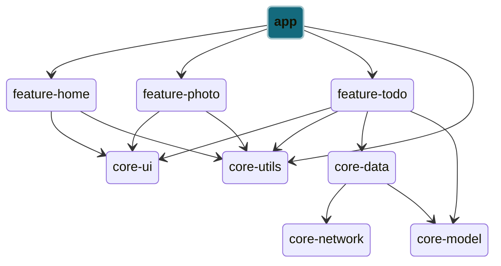

# App Module

This module hosts the main activity that serves as the primary entry point for user interaction between fragment views, as well as manage application-level configurations.

Within the dependency graph, the app module occupies the top level i.e. the first activity to start whenever users open the app. No other module can depend on the app module to prevent circular dependencies and breaking the compilation process.
As the entrypoint, the module will have to host the navigation graph to link the feature fragments and allow users to navigate between the different views created by these fragments.

It is recommended to set your common layout design in this module, including:

- Display content edge-to-edge in your app behind the system bars (status and navigation bar)
- Setting an app bar to navigate within the app at the top
  - We recommend that the app bar is configured separately in each feature to allow different design layouts as features may have different design patterns (a map view vs list view)

Common configuration for **application and activity level context** should also be set up here.
We typically only configure the activity level context to persist the View Models (data) beyond the lifecycle of the fragment. In Android, ViewModels are scoped to the lifecycle of an activity or fragment. When using ViewModel in a fragment, it's typically tied to the fragment's lifecycle, meaning it's destroyed when the fragment is destroyed. And the activity level context can be used to create the View Model so that it remains alive as long as the main activity is alive.

Application level context are usually handled by Hilt for any dependecy injection, and may not be implemented here.

At the moment, we do not recommend testing this module as it primarily uses only standardised library code, which doesn't warrant testing.
