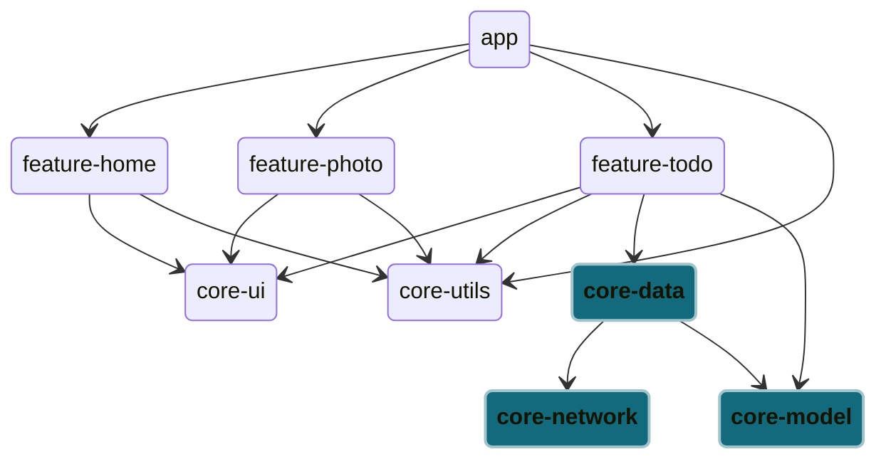

# Core module

This module contains shared resources for UI elements in the `feature` module, as well as all server-side code at the Data Layer. 

The Data Layer level comprises of the [data](./data/), [model](./model/), and [network](./network/) modules. Any `ViewModel` instances at the UI Layer are expected to call the data module at the Data Layer, which interacts with the network and model modules, as depicted below:

The [ui](./ui/) module contains shared UI related resources (eg. shared drawable, themes, values) and functions that are implemented by the fragments in the `feature` module. Do **NOT** put any View or View Models in this module.

The [utils](./utils/) module contains shared general resources (eg. network configuration, deep navigation link, dev credentials, strings) and functions (eg. provide `RequestQueue` and host `RepositoryCallback`). Although the `RequestQueue` object is a class for network connections, we have implemented the code in the `utils` module over `network` so that multiple modules depending on network connection can reuse the same Singleton instance. Similarly, `RepositoryCallback` is hosted in this modules because repositories in other individual modules may depend on this to send data in between UI layer and data layer as well. An example for the case is the optional `login` module which requires network connection and send data to UI layer.

Given the description provided, we recommend to copy the `ui` and `utils` module when starting a new mobile interface/ project. Furthermore, this implementation of modularisation decouples modules and enhances testability by isolating concerns. Accordingly, we recommend that unit tests are focused on the `core` modules.