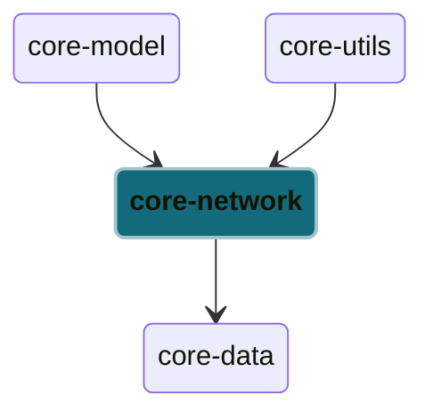

# Network Module

The network module is crucial for fetching and managing data from remote APIs to populate the Android application.
Each type of data has its own network source implementation and parser, providing a clear separation of concerns and allowing for easy maintenance and scalability.
Moreover, these network sources are designed to be singleton instances, ensuring efficient memory usage and consistent behavior across the application.

Notes:

- It is recommended to keep any local data sources in a separate module
- Using a single instance of the `RequestQueue` object is advised to streamline network operations and prevent issues. This instance is provided by the `utils` module.

## Testing

We recommend creating an interface for each group of network data sources to facilitate the creation of test doubles when unit testing the repositories. In this tutorial, `NetworkSource` is the interface that will be implemented for the API endpoints of ToDo and User. 

We recommend creating a separate `NetworkResponseParser` class to parse the network responses into the required data models. This allows for the parsing methods to become unit testable. This allows us to circumvent the mocking of network operations in the `NetworkSource` implementations during the unit test.

## Dependency Graph

