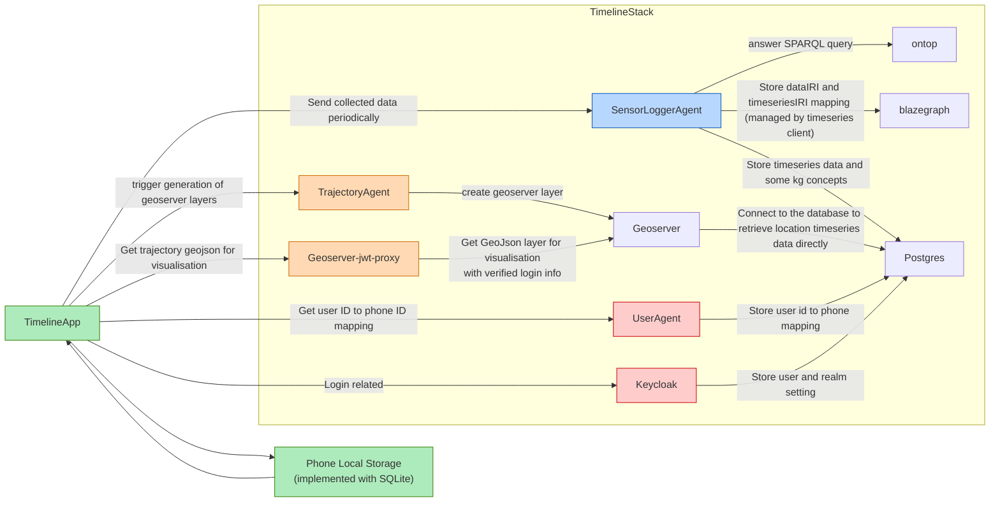

# Timeline App
This is an app for recoding sensor data and visualise user trajectories.
- User login
- Visualise trajectories
- Record sensor data, including location, acceleration, light ambient and noise level etc.

## Development Setup
### Stack
This app serves as a frontend application and should be connected to a running stack for the complete functionalities.
The stack should include the following services:
- SensorLoggerMobileAppAgent
- AccessAgent
- UserAgent
- TrajectoryQueryAgent
- Keycloak

Please launch the corresponding services in the stack.

### App
#### Login
Please add in the client configuration and auth service information in [auth_config.json](https://github.com/cambridge-cares/TheWorldAvatar/blob/main/Apps/TimelineApp/core/login/src/main/res/raw/auth_config.json) in the core/login module

`authorization_endpoint_uri`, `token_endpoint_uri`, `registration_endpoint_uri` and `user_info_endpoint_uri` can be left blank and the app will retrieve these uri with the `discovery_uri` provided.

#### Network Endpoint
Please add the stack address to `host_with_port` in [network_config.xml](https://github.com/cambridge-cares/TheWorldAvatar/blob/main/Apps/TimelineApp/core/utils/src/main/res/values/network_config.xml) in core/utils nodule.
> Example of `host_with_port` http://localhost:3838

#### Mapbox
Please configure your development machine as described in [here](https://docs.mapbox.com/android/maps/guides/install/#configure-credentials).

Add the Mapbox public key to [developer_config.xml](https://github.com/cambridge-cares/TheWorldAvatar/blob/main/Apps/TimelineApp/core/utils/src/main/res/values/developer_config.xml).

#### Resource files
Due to Github repo size limitation and version control principle, some of the binary resource files are not uploaded to Github. Please find them from [dropbox](https://www.dropbox.com/scl/fo/930lk4k3lvkav6hqts4y8/ADA97XfhCI-xaa7NUQOk4s4?rlkey=lsqhp3bbzl98r3pee8f0fd1ry&st=7cxbcfin&dl=0) and place the files to your project.

```
feature
|_ user
   |_ src
      |_ main
         |_ res
            |_ drawable
```

## Design document

### App and backend services interactions

This diagram shows the interactions between the TimelineApp, remote services and local storage interactions. 
- Green boxes: app related and hosted on phone
- Orange boxes: trajectory visualisation
- Red boxes: user and login related services
- Blue boxes: sensor data recording

Relevant agents
- [SensorLoggerMobileAppAgent](https://github.com/cambridge-cares/TheWorldAvatar/tree/main/Agents/SensorLoggerMobileAppAgent) 
  - Down sampled and add timeseries sensor data to Postgres
  - Add ontop mapping for OntoDevice mobile app sensors
  - Add timeseries triples to blazegraph
- [GeoServerJwtProxy](https://github.com/cambridge-cares/TheWorldAvatar/tree/main/Agents/utils/GeoServerJwtProxy)
  - Check Bearer token validity. 
  - Extract the user ID to form the Usert IRI and forward the request to Georserver to make sure the user is retrieving his/her own trajectories
- [UserAgent](https://github.com/cambridge-cares/TheWorldAvatar/tree/main/Agents/UserAgent)
  - Add mapping of user ID to app ID to Postgres
- [TrajectoryQueryAgent](https://github.com/cambridge-cares/TheWorldAvatar/tree/main/Agents/TrajectoryQueryAgent)
  - Create virtual table in Geoserver for trajectory visualisation
  - Add ontop mapping for device and sensors following [OntoDevice](https://github.com/TheWorldAvatar/ontology/tree/main/ontology/ontodevice)