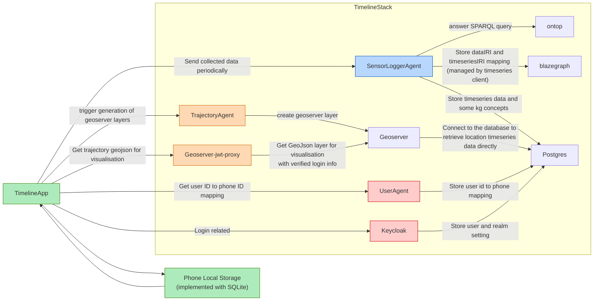
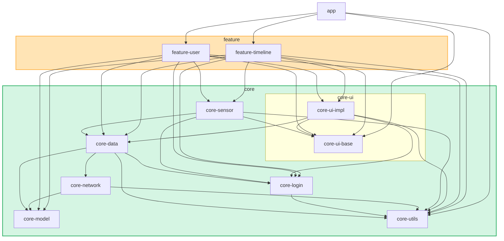
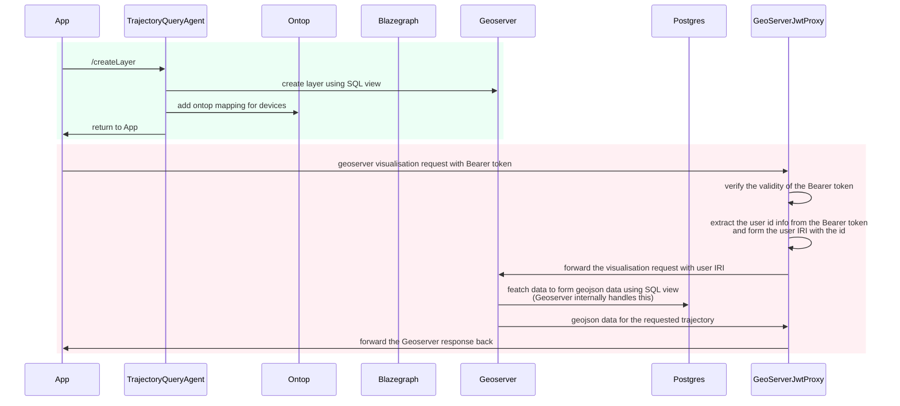

# Timeline App
- [Timeline App](#timeline-app)
  - [Development Setup](#development-setup)
    - [Stack](#stack)
    - [App](#app)
      - [Login](#login)
      - [Network Endpoint](#network-endpoint)
      - [Mapbox](#mapbox)
      - [Sensor logging config](#sensor-logging-config)
      - [Resource files](#resource-files)
  - [Design document](#design-document)
    - [App and backend services interactions](#app-and-backend-services-interactions)
    - [App Architecture](#app-architecture)
      - [app](#app-1)
      - [feature](#feature)
      - [core](#core)
      - [core-ui](#core-ui)
    - [Trajectory visualisation sequence diagram](#trajectory-visualisation-sequence-diagram)
    - [Sensor data collection related design document](#sensor-data-collection-related-design-document)


This is an app for recoding sensor data and visualise user trajectories.
- User login
- Visualise trajectories
- Record sensor data, including location, acceleration, light ambient and noise level etc.

## Development Setup
### Stack
This app serves as a frontend application and should be connected to a running stack for the complete functionalities.
The stack should include the following services:
- SensorLoggerMobileAppAgent
- AccessAgent
- UserAgent
- TrajectoryQueryAgent
- Keycloak

Please refer to [timeline-stack](https://github.com/cambridge-cares/TheWorldAvatar/tree/main/Deploy/stacks/timeline) for more information about development and production setup.

### App
#### Login
Please add in the client configuration and auth service information in [auth_config.json](https://github.com/cambridge-cares/TheWorldAvatar/blob/main/Apps/TimelineApp/core/login/src/main/res/raw/auth_config.json) in the core/login module

`authorization_endpoint_uri`, `token_endpoint_uri`, `registration_endpoint_uri` and `user_info_endpoint_uri` can be left blank and the app will retrieve these uri with the `discovery_uri` provided.

#### Network Endpoint
Please add the stack address to `host_with_port` in [network_config.xml](https://github.com/cambridge-cares/TheWorldAvatar/blob/main/Apps/TimelineApp/core/utils/src/main/res/values/network_config.xml) in core/utils nodule.
> Example of `host_with_port` http://localhost:3838

#### Mapbox
Please configure your development machine as described in [here](https://docs.mapbox.com/android/maps/guides/install/#configure-credentials).

Add the Mapbox public key to [developer_config.xml](https://github.com/cambridge-cares/TheWorldAvatar/blob/main/Apps/TimelineApp/core/utils/src/main/res/values/developer_config.xml).

#### Sensor logging config
The physical sensor pulling frequency is configured in [sensor_config.json](./core/sensor/src/main/assets/sensor_config.json). The available values can be found from [Android sensor overview](https://developer.android.com/develop/sensors-and-location/sensors/sensors_overview#sensors-monitor).

The frequency of flushing data to local source and uploading data to remote server are configured in [sensor_settings_config.json](./core/sensor/src/main/assets/sensor_settings_config.json).

#### Resource files
Due to Github repo size limitation and version control principle, some of the binary resource files are not uploaded to Github. Please find them from [dropbox](https://www.dropbox.com/scl/fo/930lk4k3lvkav6hqts4y8/ADA97XfhCI-xaa7NUQOk4s4?rlkey=lsqhp3bbzl98r3pee8f0fd1ry&st=7cxbcfin&dl=0) and place the files to your project.

```
feature
|_ user
   |_ src
      |_ main
         |_ res
            |_ drawable
```

## Design document

### App and backend services interactions

This diagram shows the interactions between the TimelineApp, remote services and local storage interactions. 
- Green boxes: app related and hosted on phone
- Orange boxes: trajectory visualisation
- Red boxes: user and login related services
- Blue boxes: sensor data recording

Relevant agents
- [SensorLoggerMobileAppAgent](https://github.com/cambridge-cares/TheWorldAvatar/tree/main/Agents/SensorLoggerMobileAppAgent) 
  - Down sampled and add timeseries sensor data to Postgres
  - Add ontop mapping for OntoDevice mobile app sensors
  - Add timeseries triples to blazegraph
- [GeoServerJwtProxy](https://github.com/cambridge-cares/TheWorldAvatar/tree/main/Agents/utils/GeoServerJwtProxy)
  - Check Bearer token validity. 
  - Extract the user ID to form the Usert IRI and forward the request to Georserver to make sure the user is retrieving his/her own trajectories
- [UserAgent](https://github.com/cambridge-cares/TheWorldAvatar/tree/main/Agents/UserAgent)
  - Add mapping of user ID to app ID to Postgres
- [TrajectoryQueryAgent](https://github.com/cambridge-cares/TheWorldAvatar/tree/main/Agents/TrajectoryQueryAgent)
  - Create virtual table in Geoserver for trajectory visualisation
  - Add ontop mapping for device and sensors following [OntoDevice](https://github.com/TheWorldAvatar/ontology/tree/main/ontology/ontodevice)

### App Architecture


The diagram shows the dependencies between modules.
#### app
All other module should **never** depend on the app module to avoid cyclic dependnecy.
- app: highest level container of the app. It contains Application and Activity level settings and hosts navigation graph of the app.
  
#### feature
Modules under feature are in UI layer. They **should not** have dependency on each other and can only depends on core modeules.
- feature-user: contains all fragments, viewmodels and resources files for all user related functions, such as 
  - landing page
  - user setting page
  - sensor setting page and 
  - help documents
- feature-timeline: contains all fragments, viewmodels and resources for map and trajectory visualisation functions.

#### core
Modules in core are mainly in data layer or designed to be shared by other modules. They can depends on other core modules but **should not** depend on feature or app modules. To make modules easy to be reused, some modules may contain ui components (ViewModel), network source and repository.
- core-sensor: sensor recording related code. It consists of 
  - source:
    - network: responsible for sending data to remote service
    - database: manage app local storage for files backup
    - handler: manage all physical sensor and the data collection
    - activity: manage the call to activity recognition API
    - state: corresponding to sensor collection state at runtime (/in memory) and storage in local SharedPreference file
    - worker: launch tasks on worker thread
  - ui: viewmodel for recording state
  - data: repository files  
- core-login: contains login related code, such as authentication state management and sending request to auth server for login and logout.
  - Contain its own network source and reporsitory
  - Take reference from [AppAuth](https://github.com/openid/AppAuth-Android)
- core-network: Timeline app specific network sources
- core-data: Timeline app specific repositories
- core-model: consist of shared data models
- core-utils: contains shared settings and util functions, such as network setting and mapbox setting.

#### core-ui
- core-ui-base: contains all static UI files, such as themes, colors, values, drawables and static UI component.
- core-ui-impl: contains shared ViewModel and UI components that use the shared ViewModel. ViewModel placed in this folder can be referenced by fragments in different `feature` modules and usually have Activity lifecycle (eg. App preference setting, user account state).

### Trajectory visualisation sequence diagram

The above diagram illustrates the interactions between the app and remote services when the app visualises trajetory. 
- Blue box: call TrajectoryQueryAgent to create SQL view layers in Geoserver and add ontop mapping to Ontop. *Notice*: This block is called each time the app visualises trajectory. Repeatedlly calling the `/createLayer` endpoint won't cause multiple layers generation. 
- Pink box: the acutal visualisation call is sent to GeoserverJwtProxy and Geoserver.

### Sensor data collection related design document
Please refer to the [sensor module](core/sensor/README.md) for more details. 
