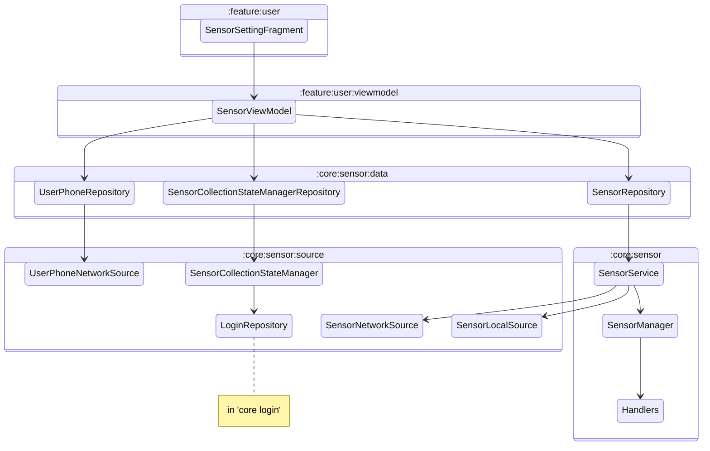

# Sensor Module
The module responsible for all sensor recording logics, including:
- Start/stop sensors
- Get data from sensors
- Send collected data in batches to server
- Store collected data locally as backup copy (work in progress)
- Record the current state of sensor recording
- Run the sensor recording, sending and storing logic as foreground service

Refer to the following diagram for the dependencies between classes

- SensorSettingFragment: A fragment class in `:feature:user` which provides the user interface for user to control the sensor recording
- SensorViewModel: A viewmodel class in `:feature:user:viewmodel` which handles the communication between UI and repository
- UserPhoneRepository: A repository level component that provide UserPhoneNetworkSource access to UI level. It register device id to user id.
- SensorCollectionStateManagerRepository: A repository level component which provide SensorCollectionStateManager functions to higher level components or other repositories. It runs provided functions with requested SensorCollectionState and clears SensorCollectionState.
- SensorRepository: A repository level component that provides control of sensor collection to UI level component.
- UserPhoneNetworkSource: A network source that registers the current phone to the logged in user.
- SensorCollectionStateManager: A source class that read and write encrypted sensor collection state with user information to local storage. 
- SensorLocalSource: A local source that stores collected data to local database
- SensorNetworkSource: A network source that is responsible for sending the collected data to the remote server
- SensorService: A foreground service that keeps the data collection, sending and storing running. It triggers the sending and storing of data.
- SensorManager: A class that manages all the sensor handlers
- Handlers: Handler class manages the corresponding physical sensor and collect data from the physical sensor.