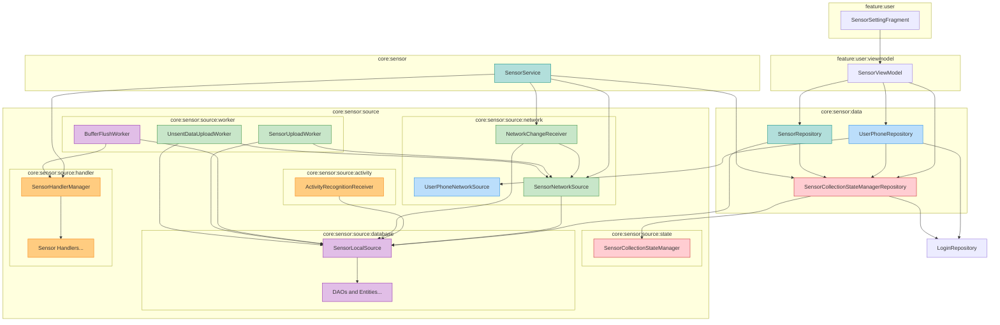
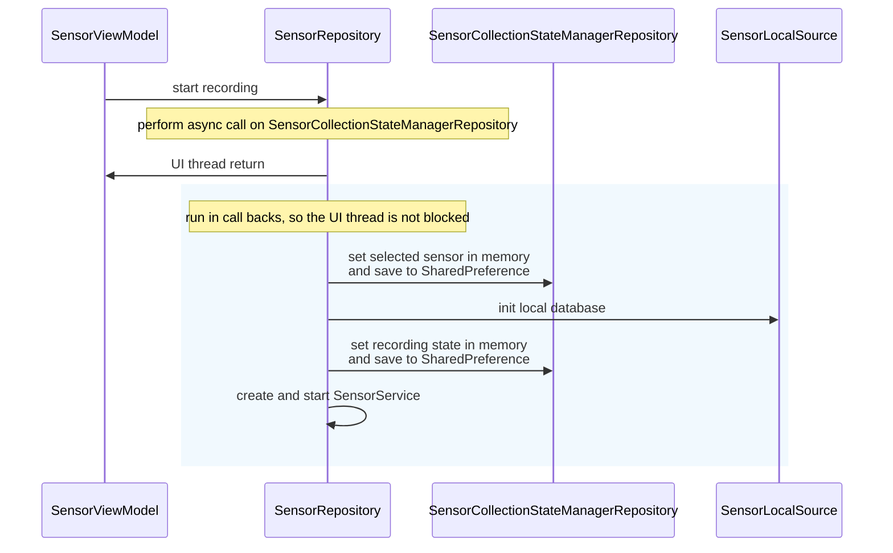
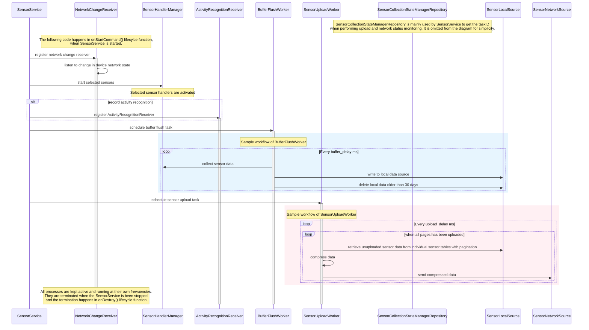
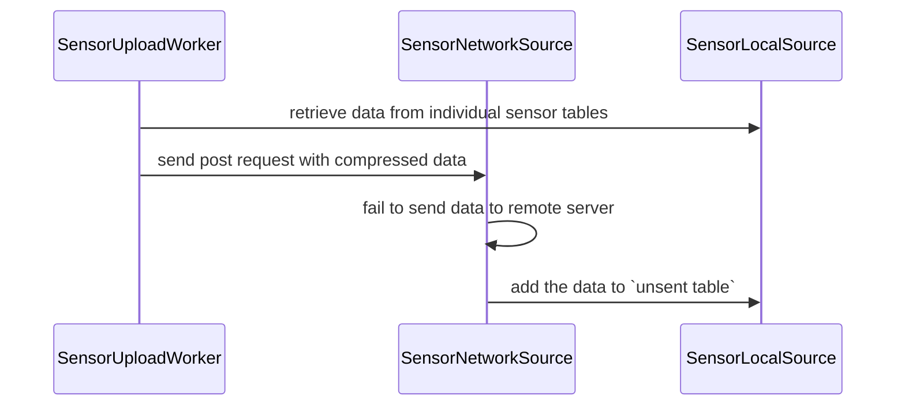
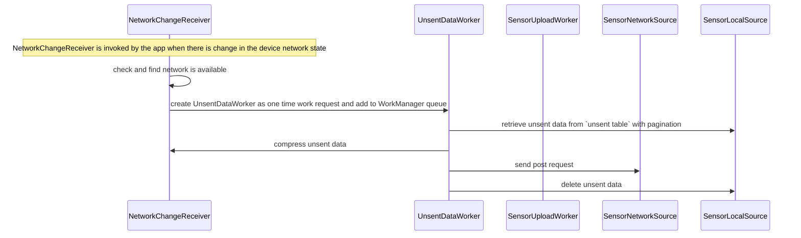

# Sensor Module
- [Sensor Module](#sensor-module)
  - [Architecture Design](#architecture-design)
  - [Sensor recording: normal flow](#sensor-recording-normal-flow)
  - [Sensor recording: handling unsent data](#sensor-recording-handling-unsent-data)
    - [UnsentData table design](#unsentdata-table-design)

The module responsible for all sensor recording logics, including:
- Start/stop sensors
- Get data from sensors
- Send collected data in batches to server
- Store collected data locally as backup copy
- Record the current state of sensor recording
- Run the sensor recording, sending and storing logic as foreground service


## Architecture Design
Refer to the following diagram for the dependencies between classes in sensor module.


- $\textcolor{#00897B}{\text{Recording process}}$: related to recording process (foreground service declaration, start/stop the service)
- $\textcolor{#388E3C}{\text{Network functions}}$: related to network functions for sensor data. Includes uploading data to remote server and detecting device network changes
- $\textcolor{#8E24AA}{\text{Local storage}}$: related to app local storage
- $\textcolor{#F57C00}{\text{Sensor data collection}}$: related to sensor data collection. Deals with the actual sensors and APIs that provide data
- $\textcolor{#C62828}{\text{Recording state management}}$: mainly used by UI. Includes state such as currently selected sensors, whether the app is recording data, 'device' ID, and foreground service task ID
- $\textcolor{#1E88E5}{\text{Phone ID and User ID registration}}$: registers 'device' ID to user ID

### UI level
- SensorSettingFragment: A fragment class in `:feature:user` which provides the user interface for user to control the sensor recording
- SensorViewModel: A viewmodel class in `:feature:user:viewmodel` which handles the communication between UI and repository

### $\textcolor{#00897B}{\textbf{Recording process}}$
- SensorRepository: A repository-level component that provides control of sensor collection to UI-level components.  
- SensorService: A foreground service that keeps data collection, sending, and storage running. It triggers the sending and storing of data. [Foreground services](https://developer.android.com/develop/background-work/services/fgs) make it less likely to be terminated by the Android OS.  

### $\textcolor{#388E3C}{\textbf{Network functions}}$
- SensorNetworkSource: A network source responsible for sending collected data to the remote server.  
- SensorUploadWorker: Handles periodic data uploads to the server.  
- NetworkChangeReceiver: Monitors network connectivity and handles unsent data when the network is restored.  
- UnsentDataUploadWorker: Handles reuploading of unsent data when the device is back online.  

### $\textcolor{#8E24AA}{\textbf{Local storage}}$
- SensorLocalSource: A local source that stores collected data in the local database.  
- BufferFlushWorker: Handles periodic flushing of data from memory to local storage.  

### $\textcolor{#F57C00}{\textbf{Sensor data collection}}$
- SensorManager: A class that manages all sensor handlers.  
- Sensor handlers: Classes that manage physical sensors and collect data from them.  
- ActivityRecognitionReceiver: A class that manages and collects activity data from the [Google Activity Recognition API](https://developers.google.com/location-context/activity-recognition).  

### $\textcolor{#C62828}{\textbf{Recording state management}}$
The recording states are logged to SharedPreference files. Each file uses a hashed user ID as its filename to differentiate state files generated by different accounts on the same device. The same file also stores other app preferences and states.  
- SensorCollectionStateManagerRepository: A repository-level component that provides `SensorCollectionStateManager` functions to higher-level components or other repositories. It executes provided functions with the requested `SensorCollectionState` and clears it afterward.  
- SensorCollectionStateManager: A source class that reads and writes encrypted sensor collection state with user information to local storage.  

### $\textcolor{#1E88E5}{\textbf{Phone ID and user ID registration}}$
- UserPhoneRepository: A repository-level component that provides access to `UserPhoneNetworkSource` for the UI layer. It registers the device ID to the user ID.  
- UserPhoneNetworkSource: A network source that registers the current phone to the logged-in user.  


## Sensor recording: normal flow
This section shows the normal flow of sensor recording.

The diagram below shows SensorViewModel trigger start recording. 

When start recording is triggered, SensorRepository performs async call to SensorCollectionStateManagerRepository to prepare to start the SensorService. UI thread is returned after the aysnc call to prevent non-responding UI, and the main logic of starting service is done in the callback of the async call. 

After the SensorService is started, it is run on separate thread and its life cycle is managed by the app and OS (not by the SensorRepository). 

The following diagram shows the work done by SensorService on `onStartCommand()` after it is started.



## Sensor recording: handling unsent data
This section shows the process that occurs when sensor data fails to upload to the remote server (e.g., due to a network issue or service downtime). This functionality ensures that no data is lost if a user loses
connection temporarily or goes offline by storing the unsent data locally and uploading it when the connection is restored.

The below diagram illustrates the case when data is not sent successfully.

Fresh data collected by sensors or APIs are stored in seperate sensor tables (eg. acceleration table, location table etc.) and retrieved by `SensorUploadWorker` under normal conditions. Data that fail to upload are moved to the `unsent table` in the call back of post request in `SensorNetworkSource`.

The following diagram shows the process when the device is back online.

NOTICE: 
- The current way of deleting unsent data isn't done in the call back of SensorNetworkSource. For the current employment, the unuploaded data will be added by SensorNetworkSource if it fails to upload so there won't be data lost. The code could be optimized further so the deletion of sent data and storing of unsent data can be in the same place.

### UnsentData table design
`UnsentData table` is designed in the way to facilitate fast retrieval. Each record corresponds to an unsent request, so the data field stores the serialized string of sensor data which reduces the processing time when reconstructing the post request during resending.
| Field | Description |
|--------|-------------|
| `int id` | Autogenerated ID that uniquely identifies each row in the table. |
| `String data` | Serialized map of `AllSensorData` from `sendPostRequest` that could not be uploaded. The data is serialized into a string in the `SensorNetworkSource` class and deserialized in `NetworkChangeReceiver` before being uploaded. |
| `String deviceId` | ID associated with the device the app is operating on. |
| `long timestamp` | Timestamp indicating when the unsent data is processed in `sendPostRequest` within `SensorNetworkSource`. |
| `String dataHash` | Unique hash code used to identify the batch of unsent data. |

To minimize the number of requests during the resend process, the code combines payloads with the same device ID within the retrieved batch of unsent data. Each POST request follows the `SensorLoggerMobileAppAgent` format.
```json
{
"messageId":21,
"sessionId":"7dc8a9c4-ccd4-4961-8b2b-568f414123b4",
"deviceId":"605a09c9-d6c5-4ba7-bc28-fe595d698b41",
"payload":
  [
    {"name":"accelerometer","accuracy":3,"time":1676967401045727000,"values":{...}},
    ...
  ]
}
```
