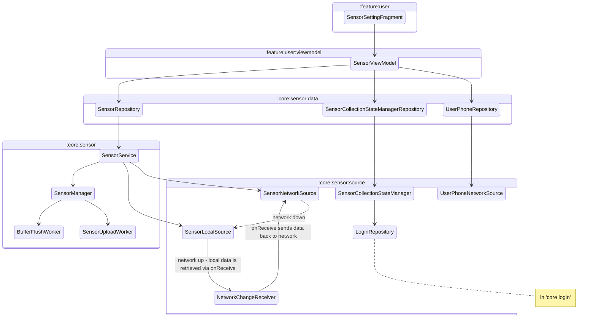

# Sensor Module
The module responsible for all sensor recording logics, including:
- Start/stop sensors
- Get data from sensors
- Send collected data in batches to server
- Store collected data locally as backup copy
- Record the current state of sensor recording
- Run the sensor recording, sending and storing logic as foreground service

Refer to the following diagram for the dependencies between classes

- SensorSettingFragment: A fragment class in `:feature:user` which provides the user interface for user to control the sensor recording
- SensorViewModel: A viewmodel class in `:feature:user:viewmodel` which handles the communication between UI and repository
- UserPhoneRepository: A repository level component that provide UserPhoneNetworkSource access to UI level. It register device id to user id.
- SensorCollectionStateManagerRepository: A repository level component which provide SensorCollectionStateManager functions to higher level components or other repositories. It runs provided functions with requested SensorCollectionState and clears SensorCollectionState.
- SensorRepository: A repository level component that provides control of sensor collection to UI level component.
- UserPhoneNetworkSource: A network source that registers the current phone to the logged in user.
- SensorCollectionStateManager: A source class that read and write encrypted sensor collection state with user information to local storage. 
- SensorLocalSource: A local source that stores collected data to local database
- SensorNetworkSource: A network source that is responsible for sending the collected data to the remote server
- SensorService: A foreground service that keeps the data collection, sending and storing running. It triggers the sending and storing of data.
- SensorManager: A class that manages all the sensor handlers
- BufferFlushWorker: Handles periodic flushing of data from memory to local storage.
- SensorUploadWorker: Handles periodic data uploads to the server.
- NetworkChangeReceiver: Monitors network connectivity and handles unsent data when the network is restored.

## Unsent Data Functionality
Overview:
The Unsent Data functionality is designed to manage sensor data that could not be uploaded to the
network due to connectivity issues. This functionality ensures that no data is lost if a user loses
connection temporarily or goes offline by storing the unsent data locally and uploading it when
the connection is restored.

Features:
Insert Unsent Data: Stores sensor data locally when the network is unavailable.
Retrieve Unsent Data: Retrieves all unsent data that needs to be sent once the network is back online.
Delete Unsent Data: Removes unsent data from local storage after it has been successfully uploaded.
Detect when the network is back online: Broadcast receiver uploads unsent data when it receives signal.
Delete Historical Data: Cleans up old historical data based on a defined cutoff time.

Data Flow:
SensorService --runs--> SensorManager --collects-data--> SensorService --sends-data--> SensorLocalService
& SensorNetworkService
if the app is online it successfully uploads data to local and network storage
if not:
sendPostRequest (located in SensorNetworkSource) catches the error and writes the un-uploaded data to
the unsentData table in local storage
sendPostRequest --> insertUnsentData
when the network goes back online:
NetworkChangeReceiver detects a change in network connectivity it will then: retrieve unsent data,
convert it to the correct form, send it back to sendPostRequest, and then delete the old unsent data
NetworkChangeReceiver --> LocalSensorSource --> NetworkChangeReceiver --> SensorNetworkSource

UnsentData Table:
int id --> autogenerated id to uniquely identify each row in the table

String data --> serialized map of AllSensorData from sendPostRequest that could not be uploaded.
The data is serialized into a string in the SensorNetworkSource class and then deserialized in
NetworkChangeReceiver before being uploaded.

String deviceId --> id associated with the device the app is operating on.

long timestamp --> time of when the unsent data is processed in sendPostRequest in SensorNetworkSource

String dataHash --> unique hash code to identify the batch of unsent data

Implementation Details:
1. Insert Unsent Data
   Unsent sensor data is stored in a local database using the UnsentDataDao interface. This process runs
   asynchronously through ExecutorService to avoid blocking the main application thread. ExecutorService
   is used to run the tasks related to unsent data in the background thread throughout NetworkChangeReceiver
   and SensorLocalSource.

2. Retrieve Unsent Data
   The retrieveUnsentData() method fetches all unsent data entries from the local database, which are
   then processed and sent to the network when connectivity is restored.

3. Delete Unsent Data
   Once the unsent data has been successfully uploaded, it gets removed from the unsent data table to
   free up space and ensure there's no duplication in the data.

4. Delete Historical Data
   Older data that is no longer needed is deleted to conserve space. The cutoff time has been configured
   in SensorService as 30 days - can be made shorter or longer if needed.

5. NetworkChangeReceiver: The NetworkChangeReceiver class extends Android's BroadcastReceiver class
   which is an android component that listens for an event as specified in the onReceive method.
   For our implementation, the NetworkChangeReceiver is triggered when the network is back online. This
   prompts the class to retrieve the unsent data, send it back to SensorNetworkSource and LocalSensorSource,
   and then delete it from the unsent data table. This operates on a background thread using
   ExecutorService so as not to crowd the main thread. Additionally, the receiver is registered in
   SensorService. This means that the receiver is only listening for network connectivity changes when
   SensorService has started, a.k.a. when the user has clicked start recording on the app. If the user
   stops recording prior to the app going back online it will only upload the data when the network
   has gone back online and the user has started recording again.

Error Handling:
Logging: Errors encountered during the insertion or deletion of unsent data are logged using
Android’s Log class for debugging purposes. If the data is not successfully uploaded, deleted, or the
process cannot be completed by the NetworkChangeReceiver those errors will be logged.

Future Improvements:
It might be helpful to instate batch processing or to remove the reflection call in the writeToDatabase method.
I am not sure but I think that could help improve efficiency, however it would increase the
amount of code of duplication and reduce the method's flexibility.