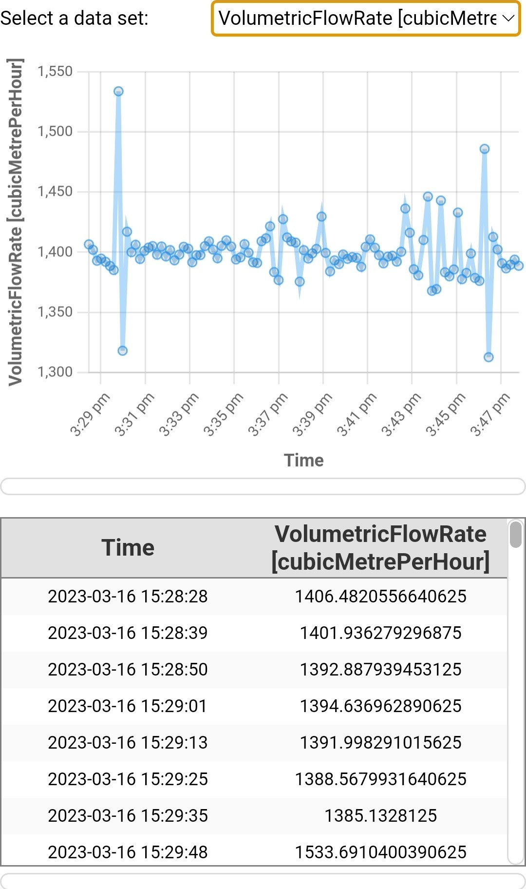
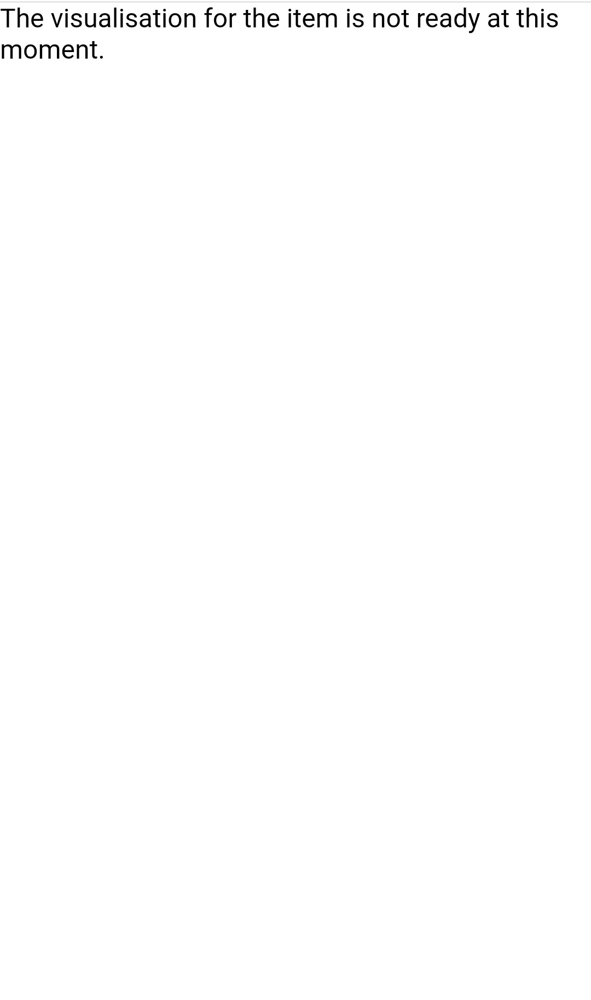

# BMS Visualisation 

This is a webapp project built with [DTVF](https://github.com/cambridge-cares/TheWorldAvatar/tree/main/web/digital-twin-vis-framework). It uses the time series module from DTVF for lab equipment data visualisation and is optimised for mobile device. The web page is part of the BMS Visualisation App.

# Restrictions

It should be noted that this project doesn't use the Cesium module in DTVF, and thus makes no use of Cesium's premium offering, Cesium Ion. 


# Setup

This project is designed to run in a docker container and needs a [Feature Info Agent](https://github.com/cambridge-cares/TheWorldAvatar/tree/main/Agents/FeatureInfoAgent), [Android Status Agent](https://github.com/cambridge-cares/TheWorldAvatar/tree/1517-dev-android-status-agent/Agents/AndroidStatusAgent), blazegraph and postgis database running in a stack. When the page is loaded, it will retrieve the equipment iri from Android Status Agent, then send this iri to Feature Info Agent, and the agent will get time series data and meta data from the blazegraph and postgis database. Therefore, for this web to display the graph, data should already exist in the blazegraph and postgis database running in the stack.

## Setup Feature Info Agent
### 1) Add Scripts to FeatureInfoAgent
Copy all `.sparql` files in `feature-info-agent-queries/` to `TheWorldAvatar/Agent/FeatureInfoAgent/queries`. 

Create `FeatureInfoAgent/queries/fia-config.json` if not exsits. Then append the queries section in `feature-info-agent-queries/fia-config.json` to `FeatureInfoAgent/queries/fia-config.json`.

More information about FeatureInfoAgent configuration can be found [here](https://github.com/cambridge-cares/TheWorldAvatar/tree/main/Agents/FeatureInfoAgent#configuration).

### 2) Add Config to Stack Manager
Follow this [deployment step](https://github.com/cambridge-cares/TheWorldAvatar/tree/main/Agents/FeatureInfoAgent#deploy-the-agent) to deploy the FeatureInfoAgent. It is recommended to copy the `.json` file and configure the `<STACK NAME.json>` in stack manager).

If deploying with `.json` file, the stack-manager/inputs/config folder will have the following structure:
```
config/
|_ services/
   |_ feature-info-agent.json
   |_ ...
|_ <STACK NAME>.json
```


The `<STACK NAME>.json` will have the following content:
```json
{
  "services": {
    "includes": [
      "feature-info-agent",
      // ...
  ],
    "excludes": [
      // ...
  ]
  }
}
```

## Setup Stack and Other Agents

Please refer to [Android Status Agent](https://github.com/cambridge-cares/TheWorldAvatar/tree/1517-dev-android-status-agent/Agents/AndroidStatusAgent#1-setup) and [stack manager](https://github.com/cambridge-cares/TheWorldAvatar/tree/main/Deploy/stacks/dynamic/stack-manager#spinning-up-a-stack) for setup instructions.

## Setup BMS Visualisation

### 1) Config Stack Address

Modify the stack's address in [index.html](https://github.com/cambridge-cares/TheWorldAvatar/blob/1502-android-app-for-data-visualisation/Apps/Visualisation/bms-app-vis/webspace/index.html#L50).

### 2) Launch Container

Run the following command to build the image and launch the bms-app-vis container:
```
docker-compose -f ./docker/docker-compose.yml up -d
```

It is worth noting that the `webspace` is mounted to the container at `/var/www/html`, so any changes made to the folder after the container is up will be effective.

After a successful setup, the docker containers should have the following structure:
```
bms-app-vis
<STACK>
|_ Android Status Agent
|_ Feature Info Agent
|_ blazegraph
|_ postgis
|_ ...
```

# Usage

## 1. Set Equipment IRI in Android Status Agent
The equipment IRI in Android Status Agent is supposed to be set in the BMS Visualisation App. However, for test purpose, one can set the equipment IRI in Android Status Agent with the following command:
```
curl --location --request POST 'http://localhost:3838/android-status-agent/set?equipmentIRI=https://www.theworldavatar.com/kg/ontobms/WFH-04_8314e3b6-3866-4135-83e7-c0cdff48f44a'
```
This will set the equipment IRI to a Walk-In Wind Fumehood. There will be no visualisation shown if setting the IRI to [Unsupported Equipment Type](#supported-equipment-type).

## 2. Config Feature Info Agent

Since the access of Feature Info Agent is done in the web page, no additional curl request need to be sent by users.

## 3. Load Web Page
Visit [http://localhost:80](http://localhost:80). A successful setup will have the following visualisation.



If the equipment IRI set in the Android Status Agent is an unsupported type, a message will shown on the web page as following.



## Supported Equipment Type

The currently supported equipment types are:
- Walk-in Fumehood

The supported equipment types are defined by the [Feature Info Agent configurations](https://github.com/cambridge-cares/TheWorldAvatar/tree/main/Agents/FeatureInfoAgent#configuration).
