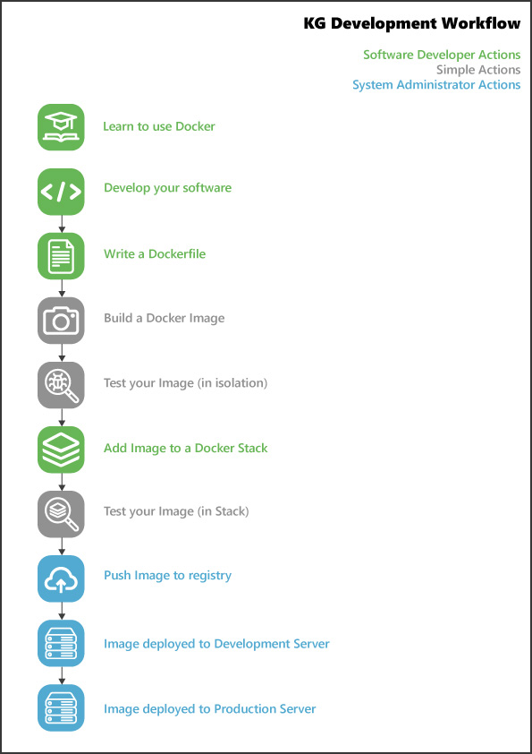

# Deployment Workflow

The public KG services hosted at [kg.cmclinnovations.com](https://kg.cmclinnovations.com) each run in a separate Docker Container and are grouped into 'Stacks' using the 'docker-compose' tool. There are currently 3 Stacks, separated by their purpose (web, agent, and database), each with the potential for development, production, and test configurations. Using these Stacks means that system administrators can refresh/move/manage sets of Containers with single commands, rather than having to deal with each individual Container; as such, the process of updating a single service will entail updating the Stack's compose file (to update the version of the Image used), then reloading the entire Stack.

The following pipeline details the expected process for developing new KG related software, or Dockerizing an existing codebase. The software development process must include these steps before that software can be hosted on CMCL systems.

---

* Learn to use Docker.
  * Developers should be familiar with [basic Docker concepts](https://docs.docker.com/get-started/overview/) as well as how to write a [Dockerfile](https://docs.docker.com/engine/reference/builder/) and [docker-compose](https://docs.docker.com/compose/) files.
* Develop your software.
  * Code should be written as required.
  * Developers should be conscious of their software's requirements; thinking about how these can be installed in a reproducible, isolated environment, will help later.
* Write a Dockerfile.
  * Write the instructions that create an environment for your software to run.
  * Use the minimum amount of installed packages/data required for your software; large Images are difficult to maintain.
  * Add an entry point to run your software when the Image is used to generate a Container.
  * If your Dockerfile/service requires credentials, persistent data, or non-public binaries then please get in touch with the system administrators at CMCL to discuss the correct approach (see more on this below).
* Build a Docker Image.
  * Create a docker-compose file solely for your software and use it to build an Image.
    * This docker-compose file will also use your Image to generate and run a Container (if configured correctly).
  * For an example of a single service docker-compose file, see ./examples/python_agent/docker-compose.yml (within the Deploy folder of TheWorldAvatar repository).
* Test your software within the Image.
  * Local testing of your software within the Docker Container generated from your Image.
  * Ensure there are no bugs, credentials, or dependency issues in your environment.
  * You should test that at least one other developer can pull your changes, run your docker-compose file, and use the service successfully.
* Add Image to a Docker Stack.
  * Move your service configuration from your local docker-compose file into one of the pre-existing Stacks using the base 'docker-compose.yml' file.
    * Multiple compose files are combined to provide a configuration for each environment, the 'base' file (docker-compose.yml) should define configurations that do not change across environments.
    * Current stacks include: web (for non-intensive web content, visualisations, and APIs), agent (intensive processes, such as those that updating KGs, or anything that runs too slowly for live web demo), and db (databases/triple stores).
  * Ensure the correct version of your Image is listed in the Stack and does not map to host ports used by other services within that Stack and environment configuration.
  * If different settings are required in different configurations, add these differences to the appropriate docker-compose files.
* Test your software within the Stack.
  * Ensure your software works and integrates with other software as required.
* Push Image to registry.
  * Once all your changes are committed, alert the system administrators at CMCL that your Image is ready to be pushed to the registry.
  * At the time of writing, system administrators will handle all pushes to the registry. Once a long term solution (perhaps automated) is in place, developers will be able to complete this step themselves. 
* Deploy Image to development environment.
  * Alert system administrators at CMCL that your Image is ready for deployment on the development server.
  * CMCL will reload the development stack and provide you with details on how to access your service.
* Deploy Image to production environment.
  * Once tested, merged to master, and ready for release to the wider public, inform system administrators.
  * CMCL will reload the production stack and provide you with details on how to access your service.
  * Now available for public viewing, marketing materials/publications can reference the software.

---

More complex software may require closer collaboration with the system administrators during the development process. If any of the following apply to your software, please
consult with the administrators as soon as possible so that they can understand how to deploy, manage, and backup your services.

* Data must persist beyond the lifecycle of your service.
  * If your software contains data that needs to be saved even after your software stops/restarts, this may require configuring a [Docker Volume](https://docs.docker.com/storage/volumes/).
  * For example: if your software uses a local database, you may want the data present in that database to still be there in new versions of your Image (after fixing a bug for example).
* Software requires confidential credentials.
  * It is policy that confidential credentials are not committed to the source code repository, or kept within the final Image. If these are 100% required within the Image (i.e. used during code execution), then Docker Secrets can be used to ensure they're kept safe.
* Non-public binaries are required within the Image.
  * As binaries should not be committed to the source code repositories, any publicly available ones should be downloaded within the Image build process.
  * If binaries are required within your Image (and are not available for download from the web within the Image), we may need to set up a protected hosting solution so that they can be downloaded during the Image build.
  
  
## Versioning

All software to be deployed using Docker should use the below version number convention. The current version number should be listed in the 'version' file; it is important that this number is correct and is updated appropriately upon release (i.e. just before branch merges). If this is version is incorrect, versions of the Docker Image hosted on the Image registry may contain invalid versions of the application.

Versions consist of 3 integers and an optional qualifier (see below).

	`X.Y.Z-QUALIFIER`
	
* The first integer (X) denotes the _major_ version number, this should be incremented when a major feature is added. When it is incremented, the Y and Z numbers should be reset to 0.
* The second integer (Y) denotes the _minor_ version number, this should be incremented when a minor feature is added. When it is incremented, the Z number should be reset to 0.
* The third integer (Z) denotes the _hotfix_ number, when a fix is made (without changing any other functionality), this number should be incremented.
* The optional qualifier is a string used to denote special versions of the code. In standard use, only the 'SNAPSHOT' qualifier should be used.
** The 'SNAPSHOT' qualifier denotes a WIP/Development version. For example, version "1.0.0-SNAPSHOT" denotes the development version of 1.0.0 (i.e. what will eventually be released as 1.0.0).
** Versions without the qualifier are taken to be the publically released version of the code (i.e. that taken from the master branch).

This means that to identify the latest production version of the tool, one only needs to look for the highest non-SNAPSHOT version number. To identify the latest in-development version (i.e. the cutting-edge), the highest SNAPSHOT version should be used. When new developments are made (without a release), a new SNAPSHOT image should be produced to overwrite the oldest one (i.e. the "1.0.0-SNAPSHOT" version should always be the latest developments towards the release of version "1.0.0").

After a release (i.e. a merge to master), it is best practice to immediately change the version number on the develop branch to the next SNAPSHOT version. This ensures that if the development code is built again after the release, it will not override the released Image. For example, if version "1.0.0" is release by merging to the master branch, straight afterwards the develop branch version should be updated to "2.0.0-SNAPSHOT" or "1.1.0-SNAPSHOT".

For more details on the version number syntax and use, please contact the system administrators at CMCL.

