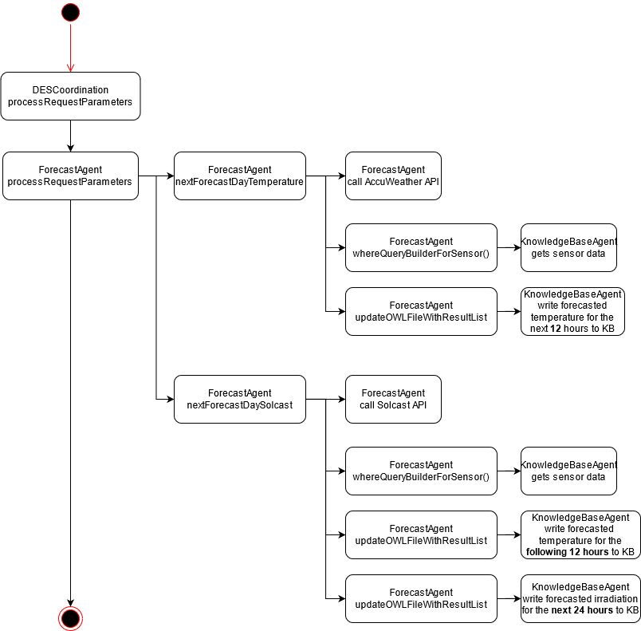

# README for Distributed Energy System

## Python Dependencies
 1. pytesseract (Extra instruction below)
 2. PIL (pillow image reader)
 3. json
 4. urllib
 5. scipy
 6. numpy
 7. math
 8. caresjpsutil (for logging, see installation notes in JPS_BASE/PythonCustomLibraries/setup.py) 

## Java Dependencies
1. jps-base-lib
2. Junit
3. javax servlet
4. org.web3j (for ethereum exchange)
5. com.google.code.gson

## What's Tesseract? 
It's an OCR software that scans images to return data. It isn't reliable, but it's what we have for interpreting real-time solar data
Because of the tesseract dependency which relies on your OS system, pip installing pytesseract isn't enough. 
Instead, follow this [guide](https://guides.library.illinois.edu/c.php?g=347520&p=4121425) to figure out how to get pytesseract going.

## What to do for deployment? 
 - Have python installed. Have java installed. Both should be added to your system environment. 
 - Have pytesseract installed
 - Have tesseract installed 
 - mvn clean install JPS DES
 - Have the files under /kb/sgp/singapore/ copied to the TOMCAT/webapps/ROOT folder. So IRI/Temperature sensor -001, forecast -001, and industrial, district, District-001.owl, and singaporeelectricalnetwork/ folders on your respective ROOT/kb folder.
 - have nodeJS server running
 - Comment Line 6, Uncomment Line 5 in \web\CO2Web\public\javascripts\DESplot.js when deploying in Claudius
 - Expected Result: Upon deployment, by loading the page localhost:82/desplot. Three graphs would appear: 
 	1. A temperature forecast graph
 	2. A solar irradiation forecast graph
 	3. A graph showing the forecasted energy consumption rates
 	4. Three consumption graphs of residential households, holding the total appliance load, total battery load, and total consumption load. 
 - (Optional) Install Metamask

## Metamask?
1. Open your browser and look for Metamask Plugin. You can download it on Google or Firefox. I use firefox. 
2. Once downloaded, log in. You can choose to create your own account, or import an account using the seedphrase. For the one in use, the seedphrase is "lunch also tomorrow broom ripple dentist orange label kitchen body mountain tired"
3. It's a collection of 12 words that you need to enter. 
 - The password for the above account is "Caesar1!". 
 - Once you enter, look at the accounts that you have. You should have Residential, Commercial, Industrial, Solar, ElectricGrid. 
4. Check the values of your accounts: 
 - Make sure that Residential, Commercial and Industrial have sufficient funds of above 10 ether. Best if you can have 200 ether per account, but currently, 10 ether is still safe. 
 - If you do not have enough, one recommendation is to get more ether from the faucet. This could be done in the following manner: 
 - Create a social media post on Twitter or Facebook containing the account's address. For example, the address for Residential is 0x1eD35d5845F8162B40df26c34562cFabd4892017
 - Once you have the post created, take the url of the specific post. Copy it (Ctrl C)
 - Go to this website: https://www.rinkeby.io/#faucet
 - On your browser, paste the URL that you have copied into the box. Select the frequency of ether that you can commit to. For example, I prefer to use 7.5 ether/day or 18.75 ether/3 days because I know that I can commit to that schedule. 
 - Once you have selected your frequency, let go of the mouse. There should be a green load bar that finishes running. If there isn't, it's most likely because you haven't allocated enough time before it finishes. 
 - Alternatively, you can deposit some of your ether that's been lying in solar or electricgrid's account. You can do it this way: 
	
	1. Select the plugin. You should see two buttons below the Ethereum Diamond icon: Send and Deposit. Click "Send"
	2. Select the account that you want to send to. 
	3. Select the button slow. Sending ether between accounts costs money, and the rinkeby network is fast enough that the "slow" action takes a pretty decent amount of time. 
	4. Click Next, and Confirm your selection This method is preferable, but because of the consumption of ether of sending between accounts, there would come to a point when the ether runs out. 

## How does it run? 
1. Every hour, WeatherIrradiationRetriever would run and collect information via OCR. Test this method by running http://localhost:8080/GetIrradiationandWeatherData
- Input: Three IRI for irradiation, wind speed and temperature
- Output: Three IRI
- Check in JPS_DATA/.../scenario/base for that folder. see if there's an error log. 
2. The DES Coordination Agent has two subcomponents and can be found in DESCoordination.java. This is called periodically due to the 10 call per limit that forecasting solar data imposes on us.
- Input: Contains the electrical network, and the district IRI
- Output: A folder that has the predictions for the next twenty four hours of the a) residential, commercial, industrial, solar and electric grid profile and b) the profiles of three types of residential households. 

3. DES Coordination calls on the Forecast Agent to check and print the next twenty four hours. It calls "/getForecastData"
	Forecast Agent takes in 
- Input: baseURL that dictates where the weather forecast files are written. 
- Output: WeatherForecast.csv is written into the baseURL folder

4. DESCoordination then calls upon DESAgent, the wrapper for the python code that uses Game Theory to model a simulation via "/DESAgentNew"
- Input: Electrical network IRI, District IRI, baseURL
- Output: 
	1. Five Graph profiles that have
		i) Solar (24)
		ii) gridsupply (24)
		iii) Commercial (24)
		iv) industrial (24)
		v) residential (24)
	2. Three sets of residential type profiles (24)
 

5. Front-End Coordination uses rdf4j to get the last complete run of DESCoordination. This is done by annotating the folder and keeping a record in runOptimization in DESAgentNew before querying it in FrontEndCoordination

1. Due to the large size of the JSON packet, the  agent reduces it to a JSON size of five, with each key having just 1 value. 
Then, it calls upon the BlockchainWrapper agent that communicates with the blockchain. 
2. Input: A JSON of five elements. 
3. Output: JSON of two keys
	1. txHash, the list of transaction hashes. A transaction hash can be treated as a receipt. 
	2. sandr, the list of senders and receivers. 
4. Coordination Agent can be tested by using "testStartCoordinationDESScenariobase()"
5. Weather Agent (RealTime) can be collected via testIrradiationRetrieverDirectCall() and testIrradiationRetrieverAgentCall()
6. Forecast Agent can be tested, but it's not recommended to do so. To test Forecast Agent, run the coordination agent by itself. 
7. BlockchainWrapper can be tested via testBlockchainWrapperDirectCall and testBlockchainWrapperAgentCall. 
	
## Class Diagrams: 
### Forecast Agent:

### DES Agent:

## There's something wrong? I can't deploy this!
- The Weather Irradiation data isn't running?
  1. First, check `testWeatherIrradiationDirect()` to see if data is being written to the respective File-based IRI
  2. Second, check if there's an error log in the folder where the results of TesseractOCR is being read to
  3. BUG: Occasionally, KBAgent reads the value as UTC rather than GMT + 8:00. I can't repeat it, but if Ctrl F brings about a result which contains "Z", that bug causes multiple values of the same reading. 
- The data's being read multiple times? 
  1. Check RunSemakau batch file. It's being run multiple times. 
- Forecast Agent isn't running? 
  1. First, check `testWeatherForecast()` to see if data is being written to the respective File-based IRI
  2. Second, check if you're able to get data from the respective urls. At the time of this README being written, Solcast and Accuweather are available and can be accessed by reading the APIs from the respective file freely. However, Solcast and Accuweather can change their API. 
- The URLs linking the transactions to the webpage are missing!
  1. Check if `testFrontEndTalk()` is working. This just checks the transaction of ether given a set of values. 
  2. Check if you have ether in your wallet. See [here](https://github.com/cambridge-cares/TheWorldAvatar/tree/master/JPS_DES#Metamask) for greater detail. 
- Why is the webpage blank? Node is running. 
  1. Check if you're reading from the right location. Localhost? Or jparksimulator? The same goes if you have a ConnectException: it's linked to the wrong location and thus change your 'test' value in jps.properties
- Where's commercial.json, electricgrid.json and all these other files that are meant to be in config.properties? 
  1. First, check server. These files are added to gitignore because the passcodes are private.
  2. The values on `config.properties` under resources/ were changed. 
  
## Websites referenced: 
1. [Solar Repository Institute](https://www.solar-repository.sg/ftp_up/weather/500_Weather.png) for the solar weather near NUS (within NUS)
2. [Solcast Forecast](https://toolkit.solcast.com.au/#/account) for the solar forecast reading as well as weather data reading
3. [Accuweather Singapore](https://www.accuweather.com/en/sg/singapore/300597/weather-forecast/300597) for the first 12 hours accurate 

## TODO: 
 - [x] Finish backup of visualization
 - [ ] virtual environment for python

