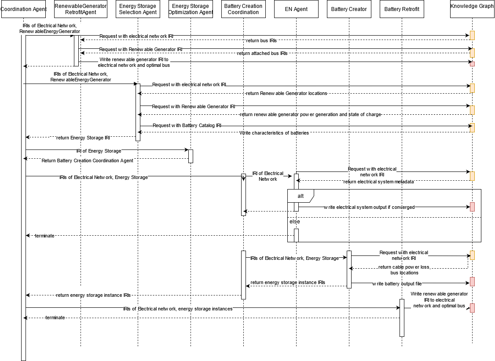
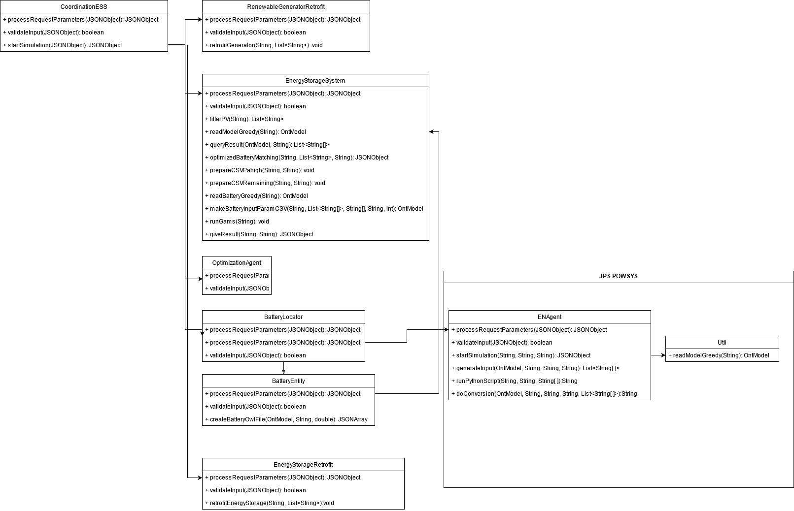

# README for Energy Storage System

## Java Dependencies
1. jps-base-lib
2. Junit
3. Javax servlet

## What to do for deployment? 
1. You need to get your GAMS installation: 
   - GAMS needs to be installed from GAMS site. As of now, versions 26-30 currently work
   - Get the license. You can get the pre-existing one from Claudius
   - Place your GAMSDIR in your system environment directory. 
2. Ensure that POWSYS is running; because the following agents are used: 
   - RenewableGeneratorRetrofit
   - ENAgent
   - BatteryRetrofit
3. Have matlab installed. Have java installed
4. mvn clean install JPS ESS
5. node app web/CO2WEB/app.js
   - Comment Line 2, Uncomment Line 3 in \web\CO2Web\public\javascripts\pwBaseFile.js when deploying in Claudius
6. have nodeJS server running
7. Expected Result: Upon deployment, by loading the page localhost:82/essMap
   i. A google map appears with Jurong Island Power Grid outlined in red and with markers denoting the plants
   ii. A button to tell you to 'Run Simulation'
   iii. Once this button is pressed, a spinning blue symbol appears. Once simulation completes, the power grid which was wiped away when the button is clicked appears again, this time with batteries. 
   iv. Clicking on the batteries shows batteries. 
   
## How does it run? 
1. The flow of ESS can be seen in this figure 
2. The scenario agent is first called by the end-user deciding to enable the ESS framework. It creates a 'parallel world' which the base world is duplicated before forwarding the request to the Coordination Agent along with the unique scenario ID of the 'parallel world' 
3. The Coordinate Agent C,receives the forwarded request and starts the following chain of events. 
4. The renewable generator retrofit agent which retrieves and retrofits a renewable energy source based on the renewable generator IRI present in the request from C. In our use case, we utilize the photo-voltaic generator present on Semakau Island. 
5. The Energy Support System framework receives the IRI of the electric grid that it will apply the ESS decision support tool to. It queries the knowledge base (KB) to determine the type of energy storage needed for the electric grid based on the technical, environmental and economic factors as outlined by the ESS decision support tool. 
6. Next, the Optimization Agent selects the type of optimization it needs to apply to the electric grid and looks for the agent that conducts that type of optimization 
7. Currently, we possess only the Optimal Power Flow (OPF) as an agent capable of optimizing the load supply and hence EN Agent is selected. 
8. However, once more optimization agents exist, Optimization Agent can be given logic as to the type of optimization it selects. 
9. C then calls a second Coordination Agent, named B, that receives the type of optimization it needs to run.
10. EN Agent queries the knowledge graph and runs the OPF model, and updates the 'parallel-world' knowledge graph with its new values. 
11. Additionally, it updates the knowledge graph with optimal locations for the placement of energy storage.
13. The total power loss is considered as the parameter for the system performance and energy storage are placed based on the extent of the power loss. 
14. B calls upon another retrofit agent, which would read the optimal locations from the knowledge graph based on the criteria above, and create the corresponding instances which possess the location and type of energy storage the electric grid would possess.    
15. These instances are retrofitted onto the electric grid in the 'parallel world'. 
16. Once the knowledge graph is updated with the instances of the energy storage systems, the framework reaches completion. 
17. The visualization agent reflects the lowered value of carbon emission due to the addition of the renewable generator as well as the energy storage systems on the electrical network,
18. The end user could proceed to change the power load and run OPF again to determine the change in carbon emissions produced by this new system. 
19. As this replica is modified, the base world remains untouched. 

 

## Class Diagram 
  

## There's something wrong? I can't deploy this!
- First, check if the test  `testCreateScenarioAndCallESSCoordinateDirect` is working. It calls the agent in use one by one. 
- Second, check if the test `testCreateScenarioAndCallESSCoordinate` is working. This calls C as a whole, thus errors can come from there. 
- Third, if both of the above conditions run without errors, then it's most likely due to the visualization being broken. It could be that you are reading from the wrong location (at which case, look at \web\CO2Web\public\javascripts\pwBaseFile.js, Line 2. Enable it to Line 3, and it should be reading from Claudius rather than local deployment. 
- Fourth, it could be POWSYS screwing up. Read POWSYS README.md for more clues.  
